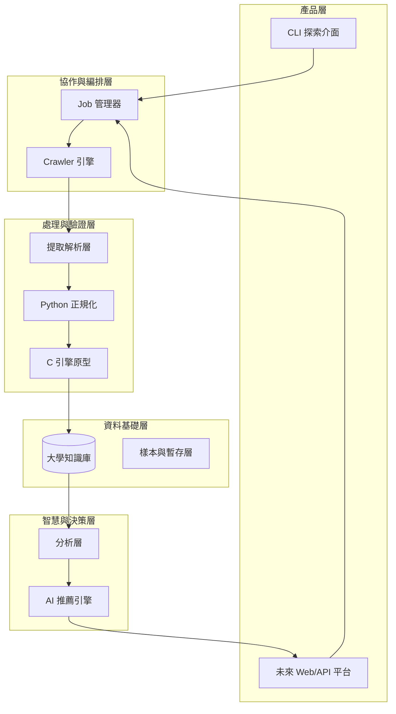
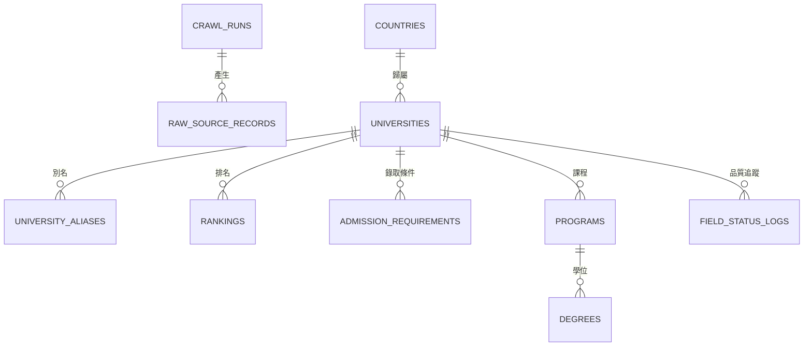
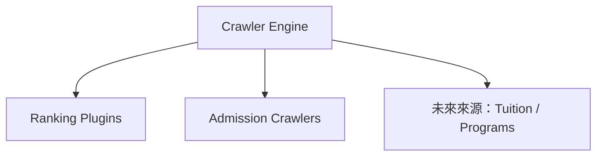
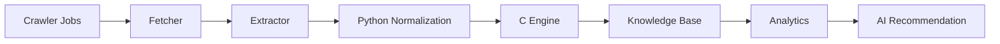

# CrawlerNest 系統架構白皮書

本文件是 CrawlerNest 專案的最高層級技術架構文件（Master Technical Architecture Document）。
目標不是只描述爬蟲程式，而是定義一條可持續演進的技術路線：

**資料採集 → 資料平台 → 分析能力 → AI 推薦 → 產品化**

---

## 1. 文件定位

本白皮書用於：

- 作為中長期架構決策的主參考
- 統一 crawler、database、analytics、recommendation、product 層的設計語言
- 定義 V1.5 現況、V2 擴展策略、V3 未來藍圖
- 在功能擴展與資料模型調整時，提供一致判準

本文件聚焦於：

- 系統架構
- 資料模型
- 資料流程
- 推薦系統設計
- 里程碑與路線圖

---

## 2. 平台現況與能力

CrawlerNest 目前採用 **資料優先（Data-first）** 架構，各層模組保持解耦，確保穩定與可擴展。

### 2.1 當前策略重點（當前 / V1.5）

1. **資料聚合**：自動採集 QS、THE、ARWU 等來源資料（目前以 QS 為主）
2. **知識基礎建設**：建立可擴展、可查詢、可追溯的大學資料庫
3. **決策支援起步**：先建立分析基礎，再逐步推進推薦能力

### 2.2 模組完成度地圖（截至 2026 年 3 月）

| 模組 | 說明 | 狀態 | 完成度 |
| :--- | :--- | :---: | :---: |
| 採集 / 網路層 | 非同步請求、端點探測、分頁處理 | 進行中（可運行） | ~80% |
| 解析 / 提取層 | 錄取要求、截止日、分數規則解析 | 進行中（可運行） | ~75% |
| Python 正規化基線 | 國家標準化、數值安全轉換、驗證流程 | 進行中（可運行） | ~60% |
| C 正規化引擎 | 名稱 / 國家 / 排名 / 分數高效處理 | 開發中 | ~25% |
| 實體識別 | 別名映射、人工校正 | 進行中（可運行） | ~30% |
| 儲存 / 資料倉層 | 統一 schema、DB writer、PostgreSQL 基線、Spring Data JPA | 進行中（可運行） | ~78% |
| 品質與驗證 | Raw lineage、欄位狀態、PostgreSQL 初始化驗證、JUnit | 進行中（可運行） | ~62% |
| 分析與推薦 | 排名聚合、特徵向量設計 | 策略目標 | ~20% |

---

## 3. 目錄

1. 平台現況與能力
2. 系統總覽架構
3. 系統分層模型
4. 核心架構策略與機制
5. 資料平台與知識庫設計
6. Crawler 框架與 Job 管線
7. 實體識別與推薦架構
8. 開發優先順序與執行策略
9. 里程碑與四年路線圖
10. 產品願景與能力地圖
11. 風險與維護策略

---

## 4. 系統總覽架構

以下為 CrawlerNest 長期目標下的整體技術架構：



核心演進原則：

**爬蟲採集 → 資料平台 → 分析能力 → AI 智能 → 產品化**

### 4.1 統一演進視圖（Unified View）

```
全球來源（QS / THE / ARWU / 校方網站）
        ↓
採集與匯入層（非同步 jobs / fetch / parse）
        ↓
正規化與實體識別（Python 基線 + C 引擎 + alias/fuzzy/embedding）
        ↓
大學知識庫（rankings / admission / programs / degrees / tuition）
        ↓
分析層 + 推薦引擎 + 公開 API 層
        ↓
B2C / B2B 產品化
```

對應分期：

- **當前（V1.5）**：採集、正規化基線、知識庫基礎
- **下一階段（V2）**：多來源整合、分析層、實體識別升級
- **未來（V3+）**：推薦引擎、公開 API、產品介面

---

## 5. 系統分層模型

CrawlerNest 可抽象為六層：

- **Layer 1 資料採集層（已運作）**：排名與錄取條件採集
- **Layer 2 資料品質與正規化層（已運作 / 開發中）**：Python 驗證基線 + C 高效正規化
- **Layer 3 知識庫層（已運作）**：Canonical University Database（單一真實來源）
- **Layer 4 分析層（策略目標）**：跨榜單聚合、統計分析、特徵工程
- **Layer 5 推薦層（策略目標）**：規則篩選 + 權重模型 + ML 精煉
- **Layer 6 產品層（已運作 / 策略目標）**：CLI（現有）與 Web/API（未來）

分層目的：每層可獨立演進，降低耦合，避免牽一髮動全身。

---

## 6. 願景與策略

### 6.1 核心願景

建立一套可持續、可自動化、可解釋的全球大學資料智慧系統，成為未來四年教育決策支援的資料底座。

### 6.2 策略目標

- **資料可信度優先**：強化正規化、實體識別、資料可追溯性
- **架構可擴展性**：從專用爬蟲演進為通用教育資料平台
- **決策價值導向**：逐步提供可行動的推薦與分析能力

---

## 7. 核心架構策略與機制

### 7.1 全域參數與組態

- 以 `Config`（Python Dataclass）集中管理參數
- 併發控制：`asyncio.Semaphore`（預設 200）
- 超時策略：全域 30 秒 timeout
- 重試策略：指數退避 `wait = retry_delay * (retry_backoff ** attempt)`

### 7.2 採集策略：Schema-driven + 探針模式

- **Source Schema**：用來源結構定義替代硬編碼
- **NID 自動探測**：多條 regex 鏈（script/data attribute/API URL）
- **Fallback**：主路徑失敗時自動切換關聯頁面

### 7.3 解析與正規化策略

- 視窗化提取（window = 140）降低噪音
- 上下文隔離（學制區段分離）避免欄位污染
- 欄位失敗保留 `unparsed` 與 raw 值，利於追查
- 雙層正規化：
  - Python：主流程驗證與清洗
  - C engine：高頻字串與數值解析加速（可插拔）

### 7.4 分數與邏輯一致性

- 區間分數（如 7.0-7.5）取中值
- 安全邊界：IELTS/TOEFL/GMAT/GRE 皆有合理範圍檢查
- 綜合評分標準化：

```text
Score_final = Σ(Score_raw / Score_max × 100) / N_valid
```

### 7.5 匯出與呈現

- CLI 表格採高可讀排版
- CSV 匯出預設 UTF-8 BOM，提升 Excel 相容性

---

## 8. 資料平台與知識庫設計

CrawlerNest 已從單純爬蟲輸出，演進為具備維度/事實/血緣（lineage）的資料倉基線。

### 8.1 Canonical 資料模型（V1.5）

核心資料表：

- `crawl_runs`
- `raw_source_records`
- `countries`
- `universities`
- `university_aliases`
- `rankings`
- `admission_requirements`
- `programs`
- `degrees`
- `tuition`
- `field_status_logs`

關係主軸：



### 8.2 表職責摘要

- `crawl_runs`：批次執行與狀態追蹤
- `raw_source_records`：原始資料暫存與重解析依據
- `universities/countries`：實體主鍵與地理維度
- `university_aliases`：來源名稱映射（實體識別基礎）
- `rankings/admission_requirements`：分析與推薦訊號表
- `programs/degrees/tuition`：V2/V3 擴展預留
- `field_status_logs`：品質與稽核層

### 8.3 長期資料模型方向

由 school-centric 擴展為：

**University → Program → Degree**

長期重點：

- Manual → Alias → Fuzzy → Embedding 的識別升級
- rankings/admission/tuition/outcome 特徵化與 ML-ready 化
- C engine 與 Python ingestion 深度整合

### 8.4 Schema 與索引策略

目前提供：

- SQLite：`crawlernest-schema/schema.sql`
- PostgreSQL：`crawlernest-schema/postgresql_schema.sql`

建議持續維護索引：

- `idx_universities_slug`
- `idx_universities_country`
- `idx_university_aliases_source_name`
- `idx_raw_source_records_source_type`
- `idx_raw_source_records_crawl_run`
- `idx_rankings_university_year`
- `idx_rankings_source_type`
- `idx_rankings_raw`
- `idx_admission_requirements_university`
- `idx_field_status_logs_university`

---

## 9. Crawler 框架與 Job 管線

### 9.1 統一 Crawler 引擎

系統採用統一引擎而非多腳本散落，統一記錄與錯誤處理。



### 9.2 Job 級編排

範例：

- `qs_world_rankings`
- `qs_subject_rankings`
- `mit_admission_sync`
- `ucla_admission_sync`

優勢：

- 排程粒度高
- 故障隔離佳
- 可觀測性高

### 9.3 全量 + 增量策略

- **Full Crawl**：週期性全量更新（1500+ universities）
- **Incremental Update**：針對 admission/program 層做增量刷新

### 9.4 排名資料策略

- 以 HTML extraction 為主，API 為輔
- 採統一 rankings table（來源無關）
- 透過 `metrics_json` 保持不同榜單指標彈性

### 9.5 端到端資料流程



---

## 10. 實體識別與推薦架構

### 10.1 實體識別流程（Entity Resolution）

```text
Raw School Name
  → Manual Mapping
  → Alias Table Lookup
  → Fuzzy Matching
  → Embedding Matching
  → Resolved school_id
```

優先序：

`manual mapping → alias table → fuzzy matching → embedding matching`

### 10.2 推薦決策流程

```text
使用者檔案
→ 規則過濾（硬條件）
→ 候選集合
→ 校/系/學位推薦
→ 權重計分
→ ML 精煉（未來）
→ 最終排序
```

### 10.3 推薦架構核心價值

- **可解釋性**：每個推薦可回溯至具體訊號
- **可擴展性**：可逐層引入 ML，不破壞既有流程
- **多層級支援**：University / Program / Degree

### 10.4 推薦演進路線

- **V1.5（當前）**：校級推薦
- **V2（下一階段）**：Program-aware 推薦
- **V3（未來）**：Degree-level 推薦
- **V4（Long-term）**：多層級智慧決策系統

### 10.5 概念評分式

```text
RecommendationScore = CompositeRanking + AdmissionProb + BudgetFit + LocationPref + OutcomeSignal
```

---

## 11. 開發優先順序與執行策略

為避免範圍膨脹（scope explosion），開發必須採分層推進。

### 11.1 第一層：當前（V1.5）

焦點：`Crawler → Normalization → Database → Query`

- 已可運行：QS ranking、Canonical schema、Python 正規化、CLI 查詢、初版實體映射
- 開發中：C 引擎原型、Java 服務測試自動化

### 11.2 第二層：下一階段（V2）

焦點：多來源整合與資料深度

- THE/ARWU 接入
- Admission 自動提取擴展
- 增量更新管線
- 實體識別升級（alias + fuzzy）
- Admission 機率估算初版
- Program taxonomy 初版

### 11.3 第三層：未來（V3）

焦點：智能化與產品化

- Hybrid recommendation engine
- Program / Degree 層推薦
- LLM 輔助 admission 解析
- Tuition / outcome / 第三方訊號整合
- API 平台與 Web 產品

### 11.4 優先原則

```text
當前（V1.5） → 下一階段（V2） → 未來（V3）
```

任何新功能若影響 V1.5 穩定性，應延期至 V2 或 V3。

---

## 12. 里程碑與四年路線圖

### 12.1 平台能力里程碑

- **Milestone 1：穩定採集能力**（QS + 基礎正規化）
- **Milestone 2：知識基礎能力**（Canonical schema + school-level identity）
- **Milestone 3：資料增強能力**（多榜單整合 + admission crawling）
- **Milestone 4：智慧決策能力**（Hybrid recommendation + multi-level model）

### 12.2 四年路線原則

**資料平台 → 分析能力 → AI 智能 → 產品化**

### 12.3 已完成里程進展（Historical Timeline）

| 日期 | 里程碑 / 更新 | 狀態 |
| :--- | :--- | :--- |
| 2026-02-04 | 初版 admission crawler 原型 | 已完成 |
| 2026-02-17 | 完成模組化重構（V2.0）並預設 async 模式 | 已完成 |
| 2026-03-09 | 完成架構藍圖與長期平台願景定義 | 已完成 |
| 2026-03-15 | 分離 Python 主流程與 C 正規化引擎 | 已完成 |
| 2026-03-18 | Java 服務升級 Spring Data JPA 與 Maven/JUnit 框架 | 已完成 |
| 2026-03-19 | PostgreSQL schema 初始化驗證，Spring Boot 啟動驗證 | 已完成 |
| 2026-03-20 | 白皮書重整：同步 PostgreSQL 基線與服務整合狀態 | 目前 |

### 12.4 未來階段規劃

- **Phase 1（0-6 個月）**：建立 HTML 樣本庫、完善 extractor 單測、完成 C engine 邊界定義
- **Phase 2（7-18 個月）**：強化 PostgreSQL-ready schema、實作去重引擎、整合 C engine
- **Phase 3（19-30 個月）**：代理池、THE/ARWU、多來源韌性與監控預警
- **Phase 4（31-48 個月）**：LLM 輔助校驗、Hybrid recommendation、趨勢分析報告

---

## 13. 產品願景與能力地圖

### 13.1 產品形態（成熟期）

- **University Data Explorer**：結構化全球院校查詢
- **AI Selection Assistant**：個人化選校輔助
- **Cross-Ranking Analytics**：跨榜單比較與研究工具
- **Integrated Decision Platform**：排名、錄取、費用、成果整合平台

### 13.2 能力地圖

| 能力層 | 能力項目 | 目前狀態 | 長期方向 |
| :--- | :--- | :---: | :--- |
| 基礎層 | 排名採集基礎設施 | 進行中 | 穩定性與維護性持續提升 |
| 基礎層 | Canonical identity schema | 進行中 | 演進至 program/degree aware |
| 基礎層 | 實體識別（Aliases） | 進行中 | 升級 fuzzy + embedding |
| 基礎層 | 知識庫儲存（SQLite → PostgreSQL） | 進行中 | 邁向 production-grade analytics/service |
| 擴展層 | 多榜單整合 | 規劃中 | 完整支援 QS/THE/ARWU 與區域榜單 |
| 擴展層 | Admission ingestion | 規劃中 | structured + raw 雙軌擴展 |
| 擴展層 | Program taxonomy | 規劃中 | 部門級與課程級分析基礎 |
| 智能層 | Admission probability estimation | 規劃中 | 可解釋推薦關鍵特徵 |
| 智能層 | Hybrid recommendation engine | 未來 | Rule + Weight + ML |
| 產品化層 | CLI explorer | 進行中 | 開發者與研究者主介面 |
| 產品化層 | API / Web platform | 未來 | 可擴展服務端與用戶介面 |

---

## 14. 風險與維護策略

### 14.1 主要風險

| 風險類別 | 風險項目 | 影響程度 | 緩解策略 |
| :--- | :--- | :---: | :--- |
| 技術層 | 網站結構改版 | 高 | 落實 schema-driven parsing，降低維護成本 |
| 基礎設施層 | IP 封鎖 / WAF | 中 | 導入代理輪替，必要時採 headless 方案 |
| 資料品質層 | 實體碎片化 | 高 | 提前推進 identity resolution 與去重引擎 |

### 14.2 例行維護清單

- **每季**：抽樣 Top 10 大學頁面，檢查 DOM 與解析正確性
- **持續**：重大架構變更後同步更新本白皮書
- **資料庫變更後**：重跑 PostgreSQL schema 初始化與 Spring Boot 連線驗證

---

> [!IMPORTANT]
> 本文件為 CrawlerNest 專案的主架構白皮書。所有重大技術決策、資料模型調整與路線轉向，均應以本文的分層模型與演進策略為優先依據，確保架構一致性、可擴展性與推薦系統可解釋性。
