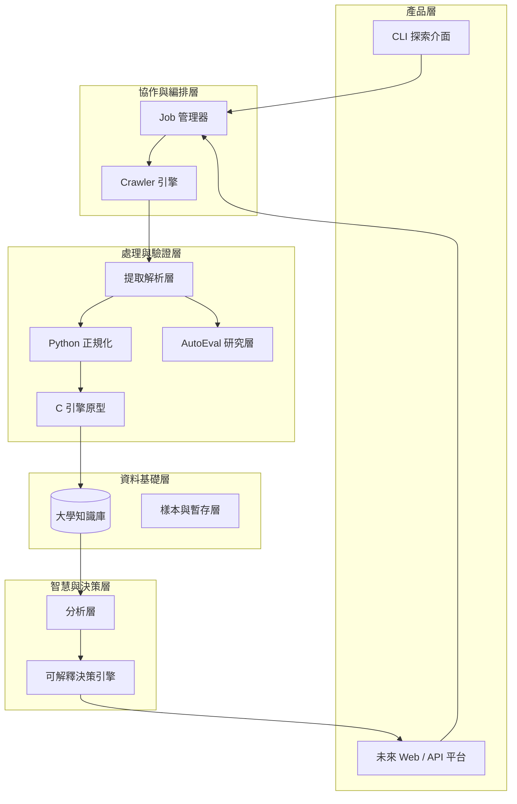
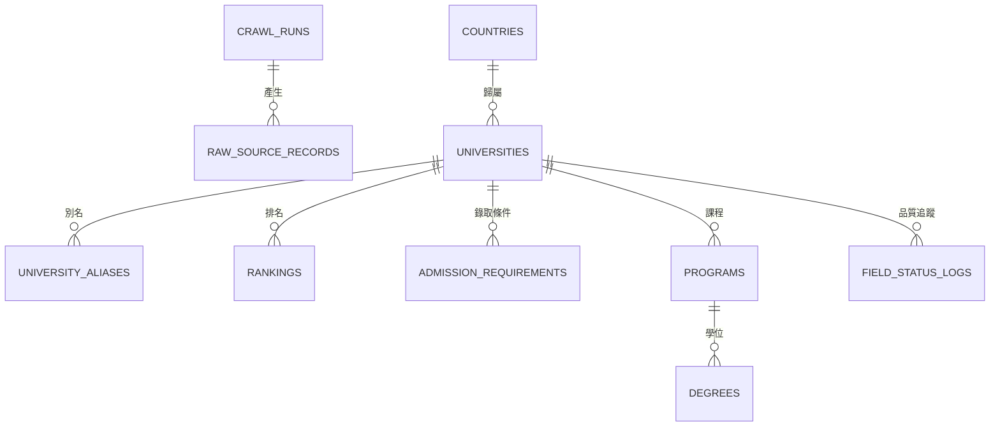
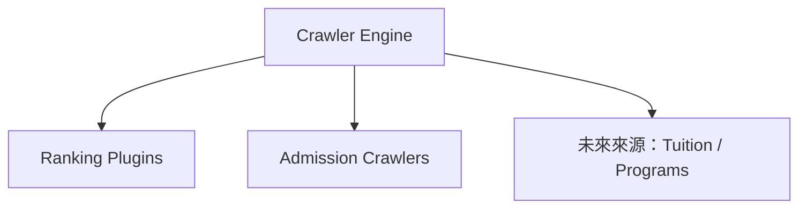
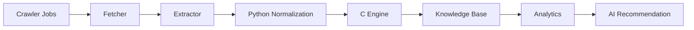

# CrawlerNest 系統架構白皮書

本文件為 CrawlerNest 專案的最高層級技術架構文件（Master Technical Architecture Document）。

CrawlerNest 的目標，不只是建立一套可以抓取大學資料的爬蟲，而是逐步演進成一個可持續擴展、可追溯、可分析、可推薦、可產品化的教育資料平台。

其核心演進路線如下：

**資料採集 → 資料平台 → 分析能力 → AI 推薦 → 產品化**

---

## 1. 文件定位

本白皮書的用途如下：

- 作為中長期技術架構與演進決策的主參考文件
- 統一 crawler、database、analytics、recommendation、product 各層的設計語言
- 說明 V1.5 當前狀態、V2 擴展方向、V3+ 長期藍圖
- 在功能擴充、資料模型調整、基礎設施變更時，提供一致的設計判準

本文件聚焦於：

- 系統架構
- 分層模型
- 資料流程
- 資料平台與知識庫設計
- 推薦系統設計
- 里程碑與路線圖
- 維運與風險管理

---

## 2. 平台現況與能力

CrawlerNest 目前採用 **Data-first（資料優先）** 的系統設計原則：

先建立可信任、可追溯、可擴充的資料平台，再在其上疊加分析、推薦與產品層能力。

### 2.1 當前策略重點（V1.5）

目前 CrawlerNest 的核心策略如下：

1. **資料聚合優先**：以 QS 為主來源，THE / ARWU 為下一階段整合目標
2. **知識庫優先**：建立可查詢、可維護、可追溯的大學資料基底
3. **決策系統先 explainable 再 intelligent**：先以 deterministic recommendation / comparison 打穩決策層，再逐步推進 AI 能力
4. **模組解耦**：crawler、extractor、normalization、db、analytics、API 彼此保持相對獨立
5. **低規節點可運行**：系統設計必須能支援老舊 x86 節點作為第一代 OpenClaw / Lobster Node
6. **合規優先加速**：在 robots.txt 與來源限制下，以本地解析並行、批次寫入、增量 checkpoint、局部更新等手段提升吞吐

### 2.2 模組完成度地圖（截至 2026 年 3 月）

| 模組 | 說明 | 狀態 | 完成度 |
| :--- | :--- | :---: | :---: |
| 最小端到端流程 | `crawlernest/run_pipeline.py`（crawl → normalize → store → query） | 已運行 | ~85% |
| 採集 / 網路層 | 非同步請求、端點探測、分頁處理、保守抓取節流 | 進行中（可運行） | ~80% |
| 解析 / 提取層 | 錄取要求、截止日、分數規則解析 | 進行中（可運行） | ~75% |
| Python 正規化基線 | 國家標準化、數值安全轉換、驗證流程 | 進行中（可運行） | ~60% |
| C 正規化引擎 | 名稱 / 國家 / 排名 / 分數高效處理 | 開發中 | ~25% |
| 實體識別 | 別名映射、人工校正、模糊比對基礎 | 進行中（可運行） | ~30% |
| 儲存 / 資料倉層 | PostgreSQL-only schema、DB writer、analytics views、Spring Data JPA | 已運行 | ~86% |
| API 讀取層（唯讀 + 決策） | Spring Boot `/universities`、`/rankings`、`/admissions`、`/recommendations`、`/compare` | 已運行 | ~82% |
| 品質與驗證 | lineage、欄位狀態、PostgreSQL 初始化驗證、JUnit、resume/checkpoint 驗證 | 進行中（可運行） | ~62% |
| 低規節點運行策略 | Low-spec mode、資源保護、長時間運行與續跑準則 | 已定義（待工程化） | ~35% |
| 分析與推薦 | 排名聚合、explainable comparison、recommendation v1 / v2 / v3、推薦 API | 已運作（第二版） | ~72% |
| AutoEval 研究層 | extractor 評估、hard dataset、manual autoloop、keep/revert | 已運行 | ~65% |

---

## 3. 目錄

1. 平台現況與能力  
2. 系統總覽架構  
3. 系統分層模型  
4. 核心架構策略與機制  
5. 資料平台與知識庫設計  
6. Crawler 框架與 Job 管線  
7. AutoEval 與資料品質演進層  
8. 實體識別與推薦架構  
9. 開發優先順序與執行策略  
10. 里程碑與四年路線圖  
11. 產品願景與能力地圖  
12. 風險與維護策略  
13. OpenClaw / Lobster-01 節點定位補充

---

## 4. 系統總覽架構

CrawlerNest 的長期技術架構如下：



核心演進原則：

**爬蟲採集 → 資料平台 → 分析能力 → AI 智能 → 產品化**

### 4.1 統一演進視圖（Unified View）

```text
全球來源（QS / THE / ARWU / 校方網站 / 未來第三方來源）
        ↓
採集與匯入層（async jobs / fetch / parse）
        ↓
正規化與實體識別（Python 基線 + C 引擎 + alias/fuzzy/embedding）
        ↓
大學知識庫（rankings / admission / programs / degrees / tuition）
        ↓
分析層 + 推薦引擎 + API 層
        ↓
B2C / B2B 產品化
```

對應分期：

- **當前（V1.5+）**：採集、正規化基線、PostgreSQL-only 資料平台、決策 API、AutoEval baseline
- **下一階段（V2）**：多來源整合深化、實體識別升級、program-level analytics
- **未來（V3+）**：LLM 輔助研究、公開 API、Web 平台、產品化

---

## 5. 系統分層模型

CrawlerNest 可抽象為六層：

### Layer 1：資料採集層（已運作）

負責排名、錄取條件、未來學程與學費資料的採集。

### Layer 2：資料品質與正規化層（已運作 / 開發中）

負責欄位清洗、正規化、型別安全轉換與資料驗證。

- Python：穩定基線、主流程清洗與驗證
- C：未來高頻處理與效能提升

### Layer 3：知識庫層（已運作）

作為 Canonical University Database，負責提供單一真實來源（Single Source of Truth）。

目前正式單一資料庫為 PostgreSQL；SQLite 僅保留為歷史 schema / migration artifact，不再是 runtime backend。

### Layer 4：分析層（已運作 / 持續擴展）

提供跨榜單聚合、統計分析、特徵工程與決策輔助能力。

### Layer 5：推薦層（已運作第一版）

提供規則篩選、可配置權重、IELTS / ranking explainable scoring、reach / target / safety 分類、comparison 決策說明；後續再演進至 Admission Probability 與 ML 精煉。

### Layer 6：產品層（已運作 / 策略目標）

- 現有：CLI、內部 API、comparison API、rule-based / hybrid recommendation API
- 未來：Web UI、公開 API、B2C / B2B 產品介面

分層目的在於：

- 降低耦合
- 允許各層獨立演進
- 避免為了單一功能調整而破壞整體系統

---

## 6. 願景與策略

### 6.1 核心願景

建立一套可持續、可自動化、可解釋的全球大學資料智慧系統，成為未來四年教育決策支援的資料底座。

### 6.2 策略目標

- **資料可信度優先**：強化正規化、實體識別、血緣追蹤與稽核能力
- **架構可擴展性優先**：從專用爬蟲演進為通用教育資料平台
- **決策價值導向**：逐步提供具可行動性的分析與推薦能力
- **可運維性優先**：支援低規節點長時間穩定運作
- **可優化性優先**：建立 AutoEval 等自我改善能力，而非只依賴人工調參

---

## 7. 核心架構策略與機制

### 7.1 全域參數與組態

- 以 `Config`（Python Dataclass）集中管理參數
- 併發控制採 `asyncio.Semaphore` + worker / concurrency 雙層節制
- 低規節點安全預設：`workers = 1`、`concurrency = 1`、`request_delay ≈ 10s`
- 全域 timeout 預設 30 秒
- 重試策略採指數退避：`wait = retry_delay * (retry_backoff ** attempt)`
- 長時間運行保護依賴：`resource_guard`、`resume`、checkpoint/snapshot

### 7.2 採集策略：Schema-driven + 探針模式

- 以來源結構 schema 取代硬編碼邏輯
- NID / page id / endpoint 透過多條 regex 鏈與來源特徵自動探測
- 主路徑失敗時，允許 fallback 到關聯頁面或替代結構

### 7.3 解析與正規化策略

- 視窗化提取（windowed extraction）降低噪音污染
- 區段隔離（例如依學制、區塊、表格）避免欄位交叉污染
- 欄位失敗時保留 `unparsed` 與 raw 值，便於回溯與除錯
- 採雙層正規化：
  - Python：主流程驗證與清洗
  - C engine：未來高頻字串與數值解析加速

### 7.4 分數與邏輯一致性

- 區間分數（如 7.0–7.5）可取中值或依策略正規化
- IELTS / TOEFL / GRE / GMAT 等分數設合理範圍檢查
- 綜合評分採標準化策略：

```text
Score_final = Σ(Score_raw / Score_max × 100) / N_valid
```

### 7.5 匯出與呈現

- CLI 表格以可讀性優先
- CSV 匯出預設 UTF-8 BOM，提升 Excel 相容性
- API 層以唯讀資料展示為主，避免過早暴露複雜寫入邏輯

---

## 8. 資料平台與知識庫設計

CrawlerNest 已從單純爬蟲輸出，逐步演進為具備維度 / 事實 / lineage 的資料平台基線。

### 8.1 Canonical 資料模型（V1.5）

核心資料表：

- `crawl_runs`
- `raw_source_records`
- `countries`
- `universities`
- `university_aliases`
- `rankings`
- `admission_requirements`
- `programs`
- `degrees`
- `tuition`
- `field_status_logs`

關係主軸：



### 8.2 表職責摘要

- `crawl_runs`：批次執行狀態追蹤
- `raw_source_records`：原始資料暫存與重解析基礎
- `universities / countries`：核心實體與地理維度
- `university_aliases`：來源名稱映射與 identity resolution 基礎
- `rankings / admission_requirements`：分析與推薦最關鍵的訊號表
- `programs / degrees / tuition`：為 V2 / V3 預留
- `field_status_logs`：欄位品質、失敗原因與稽核能力

### 8.3 長期資料模型方向

由 school-centric 演進為：

**University → Program → Degree**

長期重點：

- identity resolution 從 manual / alias，升級為 fuzzy / embedding
- ranking / admission / tuition / outcome 資料逐步特徵化
- 讓 schema 對推薦系統與分析系統友善（ML-ready）

### 8.4 Schema 與索引策略

目前提供：

- 正式 runtime schema：`crawlernest-schema/postgresql_schema.sql`
- 補充 schema：`entity_resolution_postgresql.sql`、`multi_source_postgresql.sql`、`ranking_aggregation_postgresql.sql`、`recommendation_postgresql.sql`
- `crawlernest-schema/schema.sql` 僅保留為 archived legacy SQLite schema

建議持續維護：

- `idx_universities_slug`
- `idx_universities_country`
- `idx_university_aliases_source_name`
- `idx_raw_source_records_source_type`
- `idx_raw_source_records_crawl_run`
- `idx_rankings_university_year`
- `idx_rankings_source_type`
- `idx_rankings_raw`
- `idx_admission_requirements_university`
- `idx_field_status_logs_university`

---

## 9. Crawler 框架與 Job 管線

### 9.1 統一 Crawler 引擎

系統採用統一 crawler engine，而非大量散落腳本，便於：

- 統一錯誤處理
- 統一 logging
- 統一 retry / timeout
- 統一 pipeline 編排



### 9.2 Job 級編排

目前與未來可抽象成不同 jobs，例如：

- `qs_world_rankings`
- `qs_subject_rankings`
- `mit_admission_sync`
- `ucla_admission_sync`

優勢：

- 排程粒度高
- 故障隔離好
- 可觀測性提升
- 未來更容易掛上 scheduler / node manager

### 9.3 全量 + 增量策略

- **Full Crawl**：週期性全量更新
- **Incremental Update**：針對 admission / program 層做局部刷新
- **Low-spec Execution**：在老舊節點上以低併發、保守節流、resume/checkpoint 模式執行長任務

目前已落地的增量與加速機制（V1.5）：

- **兩段模式**：可先跑 `rankings-only`（僅主榜單），再於需要時補抓 detail requirements
- **403 自動降級**：detail 連續 403 達門檻時，自動切回 rankings-only，避免整批任務中斷
- **待補抓清單輸出**：降級觸發後輸出 `pending_detail_enrichment.json`，保留後續補抓任務
- **小批次補抓子命令**：`enrich-details` 以小批次補抓 detail，成功寫回 admission，失敗保留清單續跑
- **局部更新寫入**：以 `school_slug + ranking_type + year` 先比對現有資料，未變動者跳過寫入
- **checkpoint 增量化**：執行中先寫入 journal，完成後 compact，兼顧續跑速度與完整性
- **批次寫入**：writer 層對 raw / alias / rankings / admissions 採 `executemany` 類批次路徑
- **失敗參數黑名單（TTL）**：對重複失敗的 API 參數組合暫時停用，避免反覆慢失敗

### 9.4 排名資料策略

- HTML extraction 為主，API 為輔
- 採統一 rankings table 容納多榜單
- 透過 `metrics_json` 保留不同榜單指標彈性

### 9.5 端到端資料流程



### 9.6 低規節點運行模式（OpenClaw / Lobster Node）

CrawlerNest 已明確區分：

- **開發主機**：負責功能開發、除錯、測試、小規模驗證
- **低規控制節點**：負責低並發 crawler、長時間 jobs、writer node、checkpoint/resume 與穩定性驗證

建議 Low-spec mode 安全預設：

- `workers = 1`
- `concurrency = 1`
- `request_delay = 8 ~ 12s`（建議 10 秒）
- `write_batch_size = 100 ~ 300`（依節點 I/O 能力微調）
- `log level = INFO`
- `resource_guard = enabled`
- `resume = enabled`

建議的日常執行模式：

- 主流程固定入口：`crawlernest/scripts/run_production_safe.sh`
- 若觸發 detail 降級：執行 `python3 crawlernest/run_pipeline.py enrich-details --limit 30 --request-delay 10`
- 原則：先穩定入庫主資料，再分批補齊 detail，避免單次任務因 WAF 阻擋全批失敗

設計原則不是追求極限吞吐，而是：

**慢慢跑、持續跑、壞了能續跑。**

---

## 10. AutoEval 與資料品質演進層

CrawlerNest 不只追求可運行的 extractor，也逐步建立 **可量化、可比較、可優化** 的研究層。

### 10.1 AutoEval 的定位

AutoEval 是一個位於 extractor / normalization 與資料平台之上的評估層，用於：

- 驗證 extractor 對 hard dataset 的表現
- 建立可重複的評分與比較流程
- 支援 manual autoloop 與未來 agent-assisted optimization
- 避免規則改動造成 silent regression

### 10.2 AutoEval Extractor Milestone

目前已完成第一個完整 extractor AutoEval 閉環：

- 建立 `crawlernest-autoeval`
- 設計 hard dataset（18 筆）
- 實作 extractor evaluator
- 建立 manual autoloop（evaluate → modify → re-evaluate → keep/revert）
- 達成 hard dataset 上的完整正確率

最終結果：

- `required_fill_rate = 1.000000`
- `exact_match_rate = 1.000000`
- `error_count = 0`
- `score ≈ 0.95`（runtime-adjusted）

### 10.3 AutoEval 的意義

這代表 CrawlerNest 已不只是「一套爬蟲」，而是開始具備：

- 可衡量的資料品質
- 可追蹤的優化迭代
- 可重現的評估流程
- 可拒絕退化版本的 guardrail 能力

這一層將成為未來以下能力的基礎：

- extractor 自動改進
- dataset evolution
- AI-assisted parsing
- normalization / recommendation 的評估基線

---

## 11. 實體識別與推薦架構

### 11.1 實體識別流程（Entity Resolution）

```text
Raw School Name
  → Manual Mapping
  → Alias Table Lookup
  → Fuzzy Matching
  → Embedding Matching
  → Resolved school_id
```

優先序：

`manual mapping → alias table → fuzzy matching → embedding matching`

### 11.2 推薦決策流程

```text
使用者檔案
→ 規則過濾（硬條件）
→ 候選集合
→ 校 / 系 / 學位推薦
→ 權重計分
→ ML 精煉（未來）
→ 最終排序
```

### 11.3 推薦架構核心價值

- **可解釋性**：每個推薦結果可回溯到具體特徵與訊號
- **可擴展性**：可逐層引入 ML，不破壞既有流程
- **多層級支援**：University / Program / Degree 三層

### 11.4 推薦演進路線

- **V1.5**：校級推薦
- **V2**：Program-aware 推薦
- **V3**：Degree-level 推薦
- **V4**：多層級智慧決策系統

### 11.5 概念評分式

```text
RecommendationScore = CompositeRanking + AdmissionProb + BudgetFit + LocationPref + OutcomeSignal
```

---

## 12. 開發優先順序與執行策略

### 12.1 第一層：當前（V1.5）

當前焦點：

- 已可運行：
  - QS ranking
  - Canonical schema
  - Python normalization baseline
  - CLI query
  - `crawlernest/run_pipeline.py`
  - Java read-only API（`/universities`、`/rankings`、`/admissions`）
  - 初版實體映射
  - checkpoint / resume
  - resource guard
  - extractor AutoEval baseline

- 開發中：
  - C 引擎原型
  - Java 服務測試自動化
  - Low-spec mode 工程化
  - normalization / identity resolution 提升

### 12.2 第二層：下一階段（V2）

焦點：多來源整合與資料深度

- THE / ARWU 接入
- admission 自動提取擴展
- 增量更新管線
- alias + fuzzy matching 升級
- admission probability 初版
- program taxonomy 初版
- AutoEval 擴展到 normalization

### 12.3 第三層：未來（V3）

焦點：智能化與產品化

- hybrid recommendation engine
- Program / Degree 層推薦
- LLM 輔助 admission 校驗
- tuition / outcome / 第三方訊號整合
- API 平台與 Web 產品

### 12.4 優先原則

```text
當前（V1.5） → 下一階段（V2） → 未來（V3）
```

任何新功能若會破壞當前穩定性，應延後至 V2 或 V3。

---

## 13. 里程碑與四年路線圖

### 13.1 平台能力里程碑

- **Milestone 1：穩定採集能力**（QS + 基礎正規化）
- **Milestone 2：知識基礎能力**（Canonical schema + school-level identity）
- **Milestone 3：資料增強能力**（多榜單整合 + admission crawling + AutoEval）
- **Milestone 4：智慧決策能力**（Hybrid recommendation + multi-level model）

### 13.2 四年路線原則

**資料平台 → 分析能力 → AI 智能 → 產品化**

### 13.3 已完成里程進展（Historical Timeline）

| 日期 | 里程碑 / 更新 | 狀態 |
| :--- | :--- | :--- |
| 2026-02-04 | 初版 admission crawler 原型 | 已完成 |
| 2026-02-17 | 完成模組化重構（V2.0）並預設 async 模式 | 已完成 |
| 2026-03-09 | 完成架構藍圖與長期平台願景定義 | 已完成 |
| 2026-03-15 | 分離 Python 主流程與 C 正規化引擎 | 已完成 |
| 2026-03-18 | Java 服務升級 Spring Data JPA 與 Maven/JUnit 框架 | 已完成 |
| 2026-03-19 | PostgreSQL schema 初始化驗證，Spring Boot 啟動驗證 | 已完成 |
| 2026-03-20 | 新增最小端到端入口 `crawlernest/run_pipeline.py` | 已完成 |
| 2026-03-20 | 新增 Java read-only admissions endpoint：`GET /admissions` | 已完成 |
| 2026-03-21 | 完成老舊 x86 節點可行性評估，確認可作為第一代 OpenClaw / Lobster-01 節點 | 已完成 |
| 2026-03-21 | 定義 Low-spec mode 安全預設（低並發、節流、checkpoint/resume、資源保護） | 已完成 |
| 2026-03-22 | 完成 extractor AutoEval hard dataset baseline 與 manual autoloop milestone | 已完成 |
| 2026-03-22 | crawler 新增兩段模式（`rankings-only` / detail enrichment），支援先快取主排名再補細節 | 已完成 |
| 2026-03-22 | DB writer 完成批次寫入路徑（raw / alias / rankings / admissions），降低逐筆寫入成本 | 已完成 |
| 2026-03-22 | checkpoint 改為增量 journal + 完成後 compact，提升長任務續跑效率與一致性 | 已完成 |
| 2026-03-22 | 實作局部更新策略：比對 `school_slug + ranking_type + year`，未變動資料跳過寫入 | 已完成 |
| 2026-03-23 | 完成 QS detail 403 維運處置文件化（README / 白皮書 / 維護手冊 Runbook） | 已完成 |
| 2026-03-23 | 完成 detail 403 連續偵測自動降級與 deferred 清單輸出（`pending_detail_enrichment.json`） | 已完成 |
| 2026-03-23 | 新增 `enrich-details` 小批次補抓命令，支援補寫 admission 並保留失敗項續跑 | 已完成 |
| 2026-03-23 | 新增正式固定入口腳本 `crawlernest/scripts/run_production_safe.sh`，統一 production-safe 參數 | 已完成 |
| 2026-03-23 | 完成 PostgreSQL canonical seed、legacy ranking backfill、aggregated ranking candidate view 打通 | 已完成 |
| 2026-03-23 | 完成 rule-based recommendation engine（CLI `recommend` + Spring Boot `/recommendations`） | 已完成 |
| 2026-03-23 | 完成 explainable university comparison（CLI `compare` + Spring Boot `/compare`） | 已完成 |
| 2026-03-23 | 完成 recommendation v2（reach / target / safety 分組決策） | 已完成 |
| 2026-03-23 | 完成 PostgreSQL-only cutover，移除 runtime SQLite 依賴 | 已完成 |
| 2026-03-23 | 完成 recommendation v3（hybrid deterministic scoring + preference weights + risk adjustment） | 已完成 |

### 13.4 未來階段規劃

- **Phase 1（0-6 個月）**：建立 HTML 樣本庫、完善 extractor 單測、完成 C engine 邊界定義
- **Phase 2（7-18 個月）**：強化 PostgreSQL analytics schema、實作去重引擎、整合 C engine
- **Phase 3（19-30 個月）**：代理池、THE/ARWU、多來源韌性與監控預警
- **Phase 4（31-48 個月）**：LLM 輔助校驗、decision intelligence 深化、趨勢分析報告

---

## 14. 產品願景與能力地圖

### 14.1 產品形態（成熟期）

- **University Data Explorer**：結構化全球院校查詢
- **AI Selection Assistant**：個人化選校輔助
- **Cross-Ranking Analytics**：跨榜單比較與研究工具
- **Integrated Decision Platform**：排名、錄取、費用、成果整合平台

### 14.2 能力地圖

| 能力層 | 能力項目 | 目前狀態 | 長期方向 |
| :--- | :--- | :---: | :--- |
| 基礎層 | 排名採集基礎設施 | 進行中 | 穩定性與維護性持續提升 |
| 基礎層 | Canonical identity schema | 進行中 | 演進至 program/degree aware |
| 基礎層 | 實體識別（Aliases） | 進行中 | 升級 fuzzy + embedding |
| 基礎層 | 知識庫儲存（PostgreSQL-only） | 已運作 | production-grade analytics / service baseline |
| 基礎層 | 低規節點運行能力 | 已定義（待工程化） | 演進為多節點 crawler / writer / scheduler 原型 |
| 擴展層 | 多榜單整合 | 已運作（QS 回填基線） | 完整支援 QS / THE / ARWU 與區域榜單 |
| 擴展層 | Admission ingestion | 規劃中 | structured + raw 雙軌擴展 |
| 擴展層 | Program taxonomy | 規劃中 | 部門級與課程級分析基礎 |
| 智能層 | Admission probability estimation | 規劃中 | 可解釋推薦關鍵特徵 |
| 智能層 | Explainable decision engine（compare + recommend v1/v2/v3） | 已運作（第二版） | Rule + Weight + ML |
| 研究層 | AutoEval / dataset evolution | 已運作 | 擴展至 normalization / recommendation |
| 產品化層 | CLI explorer | 進行中 | 開發者與研究者主介面 |
| 產品化層 | API / Web platform | 進行中（可運行） | 內部 decision API → 公開平台 |

---

## 15. 風險與維護策略

### 15.1 主要風險

| 風險類別 | 風險項目 | 影響程度 | 緩解策略 |
| :--- | :--- | :---: | :--- |
| 技術層 | 網站結構改版 | 高 | 落實 schema-driven parsing，降低維護成本 |
| 基礎設施層 | IP 封鎖 / WAF | 中 | 導入代理輪替，必要時採 headless 方案 |
| 採集策略層 | QS detail 頁在特定客戶端指紋下出現 403（ranking 可抓、detail 被擋） | 中 | 維持保守節流（`workers=1`, `request_delay=10`），必要時改同步模式，採 `rankings-only` + 小批次 detail 補抓 |
| 資料品質層 | 實體碎片化 | 高 | 推進 identity resolution 與去重引擎 |
| 研究層 | extractor 規則改動造成 regression | 中 | 以 AutoEval + hard dataset + keep/revert 保護 |
| 運維層 | 低規節點長時間運行失敗（OOM / IO wait / restart loop） | 中 | 導入 Low-spec mode、systemd、自動重啟節流、checkpoint/resume、log rotation |
| 硬體層 | 老舊 x86 節點老化（主機板 / PSU / SATA / 散熱） | 中 | 將其定位為可失敗節點、定期保養、資料備份、避免唯一依賴 |

### 15.2 例行維護清單

- **每季**：抽樣 Top 10 大學頁面，檢查 DOM 與解析正確性
- **每月**：檢查 low-spec 節點磁碟空間、log 增長、checkpoint 更新狀態
- **每月**：抽查 CPU / RAM / iowait / restart 次數，確認長時間運行安全
- **持續**：重大架構變更後同步更新本白皮書
- **資料庫變更後**：重跑 PostgreSQL schema 初始化與 Spring Boot 連線驗證
- **研究層變更後**：重跑 AutoEval baseline，避免 silent regression
- **硬體維護**：老舊節點定期清灰、檢查散熱與電源健康度

---

## 16. OpenClaw / Lobster-01 節點定位補充

現有老舊桌機已被明確定位為：

**OpenClaw Node-01 / Lobster-01**

其定位不是高性能主機，而是：

- 低規控制節點
- 低並發 crawler / writer node
- 長時間 background job 節點
- systemd / checkpoint / resume / log rotation 驗證節點

建議升級方向：

- 16GB RAM
- 1TB SATA SSD
- Linux / Ubuntu Server 化
- 持續維持低並發與保守節流模式

工程原則：

> 這台機器的價值不在極限性能，而在於把老硬體轉成可運行、可重建、可容錯的基礎設施節點。

因此，OpenClaw / Lobster-01 應被視為：

- 第一代龍蝦機
- 低成本節點
- 可失敗節點
- 多節點架構前的驗證節點

不得將其作為長期唯一核心節點，但可作為未來多節點 crawler / writer / scheduler 架構的重要原型。

---

> [!IMPORTANT]
> 本文件為 CrawlerNest 專案的主架構白皮書。所有重大技術決策、資料模型調整、研究層擴展與路線轉向，均應以本文的分層模型與演進策略為優先依據，以確保架構一致性、可擴展性、資料可信度與推薦系統可解釋性。
