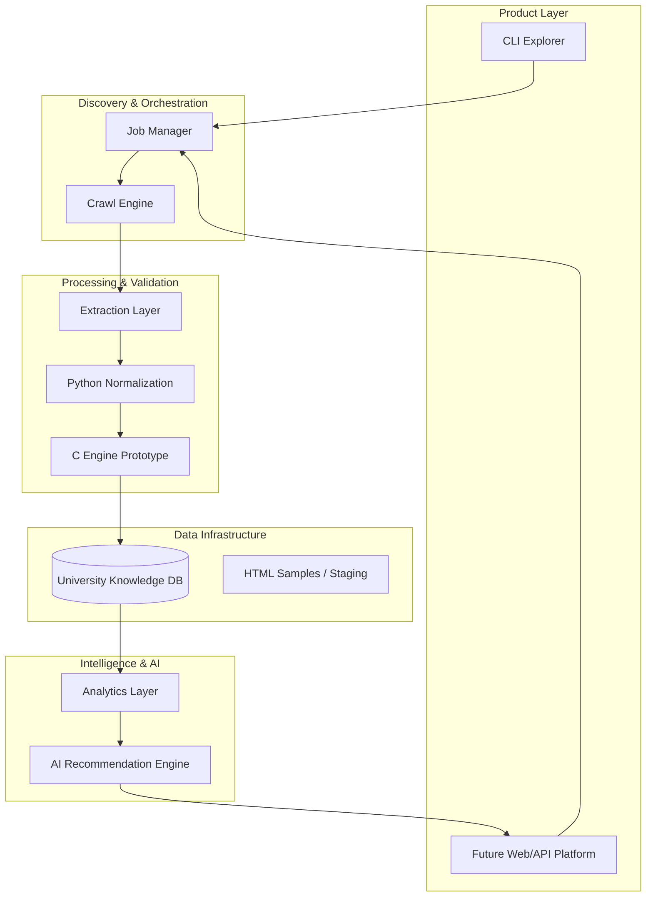
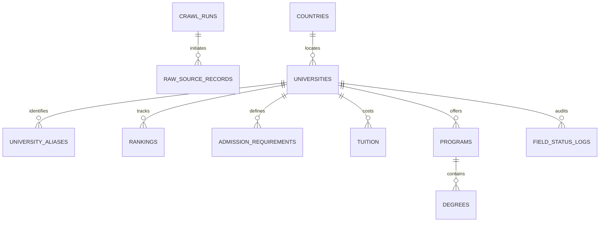
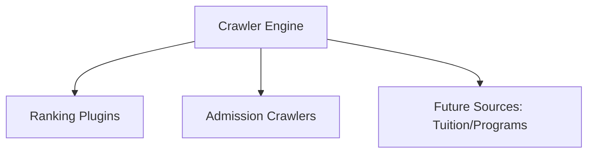
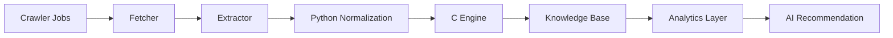

# CrawlerNest System Architecture Whitepaper

This document serves as the Master Technical Architecture Whitepaper for the CrawlerNest project. It provides a comprehensive explanation of the system's layered design, data models, processing pipelines, recommendation architecture, and long-term platform strategy. Our goal is not merely to build a crawler but to define a technical blueprint for evolving from large-scale data collection into a global **University Data Intelligence Platform**.

## Whitepaper Positioning

This document is the **Master Technical Architecture Document** for CrawlerNest, serving as:

- **Strategic Reference**: High-level architectural framework for long-term evolution.
- **Design Alignment**: Unified design language across crawler, database, analytics, and AI layers.
- **Structural Blueprint**: Core reference for future feature expansion and data model iterations.

This whitepaper prioritizes **architecture, platform design, data modeling, and recommendation logic**. It defines:

- The current **CrawlerNest [Operational: V1.5]** foundation.
- Mid-to-long-term **Next [Strategic Goal: V2] & Future [Vision: V3]** expansion strategies.
- The roadmap for the future AI-driven recommendation engine and consumer-facing products.

---

## Current Platform Status & Capabilities

CrawlerNest is currently built on a **data-first architecture**, where each functional layer is decoupled to ensure stability and scalability.

### Strategic Focus [Current]
The system transforms fragmented web data into a structured knowledge base for:
1. **Data Aggregation**: Automated collection from global sources (QS, THE, ARWU, etc.).
2. **Knowledge Infrastructure**: A scalable, standardized global university database.
3. **Decision Support [Initial]**: Analysis to assist in university selection.

### Module Completion Map
*Current development status of the core technical stack (as of March 2026):*

| Module | Description | Status | Completion |
| :--- | :--- | :---: | :---: |
| **Ingestion / Networking** | Async Stack, Endpoint Probing, Pagination | [Operational] | ~80% |
| **Extraction / Parsing** | Admission Requirements, Deadlines, Scoring Heuristics | [Operational] | ~75% |
| **Normalization Baseline** | Country Canon, Safe Numeric Casting, Validation Pipelines | [Operational] | ~60% |
| **C Normalization Engine** | High-performance Name/Country/Rank Parsing | [In Development] | ~25% |
| **Entity Resolution** | Alias Mapping, Manual Correction | [Operational] | ~30% |
| **Storage / Data Warehouse** | Unified Schema, DB Writer, PostgreSQL Baseline, Spring Data JPA | [Operational] | ~78% |
| **Quality & Verification** | Raw Lineage, Parsing Metadata, PostgreSQL Initialization Test, JUnit Automation | [Operational] | ~62% |
| **Analytics & Recommendation**| Ranking Aggregation, Feature Vector Design | [Strategic Goal] | ~20% |

---

## Table of Contents

1. [Current Platform Status & Capabilities](#current-platform-status--capabilities)
2. [System Architecture Overview](#system-architecture-overview-high-level)
3. [System Layer Model (Operational vs. Planned)](#system-layer-model-architectural-layers)
4. [Core Architectural Mechanisms](#core-architectural-mechanisms)
5. [Data Platform & Knowledge Base Architecture](#data-platform--knowledge-base-architecture)
6. [Crawler Framework & Job-based Pipelines](#crawler-framework--job-based-pipelines)
7. [AI Recommendation Architecture (Vision)](#ai-recommendation-architecture)
8. [Project Milestones & 4-Year Roadmap](#project-milestones--4-year-roadmap)
9. [Risk Mitigation & Maintenance](#risk-mitigation--maintenance)

---


## System Architecture Overview (High-level)

The following diagram illustrates the long-term system architecture of CrawlerNest as a university data intelligence platform.



This architecture reflects the long-term design principle:
**Crawler → Data Platform → Analytics → AI → Product**

---

## System Layer Model (Architectural Layers)

To clearly define the platform structure, it is categorized into six functional layers:

- **Layer 1: Data Collection [Operational]**: Automated crawling of rankings (QS, THE, ARWU) and admission requirements.
- **Layer 2: Data Quality & Normalization [Operational / In Development]**: Multi-stage validation using Python pipelines (Operational) and high-performance C normalization modules (In Development).
- **Layer 3: Knowledge Base [Operational]**: Canonical University Database serving as the central "Single Source of Truth."
- **Layer 4: Analytics Layer [Strategic Goal]**: Cross-ranking aggregation, statistical analysis, and feature engineering for recommendations.
- **Layer 5: Recommendation Engine [Strategic Goal]**: Rule-based screening combined with weighted scoring and future ML-driven refinement.
- **Layer 6: Product Layer [Operational / Strategic Goal]**: Developer CLI tools (Operational) and future consumer-facing web/API platforms (Strategic Goal).

Each layer is isolated through modular interfaces, allowing for continuous independent evolution.

---

## Vision & Institutional Strategy

### 1. Core Vision
To establish a perpetual, automated system for the intelligent analysis of global university rankings and admission requirements, serving as the definitive data backbone for international education intelligence over the next four years.

### 2. Strategic Objectives
- **Data Integrity [Current Focus]**: Maintaining a high-fidelity knowledge base through rigorous normalization and entity resolution.
- **Scalability [Architecture Goal]**: Evolving from a specialized crawler into a general-purpose educational intelligence platform.
- **Decision Value [Long-term Vision]**: Providing actionable insights to students, researchers, and institutions through AI-driven analytics.

---

## 二、 核心技術架構與機制 (Core Architectural Strategy & Mechanisms)

### 1. 全域參數與組態機制 (Configuration Logic)
系統核心由 `Config` 類管理，採用 Python Dataclass 封裝，實現「參數化管理」：
- **網路請求控制**：透過 `asyncio.Semaphore` 限制最大進行中的協程數量 (`max_concurrent_requests = 200`)，並設定全域 30 秒中斷時間。
- **指數退避重試 (Exponential Backoff)**：`wait = retry_delay * (retry_backoff ** attempt)`，初始延遲 1.0s，退避倍率 2.0。

### 2. 數據獲取層：Schema-driven 與探針模式
為了應對頻繁改版，系統將從「硬編碼」轉向「配置驅動」：
- **Source Schema**：定義來源（如 QS）的 JSON/HTML 結構。
- **NID 自動發現算法**：啟動「探針模式」，透過多重 Regex 偵測鏈 (Script tags, HTML data attributes, API URLs) 定位 NID。
- **自動降級機制 (Fallback)**：若無法提取 NID，依據定義的關聯頁面列表自動跳轉，極大提高系統健壯性。

### 3. 解析提取層：視窗化滑動搜尋 (Windowed Extract)
- **視窗化算法**：設定 `window = 140`，在關鍵字前後 140 個字元內進行目標模式匹配，減少無關連數據干擾。
- **上下文隔離技術 (Context Isolation)**：利用 Regex 截取相關區段（如區分 Undergraduate 與 Postgraduate），避免學制要求混淆。
- **容錯機制**：欄位失效時標記 `unparsed` 並保留原始數據供後續稽核。

### 3.1 正規化引擎分層 (Normalization Engine Layering)

為了在資料進入 knowledge base 前提高一致性與可分析性，CrawlerNest 的正規化層採取 **Python baseline + C prototype engine** 的雙層策略：

- **Python Normalization Baseline**：負責目前主流程中的 safe numeric casting、country normalization、欄位驗證與基本清洗。
- **CrawlerNest C Data Normalization Engine**：作為高效能 prototype，聚焦於名稱正規化、國家標準化、排名區間解析、分數清洗與後續 duplicate detection 前處理。

目前 C engine 的定位不是取代整個 Python pipeline，而是作為未來可插拔的 **data quality accelerator / preprocessing module**。

### 4. 數據平台層：去重與實體識別 (Deduplication)
- **模糊匹配策略**：利用 Levenshtein 距離、縮寫擴展與 Token 匹配處理名稱不一致問題。
- **地理座標歸一化**：採用 `unicodedata` 進行 NFKD 正規化與字符過濾，並通過硬映射統一國家名稱。

---

## 三、 深度技術實作邏輯 (Detailed Implementation)

### 1. 特徵提取、驗證與正規化 (Extraction, Validation & Normalization)
- **數值解析**：針對分數範圍（如 `7.0-7.5`），執行算術平均運算 `(min + max) / 2` 輸出單一浮點數。
- **指標安全邊界**：
  * IELTS: `[0, 9.0]` | TOEFL: `[0, 120]` | GMAT: `[200, 800]` | GRE: `[260, 340]`
  * 若超出上述邊界，系統自動將該欄位設定為 `None`，防止統計偏差。
- **雙層正規化路徑**：短期由 Python pipeline 執行主流程驗證與 normalization；中長期則預留 C engine 處理高頻率字串清洗、rank parsing、score cleaning 與 duplicate-ready comparison string generation。

### 2. 區域過濾機制 (`_filter_nodes_for_region`)
區域排名核心邏輯包含三項原子操作（滿足其一即獲准）：
- **路徑匹配**：檢查 `resolved_url` 是否包含子區域 Slug。
- **標籤驗證**：檢查節點內部的 `region` 或 `subregion` 字串。
- **名單驗證**：檢查國家是否在預定義清單中。
---

## Core Architectural Mechanisms

### 1. Global Configuration & Orchestration
The system core is managed by a `Config` singleton (implemented via Python Dataclasses), ensuring centralized control:
- **Concurrency Control**: Utilizes `asyncio.Semaphore` to limit concurrent requests (default: 200) with a global 30-second timeout.
- **Exponential Backoff**: Implements robust retry logic: `wait = retry_delay * (retry_backoff ** attempt)`, starting at 1.0s with a 2.0x multiplier.

### 2. Ingestion Strategy: Schema-driven & Discovery Probes
To handle frequent website structure changes, the system prioritizes configuration over hard-coding:
- **Source Schemas**: Declarative definitions of JSON/HTML structures for each ranking source (e.g., QS).
- **Automated Node Discovery (NID)**: A "Probe Mode" utilizing multiple regex chains (script tags, data attributes, API endpoints) to dynamically locate target data nodes.
- **Graceful Fallback**: Automated navigation to related pages if primary data points are missing, significantly improving crawl reliability.
- **Normalization Scoring**: Implements composite scoring logic: $Score_{final} = \frac{\sum (Score_{raw} / Score_{max} \times 100)}{N_{valid}}$ to ensure disparate metrics (e.g., GMAT vs. IELTS) are weighted fairly.

### 3. Data Export & Presentation
- **High-Fidelity CLI**: Console tables built using Unicode box-drawing characters with dynamic width adaptation for terminal responsiveness.
- **Enterprise Compatibility**: CSV exports include UTF-8 BOM headers to ensure seamless compatibility with Microsoft Excel across platforms.

---

## Data Platform & Knowledge Base Architecture

The CrawlerNest Data Platform evolves the system from a simple scraping tool into a structured **Educational Intelligence Warehouse**.

### 1. Canonical Data Model
The V1.5 schema implements a **warehouse-style hierarchy** featuring dimensions, facts, and raw lineage. The original warehouse baseline was implemented in SQLite, and the project has now completed an initial PostgreSQL schema migration baseline for service-layer integration and future analytics expansion.

#### Core Entity Relationships


#### Primary Table Responsibilities
- **crawl_runs [Operational]**: Tracks batch metadata and serves as the lineage entry point.
- **raw_source_records [Operational]**: Staging layer preserving raw JSON/HTML for audit and re-parsing.
- **universities / countries [Operational]**: Dimension tables defining canonical institutional identities.
- **university_aliases [Operational]**: Mapping source-specific variants to canonical IDs (Entity Resolution).
- **rankings / admission_requirements [Operational]**: Fact tables supporting analytics and recommendation features.
- **tuition [Design Placeholder]**: Costs data structure (V2 development target).
- **programs / degrees [Design Placeholder]**: Forward-looking structural placeholders for degree-level expansion (V3 development target).

### 2. Strategic Data Model Evolution
While currently school-centric, the model is prepared for multi-level expansion:
**University → Program → Degree**

Key long-term focus areas:
- **High-fidelity Resolution**: Transitioning from manual alias mapping to fuzzy and embedding-based matching.
- **Feature Engineering**: Transforming raw rankings and admission signals into ML-ready feature vectors for the recommendation engine.
- **Interoperability**: Using the C-based normalization engine as a pluggable data quality accelerator.

### 1.2 SQL Schema (Reference Implementation)

### 3. SQL Schema Reference
The following schema defines the V1.5 warehouse baseline, incorporating crawl runs, raw staging, dimensions, facts, and auditing logs. This reference reflects the canonical logical model; SQLite served as the original persistence baseline, and PostgreSQL has now been validated as the next-stage operational database target for the Java service layer.

```sql
-- Core Lineage & Job Management
CREATE TABLE crawl_runs (
    crawl_run_id INTEGER PRIMARY KEY AUTOINCREMENT,
    source_name TEXT NOT NULL,
    ranking_type TEXT,
    started_at TIMESTAMP DEFAULT CURRENT_TIMESTAMP,
    finished_at TIMESTAMP,
    status TEXT DEFAULT 'running',
    notes TEXT
);

-- Dimension Tables (Canonical Identity)
CREATE TABLE countries (
    country_id INTEGER PRIMARY KEY AUTOINCREMENT,
    country_name TEXT NOT NULL UNIQUE,
    country_code TEXT UNIQUE,
    region_name TEXT,
    created_at TIMESTAMP DEFAULT CURRENT_TIMESTAMP
);

CREATE TABLE universities (
    university_id INTEGER PRIMARY KEY AUTOINCREMENT,
    school_slug TEXT UNIQUE NOT NULL,
    display_name TEXT NOT NULL,
    canonical_name TEXT,
    country_id INTEGER,
    city_name TEXT,
    website_url TEXT,
    qs_profile_path TEXT,
    created_at TIMESTAMP DEFAULT CURRENT_TIMESTAMP,
    updated_at TIMESTAMP DEFAULT CURRENT_TIMESTAMP,
    FOREIGN KEY (country_id) REFERENCES countries(country_id)
);

CREATE TABLE university_aliases (
    alias_id INTEGER PRIMARY KEY AUTOINCREMENT,
    university_id INTEGER NOT NULL,
    source_name TEXT NOT NULL,
    source_school_name TEXT NOT NULL,
    match_type TEXT DEFAULT 'manual',
    confidence_score REAL DEFAULT 1.0,
    FOREIGN KEY (university_id) REFERENCES universities(university_id),
    UNIQUE(source_name, source_school_name)
);

-- Staging & Audit Layer
CREATE TABLE raw_source_records (
    raw_id INTEGER PRIMARY KEY AUTOINCREMENT,
    crawl_run_id INTEGER,
    source_name TEXT NOT NULL,
    record_type TEXT,
    ranking_type TEXT,
    source_url TEXT,
    raw_json TEXT,
    raw_text TEXT,
    fetched_at TIMESTAMP DEFAULT CURRENT_TIMESTAMP,
    FOREIGN KEY (crawl_run_id) REFERENCES crawl_runs(crawl_run_id)
);

-- Fact Tables (Signals for Analytics/AI)
CREATE TABLE rankings (
    ranking_id INTEGER PRIMARY KEY AUTOINCREMENT,
    university_id INTEGER NOT NULL,
    raw_id INTEGER,
    ranking_source TEXT NOT NULL,
    ranking_type TEXT NOT NULL,
    ranking_year INTEGER,
    rank_start INTEGER,
    rank_end INTEGER,
    score REAL,
    metrics_json TEXT,
    source_url TEXT,
    created_at TIMESTAMP DEFAULT CURRENT_TIMESTAMP,
    FOREIGN KEY (university_id) REFERENCES universities(university_id),
    FOREIGN KEY (raw_id) REFERENCES raw_source_records(raw_id)
);

CREATE TABLE admission_requirements (
    requirement_id INTEGER PRIMARY KEY AUTOINCREMENT,
    university_id INTEGER NOT NULL,
    program_id INTEGER,
    degree_id INTEGER,
    raw_id INTEGER,
    source_url TEXT,
    gpa_min REAL,
    ielts_min REAL,
    toefl_min REAL,
    gre_min REAL,
    gmat_min REAL,
    application_deadline_text TEXT,
    raw_text TEXT,
    parsed_status TEXT,
    extracted_at TIMESTAMP DEFAULT CURRENT_TIMESTAMP,
    FOREIGN KEY (university_id) REFERENCES universities(university_id),
    FOREIGN KEY (raw_id) REFERENCES raw_source_records(raw_id)
);
```

#### Key Design Principles:
- **Lineage Tracking**: `crawl_runs` and `raw_source_records` ensure that every data point can be traced back to its specific crawl batch and original source.
- **Identity Resolution**: The `universities`, `countries`, and `aliases` tables manage canonical institutional identities, preventing data fragmentation across multiple ranking sources.
- **Hybrid Storage**: Use of `metrics_json` and `raw_text` allows for a flexible schema that captures both structured numeric data and semi-structured qualitative signals for future LLM-based parsing.

### 4. Optimized Indexing Strategy
To support high-performance analytics and entity resolution, the following indexes are maintained:

```sql
CREATE INDEX idx_countries_name ON countries(country_name);
CREATE INDEX idx_universities_slug ON universities(school_slug);
CREATE INDEX idx_universities_country ON universities(country_id);
CREATE INDEX idx_university_aliases_source_name ON university_aliases(source_name, source_school_name);
CREATE INDEX idx_raw_source_records_source_type ON raw_source_records(source_name, ranking_type);
CREATE INDEX idx_raw_source_records_crawl_run ON raw_source_records(crawl_run_id);
CREATE INDEX idx_rankings_university_year ON rankings(university_id, ranking_year);
CREATE INDEX idx_rankings_source_type ON rankings(ranking_source, ranking_type);
CREATE INDEX idx_rankings_raw ON rankings(raw_id);
CREATE INDEX idx_admission_requirements_university ON admission_requirements(university_id);
CREATE INDEX idx_field_status_logs_university ON field_status_logs(university_id);
```

These indexes facilitate:
- **Identity Resolution**: Fast lookups for universities and aliases across multiple sources.
- **Analytics Performance**: Efficient cross-ranking trend analysis and country-level statistics.
- **Data Governance**: Rapid traceback of parsing errors and crawl batch history.

### 5. Functional Data Roles
- **System Orchestration (`crawl_runs`)**: Standardizes batch lifecycle management.
- **Geospatial Consistency (`countries`)**: Prevents fragmentation of country/region data.
- **Institutional Identity (`universities` & `university_aliases`)**: The core of the platform, enabling multi-source data merging.
- **Data Provenance (`raw_source_records`)**: Acts as a persistent caching and audit layer.
- **Analytical Facts (`rankings` & `admission_requirements`)**: Raw signals used for downstream analytics; all normalization and weighting occur at the analytics layer.
- **Quality Assurance (`field_status_logs`)**: Provides a transparent audit trail for all normalization and extraction operations.

## Crawler Framework & Job-based Pipelines

### 1. Unified Crawler Engine
The system is driven by a unified crawler engine that eliminates the need for independent scripts. This centralized approach enables consistent logging, error handling, and data flow management.



#### Operational Data Flow
1. **Source Page**: Target URL identified by the job.
2. **Fetcher**: Handles HTTP/Async requests with rotation and retries.
3. **Extractor**: Performs HTML/JSON parsing via schema-driven logic.
4. **Normalization**: Python validation followed by high-performance C-engine processing.
5. **Database**: Final persistence in the University Knowledge Base.

---

### 2. Job-Level Orchestration
The system utilizes a **Job-based scheduling architecture** to ensure task isolation and observability. Examples includes:
- `qs_world_rankings`
- `qs_subject_rankings`
- `mit_admission_sync`
- `ucla_admission_sync`

**Advantages of Job-based Design**:
- **Granular Scheduling**: Jobs can be prioritized or deferred independently.
- **Error Isolation**: Failure in one job (e.g., a specific university site) does not impact the rest of the pipeline.
- **Enhanced Observability**: Clear tracking of success rates and performance metrics per job.

### 3. Collection Strategy: Baseline vs. Incremental
CrawlerNest employs a dual-mode collection strategy:
- **Full Crawl (Baseline)**: Periodic complete refreshes of global ranking datasets (1,500+ universities).
- **Incremental Update**: Selective refreshing of admission requirements and program-level data to optimize bandwidth and target site respect.

---

### 4. Ranking Data Strategy
The ranking crawler architecture is governed by key strategic principles:
- **Resilient Extraction**: Prioritization of HTML extraction for higher stability, with API integration reserved for future optimization.
- **Unified Rankings Table**: A consolidated storage strategy where all sources (QS, THE, ARWU) share a single canonical table.

**Design Benefits**:
- **Cross-Ranking Analytics**: Enables direct comparisons between different ranking methodologies.
- **AI Ranking Aggregation**: Provides a consistent foundation for composite scoring and trend analysis.
- **Schema Flexibility**: Use of `metrics_json` avoids schema bloat by storing source-specific indicators (e.g., Academic Reputation vs. Research Influence) in a flexible format.

### 5. Operational Data Pipeline
The end-to-end flow from raw collection to intelligent recommendation is illustrated below:



This pipeline ensures a clean separation of concerns:
- **Collection Layer**: Infrastructure and networking.
- **Processing Layer**: Extraction and multi-stage normalization.
- **Storage Layer**: The definitive University Knowledge Base.
- **Decision Layer**: Advanced analytics and recommendation heuristics.

這種分層確保系統未來可以：

- 更換 crawler source 而不影響資料模型
- 重跑 normalization 與 analytics
- 在資料庫層之上構建新的產品功能

### 7.1 Platform Architecture

為了支援未來四年的產品化目標，CrawlerNest 系統將逐步演進為一個 **University Data Platform**，並在其上建立 AI 決策層。此架構與目前的 crawler 系統保持相容，同時允許未來擴展 API 與 Web 平台。

整體架構如下：

```
                ┌──────────────────────────────┐
                │      CLI / Interactive UI    │
                └──────────────┬───────────────┘
                               │
                         ┌─────▼─────┐
                         │  Crawler  │
                         │Orchestrator│
                         └─────┬─────┘
                               │
                ┌──────────────┼──────────────┐
                │                              │
          Fetcher Layer                  Extractor Layer
                │                              │
                └──────────────┬──────────────┘
                               │
                       University Data Model
                               │
                Python Validation / Normalization Layer
                               │
                C Data Normalization Engine (Prototype)
                               │
                         DB Writer Layer
                               │
                 ┌─────────────▼─────────────┐
                 │ SQLite / PostgreSQL KB    │
                 │ Warehouse Baseline        │
                 └─────────────┬─────────────┘
                               │
                         Analytics Layer
                               │
                 ┌─────────────▼─────────────┐
                 │   AI Recommendation       │
                 │   & Decision Engine       │
                 └─────────────┬─────────────┘
                               │
                       Future API Platform
                               │
                       Future Web Platform
```

此設計遵循一個核心原則：

```
Crawler → Database → Analytics → AI → Product
```

說明：

- **Crawler Layer**：負責從 QS / THE / ARWU 等來源採集排名與相關資料。
- **University Knowledge Base**：系統的核心資料庫，儲存 canonical university data。
- **Analytics Layer**：負責 ranking aggregation、ROI analysis 與資料統計。
- **AI Decision Engine**：提供 personalized university recommendation。
- **API / Web Platform**：透過 `servise_for_java` (Spring Boot) 提供 REST API 端點（`/universities`, `/rankings`, `/recommendations`），並作為未來產品介面的服務後端。

此架構確保：

- Data pipeline 與 AI layer 解耦
- 未來能支援多 ranking 整合
- 系統可逐步產品化，而不影響現有 crawler 架構
 - PostgreSQL baseline 已完成初始化與 Java Spring Boot service 啟動驗證

### 7.2 Architecture Principles

為了確保 CrawlerNest 在未來四年的擴展過程中保持可維護性與一致性，系統設計遵循以下核心原則：

- **Data-first Architecture**：優先建立穩定資料層，再向上發展 analytics 與 AI。
- **Schema-driven Extraction**：以資料結構與來源規格驅動採集邏輯，降低網站改版帶來的維護成本。
- **Layered Architecture**：Crawler、Normalization、Database、Analytics 與 AI Recommendation 分層實作，避免高耦合。
- **Source-agnostic Ranking System**：所有 ranking source 皆寫入統一的 canonical rankings schema，而非各自建立獨立系統。
- **Canonical Identity Resolution**：以 university_id 為核心，結合 manual mapping、alias、fuzzy matching 與 embedding matching 完成實體對齊。
- **Analytics-after-Storage**：所有 normalization、aggregation、AI scoring 皆在資料寫入後進行，避免 crawler 層過度複雜化。
- **Progressive Productization**：系統先完成 data platform，再逐步擴展為 API 與 Web product，而非一開始直接做完整產品介面。
- **Warehouse-first Persistence**：crawler output 不再只停留於 console / CSV，而是優先進入可追溯的 SQLite knowledge base。
- **Lineage-aware Data Design**：透過 `crawl_runs` 與 `raw_source_records` 保留資料來源、crawler batch 與解析上下文，支援未來品質治理與重解析。
- **Language-appropriate Modules**：對高頻率字串清洗與資料前處理採取 language-appropriate strategy，允許 Python 主流程與 C-based normalization engine 並存。

---

### 8. Entity Resolution Pipeline

為解決不同資料來源中學校名稱不一致的問題，系統採用多階段實體識別策略：

```
Raw School Name
      │
      ▼
Manual Mapping
      │
      ▼
Alias Table Lookup
      │
      ▼
Fuzzy Matching
      │
      ▼
Embedding Matching (AI)
      │
      ▼
Resolved school_id
```

說明：

- **Manual Mapping**：最高準確度，用於核心學校名稱。
- **Alias Table**：維護常見別名，例如 MIT / Massachusetts Institute of Technology。
- **Fuzzy Matching**：利用字串相似度處理小幅拼寫差異。
- **Embedding Matching**：透過語義向量比對處理複雜名稱變體。

Priority order：manual mapping → alias table → fuzzy matching → embedding matching

---

### 9. AI Recommendation Architecture

推薦系統在架構層可抽象為以下決策流程：

```
User Profile
   │
   ▼
Rule Filter
(Hard Constraints)
   │
   ▼
Candidate Set
   │
   ▼
University / Program / Degree Recommendation
   │
   ▼
Weighted Scoring Layer
   │
   ▼
ML Refinement Layer
   │
   ▼
Final Ranked Recommendations
```

## AI Recommendation Architecture

The CrawlerNest recommendation engine is designed to evolve from simple rule-based filtering into a sophisticated, multi-level AI decision support system.

### Core Strategic Value
This architecture ensures three critical platform characteristics:
- **Explainability**: Weighted scoring provides transparent rationale for every recommendation.
- **Extensibility**: The modular design allows for the seamless integration of machine learning layers as data volume grows.
- **Multi-level Support**: Simultaneously supports recommendations at the **University, Program, and Degree** levels.

### Evolutionary Roadmap [Strategic Vision]
The system follows a staged approach to recommendation depth:
- **V1.5 (Current Development)**: University-level Recommendation
- **V2 (Strategic Goal)**: Program-aware Recommendation
- **V3 (Strategic Goal)**: Degree-level Recommendation
- **V4 (Long-term Vision)**: Comprehensive Multi-level Intelligent Decision Support

This strategy transforms CrawlerNest from a mere data viewer into a true **Education Decision Support System (EDSS)**.

---


### 1. Multi-level Recommendation Strategy
To manage complexity, the recommendation depth is expanded incrementally based on data maturity:
- **University-level**: Addressing the foundational question: "Which institutions are a good fit?"
- **Program-aware**: Addressing specialized fit: "Which specific departments or fields align with the user's goals?"
- **Degree-level**: Addressing granular fit: "Which specific degree offerings provide the best outcome/ROI?"

### 2. Hybrid Recommendation Engine
The ultimate state of the engine is a **Hybrid System (Rule-based + Weighted Scoring + ML Refinement)**.

#### Processing Pipeline:
1. **Rule Filter (Hard Constraints)**: Filters candidates based on absolute requirements (IELTS/TOEFL scores, Budget, Country, Degree type).
2. **Weighted Scoring Layer**: Calculates a base score using explainable signals such as aggregate rankings, admission probability, and cost/location fit.
3. **ML Refinement Layer (Future)**: Fine-tunes the ranking based on historical outcomes and user behavior models as the dataset matures.

### 3. Recommendation Scoring Model (Conceptual)
In the V1.5 / V2 stages, the engine utilizes an explainable weighted scoring model:

$RecommendationScore = CompositeRanking + AdmissionProb + BudgetFit + LocationPref + OutcomeSignal$

- **CompositeRanking**: Aggregated score derived from QS, THE, and ARWU.
- **AdmissionProb**: Statistical estimation of acceptance based on academic credentials.
- **BudgetFit**: Alignment between tuition costs and user financial constraints.
- **LocationPref**: Regional or country-specific preferences.
- **OutcomeSignal**: Employment rates, career outcomes, and other third-party value indicators.


---

## Development Priorities & Execution Strategy

To ensure sustainable growth and avoid scope explosion, CrawlerNest development is prioritized into three distinct tiers. This strategy ensures a functional core platform is delivered before expanding into AI and product layers.

### Tier 1: Current (V1.5) — Foundational Data Platform [Operational / Finalizing]
This tier establishes the critical path for system viability.
- **Focus**: `Crawler → Normalization → Database → Query`
- **Core Components [Operational]**:
    - Ranking crawlers (QS World Rankings baseline).
    - Canonical Database Schema implementation (SQLite baseline + PostgreSQL migration baseline).
    - Multi-stage Normalization Pipelines (Python).
    - CLI Explorer/Query Interface for developer and power-user access.
    - Initial School Mapping and Identity Resolution mechanisms.
- **Core Components [In Development]**:
    - C Normalization Engine Prototype.
    - JUnit Automation framework for Java services.

**Status**: Provides a stable data foundation and a continuously updatable university knowledge base.

---

### Tier 2: Next (V2) — Platform Expansion & Enrichment [Strategic Goal]
Building upon the stable V1.5 foundation to create a comprehensive knowledge base.
- **Focus**: Multi-source data integration and deeper parsing.
- **Core Components [Planned]**:
    - Integration of additional ranking sources (THE, ARWU).
    - Automated admission requirement extraction from university sites.
    - Incremental update pipelines for efficient data maintenance.
    - Advanced Entity Resolution (Alias tables + fuzzy matching).
    - Preliminary Admission Probability heuristics.
    - Initial implementation of Program Taxonomy.

---

此階段的目標是建立 **完整的 University Knowledge Base**。

---

### Future (V3) — 未來進化 (Advanced Intelligence Layer)

此層為長期目標，不影響核心平台運作。

- Hybrid recommendation engine
- Personalized university ranking
- Program-aware recommendation
- Degree-level recommendation
- LLM-based admission parsing
- Tuition / career outcome / third-party signal integration
- Future API platform
- Future web product

這一層將把 CrawlerNest 從 **data platform** 推進為 **decision-support system**。

---

### Priority Principle

整個專案開發必須遵循以下順序：

```
Current (V1.5) → Next (V2) → Future (V3)
```

任何新功能若影響 Current (V1.5) 穩定性，應延後至 Next (V2) 或 Future (V3)。

此策略確保：

- 系統能快速產出可用成果
- 架構不會因過度設計而停滯
- 長期演進仍然保持清晰方向


## Major Project Milestones

本節描述的是 **平台能力里程碑 (platform capability milestones)**，用於定義系統在長期演進過程中必須達到的穩定能力節點。

實際開發優先順序仍應以 **Development Priorities (Current (V1.5) → Next (V2) → Future (V3))** 為準，以避免在早期階段過度擴展系統範圍。

The long-term development of CrawlerNest is organized into a sequence of major technical milestones. Each milestone represents a stable platform capability that the system must achieve before moving to the next stage.

### Milestone 1 — Stable Crawling Infrastructure Capability

- 完成 ranking crawler 的穩定化
- 建立基本 extraction / normalization pipeline
- 支援 QS ranking dataset

### Milestone 2 — University Knowledge Base Capability

- 建立 canonical database schema
- 完成 school identity resolution
- 支援 admission requirements crawling

### Milestone 3 — Multi-Ranking Integration Capability

- 整合 QS / THE / ARWU rankings
- 建立 ranking aggregation
- 支援 cross-ranking analytics

### Milestone 4 — Multi-level AI-assisted Recommendation Capability

### Tier 3: Future (V3) — Advanced Intelligence Layer
The long-term evolutionary stage where the platform transforms into a decision-support system.
- **Focus**: AI-driven insights and multi-level recommendations.
- **Core Components**:
    - Hybrid Recommendation Engine (Rule + Scoring + ML).
    - Personalized institutional rankings.
    - Program and Degree-level recommendation modules.
    - LLM-integrated admission parsing for complex, unstructured requirements.
    - Integration of external signals (Tuition, Career Outcomes, ROI).
    - Development of public API and Web products.

---

### Execution Principle: Linear Progression
Development must follow a strict sequential order:
**Tier 1 (V1.5) → Tier 2 (V2) → Tier 3 (V3)**

New features must not compromise the stability of Tier 1. This ensures rapid delivery of functional results while maintaining a clear, non-bloated architectural direction.

---

## Development Roadmap & Milestones

The CrawlerNest roadmap is defined by stable **Platform Capability Milestones**, ensuring that foundational infrastructure is solidified before advancing to higher-level intelligence.

### 1. Major Capability Milestones
- **Milestone 1 — Stable Ingestion**: Verified crawling for QS ranking datasets and robust normalization.
- **Milestone 2 — Knowledge Infrastructure**: Canonical schema implementation and school-level identity resolution.
- **Milestone 3 — Data Enrichment**: Integration of multi-source rankings (THE, ARWU) and admission requirement crawling.
- **Milestone 4 — Intelligent Decision Support**: Deployment of the hybrid recommendation engine and multi-level data models.

### 2. 4-Year Strategic Roadmap
Our path follows the principle: **Data Platform → Analytics → AI → Productization.**

#### Historical Project Timeline (Current Progress)
| Date | Milestone / Update | Status |
| :--- | :--- | :--- |
| **2026-02-04** | Initial admission requirements crawler prototype. | Done |
| **2026-02-17** | Complete modular refactor (V2.0); established async default mode. | Done |
| **2026-03-09** | Formalized system architecture and long-term intelligence platform vision. | Done |
| **2026-03-15** | Structural modularization: Separated Python orchestration from the C Normalization Engine. | Done |
| **2026-03-18** | Java services upgraded to Spring Data JPA with Maven/JUnit automation framework. | Done |
| **2026-03-19** | PostgreSQL schema initialization validated; Spring Boot service successfully booted against the new database baseline. | Done |
| **2026-03-20** | **Architecture Whitepaper Refined**: Updated persistence status to reflect PostgreSQL baseline validation and service integration progress. | **Current** |

#### Future Development Phases
- **Phase 1: Stabilization (Months 0–6)**: Establish HTML sample libraries, automate unit testing for extractors, and finalize C-engine boundary definitions.
- **Phase 2: Data Modeling (Months 7–18)**: Strengthen PostgreSQL-ready schemas, implement de-duplication engines, and integrate C-engine into ingestion pipelines.
- **Phase 3: Resilience & Multi-Source (Months 19–30)**: Integrate proxy rotation, THE/ARWU rankings, and real-time monitoring alerts.
- **Phase 4: Advanced Intelligence (Months 31–48)**: Deploy LLM-assisted verification, hybrid recommendation engine, and produce comprehensive trend analysis reports.

---

## Product Vision & Capability Map

### 1. Future Product Paradigms
In its mature state, CrawlerNest will support multiple product configurations:
- **University Data Explorer**: A structured global institutional search platform.
- **AI Selection Assistant**: Personalization engine providing tailored university recommendations.
- **Cross-Ranking Analytics**: Comparative methodology tools for researchers and policymakers.
- **Integrated Decision Platform**: A "one-stop shop" for ranking, admission, tuition, and outcome data.

### 2. System Capability Map
The following matrix categorizes platform capabilities across four evolutionary layers:

| Layer | Capability | Status | Direction |
| :--- | :--- | :---: | :--- |
| **Foundation** | Ranking Crawling Infrastructure | **Active** | Continuous stability and maintenance optimization. |
| **Foundation** | Canonical Identity Schema | **Active** | Evolution to program/degree-aware models. |
| **Foundation** | Identity Resolution (Aliases) | **Active** | Transitioning to fuzzy and embedding-based matching. |
| **Foundation** | Knowledge Base Persistence (SQLite → PostgreSQL) | **Active** | PostgreSQL baseline validated; continuing toward production-grade analytics and service integration. |
| **Expansion** | Multi-Ranking Integration | **Planned** | Full support for QS, THE, ARWU, and regional lists. |
| **Expansion** | Admission Ingestion | **Planned** | Extraction of structured and raw admission signatures. |
| **Expansion** | Program Taxonomy | **Planned** | Foundation for department-level analytics. |
| **Intelligence** | Admission Probability Estimation | **Planned** | Key feature for explainable recommendations. |
| **Intelligence** | Hybrid Recommendation Engine | **Future** | Rule-based screening + ML refinement. |
| **Productization** | CLI Explorer | **Active** | Primary developer and research interface. |
| **Productization** | API & Web Platform | **Future** | Scalable service endpoints and consumer interfaces. |

---

---

## Risk Mitigation & Maintenance

Our technical strategy includes proactive management of crawler, data platform, and AI-related risks.

| Risk Category | Item | Severity | Mitigation Strategy |
| :--- | :--- | :---: | :--- |
| **Technical** | Site Structure Changes | High | Implementation of schema-driven parsing to reduce maintenance overhead. |
| **Infrastructure** | IP Blocking / WAF | Medium | Proxy rotation integration and migration to headless browsing if necessary. |
| **Data Quality** | Entity Fragmentation | High | Prioritization of identity resolution and de-duplication engines. |

### Routine Maintenance Checklist
- **Quarterly Audit**: Sample-check top 10 institutions to verify DOM stability and parsing accuracy.
- **Continuous Alignment**: Ensure that any major architectural changes are reflected in this Master Project Plan.
- **Database Verification**: Re-run PostgreSQL schema initialization and Spring Boot connectivity checks whenever schema or persistence configuration changes.

---

> [!IMPORTANT]
> This document constitutes the definitive Technical Architecture Whitepaper for the CrawlerNest project. All architectural decisions, data model modifications, and strategic pivots must align with the layered design and evolutionary tiers documented herein.
