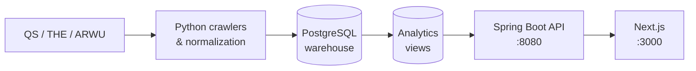

# CrawlerNest

An end-to-end university data infrastructure and web platform. It aggregates global and subject rankings from QS, THE, and ARWU into a single warehouse, exposes an explainability-first API, and delivers a Next.js frontend for browsing, comparing, and saving universities.

The system is data-first: crawlers and pipelines write canonical records into PostgreSQL, and the UI reads only from analytics views — never directly from raw tables.

---

## What It Does

- **Global rankings** — 1,499 universities aggregated from QS 2026 (THE and ARWU adapters included)
- **Subject rankings** — QS 2026 subject data for Computer Science, Electrical Engineering, Business & Management
- **Explainability** — every ranking and recommendation comes with a source comparison, confidence level, and evidence chain
- **Recommendations** — filter universities by region, rank tier, and subject; export a named plan
- **Analytics** — year-over-year rank movement, cross-source disagreement, data quality diagnostics
- **Identity layer** — session-based accounts, saved universities, saved recommendation plans

---

## Architecture



**Tech stack:** Python · PostgreSQL · Spring Boot (Java 17) · Next.js (React) · Tailwind CSS

---

## Repository Layout

```
crawlernest/
  crawlernest-web/          Next.js frontend
  servise_for_java/         Spring Boot API
  crawlernest-core/         canonical resolution, aggregation
  pipeline/                 CLI entry points
  crawlernest-normalization/ C-language CSV normalizer (research component)
  crawlernest-agents/       AI dev agent collection (readonly, optional)
crawlernest_ranking_crawler/ Python ranking ingestion package
crawlernest_admission_crawler/ Python admission ingestion package
docs/                       architecture, operations, release docs
scripts/                    startup, smoke checks, operational automation
tests/                      integration tests
```

---

## Getting Started

→ **[docs/GETTING_STARTED.md](docs/GETTING_STARTED.md)** — full local setup (PostgreSQL, Python, Java, Node.js, data pipeline)

One-line start (after first-time setup):

```bash
./scripts/start_localhost.sh
```

---

## Documentation

| Topic | Doc |
|-------|-----|
| Architecture | [docs/ARCHITECTURE_OVERVIEW.md](docs/ARCHITECTURE_OVERVIEW.md) |
| Repository map | [docs/REPOSITORY_MAP.md](docs/REPOSITORY_MAP.md) |
| Data flow | [docs/DATA_FLOW.md](docs/DATA_FLOW.md) |
| API surface | [docs/API_SURFACE.md](docs/API_SURFACE.md) |
| Operational runbook | [docs/operational/OPERATIONAL_RUNBOOK.md](docs/operational/OPERATIONAL_RUNBOOK.md) |
| Auth limitations | [docs/AUTH_LIMITATIONS.md](docs/AUTH_LIMITATIONS.md) |
| Local troubleshooting | [docs/LOCAL_TROUBLESHOOTING.md](docs/LOCAL_TROUBLESHOOTING.md) |
| All docs | [docs/README.md](docs/README.md) |

---

## Current State

CrawlerNest v0.1 is an operational MVP — reproducible and demonstrable, not a production deployment.

- THE and ARWU are in stable degraded state (data unavailable); QS 2026 is fully ingested
- All universities show as single-source; confidence is always "low" under the current RC-1 posture
- The agent page defaults to a mock provider and does not write to the database

Release notes: [docs/release/RELEASE_NOTES_v0.1.md](docs/release/RELEASE_NOTES_v0.1.md)
