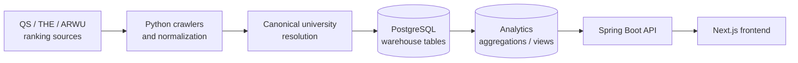

# CrawlerNest

CrawlerNest is an end-to-end university data infrastructure and web platform for global university rankings, subject rankings, admissions signals, and local exploration workflows.

The project is data-first: the UI reads from warehouse and analytics views, while crawlers and pipelines prepare canonical records in PostgreSQL.

## Quick Start

Use this path for a full local run.

### 1. Create the Python environment

```bash
python3 -m venv .venv
source .venv/bin/activate
pip install -r requirements.txt
```

### 2. Install and start PostgreSQL

On WSL/Ubuntu, use the local PostgreSQL package:

```bash
sudo apt update
sudo apt install postgresql postgresql-contrib
sudo service postgresql start
```

Create the local development role and database:

```bash
sudo -u postgres psql -c "CREATE ROLE test WITH LOGIN PASSWORD 'test';"
sudo -u postgres createdb -O test clawer
```

If the role or database already exists, keep using the same credentials:

```text
database: clawer
user: test
password: test
host: localhost
port: 5432
```

### 3. Bootstrap schemas and seed data

Run this once in a new environment. It is safe to rerun.

```bash
python3 -m crawlernest.run_pipeline bootstrap-postgres \
  --pg-user test \
  --pg-password test \
  --pg-database clawer
```

### 4. Initialize ranking data

The web app will be empty until pipeline data exists.

```bash
./.venv/bin/python -m crawlernest.run_pipeline run \
  --limit 20 \
  --ranking-year 2026 \
  --pg-user test \
  --pg-password test \
  --pg-database clawer
```

You can confirm the analytics view has data:

```bash
PGPASSWORD=test psql -h localhost -U test -d clawer \
  -c "SELECT count(*) FROM analytics.v_aggregated_rankings_latest;"
```

### 5. Confirm Spring Boot datasource credentials

`crawlernest/servise_for_java/src/main/resources/application.properties` must use:

```properties
spring.datasource.url=jdbc:postgresql://localhost:5432/clawer
spring.datasource.username=test
spring.datasource.password=test
```

### 6. Install frontend dependencies

Node.js **>=20.9** is required. Check your version:

```bash
node --version
```

Install Node.js dependencies (run once, or after pulling changes):

```bash
cd crawlernest/crawlernest-web
npm install
cd ../..
```

### 7. Start local services

```bash
./scripts/start_localhost.sh
```

The script checks PostgreSQL, verifies Node.js version, confirms `node_modules`
exists, verifies the API port, starts Spring Boot with `-Dmaven.test.skip=true`,
then starts the Next.js frontend. Press `Ctrl+C` to stop both services.

You can also run services manually:

```bash
cd crawlernest/servise_for_java
./mvnw -Dmaven.test.skip=true spring-boot:run
```

```bash
cd crawlernest/crawlernest-web
npm run dev
```

### 8. Smoke check

```bash
curl -i "http://localhost:8080/api/v1/rankings?page=1&pageSize=5"
curl -i "http://localhost:3000/api/rankings?page=1&pageSize=5"
curl -I "http://localhost:3000/rankings"
./scripts/smoke_local_stack.sh
```

## Service URLs

```text
Web: http://localhost:3000
API: http://localhost:8080
Agent API: http://localhost:8090
```

Main pages:

```text
Global rankings: http://localhost:3000/rankings
Subject rankings: http://localhost:3000/subject-rankings
Agent: http://localhost:3000/agent
```

## Architecture

CrawlerNest is organized as a data pipeline plus product read layer:



Current system components:

- Ranking ingestion for QS and THE, with ARWU adapter support when source data exists.
- Aggregation into `analytics.v_aggregated_rankings_latest`.
- Subject rankings as a parallel QS subject read path.
- Recommendation layer reading aggregated ranking candidates.
- Diagnostics for health, freshness, data quality, ranking readiness, subject readiness, and source agreement.
- Cross-source intelligence and explainability APIs for source comparison, disagreement, confidence, and aggregation inputs.
- Operational automation through daily pipeline, snapshots, metadata bundles, and smoke checks.
- CI/CD through release smoke and fixture-mode data quality workflows.

Start with these docs when changing architecture or onboarding:

- [Documentation Hub](docs/README.md)
- [Architecture Overview](docs/ARCHITECTURE_OVERVIEW.md)
- [Repository Map](docs/REPOSITORY_MAP.md)
- [Data Flow](docs/DATA_FLOW.md)
- [Operational Runbook](docs/OPERATIONAL_RUNBOOK.md)
- [API Surface](docs/API_SURFACE.md)

## Subject Rankings MVP

Subject rankings are implemented as a parallel read path, not as an extension of global ranking aggregation.

Current MVP support:

```text
source: QS
year: 2026
subjects:
  - computer-science
  - electrical-engineering
```

Load QS subject ranking data:

```bash
./.venv/bin/python -m crawlernest.run_pipeline run-qs-subject \
  --subject computer-science \
  --year 2026 \
  --pg-user test \
  --pg-password test \
  --pg-database clawer
```

```bash
./.venv/bin/python -m crawlernest.run_pipeline run-qs-subject \
  --subject electrical-engineering \
  --year 2026 \
  --pg-user test \
  --pg-password test \
  --pg-database clawer
```

Subject ranking API examples:

```bash
curl "http://localhost:8080/api/v1/subject-rankings/subjects"
curl "http://localhost:8080/api/v1/subject-rankings?subject=computer-science&year=2026&page=1&pageSize=20"
```

Web proxy examples:

```bash
curl "http://localhost:3000/api/subject-rankings/subjects"
curl "http://localhost:3000/api/subject-rankings?subject=computer-science&year=2026&page=1&pageSize=20"
```

## Data Visibility

Global ranking UI reads from:

```text
warehouse.ranking_record
analytics.v_aggregated_rankings_latest
```

Subject ranking UI reads from:

```text
warehouse.subject_ranking_record
analytics.v_subject_rankings_latest
```

Raw and staging tables are pipeline inputs. They are not shown directly in the product UI.

## Diagnostics And Explainability

Operational and data quality surfaces:

```text
Health:              /api/v1/health
Freshness:           /api/v1/freshness
Ranking diagnostics: /api/v1/diagnostics/rankings
Subject diagnostics: /api/v1/diagnostics/subjects
Data quality:        /api/v1/diagnostics/data-quality
Source agreement:    /api/v1/diagnostics/source-agreement
```

Explainability surfaces:

```text
Source comparison:   /api/v1/universities/{id}/source-comparison
Ranking explain:     /api/v1/rankings/{id}/explain
University sources:  /universities/[slug]/sources
```

These endpoints read stored ranking evidence and aggregation output. They do not modify aggregation, canonical matching, recommendation scoring, or schema.

## CI/CD And Operations

CI workflows:

```text
.github/workflows/release-smoke.yml
.github/workflows/data-quality.yml
```

Operational scripts:

```text
scripts/smoke_release.sh
scripts/smoke_local_stack.sh
scripts/run_daily_pipeline.sh
scripts/export_system_snapshot.py
scripts/export_metadata_bundle.sh
scripts/build_failure_summary.py
```

Generated operational evidence is written to `snapshots/`, `reports/`, and daily logs.

## Current Maturity

CrawlerNest is currently an operational MVP: the end-to-end ranking path,
subject ranking path, diagnostics, smoke checks, snapshots, and recovery docs are
usable for local development and evidence-driven iteration. The current focus is
operational reliability, reproducibility, observability, and conservative
recovery rather than autonomous automation.

The sibling `crawlernest-agents` repository remains a readonly development
companion. It is not a runtime dependency, CI requirement, submodule, symlink, or
production truth source.

## Optional Agents Workflows

CrawlerNest can work with a sibling `crawlernest-agents` repository for readonly
development analysis:

```text
dev/
  University-Data-Infrastructure-Web-Platform/
  crawlernest-agents/
```

Use `./scripts/agent_debug.sh` for the optional debug workflow and
`./scripts/agent_pipeline_analysis.sh <log_file>` for readonly pipeline log
analysis. These wrappers do not make `crawlernest-agents` a dependency, symlink,
submodule, CI step, or production runtime component. Generated analysis output is
limited to `tmp/agent-debug/`, `tmp/agent-analysis/`, or the agents repo's own
`tmp/` directory.

Repo-aware prompt context is available through
`./scripts/agent_context_snapshot.sh` and `./scripts/agent_repo_prompt.sh`.
The snapshot flow collects readonly repository state and operational evidence,
then injects `tmp/agent-context/context_snapshot.md` into prompt generation.
Context artifacts stay in `tmp/agent-context/`.

## Manual Development

Start the Spring Boot API:

```bash
cd crawlernest/servise_for_java
./mvnw -Dmaven.test.skip=true spring-boot:run
```

Start the Next.js web app:

```bash
cd crawlernest/crawlernest-web
npm install
npm run dev
```

Run selected checks:

```bash
python3 crawlernest/scripts/smoke_subject_rankings.py
cd crawlernest/crawlernest-web && npm run build
cd crawlernest/servise_for_java && ./mvnw -q -Dtest=SubjectRankingApiIntegrationTest test
```

## Documentation

- [Documentation Hub](docs/README.md) - current docs entrypoint and duplicate-content policy
- [Architecture Overview](docs/ARCHITECTURE_OVERVIEW.md) - high-level system map and rendered diagrams
- [Repository Map](docs/REPOSITORY_MAP.md) - directory ownership and onboarding map
- [Data Flow](docs/DATA_FLOW.md) - ranking and subject ranking data flow
- [Operational Runbook](docs/OPERATIONAL_RUNBOOK.md) - startup, smoke checks, snapshots, diagnostics, and rollback
- [API Surface](docs/API_SURFACE.md) - current endpoint catalog
- [Project State Review](docs/PROJECT_STATE_REVIEW.md) - maturity, risk, readiness, and next-phase assessment
- [Python Environment](docs/PYTHON_ENVIRONMENT.md) - venv, psycopg2, and local runtime consistency
- [Backup Restore Drill](docs/BACKUP_RESTORE_DRILL.md) - readonly-safe backup and restore rehearsal
- [Snapshot Comparison](docs/SNAPSHOT_COMPARISON.md) - compare operational snapshots and failure-state fixtures
- [Demo Checklist](docs/DEMO_CHECKLIST.md) — step-by-step checklist before any demo or handover
- [Local Troubleshooting](docs/LOCAL_TROUBLESHOOTING.md) — known issues and fixes for the local development environment

## Common Issues

### Port 8080 is already in use

```bash
lsof -i :8080
kill -9 <PID>
```

### The UI has no data

Run the pipeline first, then reload the page:

```bash
./.venv/bin/python -m crawlernest.run_pipeline run \
  --limit 20 \
  --ranking-year 2026 \
  --pg-user test \
  --pg-password test \
  --pg-database clawer
```

For subject rankings, also run the subject loader for the subject you want to browse.

### The subject ranking page loads but the table is empty

Check that the subject pipeline wrote rows and that the Java API is running:

```bash
python3 crawlernest/scripts/smoke_subject_rankings.py
curl "http://localhost:8080/api/v1/subject-rankings?subject=computer-science&year=2026"
```

### Docker is not available

Docker is optional for the WSL/local flow. Use the local PostgreSQL service
shown in Quick Start step 2.

## Recommended Workflow

```text
1. Start PostgreSQL
2. Run the data pipeline
3. Start API and web services
4. Open /rankings or /subject-rankings
5. Debug from warehouse/analytics views before debugging UI
```

CrawlerNest is correctness-first. If something looks wrong, verify the data pipeline and warehouse views before changing the product layer.
