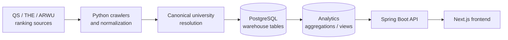

# CrawlerNest

CrawlerNest is an end-to-end university data infrastructure and web platform for global university rankings, subject rankings, admissions signals, and local exploration workflows.

The project is data-first: the UI reads from warehouse and analytics views, while crawlers and pipelines prepare canonical records in PostgreSQL.

## Quick Start

Use this path for a full local run.

### 1. Create the Python environment

```bash
python3 -m venv .venv
source .venv/bin/activate
pip install -r requirements.txt
```

### 2. Install and start PostgreSQL

On WSL/Ubuntu, use the local PostgreSQL package:

```bash
sudo apt update
sudo apt install postgresql postgresql-contrib
sudo service postgresql start
```

Create the local development role and database:

```bash
sudo -u postgres psql -c "CREATE ROLE test WITH LOGIN PASSWORD 'test';"
sudo -u postgres createdb -O test clawer
```

If the role or database already exists, keep using the same credentials:

```text
database: clawer
user: test
password: test
host: localhost
port: 5432
```

### 3. Bootstrap schemas and seed data

Run this once in a new environment. It is safe to rerun.

```bash
python3 -m crawlernest.run_pipeline bootstrap-postgres \
  --pg-user test \
  --pg-password test \
  --pg-database clawer
```

### 4. Initialize ranking data

The web app will be empty until pipeline data exists.

```bash
./.venv/bin/python -m crawlernest.run_pipeline run \
  --limit 20 \
  --ranking-year 2026 \
  --pg-user test \
  --pg-password test \
  --pg-database clawer
```

You can confirm the analytics view has data:

```bash
PGPASSWORD=test psql -h localhost -U test -d clawer \
  -c "SELECT count(*) FROM analytics.v_aggregated_rankings_latest;"
```

### 5. Confirm Spring Boot datasource credentials

`crawlernest/servise_for_java/src/main/resources/application.properties` must use:

```properties
spring.datasource.url=jdbc:postgresql://localhost:5432/clawer
spring.datasource.username=test
spring.datasource.password=test
```

### 6. Install frontend dependencies

Node.js **>=20.9** is required. The repo includes `.nvmrc`, so nvm users can
select the frozen major version first:

```bash
nvm use
node --version
```

Install Node.js dependencies (run once, or after pulling changes):

```bash
cd crawlernest/crawlernest-web
npm ci
cd ../..
```

### 7. Start local services

```bash
./scripts/start_localhost.sh
```

The script checks PostgreSQL, verifies Node.js version, confirms `node_modules`
exists, verifies the API port, starts Spring Boot with `-Dmaven.test.skip=true`,
then starts the Next.js frontend. Press `Ctrl+C` to stop both services.

You can also run services manually:

```bash
cd crawlernest/servise_for_java
./mvnw -Dmaven.test.skip=true spring-boot:run
```

If multiple JDKs are installed, make sure `JAVA_HOME` points to a Java 17 JDK
before starting the backend.

```bash
cd crawlernest/crawlernest-web
npm run dev
```

The Agent page uses a readonly model-provider bridge through
`/api/agent/chat`. It defaults to the mock provider and does not execute tools,
write the database, run pipelines, or modify the repository.

```bash
AGENT_MODEL_PROVIDER=mock npm run dev
```

See [Agent Model Integration](docs/agent/AGENT_MODEL_INTEGRATION.md) for Ollama and
OpenAI server-side environment setup.

### 8. Smoke check

```bash
curl -i "http://localhost:8080/api/v1/rankings?page=1&pageSize=5"
curl -i "http://localhost:3000/api/rankings?page=1&pageSize=5"
curl -I "http://localhost:3000/rankings"
./scripts/smoke_local_stack.sh
```

## Service URLs

```text
Web: http://localhost:3000
API: http://localhost:8080
Agent API: http://localhost:8090
```

Main pages:

```text
Global rankings: http://localhost:3000/rankings
Subject rankings: http://localhost:3000/subject-rankings
Agent: http://localhost:3000/agent
```

## Architecture

CrawlerNest is organized as a data pipeline plus product read layer:



Current system components:

- Ranking ingestion for QS and THE, with ARWU adapter support when source data exists.
- Aggregation into `analytics.v_aggregated_rankings_latest`.
- Subject rankings as a parallel QS subject read path.
- Recommendation layer reading aggregated ranking candidates.
- Diagnostics for health, freshness, data quality, ranking readiness, subject readiness, and source agreement.
- Cross-source intelligence and explainability APIs for source comparison, disagreement, confidence, and aggregation inputs.
- Operational automation through daily pipeline, snapshots, metadata bundles, and smoke checks.
- CI/CD through release smoke and fixture-mode data quality workflows.

Start with these docs when changing architecture or onboarding:

- [Documentation Hub](docs/README.md)
- [Architecture Overview](docs/ARCHITECTURE_OVERVIEW.md)
- [Repository Map](docs/REPOSITORY_MAP.md)
- [Data Flow](docs/DATA_FLOW.md)
- [Operational Runbook](docs/operational/OPERATIONAL_RUNBOOK.md)
- [API Surface](docs/API_SURFACE.md)

## Subject Rankings MVP

Subject rankings are implemented as a parallel read path, not as an extension of global ranking aggregation.

Current MVP support:

```text
source: QS
year: 2026
subjects:
  - computer-science
  - electrical-engineering
```

Load QS subject ranking data:

```bash
./.venv/bin/python -m crawlernest.run_pipeline run-qs-subject \
  --subject computer-science \
  --year 2026 \
  --pg-user test \
  --pg-password test \
  --pg-database clawer
```

```bash
./.venv/bin/python -m crawlernest.run_pipeline run-qs-subject \
  --subject electrical-engineering \
  --year 2026 \
  --pg-user test \
  --pg-password test \
  --pg-database clawer
```

Subject ranking API examples:

```bash
curl "http://localhost:8080/api/v1/subject-rankings/subjects"
curl "http://localhost:8080/api/v1/subject-rankings?subject=computer-science&year=2026&page=1&pageSize=20"
```

Web proxy examples:

```bash
curl "http://localhost:3000/api/subject-rankings/subjects"
curl "http://localhost:3000/api/subject-rankings?subject=computer-science&year=2026&page=1&pageSize=20"
```

## Data Visibility

Global ranking UI reads from:

```text
warehouse.ranking_record
analytics.v_aggregated_rankings_latest
```

Subject ranking UI reads from:

```text
warehouse.subject_ranking_record
analytics.v_subject_rankings_latest
```

Raw and staging tables are pipeline inputs. They are not shown directly in the product UI.

## Diagnostics And Explainability

Operational and data quality surfaces:

```text
Health:              /api/v1/health
Freshness:           /api/v1/freshness
Ranking diagnostics: /api/v1/diagnostics/rankings
Subject diagnostics: /api/v1/diagnostics/subjects
Data quality:        /api/v1/diagnostics/data-quality
Source agreement:    /api/v1/diagnostics/source-agreement
```

Explainability surfaces:

```text
Source comparison:   /api/v1/universities/{id}/source-comparison
Ranking explain:     /api/v1/rankings/{id}/explain
University sources:  /universities/[slug]/sources
```

These endpoints read stored ranking evidence and aggregation output. They do not modify aggregation, canonical matching, recommendation scoring, or schema.

## CI/CD And Operations

CI workflows:

```text
.github/workflows/release-smoke.yml
.github/workflows/data-quality.yml
```

Operational scripts:

```text
scripts/smoke_release.sh
scripts/smoke_local_stack.sh
scripts/run_daily_pipeline.sh
scripts/export_system_snapshot.py
scripts/export_metadata_bundle.sh
scripts/build_failure_summary.py
```

Generated operational evidence is written to `snapshots/`, `reports/`, and daily logs.

## v0.1 Demo Milestone

CrawlerNest v0.1 is the first formally scoped engineering milestone. It is a **reproducible, demonstrable, operational MVP** — not a production deployment.

**Current release state:**

- 1,499 aggregated universities (QS 2026 full ingestion)
- Subject rankings MVP operational (Computer Science, Electrical Engineering)
- Full diagnostics and explainability API coverage
- CI passing (release-smoke + data-quality) without a live database
- Readonly agent integration for development support

**Release bundle:** `releases/v0.1-demo/` — built by `scripts/build_demo_bundle.sh`

**Release documentation:**

| Document | Purpose |
|----------|---------|
| [docs/RELEASE_NOTES_v0.1.md](docs/release/RELEASE_NOTES_v0.1.md) | Executive summary, capabilities, known limitations, maturity assessment |
| [docs/DEMO_SCRIPT_v0.1.md](docs/demo/DEMO_SCRIPT_v0.1.md) | 3-min, 5-min, and 10-min demo flows with commands and expected output |
| [docs/VERSION_SCOPE_v0.1.md](docs/release/VERSION_SCOPE_v0.1.md) | Included / not included / explicitly avoided scope definition |
| [docs/SCREENSHOT_CHECKLIST_v0.1.md](docs/demo/SCREENSHOT_CHECKLIST_v0.1.md) | Screenshot requirements, routes, viewports, filenames |
| [docs/RELEASE_STRUCTURE.md](docs/release/RELEASE_STRUCTURE.md) | Bundle structure, artifact meanings, reproducibility assumptions |

To build the demo bundle:

```bash
./scripts/build_demo_bundle.sh
```

## Current Maturity

CrawlerNest is currently an operational MVP: the end-to-end ranking path,
subject ranking path, diagnostics, smoke checks, snapshots, and recovery docs are
usable for local development and evidence-driven iteration. The current focus is
operational reliability, reproducibility, observability, and conservative
recovery rather than autonomous automation.

The sibling `crawlernest-agents` repository remains a readonly development
companion. It is not a runtime dependency, CI requirement, submodule, symlink, or
production truth source.

## Maintenance Governance

CrawlerNest uses a conservative, readonly-first maintenance philosophy.
The following documents define the operational boundaries and signal hierarchy:

| Document | Purpose |
|----------|---------|
| [docs/OPERATIONAL_RESTRAINT_GUIDELINES.md](docs/operational/OPERATIONAL_RESTRAINT_GUIDELINES.md) | When NOT to add automation, diagnostics, reports, or scripts. |
| [docs/MAINTENANCE_SUSTAINABILITY_REVIEW.md](docs/operational/MAINTENANCE_SUSTAINABILITY_REVIEW.md) | What is sustainable, what is complexifying, and where future cleanup is most valuable. |
| [docs/SIGNAL_TO_NOISE_REVIEW.md](docs/data/SIGNAL_TO_NOISE_REVIEW.md) | High-value vs secondary signals; recommended reading hierarchy by operator role. |
| [docs/OPERATIONAL_BOUNDARY_REINFORCEMENT.md](docs/operational/OPERATIONAL_BOUNDARY_REINFORCEMENT.md) | Capabilities intentionally NOT implemented at RC-1 and why. |
| [docs/REPORT_CRITICALITY.md](docs/data/REPORT_CRITICALITY.md) | Critical / important / reference classification for all generated reports. |
| [docs/RELEASE_BUNDLE_SIMPLIFICATION_REVIEW.md](docs/release/RELEASE_BUNDLE_SIMPLIFICATION_REVIEW.md) | Must-exist vs supporting vs optional artifact classification for the release bundle. |
| [docs/OPERATIONAL_CALMNESS_REVIEW.md](docs/operational/OPERATIONAL_CALMNESS_REVIEW.md) | Calm vs noisy surface analysis; false urgency risks; calmness preservation guidelines. |
| [docs/REPORT_LIFECYCLE.md](docs/data/REPORT_LIFECYCLE.md) | Producer, consumer, freshness expectation, lifecycle category, and archival expectation per report. |
| [docs/MAINTENANCE_FATIGUE_REVIEW.md](docs/operational/MAINTENANCE_FATIGUE_REVIEW.md) | Attention hotspots, repeated warning exposure, cognitive overload risks, and fatigue reduction. |
| [docs/OPERATIONAL_COHERENCE_REVIEW.md](docs/operational/OPERATIONAL_COHERENCE_REVIEW.md) | Coherence strengths, terminology risks, relationship stability, and cleanup opportunities. |
| [docs/MAINTENANCE_READING_MODES.md](docs/operational/MAINTENANCE_READING_MODES.md) | Structured reading modes: quick status, release prep, freshness investigation, incident, audit, onboarding. |
| [docs/MAINTENANCE_CADENCE_REVIEW.md](docs/operational/MAINTENANCE_CADENCE_REVIEW.md) | Appropriate cadence for each maintenance activity: daily, weekly, release-demo, incident-only, archival. |
| [docs/OPERATIONAL_MEMORY_PRESERVATION.md](docs/operational/OPERATIONAL_MEMORY_PRESERVATION.md) | What must be preserved long-term vs temporary; bundle archival semantics; handoff requirements. |
| [docs/STABLE_DEGRADED_STATE.md](docs/data/STABLE_DEGRADED_STATE.md) | Current RC-1 stable degraded posture: accepted conditions, escalation triggers, communication guidance. |
| [docs/MAINTENANCE_DISCIPLINE.md](docs/operational/MAINTENANCE_DISCIPLINE.md) | Behavioral discipline: healthy and unhealthy maintenance patterns; discipline under pressure. |
| [docs/OPERATIONAL_CONTINUITY_REVIEW.md](docs/operational/OPERATIONAL_CONTINUITY_REVIEW.md) | Continuity strengths, risks, vulnerable assumptions, and report relationships requiring continuity. |
| [docs/MAINTENANCE_CONTINUITY_MODEL.md](docs/operational/MAINTENANCE_CONTINUITY_MODEL.md) | Continuity concepts: stable degraded, report, snapshot, confidence, release honesty, vocabulary. |
| [docs/OPERATIONAL_MEMORY_DURABILITY.md](docs/operational/OPERATIONAL_MEMORY_DURABILITY.md) | Artifact durability tiers (durable/semi-durable/ephemeral); bundle and snapshot semantics. |
| [docs/STABLE_DEGRADED_CONTINUITY.md](docs/data/STABLE_DEGRADED_CONTINUITY.md) | Long-term stable degraded posture: calm maintenance, false urgency avoidance, desensitization risks. |

Maintenance calm summary (contextualizes known RC-1 stable conditions vs signals needing attention):

```bash
./scripts/build_maintenance_calm_summary.py
# outputs: reports/maintenance_calm_summary.md
```

Maintenance steadiness summary (caution level, stable degraded indicators, steadiness guidance):

```bash
./scripts/build_maintenance_steadiness_summary.py
# outputs: reports/maintenance_steadiness_summary.md
```

Maintenance continuity summary (continuity posture, stable degraded continuity, honesty continuity):

```bash
./scripts/build_maintenance_continuity_summary.py
# outputs: reports/maintenance_continuity_summary.md
```

Maintenance navigation (single-page operator guide):

```bash
./scripts/build_maintenance_navigation.py
# outputs: reports/maintenance_navigation.md
```

## Competition Track

CrawlerNest Competition Track Phase 1 transitions the system from an operational
infrastructure showcase to a **University Intelligence / Dispatch Competition Prototype** —
an explainable, evidence-backed analytics platform with observable source traceability.

| Document | Purpose |
|----------|---------|
| [docs/COMPETITION_TRACK.md](docs/competition/COMPETITION_TRACK.md) | Positioning, competition differentiators, what CrawlerNest is and is not, non-goals. |
| [docs/ANALYTICS_SURFACE_PLAN.md](docs/analytics/ANALYTICS_SURFACE_PLAN.md) | Analytics items evaluated: demo value, complexity, RC-1 limitations, non-goals. |
| [docs/ANALYTICS_EXPLAINABILITY.md](docs/analytics/ANALYTICS_EXPLAINABILITY.md) | Explainability requirements, caveat delivery, what analytics must not do. |
| [docs/COMPETITION_DEMO_NARRATIVE.md](docs/competition/COMPETITION_DEMO_NARRATIVE.md) | Demo flow, talking points, required caveats, what not to claim. |
| [docs/RECOMMENDATION_EVIDENCE_MODEL.md](docs/analytics/RECOMMENDATION_EVIDENCE_MODEL.md) | Evidence types for recommendation explanation: ranking, IELTS, source, confidence, caveats. |

**Analytics endpoints (readonly):**

```text
GET /api/v1/analytics/ranking-trends       — year-over-year rank movement; single_year_only flag
GET /api/v1/analytics/source-disagreement  — rank spread across QS/THE/ARWU sources
```

**Analytics frontend page:**

```text
http://localhost:3000/analytics
```

## Current Identity Layer

CrawlerNest includes a minimal session-based identity layer for local development and demo use.

**What is included:**

- Account registration and sign-in with BCrypt password hashing.
- HttpOnly session cookies (`JSESSIONID`, SameSite=Lax, 30-minute timeout).
- Saved universities — bookmark rankings entries per account; view at `/saved-universities`.
- Saved recommendation snapshots — save a full recommendation result as a named plan; view at `/saved-recommendations`.
- Per-user data isolation: all user-data queries are scoped to the authenticated user.

**Auth pages:**

```text
Sign up:              http://localhost:3000/signup
Sign in:              http://localhost:3000/signin
Saved universities:   http://localhost:3000/saved-universities
Saved plans:          http://localhost:3000/saved-recommendations
```

**What is not included (current scope):**

- No RBAC or admin tooling.
- No OAuth or third-party identity providers.
- No JWT or token-based auth.
- No frontend route protection (pages are accessible; data requests are gated at the API layer).
- No distributed session infrastructure — backend restart signs out all users.
- No rate limiting, account lockout, or email verification.

**Localhost assumption:** Session cookies do not use the `Secure` flag. This is intentional for local HTTP development. The flag must be set before any internet-accessible deployment.

See [docs/AUTH_LIMITATIONS.md](docs/AUTH_LIMITATIONS.md) for the full limitations and scaling risks.

## Optional Agents Workflows

`crawlernest/crawlernest-agents/` is a repo-native AI dev agent collection.
It provides readonly development analysis agents and scripts without modifying
runtime, API, or database code.

```text
crawlernest/crawlernest-agents/
  agents/     ← per-role agent definitions
  scripts/    ← debug, analysis, and pipeline wrappers
  memory/     ← persistent agent context files
```

Use `./scripts/agent_debug.sh` for the optional debug workflow and
`./scripts/agent_pipeline_analysis.sh <log_file>` for readonly pipeline log
analysis. These agents are not a dependency, CI step, or production runtime
component. Generated analysis output is limited to `tmp/agent-debug/` or
`tmp/agent-analysis/`.

Repo-aware prompt context is available through
`./scripts/agent_context_snapshot.sh` and `./scripts/agent_repo_prompt.sh`.

## C Normalization Engine

`crawlernest/crawlernest-normalization/` is a standalone C-language CSV normalization
engine that standardizes heterogeneous crawler output (university names, country
abbreviations, rank-range strings, score formats) into comparable numeric records.

```text
crawlernest/crawlernest-normalization/
  c_engine/src/       ← normalization logic in C
  c_engine/include/   ← public header files
  c_engine/Makefile   ← build script (requires gcc)
  c_engine/data/      ← sample input/output CSV files
```

The Python bridge (`crawlernest-normalization-py/`) calls the compiled binary
and falls back to a pure-Python normalizer when the binary is unavailable.
This component is a research deliverable and is **not** called by the Spring Boot
API or Next.js frontend at runtime.

## Manual Development

Start the Spring Boot API:

```bash
cd crawlernest/servise_for_java
./mvnw -Dmaven.test.skip=true spring-boot:run
```

Start the Next.js web app:

```bash
cd crawlernest/crawlernest-web
npm install
npm run dev
```

Run selected checks:

```bash
python3 crawlernest/scripts/smoke_subject_rankings.py
cd crawlernest/crawlernest-web && npm run build
cd crawlernest/servise_for_java && ./mvnw -q -Dtest=SubjectRankingApiIntegrationTest test
```

## Documentation

- [Documentation Hub](docs/README.md) - current docs entrypoint and duplicate-content policy
- [Architecture Overview](docs/ARCHITECTURE_OVERVIEW.md) - high-level system map and rendered diagrams
- [Repository Map](docs/REPOSITORY_MAP.md) - directory ownership and onboarding map
- [Data Flow](docs/DATA_FLOW.md) - ranking and subject ranking data flow
- [Operational Runbook](docs/operational/OPERATIONAL_RUNBOOK.md) - startup, smoke checks, snapshots, diagnostics, and rollback
- [API Surface](docs/API_SURFACE.md) - current endpoint catalog
- [Project State Review](docs/PROJECT_STATE_REVIEW.md) - maturity, risk, readiness, and next-phase assessment
- [Python Environment](docs/PYTHON_ENVIRONMENT.md) - venv, psycopg2, and local runtime consistency
- [Backup Restore Drill](docs/operational/BACKUP_RESTORE_DRILL.md) - readonly-safe backup and restore rehearsal
- [Snapshot Comparison](docs/data/SNAPSHOT_COMPARISON.md) - compare operational snapshots and failure-state fixtures
- [Source Health Model](docs/data/SOURCE_HEALTH_MODEL.md) - source states and readonly health signals
- [Operational Intelligence Automation](docs/operational/OPERATIONAL_INTELLIGENCE_AUTOMATION.md) - observability automation boundaries and escalation semantics
- [RC-1 Environment Freeze](docs/release/RC1_ENVIRONMENT_FREEZE.md) - verified runtime bounds and setup assumptions
- [RC-1 Dependency Review](docs/release/RC1_DEPENDENCY_REVIEW.md) - dependency risk and pinning review
- [RC-1 Release Hygiene](docs/release/RC1_RELEASE_HYGIENE.md) - generated artifact and temporary-output policy
- [RC-1 Stability Review](docs/release/RC1_STABILITY_REVIEW.md) - long-run persistence and restart review
- [RC-1 Freeze Scope](docs/release/RC1_FREEZE_SCOPE.md) - frozen, allowed, and blocked change surfaces
- [RC-1 Validation Results](docs/release/RC1_VALIDATION_RESULTS.md) - release-candidate validation summary
- [Operational Intelligence Automation](docs/operational/OPERATIONAL_INTELLIGENCE_AUTOMATION.md) - readonly timeline, drift, freshness, and summary automation boundaries
- [Source Health Model](docs/data/SOURCE_HEALTH_MODEL.md) - source states and observability signals
- [Operational Index](docs/operational/OPERATIONAL_INDEX.md) - hierarchy and ownership for snapshots, reports, validation, bundles, and agent context artifacts
- [Operational Vocabulary](docs/operational/OPERATIONAL_VOCABULARY.md) - consolidated terminology for reports and release evidence
- [Report Relationships](docs/data/REPORT_RELATIONSHIPS.md) - graph of report inputs, outputs, bundle feeds, and demo summaries
- [Snapshot Lineage](docs/data/SNAPSHOT_LINEAGE.md) - snapshot lifecycle and derived intelligence relationships
- [Operational Surface Review](docs/operational/OPERATIONAL_SURFACE_REVIEW.md) - consolidation review for overlapping operational artifacts
- [Maintenance Priority Matrix](docs/operational/MAINTENANCE_PRIORITY_MATRIX.md) - maintenance priorities, response times, escalation, and freeze interaction
- [Source Freshness Recovery](docs/data/SOURCE_FRESHNESS_RECOVERY.md) - human-led recovery plan for stale or unavailable sources
- [Maintenance Runbook](docs/operational/MAINTENANCE_RUNBOOK.md) - copy-paste friendly maintenance checks and refresh sequence
- [Release State Checklist](docs/release/RELEASE_STATE_CHECKLIST.md) - pre-demo/release operational readiness checklist
- [Operational Cleanup Guide](docs/operational/OPERATIONAL_CLEANUP_GUIDE.md) - retention and cleanup guidance for snapshots, reports, bundles, and tmp artifacts
- [Source State Explainability](docs/data/SOURCE_STATE_EXPLAINABILITY.md) - source-state explanations and demo caveat guidance
- [Freshness Consistency Review](docs/data/FRESHNESS_CONSISTENCY_REVIEW.md) - freshness semantics alignment and known divergence
- [Maintenance Ergonomics Review](docs/operational/MAINTENANCE_ERGONOMICS_REVIEW.md) - maintenance entrypoint and workflow friction review
- [Operational Confidence Model](docs/operational/OPERATIONAL_CONFIDENCE_MODEL.md) - confidence dimensions, levels, and maintainer behavior
- [Source Completeness Review](docs/data/SOURCE_COMPLETENESS_REVIEW.md) - QS/THE/ARWU/subject completeness and caveat implications
- [Demo Honesty Guidelines](docs/demo/DEMO_HONESTY_GUIDELINES.md) - acceptable and unacceptable demo phrasing
- [Confidence Consistency Review](docs/data/CONFIDENCE_CONSISTENCY_REVIEW.md) - confidence semantics across maintenance reports
- [Maintenance Signal Clarity](docs/operational/MAINTENANCE_SIGNAL_CLARITY.md) - authoritative, derived, demo-facing, and escalation-facing signals
- [Demo Checklist](docs/demo/DEMO_CHECKLIST.md) — step-by-step checklist before any demo or handover
- [Local Troubleshooting](docs/LOCAL_TROUBLESHOOTING.md) — known issues and fixes for the local development environment

## Common Issues

### Port 8080 is already in use

```bash
lsof -i :8080
kill -9 <PID>
```

### The UI has no data

Run the pipeline first, then reload the page:

```bash
./.venv/bin/python -m crawlernest.run_pipeline run \
  --limit 20 \
  --ranking-year 2026 \
  --pg-user test \
  --pg-password test \
  --pg-database clawer
```

For subject rankings, also run the subject loader for the subject you want to browse.

### The subject ranking page loads but the table is empty

Check that the subject pipeline wrote rows and that the Java API is running:

```bash
python3 crawlernest/scripts/smoke_subject_rankings.py
curl "http://localhost:8080/api/v1/subject-rankings?subject=computer-science&year=2026"
```

### Docker is not available

Docker is optional for the WSL/local flow. Use the local PostgreSQL service
shown in Quick Start step 2.

## Recommended Workflow

```text
1. Start PostgreSQL
2. Run the data pipeline
3. Start API and web services
4. Open /rankings or /subject-rankings
5. Debug from warehouse/analytics views before debugging UI
```

CrawlerNest is correctness-first. If something looks wrong, verify the data pipeline and warehouse views before changing the product layer.
