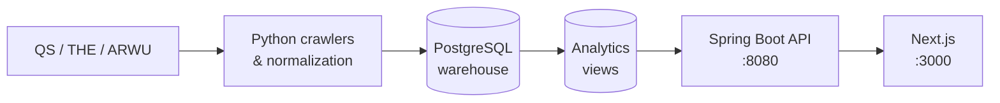

# CrawlerNest

[](https://github.com/heinricitorgau/University-Data-Infrastructure-Web-Platform/actions/workflows/agent-tests.yml)
[](https://github.com/heinricitorgau/University-Data-Infrastructure-Web-Platform/actions/workflows/ml-tests.yml)
[](https://github.com/heinricitorgau/University-Data-Infrastructure-Web-Platform/actions/workflows/data-quality.yml)
[](https://github.com/heinricitorgau/University-Data-Infrastructure-Web-Platform/actions/workflows/release-smoke.yml)

An end-to-end university data infrastructure and web platform. It aggregates global and subject rankings from QS, THE, and ARWU into a single warehouse, exposes an explainability-first API, and delivers a Next.js frontend for browsing, comparing, and saving universities.

The system is data-first: crawlers and pipelines write canonical records into PostgreSQL, and the UI reads only from analytics views — never directly from raw tables.

---

## What It Does

- **Global rankings** — 1,499 universities aggregated from QS 2026 (THE and ARWU adapters included)
- **Subject rankings** — QS 2026 subject data for Computer Science, Electrical Engineering, Business & Management
- **Explainability** — every ranking and recommendation comes with a source comparison, confidence level, and evidence chain
- **Recommendations** — filter universities by region, rank tier, and subject; export a named plan
- **Analytics** — year-over-year rank movement, cross-source disagreement, data quality diagnostics
- **Modelling** — a feature layer over the nine QS indicators, with the withheld
  `Overall Score` of ranks 601–1503 as a supervised target
- **Identity layer** — session-based accounts, saved universities, saved recommendation plans

---

## Architecture



**Tech stack:** Python · PostgreSQL · Spring Boot (Java 17) · Next.js (React) · Tailwind CSS

---

## Modelling layer

QS publishes nine component indicators for all 1,503 universities in the 2026
snapshot, but the `Overall Score` only for ranks 1–600. That asymmetry is a
supervised learning problem sitting in the data:

```
rank    1– 600  →  score published   →    600 labelled rows  (training set)
rank  601–1503  →  score withheld    →    903 unlabelled rows (inference set)
```

Exploratory analysis of that split produced the finding that shapes the whole
modelling design:


PC1 alone explains 50.7% of the variance and orders the labelled universities
almost monotonically by rank. But the 903 universities we would predict pile up
at the low end of PC1, where training data is sparse — every indicator differs
between the two groups by 0.67 to 1.91 pooled standard deviations. **Predicting
the withheld scores is extrapolation, not interpolation.**

So the model does not get to report a flattering cross-validated error and call
it accuracy. Cross-validation measures how well it recovers QS's scoring
function; a per-prediction support flag decides which estimates are publishable;
and Spearman correlation against the published ranks of the 903 provides the
only external validation available in the shifted region — the scores are
unknown there, but the ordering is not.

Two results came out of it:

**The published weighting is recoverable from the data.** A linear fit on the
raw indicators reproduces QS's documented weighting to a mean absolute error of
0.0006 — Academic Reputation 0.2996 against a published 0.30, Citations per
Faculty 0.1992 against 0.20, and so on across all nine. That makes this system
identification rather than forecasting, and the resulting R² of 0.9999 is
reported as "the formula was recovered", not as predictive accuracy.

**Preprocessing mattered more than the model.** The first pipeline used median
imputation and scored Spearman 0.9551 against the published ranks of the 903.
Holding the weights fixed — they differ from QS's by at most 0.0008 — and only
renormalising over available indicators instead of imputing moved that to
0.9755. Median imputation borrows values from a training distribution whose
medians run three to five times higher than the withheld tail. Cross-validation
alone would have shipped the worse pipeline; only the out-of-distribution check
caught it.

Estimates are stored and labelled as estimates. Nothing in the modelling layer
writes to `analytics.aggregated_rankings` or changes a published rank, and 27%
of the inference set is flagged as outside the model's support.

→ **[crawlernest/crawlernest-ml/](crawlernest/crawlernest-ml/)** — feature
contract, EDA, metrics, and model cards.

---

## Repository Layout

```
crawlernest/
  crawlernest-web/          Next.js frontend
  servise_for_java/         Spring Boot API
  crawlernest-core/         canonical resolution, aggregation
  crawlernest-ml/           feature layer, EDA, and models over the QS indicators
  pipeline/                 CLI entry points
  crawlernest-normalization/ C-language CSV normalizer (research component)
  crawlernest-agents/       AI dev agent collection (readonly, optional)
crawlernest_ranking_crawler/ Python ranking ingestion package
crawlernest_admission_crawler/ Python admission ingestion package
docs/                       architecture, operations, release docs
scripts/                    startup, smoke checks, operational automation
tests/                      integration tests
```

---

## Getting Started

First-time setup (fresh clone → runnable, one command):

```bash
./scripts/setup_from_scratch.sh
```

The script creates the Python venv, installs dependencies, starts PostgreSQL
(local install or Docker via `docker-compose.postgres.yml`), bootstraps the
schema, runs the first data crawl, and installs frontend dependencies. It is
idempotent — re-run it after fixing whatever it reports.

Then start everything:

```bash
./scripts/start_localhost.sh
```

→ **[docs/GETTING_STARTED.md](docs/GETTING_STARTED.md)** — the same steps done
manually, plus subject rankings and troubleshooting.

### Run your own data

**This repository ships with no ranking data.** Every deployment crawls its
own data directly from the ranking sources:

```bash
./.venv/bin/python -m crawlernest.run_pipeline run \
  --limit 20 --ranking-year 2026 \
  --pg-user test --pg-password test --pg-database clawer
```

- Crawling is polite by default: **10 seconds between requests** (tune with
  `--request-delay`, but stay respectful). Check the source site's
  `robots.txt` and terms of use before increasing crawl volume.
- If a live fetch fails, the pipeline falls back to your most recent local
  snapshot under `crawlernest/crawlernest-kb/` (snapshots are created on each
  successful run and are not committed to git).
- The crawl writes staging → warehouse → analytics; the UI reads only
  analytics views. Re-running is safe and idempotent per year/source.

---

## Documentation

| Topic | Doc |
|-------|-----|
| Architecture | [docs/ARCHITECTURE_OVERVIEW.md](docs/ARCHITECTURE_OVERVIEW.md) |
| Repository map | [docs/REPOSITORY_MAP.md](docs/REPOSITORY_MAP.md) |
| Data flow | [docs/DATA_FLOW.md](docs/DATA_FLOW.md) |
| API surface | [docs/API_SURFACE.md](docs/API_SURFACE.md) |
| Operational runbook | [docs/operational/OPERATIONAL_RUNBOOK.md](docs/operational/OPERATIONAL_RUNBOOK.md) |
| Auth limitations | [docs/AUTH_LIMITATIONS.md](docs/AUTH_LIMITATIONS.md) |
| Local troubleshooting | [docs/LOCAL_TROUBLESHOOTING.md](docs/LOCAL_TROUBLESHOOTING.md) |
| Local LLM (ds4) | [docs/DS4_LOCAL_MODEL.md](docs/DS4_LOCAL_MODEL.md) — natural-language answers for recommendation, ranking, lookup, and data-query tasks via a local or remote ds4 model (env config, remote host + SSH-tunnel/auth setup) |
| All docs | [docs/README.md](docs/README.md) |

---

## Current State

CrawlerNest v0.1 is an operational MVP — reproducible and demonstrable, not a production deployment.

- THE and ARWU are in stable degraded state (data unavailable); QS 2026 is fully ingested
- All universities show as single-source; confidence is always "low" under the current RC-1 posture
- The agent page defaults to a mock provider and does not write to the database

Release notes: [docs/release/RELEASE_NOTES_v0.1.md](docs/release/RELEASE_NOTES_v0.1.md)
