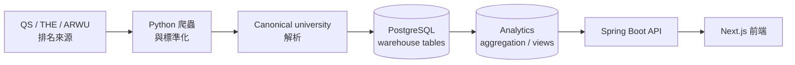

# CrawlerNest

CrawlerNest 是一個端到端的大學資料基礎設施與網站平台，涵蓋全球排名、學科排名、申請訊號與本機探索流程。

這是一個 data-first 系統：UI 讀取 warehouse 與 analytics view，crawler 與 pipeline 負責把資料整理成 canonical records 並寫入 PostgreSQL。

## 快速啟動

建議用這個流程完整啟動本機環境。

### 1. 建立 Python 環境

```bash
python3 -m venv .venv
source .venv/bin/activate
pip install -r requirements.txt
```

### 2. 安裝並啟動 PostgreSQL

WSL/Ubuntu 建議使用本機 PostgreSQL 套件：

```bash
sudo apt update
sudo apt install postgresql postgresql-contrib
sudo service postgresql start
```

建立本機開發用 role 與 database：

```bash
sudo -u postgres psql -c "CREATE ROLE test WITH LOGIN PASSWORD 'test';"
sudo -u postgres createdb -O test clawer
```

如果 role 或 database 已存在，沿用同一組連線設定：

```text
database: clawer
user: test
password: test
host: localhost
port: 5432
```

### 3. Bootstrap schemas 與 seed data

新環境先執行一次；這個指令可以安全重跑。

```bash
python3 -m crawlernest.run_pipeline bootstrap-postgres \
  --pg-user test \
  --pg-password test \
  --pg-database clawer
```

### 4. 初始化排名資料

沒有資料時，網站會顯示空結果。

```bash
./.venv/bin/python -m crawlernest.run_pipeline run \
  --limit 20 \
  --ranking-year 2026 \
  --pg-user test \
  --pg-password test \
  --pg-database clawer
```

可以先確認 analytics view 有資料：

```bash
PGPASSWORD=test psql -h localhost -U test -d clawer \
  -c "SELECT count(*) FROM analytics.v_aggregated_rankings_latest;"
```

### 5. 確認 Spring Boot datasource 帳密

`crawlernest/servise_for_java/src/main/resources/application.properties` 必須使用：

```properties
spring.datasource.url=jdbc:postgresql://localhost:5432/clawer
spring.datasource.username=test
spring.datasource.password=test
```

### 6. 安裝前端相依套件

需要 Node.js **>=20.9**。確認版本：

```bash
node --version
```

安裝 Node.js 相依套件（初次執行，或 pull 新版後執行）：

```bash
cd crawlernest/crawlernest-web
npm install
cd ../..
```

### 7. 啟動本機服務

```bash
./scripts/start_localhost.sh
```

這個 script 會依序：檢查 PostgreSQL、確認 Node.js 版本、確認 `node_modules`
存在、確認 API port 未被占用、用 `-Dmaven.test.skip=true` 啟動 Spring Boot，
再啟動 Next.js frontend。按 `Ctrl+C` 可同時停止兩個服務。

也可以手動啟動服務：

```bash
cd crawlernest/servise_for_java
./mvnw -Dmaven.test.skip=true spring-boot:run
```

```bash
cd crawlernest/crawlernest-web
npm run dev
```

### 8. Smoke check

```bash
curl -i "http://localhost:8080/api/v1/rankings?page=1&pageSize=5"
curl -i "http://localhost:3000/api/rankings?page=1&pageSize=5"
curl -I "http://localhost:3000/rankings"
./scripts/smoke_local_stack.sh
```

## 服務位置

```text
Web: http://localhost:3000
API: http://localhost:8080
Agent API: http://localhost:8090
```

主要頁面：

```text
全球排名: http://localhost:3000/rankings
學科排名: http://localhost:3000/subject-rankings
Agent: http://localhost:3000/agent
```

## 系統架構

CrawlerNest 目前是 data pipeline 加 product read layer 的組合：



目前系統元件：

- QS 與 THE ranking ingestion；有 ARWU adapter，可在有來源資料時使用。
- Aggregation 寫入並讀取 `analytics.v_aggregated_rankings_latest`。
- 學科排名是獨立的 QS subject read path，不改 global aggregation。
- Recommendation layer 讀取 aggregated ranking candidates。
- Diagnostics 涵蓋 health、freshness、data quality、ranking readiness、subject readiness、source agreement。
- Cross-source intelligence 與 explainability APIs 支援 source comparison、disagreement、confidence、aggregation inputs。
- Operational automation 包含 daily pipeline、snapshots、metadata bundles、smoke checks。
- CI/CD 包含 release smoke 與 fixture-mode data quality workflows。

架構與 onboarding 文件：

- [Documentation Hub](docs/README.md)
- [Architecture Overview](docs/ARCHITECTURE_OVERVIEW.md)
- [Repository Map](docs/REPOSITORY_MAP.md)
- [Data Flow](docs/DATA_FLOW.md)
- [Operational Runbook](docs/OPERATIONAL_RUNBOOK.md)
- [API Surface](docs/API_SURFACE.md)

## Subject Rankings MVP

學科排名是獨立的 read path，不是 global ranking aggregation 的延伸。

目前 MVP 支援：

```text
source: QS
year: 2026
subjects:
  - computer-science
  - electrical-engineering
```

載入 QS 學科排名資料：

```bash
./.venv/bin/python -m crawlernest.run_pipeline run-qs-subject \
  --subject computer-science \
  --year 2026 \
  --pg-user test \
  --pg-password test \
  --pg-database clawer
```

```bash
./.venv/bin/python -m crawlernest.run_pipeline run-qs-subject \
  --subject electrical-engineering \
  --year 2026 \
  --pg-user test \
  --pg-password test \
  --pg-database clawer
```

Subject Ranking API 範例：

```bash
curl "http://localhost:8080/api/v1/subject-rankings/subjects"
curl "http://localhost:8080/api/v1/subject-rankings?subject=computer-science&year=2026&page=1&pageSize=20"
```

Web proxy 範例：

```bash
curl "http://localhost:3000/api/subject-rankings/subjects"
curl "http://localhost:3000/api/subject-rankings?subject=computer-science&year=2026&page=1&pageSize=20"
```

## 資料可見性

全球排名 UI 讀取：

```text
warehouse.ranking_record
analytics.v_aggregated_rankings_latest
```

學科排名 UI 讀取：

```text
warehouse.subject_ranking_record
analytics.v_subject_rankings_latest
```

Raw 與 staging tables 是 pipeline 輸入，不會直接顯示在產品 UI。

## Diagnostics 與 Explainability

Operational 與 data quality surfaces：

```text
Health:              /api/v1/health
Freshness:           /api/v1/freshness
Ranking diagnostics: /api/v1/diagnostics/rankings
Subject diagnostics: /api/v1/diagnostics/subjects
Data quality:        /api/v1/diagnostics/data-quality
Source agreement:    /api/v1/diagnostics/source-agreement
```

Explainability surfaces：

```text
Source comparison:   /api/v1/universities/{id}/source-comparison
Ranking explain:     /api/v1/rankings/{id}/explain
University sources:  /universities/[slug]/sources
```

這些 endpoint 讀取既有 ranking evidence 與 aggregation output，不會修改 aggregation、canonical matching、recommendation scoring 或 schema。

## CI/CD 與營運自動化

CI workflows：

```text
.github/workflows/release-smoke.yml
.github/workflows/data-quality.yml
```

Operational scripts：

```text
scripts/smoke_release.sh
scripts/smoke_local_stack.sh
scripts/run_daily_pipeline.sh
scripts/export_system_snapshot.py
scripts/export_metadata_bundle.sh
scripts/build_failure_summary.py
```

營運證據會輸出到 `snapshots/`、`reports/` 與 daily logs。

## v0.1 Demo Milestone

CrawlerNest v0.1 是第一個正式範圍界定的 engineering milestone，是一個 **可重現、可展示、可操作的 MVP**，而非生產環境部署。

**目前 Release 狀態：**

- 1,499 所大學已完成 aggregation（QS 2026 完整匯入）
- Subject rankings MVP 可運作（Computer Science、Electrical Engineering）
- 完整 diagnostics 與 explainability API 覆蓋
- CI 通過（release-smoke + data-quality），不需要 live database
- Readonly agent integration，僅供開發支援使用

**Release bundle：** `releases/v0.1-demo/` — 由 `scripts/build_demo_bundle.sh` 建立

**Release 文件：**

| 文件 | 用途 |
|------|------|
| [docs/RELEASE_NOTES_v0.1.md](docs/RELEASE_NOTES_v0.1.md) | 執行摘要、功能說明、已知限制、成熟度評估 |
| [docs/DEMO_SCRIPT_v0.1.md](docs/DEMO_SCRIPT_v0.1.md) | 3 分鐘、5 分鐘、10 分鐘 demo 流程，含指令與預期輸出 |
| [docs/VERSION_SCOPE_v0.1.md](docs/VERSION_SCOPE_v0.1.md) | 包含 / 不包含 / 明確排除的範圍定義 |
| [docs/SCREENSHOT_CHECKLIST_v0.1.md](docs/SCREENSHOT_CHECKLIST_v0.1.md) | Screenshot 需求、路徑、viewport、建議檔名 |
| [docs/RELEASE_STRUCTURE.md](docs/RELEASE_STRUCTURE.md) | Bundle 結構、artifact 意義、重現性假設說明 |

建立 demo bundle：

```bash
./scripts/build_demo_bundle.sh
```

## 目前成熟度

CrawlerNest 目前是 operational MVP：end-to-end ranking path、subject ranking
path、diagnostics、smoke checks、snapshots 與 recovery docs 已可支援本機開發與
evidence-driven iteration。現階段重點是 operational reliability、
reproducibility、observability 與保守 recovery，而不是 autonomous automation。

同層的 `crawlernest-agents` repository 仍是 readonly development companion。
它不是 runtime dependency、CI requirement、submodule、symlink 或 production
truth source。

## 選用 Agents 工作流程

CrawlerNest 可以搭配同層的 `crawlernest-agents` repository 做 readonly
development analysis：

```text
dev/
  University-Data-Infrastructure-Web-Platform/
  crawlernest-agents/
```

使用 `./scripts/agent_debug.sh` 執行選用 debug workflow，使用
`./scripts/agent_pipeline_analysis.sh <log_file>` 做 readonly pipeline log
analysis。這些 wrapper 不會把 `crawlernest-agents` 變成 dependency、symlink、
submodule、CI step 或 production runtime component。產生的分析輸出只允許放在
`tmp/agent-debug/`、`tmp/agent-analysis/`，或 agents repo 自己的 `tmp/`。

Repo-aware prompt context 可透過 `./scripts/agent_context_snapshot.sh` 與
`./scripts/agent_repo_prompt.sh` 使用。snapshot flow 會收集 readonly repository
state 與 operational evidence，並把 `tmp/agent-context/context_snapshot.md` 注入
prompt generation。context artifacts 只會放在 `tmp/agent-context/`。

## 手動開發模式

啟動 Spring Boot API：

```bash
cd crawlernest/servise_for_java
./mvnw -Dmaven.test.skip=true spring-boot:run
```

啟動 Next.js Web：

```bash
cd crawlernest/crawlernest-web
npm install
npm run dev
```

執行常用檢查：

```bash
python3 crawlernest/scripts/smoke_subject_rankings.py
cd crawlernest/crawlernest-web && npm run build
cd crawlernest/servise_for_java && ./mvnw -q -Dtest=SubjectRankingApiIntegrationTest test
```

## 文件

- [Documentation Hub](docs/README.md) - 文件入口與重複內容整理原則
- [Architecture Overview](docs/ARCHITECTURE_OVERVIEW.md) - high-level system map and rendered diagrams
- [Repository Map](docs/REPOSITORY_MAP.md) - directory ownership and onboarding map
- [Data Flow](docs/DATA_FLOW.md) - ranking and subject ranking data flow
- [Operational Runbook](docs/OPERATIONAL_RUNBOOK.md) - startup, smoke checks, snapshots, diagnostics, rollback
- [API Surface](docs/API_SURFACE.md) - current endpoint catalog
- [Project State Review](docs/PROJECT_STATE_REVIEW.md) - maturity、risk、readiness 與 next-phase assessment
- [Python Environment](docs/PYTHON_ENVIRONMENT.md) - venv、psycopg2 與 local runtime consistency
- [Backup Restore Drill](docs/BACKUP_RESTORE_DRILL.md) - readonly-safe backup 與 restore rehearsal
- [Snapshot Comparison](docs/SNAPSHOT_COMPARISON.md) - compare operational snapshots 與 failure-state fixtures
- [Demo Checklist](docs/DEMO_CHECKLIST.md) — demo 或交接前的逐步確認清單
- [Local Troubleshooting](docs/LOCAL_TROUBLESHOOTING.md) — 本機開發環境已知問題與解法

## 常見問題

### Port 8080 被佔用

```bash
lsof -i :8080
kill -9 <PID>
```

### UI 沒有資料

先執行 pipeline，再重新整理頁面：

```bash
./.venv/bin/python -m crawlernest.run_pipeline run \
  --limit 20 \
  --ranking-year 2026 \
  --pg-user test \
  --pg-password test \
  --pg-database clawer
```

如果是學科排名頁，也需要針對想看的 subject 執行 subject loader。

### 學科排名頁能開，但表格是空的

確認 subject pipeline 有寫入資料，而且 Java API 正在執行：

```bash
python3 crawlernest/scripts/smoke_subject_rankings.py
curl "http://localhost:8080/api/v1/subject-rankings?subject=computer-science&year=2026"
```

### 找不到 Docker

WSL/local 流程不需要 Docker。使用快速啟動第 2 步的本機 PostgreSQL service 即可。

## 建議開發流程

```text
1. 啟動 PostgreSQL
2. 執行資料 pipeline
3. 啟動 API 與 Web
4. 打開 /rankings 或 /subject-rankings
5. 先從 warehouse/analytics views 查資料，再 debug UI
```

CrawlerNest 以 correctness-first 為原則。當畫面看起來不對時，先確認 data pipeline 與 warehouse views，再修改產品層。
