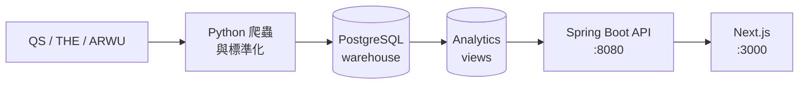

# CrawlerNest

[](https://github.com/heinricitorgau/University-Data-Infrastructure-Web-Platform/actions/workflows/agent-tests.yml)
[](https://github.com/heinricitorgau/University-Data-Infrastructure-Web-Platform/actions/workflows/data-quality.yml)
[](https://github.com/heinricitorgau/University-Data-Infrastructure-Web-Platform/actions/workflows/release-smoke.yml)

端到端的大學資料基礎設施與網站平台。將 QS、THE、ARWU 的全球排名與學科排名彙整進統一的資料倉儲，提供具可解釋性的 API，並以 Next.js 前端呈現大學比較、瀏覽與儲存功能。

系統以資料為核心：爬蟲與 pipeline 負責將 canonical records 寫入 PostgreSQL，前端只從 analytics views 讀取，從不直接存取原始資料表。

---

## 功能概覽

- **全球排名** — 彙整 1,499 所大學（QS 2026 完整匯入，含 THE 與 ARWU adapter）
- **學科排名** — QS 2026 學科資料：資工、電機、商管
- **可解釋性** — 每筆排名與推薦均附帶來源比較、信心等級與證據鏈
- **推薦系統** — 依地區、排名區間、學科篩選大學，可匯出命名計畫
- **分析儀表板** — 年度排名變化、跨來源分歧、資料品質診斷
- **身份層** — Session-based 帳號、已儲存大學、已儲存推薦計畫

---

## 系統架構



**技術棧：** Python · PostgreSQL · Spring Boot (Java 17) · Next.js (React) · Tailwind CSS

---

## 目錄結構

```
crawlernest/
  crawlernest-web/          Next.js 前端
  servise_for_java/         Spring Boot API
  crawlernest-core/         canonical 解析、aggregation
  pipeline/                 CLI 進入點
  crawlernest-normalization/ C 語言 CSV 標準化引擎（研究元件）
  crawlernest-agents/       AI 開發 agent 集合（readonly，選用）
crawlernest_ranking_crawler/ Python 排名匯入套件
crawlernest_admission_crawler/ Python 申請資訊匯入套件
docs/                       架構、營運、發佈文件
scripts/                    啟動、smoke check、營運自動化
tests/                      整合測試
```

---

## 開始使用

→ **[docs/GETTING_STARTED.md](docs/GETTING_STARTED.md)** — 完整本機設定教學（PostgreSQL、Python、Java、Node.js、資料 pipeline）

第一次設定完成後，之後只需：

```bash
./scripts/start_localhost.sh
```

---

## 文件索引

| 主題 | 文件 |
|------|------|
| 系統架構 | [docs/ARCHITECTURE_OVERVIEW.md](docs/ARCHITECTURE_OVERVIEW.md) |
| 目錄地圖 | [docs/REPOSITORY_MAP.md](docs/REPOSITORY_MAP.md) |
| 資料流向 | [docs/DATA_FLOW.md](docs/DATA_FLOW.md) |
| API 列表 | [docs/API_SURFACE.md](docs/API_SURFACE.md) |
| 營運手冊 | [docs/operational/OPERATIONAL_RUNBOOK.md](docs/operational/OPERATIONAL_RUNBOOK.md) |
| 身份驗證限制 | [docs/AUTH_LIMITATIONS.md](docs/AUTH_LIMITATIONS.md) |
| 本機問題排解 | [docs/LOCAL_TROUBLESHOOTING.md](docs/LOCAL_TROUBLESHOOTING.md) |
| 所有文件 | [docs/README.md](docs/README.md) |

---

## 目前狀態

CrawlerNest v0.1 是 operational MVP——可重現、可展示，尚非生產環境部署。

- THE 與 ARWU 處於 stable degraded 狀態（資料不可用）；QS 2026 已完整匯入
- 所有大學目前為單一來源；在 RC-1 狀態下信心等級固定為 "low"
- Agent 頁面預設使用 mock provider，不會寫入資料庫

發佈說明：[docs/release/RELEASE_NOTES_v0.1.md](docs/release/RELEASE_NOTES_v0.1.md)
