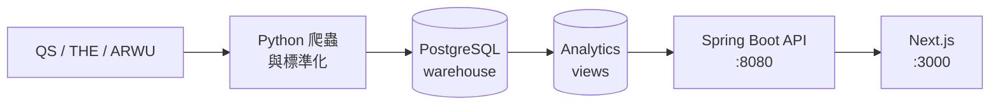

# CrawlerNest

[](https://github.com/heinricitorgau/University-Data-Infrastructure-Web-Platform/actions/workflows/agent-tests.yml)
[](https://github.com/heinricitorgau/University-Data-Infrastructure-Web-Platform/actions/workflows/ml-tests.yml)
[](https://github.com/heinricitorgau/University-Data-Infrastructure-Web-Platform/actions/workflows/data-quality.yml)
[](https://github.com/heinricitorgau/University-Data-Infrastructure-Web-Platform/actions/workflows/release-smoke.yml)
[](https://github.com/heinricitorgau/University-Data-Infrastructure-Web-Platform/actions/workflows/api-tests.yml)
[](https://github.com/heinricitorgau/University-Data-Infrastructure-Web-Platform/actions/workflows/python-tests.yml)

端到端的大學資料基礎設施與網站平台。將 QS、THE、ARWU 的全球排名與學科排名彙整進統一的資料倉儲，提供具可解釋性的 API，並以 Next.js 前端呈現大學比較、瀏覽與儲存功能。

系統以資料為核心：爬蟲與 pipeline 負責將 canonical records 寫入 PostgreSQL，前端只從 analytics views 讀取，從不直接存取原始資料表。

---

## 目錄

- [功能概覽](#功能概覽)
- [系統架構](#系統架構)
- [多來源彙整](#多來源彙整)
- [建模層](#建模層)
- [目錄結構](#目錄結構)
- [開始使用](#開始使用)
- [文件索引](#文件索引)
- [持續整合](#持續整合)
- [目前狀態](#目前狀態)
- [授權條款](#授權條款)

---

## 功能概覽

- **多來源排名** — 1,499 所大學，三個來源實際匯入：QS 1,499 筆、THE 1,080 筆、ARWU 582 筆
- **學科排名** — QS 2026 學科資料：資工、電機、商管
- **可解釋性** — 每筆排名與推薦均附帶來源比較、信心等級與證據鏈
- **建模層** — 針對 QS 隱藏分數的估計值，附帶機械推導的支援旗標
- **推薦系統** — 依地區、排名區間、學科篩選大學，可匯出命名計畫
- **分析儀表板** — 年度排名變化、跨來源分歧、資料品質診斷
- **身份層** — Session-based 帳號、已儲存大學、已儲存推薦計畫

---

## 系統架構



**技術棧：** Python · PostgreSQL · Spring Boot (Java 17) · Next.js (React) · Tailwind CSS

---

## 多來源彙整

三個來源的權重為 QS 0.222、THE 0.654、ARWU 0.124，總和為 1.0。`coverage_ratio`
是實際有資料的來源權重佔比，所以它直接顯示一筆資料背後有多少證據：

| 來源組合 | 大學數 | coverage_ratio | 信心等級 |
|---|---:|---:|---|
| QS + THE + ARWU | 508 | 1.000 | high |
| QS + THE | 572 | 0.876 | medium |
| QS + ARWU | 74 | 0.346 | medium |
| 僅 QS | 345 | 0.222 | low |

信心等級由來源數**機械推導**，不由人工指定——這是 [`CLAUDE.md`](CLAUDE.md)
裡「No black-box scores」規則的一部分。

跨來源的實體解析（「哪個 QS 大學等於哪個 THE 大學」）不使用相似度評分。在這份
資料上，相似度會把 Tokyo Institute of Technology 配給 MIT、University of
British Columbia 配給 University of Northern British Columbia。每一筆別名都必須
同時滿足三個條件：國別相同、正規化後的實詞完全一致（不移除任何實詞）、以及雙向
一對一。規則到不了的部分（改名、純縮寫、分不出校區或他校的後綴）留給人工，因為
**錯配比漏配嚴重得多**。

---

## 建模層

QS 為 2026 快照的全部 1,503 所大學公布九項成分指標，但 `Overall Score` 只公布
給第 1–600 名。這個不對稱本身就是一個監督式學習問題：

```
第    1– 600 名  →  分數已公布  →    600 筆有標籤（訓練集）
第  601–1503 名  →  分數被隱藏  →    903 筆無標籤（推論集）
```

對這個切分做探索式分析，得出了決定整個建模設計的發現：


PC1 單獨解釋 50.7% 的變異，且幾乎單調地依名次排列有標籤的大學。但要預測的那 903
所堆積在 PC1 的低端，也就是訓練資料稀疏的區域——每一項指標在兩群之間都相差 0.67
到 1.91 個合併標準差。**預測被隱藏的分數是外推，不是內插。**

因此模型不能拿一個好看的交叉驗證誤差當成準確率。交叉驗證衡量的是它還原 QS 計分
函數的程度；逐筆的支援旗標決定哪些估計值可以呈現；而與那 903 所已公布名次的
Spearman 相關，是位移區域裡唯一可得的外部驗證——那裡分數未知，但**次序是已知的**。

由此得到兩個結果：

**公布的權重可以從資料中還原。** 對原始指標做線性擬合，重現了 QS 文件記載的權重
到平均絕對誤差 0.0006——Academic Reputation 0.2996 對公布的 0.30、Citations per
Faculty 0.1992 對 0.20，九項皆然。這使它成為系統辨識而非預測，因此 R² 0.9999
應該讀作「公式被還原了」，而不是預測準確率。

**前處理比模型選擇更關鍵。** 第一版 pipeline 使用中位數填補，對那 903 所的
Spearman 是 0.9551。固定權重不變（與 QS 的差距最多 0.0008），只把填補改成在可用
指標上重新正規化，就提升到 0.9755。中位數填補借用的是訓練分布的數值，而那個分布
的中位數比被隱藏的尾段高出三到五倍。**只看交叉驗證會出貨較差的那個版本**，是
分布外的檢查才抓到它。

估計值以估計值的身分儲存與標記。建模層不會寫入 `analytics.aggregated_rankings`，
也不會更動任何已公布的名次，推論集中有 27% 被標記為落在模型的支援範圍之外。

→ **[crawlernest/crawlernest-ml/](crawlernest/crawlernest-ml/)** — 特徵契約、
EDA、指標與 model cards。

---

## 目錄結構

```
crawlernest/
  crawlernest-web/          Next.js 前端
  servise_for_java/         Spring Boot API
  crawlernest-core/         canonical 解析、aggregation
  crawlernest-ml/           QS 指標的特徵層、EDA 與模型
  pipeline/                 CLI 進入點
  crawlernest-normalization/ C 語言 CSV 標準化引擎（研究元件）
  crawlernest-agents/       AI 開發 agent 集合（readonly，選用）
crawlernest_ranking_crawler/ Python 排名匯入套件
crawlernest_admission_crawler/ Python 申請資訊匯入套件
docs/                       架構、營運、發佈文件
scripts/                    啟動、smoke check、營運自動化
tests/                      整合測試
```

---

## 開始使用

**前置需求**

| 相依項目 | 版本 |
|---|---|
| Python | 3.11+ |
| PostgreSQL | 14+ |
| Java JDK | 17 |
| Node.js | ≥ 20.9 |
| Maven | 由 `mvnw` 內含 |

→ **[docs/GETTING_STARTED.md](docs/GETTING_STARTED.md)** — 完整本機設定教學（PostgreSQL、Python、Java、Node.js、資料 pipeline）

第一次設定完成後，之後只需：

```bash
./scripts/start_localhost.sh
```

---

## 文件索引

| 主題 | 文件 |
|------|------|
| 系統架構 | [docs/ARCHITECTURE_OVERVIEW.md](docs/ARCHITECTURE_OVERVIEW.md) |
| 目錄地圖 | [docs/REPOSITORY_MAP.md](docs/REPOSITORY_MAP.md) |
| 資料流向 | [docs/DATA_FLOW.md](docs/DATA_FLOW.md) |
| API 列表 | [docs/API_SURFACE.md](docs/API_SURFACE.md) |
| 分析可解釋性 | [docs/analytics/ANALYTICS_EXPLAINABILITY.md](docs/analytics/ANALYTICS_EXPLAINABILITY.md) |
| 營運手冊 | [docs/operational/OPERATIONAL_RUNBOOK.md](docs/operational/OPERATIONAL_RUNBOOK.md) |
| 身份驗證限制 | [docs/AUTH_LIMITATIONS.md](docs/AUTH_LIMITATIONS.md) |
| 本機問題排解 | [docs/LOCAL_TROUBLESHOOTING.md](docs/LOCAL_TROUBLESHOOTING.md) |
| 所有文件 | [docs/README.md](docs/README.md) |

---

## 持續整合

六個 workflow、十個 job。一個檢查的價值取決於它**能不能失敗**，所以下表記錄的是
每個 workflow 實際執行了什麼，而不是它們的名字。

| Workflow | 實際執行的內容 |
|---|---|
| **Agent Tests** | web-agent 生成層的 126 個測試，接著跑完整 55 筆 golden case 的忠實性評估。兩個機械驗證訊號（忠實性規則與出處／缺席／完整性檢查）都被當成偵測器評分，clean text 上的誤報與召回率分開report。 |
| **ML Tests** | 三個 job。特徵層不變量與指標回歸閘門（從已提交快照重訓兩個模型，真實退步會擋下）。一個 serving job，把預測寫進拋棄式 PostgreSQL 並驗證資料列。一個 MATLAB job，安裝 MATLAB、重新執行 `run_qs_eda.m`，把新產出同時比對 Python 與已提交的 artifacts。 |
| **Python Tests** | 兩個 job。fixture 模式不起任何服務；PostgreSQL job 跑 opt-in 的資料庫測試——彙整數學、來源權重一致性、陳舊列清理、ingest 冪等性。另外有每週排程，因為這裡曾有一次失敗是**時間流逝**造成的，不是某次 commit。 |
| **API Tests** | Spring Boot 測試套件，對真實 PostgreSQL service 執行，97 個測試，surefire 報告會上傳成 artifact。 |
| **Release Smoke** | 兩個 job。建置產物——Java 編譯、Next.js build、Python 語法、唯讀 fixture；以及一個 analytics-bridge job，bootstrap PostgreSQL、種入六所大學、跑兩次 warehouse→analytics bridge、啟動 Spring Boot，確認 `/api/v1/rankings` 回得出寫進去的東西，最後跑端點存活檢查。 |
| **Data Quality** | 驗證 golden 回歸資料集與 CI fixture 檔案，然後以 fixture 模式跑 ranking-regression 與 failure-summary runner——不需資料庫、不需網路。 |

有兩件事這裡刻意**不**宣稱：

- **跳過不等於通過。** 這裡好幾項檢查曾經是靜默跳過的——PostgreSQL 測試沒有
  資料庫、API 端點檢查沒有 server、MATLAB 原始碼從未被重新執行。現在每一項都在
  一個無法跳過它的地方執行，而合理跳過的 job 會在名稱裡說明。
- **綠燈代表檢查跑了，不代表系統是對的。** 剩下的缺口記錄在
  [`crawlernest-ml/README.md`](crawlernest/crawlernest-ml/README.md) 的限制段落，
  不藏在通過的徽章後面。

本機執行完整套件（含 opt-in 的 PostgreSQL 測試）：

```bash
CRAWLERNEST_RUN_PG_TESTS=1 CRAWLERNEST_PG_PASSWORD=test \
  python3 crawlernest/crawlernest-tests/run_tests.py
```

---

## 目前狀態

CrawlerNest v0.1 是 operational MVP——可重現、可展示，尚非生產環境部署。

- 三個排名來源都已匯入：QS 1,499 筆、THE 1,080 筆、ARWU 582 筆
- 508 所大學達到三來源（信心 high），345 所仍為單一來源（low）
- 實體解析的覆蓋率仍有缺口：THE 有 419 所、ARWU 有 293 筆未配對。規則能安全處理
  的都已處理，剩下的是改名、純縮寫與難以區分的校區後綴，需要人工逐筆判斷
- 缺少的名次會被明確揭露成**我們的缺口**（未匯入或未配對），而不是來源沒有排名
- Agent 頁面預設使用 mock provider，不會寫入資料庫

發佈說明：[docs/release/RELEASE_NOTES_v0.1.md](docs/release/RELEASE_NOTES_v0.1.md)

---

## 授權條款

[Apache License 2.0](LICENSE)。

本平台匯入的排名資料屬於 QS、Times Higher Education 與 ShanghaiRanking，**不在
該授權範圍內**。已提交的快照存在於此是為了讓 pipeline 與模型可重現；若要對外發布
由這些資料衍生的內容，仍須遵守各來源自身的條款。
