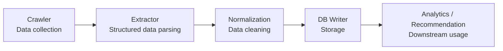
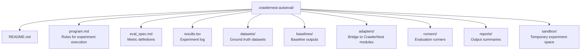

# CrawlerNest AutoEval

> Autonomous evaluation and optimization layer for CrawlerNest.

## Overview

CrawlerNest AutoEval is a research-oriented module designed to systematically evaluate, compare, and improve data extraction and normalization logic within the CrawlerNest ecosystem.

Instead of manually tuning parsers or cleaning rules, AutoEval introduces a structured experiment loop:

- Modify a rule or strategy
- Run evaluation on a fixed dataset
- Measure performance
- Keep or discard the change

This module is inspired by autonomous research workflows, but adapted for **data engineering and information extraction**, not LLM training.

---

## Purpose in CrawlerNest

CrawlerNest consists of multiple layers:



AutoEval sits **above these layers** and acts as a:

> "quality optimization engine"

It does not replace any component. Instead, it:

- Calls existing modules
- Evaluates their outputs
- Compares different strategies
- Helps identify better implementations

---

## Core Idea

AutoEval follows a controlled experiment loop:

1. Start from a baseline implementation
2. Apply a small modification (e.g., parser rule)
3. Run evaluation on a fixed dataset
4. Compute metrics
5. Compare against baseline
6. Keep or discard the change

This creates a reproducible and trackable improvement process.

---

## What Gets Evaluated

### 1. Extractors

- Field extraction accuracy
- Missing required fields
- Structural consistency

### 2. Normalization

- Entity consistency (e.g., university names)
- Deduplication quality
- Formatting correctness

### 3. (Future) Recommendation / Ranking

- Ranking quality
- Feature effectiveness
- Retrieval performance

---

## Project Structure



---

## Key Components

### program.md
Defines how experiments are conducted.

- What files can be modified
- How to run evaluations
- Keep / discard rules

---

### eval_spec.md
Defines evaluation metrics.

Example metrics:

- required_field_fill_rate
- exact_match_rate
- error_count
- runtime

---

### results.tsv
Tracks all experiments.

Example:

```
commit\tscore\tfill_rate\terror_count\tstatus\tdescription
abc123\t0.82\t0.90\t3\tkeep\tbaseline extractor
bcd234\t0.85\t0.92\t2\tkeep\tadded fallback selector
cde345\t0.78\t0.88\t5\tdiscard\tregex-only parsing
```

---

### adapters/
Adapters connect AutoEval to existing modules:

- crawlernest-extractors
- crawlernest-normalization

This avoids modifying core systems directly.

---

### runners/
Execution layer for experiments.

Examples:

- run_extractor_eval.py
- run_normalization_eval.py

---

## Design Principles

### 1. Isolation
AutoEval does not directly modify production code.

### 2. Reproducibility
All experiments run on fixed datasets.

### 3. Small Iterations
Each experiment changes only one aspect.

### 4. Measurable Progress
All results are logged and comparable.

---

## Current Status

This module is in early development and currently focused on:

- Extractor evaluation
- Normalization validation

Future work includes:

- Automated rule generation
- AI-assisted optimization
- Integration with recommendation systems

---

## Philosophy

CrawlerNest is not just a data pipeline.

AutoEval introduces a second layer:

> A system that improves the system.

Instead of manually refining logic, we build mechanisms that:

- Measure quality
- Track improvements
- Enable continuous evolution

---

## Relation to Original Autoresearch

This module is inspired by Karpathy's "autoresearch" concept, but differs in key ways:

| Aspect | Original | CrawlerNest AutoEval |
|------|--------|----------------------|
| Domain | LLM training | Data extraction & normalization |
| Target | train.py | Extractors / rules |
| Metric | val_bpb | Data quality metrics |
| Goal | Better model | Better structured data |

---

## License

Follows the main CrawlerNest project license.
