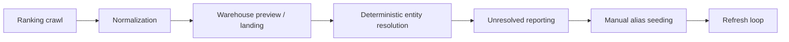
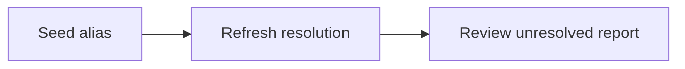

# CrawlerNest Entity Resolution

## Pipeline Position

Entity resolution is the identity-control layer that maps normalized university names onto canonical university entities without mutating the original ranking facts.

## Current Strategy

The current production-minded ranking flow uses a conservative first-pass resolver.

Resolution follows this order:

1. exact match against canonical university normalized names
2. exact match against curated university aliases
3. unresolved if no deterministic match exists

Current resolution status values are:

- `resolved`
- `unresolved`

This is intentionally narrower than a full fuzzy-matching system. At this stage, the priority is correctness, repeatability, and safe manual improvement rather than maximum automatic coverage.

## Why The Resolver Is Conservative

CrawlerNest currently treats incorrect identity merges as more dangerous than missed matches.

Because of that:

- fuzzy matching is not on the default ranking production path
- AI-based matching is not on the default ranking production path
- unresolved rows are surfaced explicitly instead of being guessed into a canonical entity

This keeps the system explainable and easier to audit.

## Canonical And Alias Model

The resolution model is built around two concepts:

- **canonical universities**: the stable internal identity of an institution
- **university aliases**: curated alternative names that should resolve to the same canonical entity

Typical examples of aliases include:

- abbreviations
- source-specific naming variants
- punctuation or casing variants
- manual curation for historically inconsistent source naming

## Manual Curation Loop

The intended operating loop is:

This loop allows operators to reduce unresolved entities incrementally without changing crawler behavior or rewriting upstream pipeline stages.

The benefits are:

- deterministic behavior
- clear auditability
- easy reruns
- low-risk expansion of resolution coverage

## What This Layer Owns

- canonical identity matching for normalized university names
- alias-driven deterministic resolution
- unresolved status assignment
- support for manual curation and re-resolution

## What This Layer Does Not Own

- crawler-side normalization
- ranking aggregation truth
- recommendation scoring
- final product read models
- heuristic or AI-driven auto-merging on the production path

## Future Direction

This layer is expected to evolve, but in controlled phases.

Likely future directions include:

- broader alias coverage
- batch curation workflows
- review-oriented matching queues
- optional fuzzy or semantic candidate generation behind explicit guardrails

Any future expansion should remain downstream of the deterministic baseline rather than replacing it outright.
