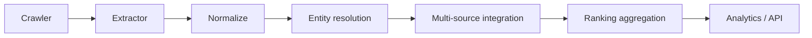

# Ranking Aggregation (Deterministic, Explainable)

## Objective

Combine source-specific rankings (QS/THE/ARWU) into one explainable comparison layer.

This is **not ML**. It is deterministic analytics.

## Pipeline Position



## Deterministic Stages

1. Per-source rank collection
- collect available source ranks from QS / THE / ARWU
- preserve the source ranks as the only ranking-order input

2. Rank aggregation
- configurable per source
- default:
  - QS: 0.40
  - THE: 0.35
  - ARWU: 0.25
- aggregated rank value = weighted average of available source ranks
- lower aggregated rank value is better

3. Composite score
- optional display metric only
- weighted average over available source scores only when scores exist
- never used for ranking order

4. Display rank
- sort by aggregated rank value asc
- dense rank assignment (ties share rank)

## Explainability Output

Per university output includes:

- `canonical_university_id`
- `source_ranks`
- `source_normalized_scores`
- `source_weights_used`
- `composite_score`
- `display_rank`
- `aggregation_method_version`
- `coverage_ratio`

## Edge Case Handling

- Missing source data: weighted average renormalizes by used rank weights
- Tied scores: dense rank
- Rank ranges (`201-250`): midpoint
- Conflicting score scales: source-specific scale config affects display only
- Partial year coverage: aggregate per year independently
- Single-source universities: still aggregated, lower `coverage_ratio`

## Core Interface

```python
from ranking_aggregation import aggregate_rankings, default_aggregation_config

outputs = aggregate_rankings(records, config=default_aggregation_config())
```

## Storage

Use `ranking_aggregation_postgresql.sql` tables:

- `analytics.aggregation_runs`
- `analytics.source_weight_config`
- `analytics.aggregated_rankings`

and view:

- `analytics.v_aggregated_rankings_latest`
