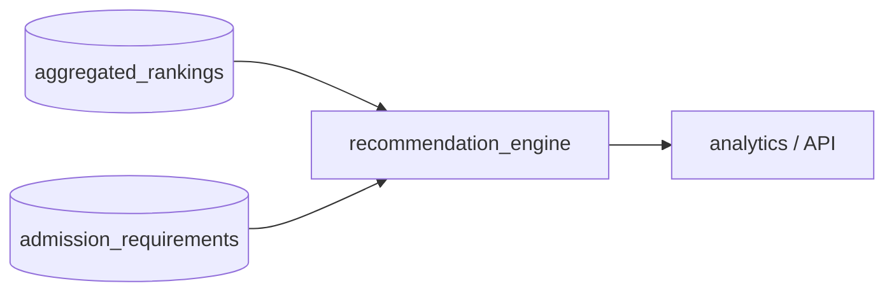

# Production Decision Engine

## Objective

Recommend universities from canonical entities using deterministic, explainable rules.

This is **not ML**.

## Pipeline Position



## Module Structure

- `config.py`
  Centralized defaults, policy/scoring/explanation versioning, environment overrides
- `policy.py`
  Eligibility, category boundaries, preference weighting, risk adjustment, category assignment
- `confidence.py`
  Rule-based recommendation confidence and confidence reason generation
- `explanations.py`
  Deterministic user-facing explanation templates
- `engine.py`
  Orchestration layer that applies the policy stack and returns grouped results
- `repository.py`
  PostgreSQL candidate fetch and recommendation-run persistence
- `types.py`
  Query, candidate, breakdown, grouped result contracts

## Decision Layers

1. Eligibility filter layer
- requires usable ranking evidence
- keeps country as a soft preference in v3
- handles missing IELTS gracefully

2. Base scoring layer
- `ranking_score`
- `ielts_fit_score`
- `confidence_score`

3. Preference adjustment layer
- configurable `ranking / ielts / confidence / country_match` weights
- ranking remains dominant after normalization

4. Risk adjustment layer
- conservative / balanced / aggressive profile shifts

5. Category assignment layer
- deterministic `reach / target / safety`

6. Explanation generation layer
- filter summary
- category reason
- score explanation
- preference impact
- risk adjustment summary

## Explainability Output

Each result returns:
- `canonical_university_id`
- `university_name`
- `country`
- `aggregated_rank`
- `ielts_min`
- `matching_score`
- `recommendation_confidence`
- `confidence_reason`
- `scoring_version`
- `decision_policy_version`
- `explanation_version`
- `explanation`
- `score_breakdown`

## Design Notes

- Missing IELTS requirement is excluded by default when the user supplies an IELTS score.
- If `preferred_ranking_source` is present and that source rank exists, it is used for the rank constraint and rank-score component.
- If the preferred source rank is missing, the engine falls back to `aggregated_rank`.
- Missing sub-scores do not zero-out the final score; weights are renormalized over available components.

## Recommended Storage

Use `recommendation_postgresql.sql` to create:
- `warehouse.canonical_university_link`
- `analytics.recommendation_runs`
- `analytics.recommendation_results`
- `analytics.v_recommendation_candidates_latest`

## Core Interface

```python
from recommendation_engine import (
    RecommendationQuery,
    default_recommendation_config,
    recommend_universities_v3,
)

grouped = recommend_universities_v3(
    candidates,
    RecommendationQuery(
        country="United Kingdom",
        ielts_score=6.5,
        target_rank=100,
        risk_profile="balanced",
        preference_weights={"ranking": 0.5, "ielts": 0.2, "confidence": 0.2, "country_match": 0.1},
    ),
)
```
