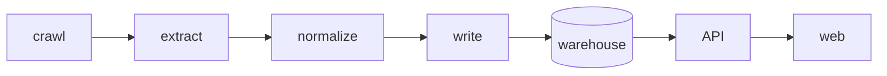

# CrawlerNest System Architecture

This document is now a **legacy mirror / redirect** for the architecture narrative inside the inner `crawlernest/` workspace.

For current canonical docs, use:

- `docs/architecture/SYSTEM_ENGINE_ARCHITECTURE.md`
  v1 full-vision architecture
  v2 current executable architecture
- `docs/architecture/REPO_STRUCTURE.md`
  repo and module layout

## Current Status

The older version of this file described a broader platform architecture with more active layers than the current engineering reality.

Today, the safest mental model is:

With these boundaries:

- `crawlernest-ranking-crawler/`
  stable active ranking path
- `crawlernest-admission-crawler/`
  limited / pilot admission path
- `crawlernest-extractors/`
  shared helper layer
- `crawlernest-db-writer/`
  controlled write boundary
- `crawlernest-core/entity_resolution/`
  minimal viable canonical linking
- `crawlernest-core/multi_source/` and `crawlernest-core/ranking_aggregation/`
  future-expansion oriented, not the primary execution path
- `crawlernest/agent/`, `crawlernest-mini-agent/`, `crawlernest-autoeval/`
  development-support systems, not production data path

## Recommended Reading

1. `README.md`
2. `docs/architecture/REPO_STRUCTURE.md`
3. `docs/architecture/SYSTEM_ENGINE_ARCHITECTURE.md`

This file is intentionally kept short to avoid architecture drift.
