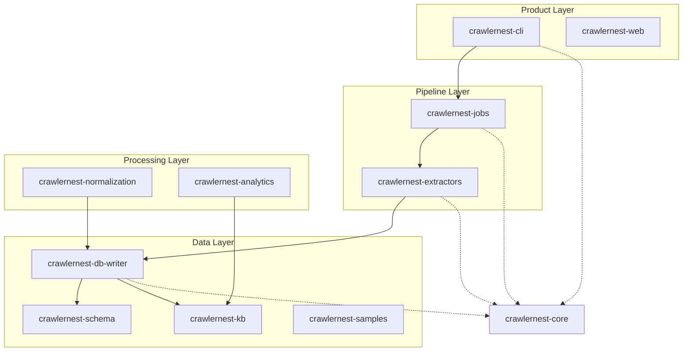

# 🏗️ CrawlerNest Architecture

The CrawlerNest platform is a modular data-processing engine designed for research and production-grade web crawling. This document describes the "startup / research-lab" style architecture implemented in the 2026 refactor.

## 📌 System Topology

## 📂 Module Descriptions

### 1. [crawlernest-core](file:///Users/test/Desktop/crawlernest/crawlernest-core)
Contains shared models (e.g., `University`, `AdmissionRequirements`), logging utilities, and the central `Config` system. This is the foundation upon which all other modules are built.

### 2. [crawlernest-extractors](file:///Users/test/Desktop/crawlernest/crawlernest-extractors)
Low-level networking and parsing logic.
- `fetcher.py`: Handles HTTP requests (sync and async) with retry logic and SSL management.
- `extractor.py`: Uses regex and heuristics to parse admission requirements and scores from HTML.

### 3. [crawlernest-jobs](file:///Users/test/Desktop/crawlernest/crawlernest-jobs)
The orchestration layer. Manages the lifecycle of a crawl task, including pagination and session management.
- `crawler.py`: Coordination between fetchers, extractors, and writers.
- `crawlernest_main.py`: Main entry point logic.

### 4. [crawlernest-db-writer](file:///Users/test/Desktop/crawlernest/crawlernest-db-writer)
The persistence layer.
- `db_writer.py`: Implements the warehouse-style ingestion pipeline (dimensions vs. facts).
- `db.py`: Legacy support for flat SQLite tables.

### 5. [crawlernest-normalization](file:///Users/test/Desktop/crawlernest/crawlernest-normalization)
Data cleaning and standardization.
- **C Engine**: Located in `c_engine/`. High-performance score and country name normalizer written in C.

### 6. [crawlernest-cli](file:///Users/test/Desktop/crawlernest/crawlernest-cli)
Command-line interface for the platform.
- `interactive.py`: Menu-driven interface for selecting regions and ranking years.

### 7. [crawlernest-schema](file:///Users/test/Desktop/crawlernest/crawlernest-schema)
Source of truth for the database structure (`schema.sql`) and metadata mappings.

### 8. [crawlernest-kb](file:///Users/test/Desktop/crawlernest/crawlernest-kb)
The Knowledge Base. Contains snapshots of validated data and reference databases.

---

## ⚡ Technical Highlights

- **Async Concurrency**: Uses `aiohttp` and `asyncio.Semaphore` to crawl thousands of nodes while staying within server rate limits.
- **Robustness**: Extracted data is validated against known score boundaries (e.g., IELTS 0–9).
- **Network Resilience**: External API calls are guarded by mocks in tests, and live calls use auto-skipping logic if endpoints are unreachable.
