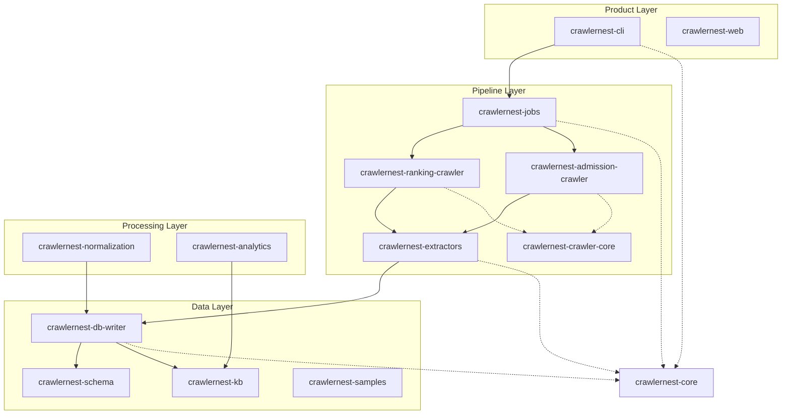

# 🏗️ CrawlerNest Architecture

The CrawlerNest platform is a modular data-processing engine designed for research and production-grade web crawling. This document describes the "startup / research-lab" style architecture implemented in the 2026 refactor.

The ranking path now includes a controlled data-production and resolution chain before any final product-facing truth is touched:

```text
crawl -> raw -> normalized -> staging -> validate -> ingest -> warehouse preview -> warehouse landing -> resolve -> report -> seed -> refresh
```

This makes ranking ingestion rerunnable, auditable, and safer to evolve.

## 📌 System Topology



## 📂 Module Descriptions

### 1. [crawlernest-core](file:///Users/test/Desktop/crawlernest/crawlernest-core)
Contains shared models (e.g., `University`, `AdmissionRequirements`), logging utilities, and the central `Config` system. This is the foundation upon which all other modules are built.

### 2. `crawlernest-crawler-core`
Shared crawler runtime building blocks.
- `http_client.py`: Minimal HTTP wrapper.
- `retry.py`: Retry helper.
- `rate_limit.py`: Per-request delay control.
- `logger.py`: Shared logger factory.
- `base.py`: Thin base crawler with snapshot hooks.

### 3. `crawlernest-ranking-crawler`
Ranking-specific crawler engine.
- `engine.py`: Ranking engine entrypoint and source dispatch.
- `sources/qs.py`: Example QS crawler stub.
- `sources/the.py`, `sources/arwu.py`: placeholder source crawlers.
- `models.py`: `RankingRecord`.
- downstream handoff now feeds a controlled ranking production workflow rather than writing directly into final product-serving truth

### 4. `crawlernest-admission-crawler`
Admission-specific crawler engine.
- `engine.py`: Admission engine entrypoint.
- `crawlers/university_site.py`: example university-site crawler stub.
- `extractors/admission_requirements.py`: lightweight admission record builder.
- `models.py`: `AdmissionRecord`.

### 5. [crawlernest-extractors](file:///Users/test/Desktop/crawlernest/crawlernest-extractors)
Reusable fetch / parse helpers used by crawler engines and legacy ingestion code.

### 6. [crawlernest-jobs](file:///Users/test/Desktop/crawlernest/crawlernest-jobs)
The orchestration layer. It should own batch execution and pipeline routing, not low-level crawler transport concerns.

### 7. [crawlernest-db-writer](file:///Users/test/Desktop/crawlernest/crawlernest-db-writer)
The persistence layer.
- `db_writer.py`: Implements the warehouse-style ingestion pipeline (dimensions vs. facts).
- `db.py`: Legacy support for flat SQLite tables.

For the ranking-specific workflow, persistence is now more explicitly staged:

- validated staging persistence
- warehouse preview mapping
- warehouse landing writes
- post-landing deterministic entity resolution

This separation reduces the risk of pushing crawler-side uncertainty directly into final warehouse truth.

### 8. [crawlernest-normalization](file:///Users/test/Desktop/crawlernest/crawlernest-normalization)
Data cleaning and standardization.
- **C Engine**: Located in `c_engine/`. High-performance score and country name normalizer written in C.

### 9. [crawlernest-cli](file:///Users/test/Desktop/crawlernest/crawlernest-cli)
Command-line interface for the platform.
- `interactive.py`: Menu-driven interface for selecting regions and ranking years.

### 10. [crawlernest-schema](file:///Users/test/Desktop/crawlernest/crawlernest-schema)
Source of truth for the database structure (`schema.sql`) and metadata mappings.

### 11. [crawlernest-kb](file:///Users/test/Desktop/crawlernest/crawlernest-kb)
The Knowledge Base. Contains snapshots of validated data and reference databases.

---

## ⚡ Technical Highlights

- **Separated crawler runtime**: transport concerns now live in `crawlernest-crawler-core`, while ranking and admission engines evolve independently.
- **Controlled ranking production path**: ranking records move through staging, validation, warehouse landing, and deterministic entity resolution before downstream truth consumption.
- **Robustness**: Extracted data is validated against known score boundaries (e.g., IELTS 0–9).
- **Network Resilience**: External API calls are guarded by mocks in tests, and live calls use auto-skipping logic if endpoints are unreachable.
