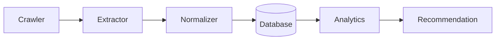
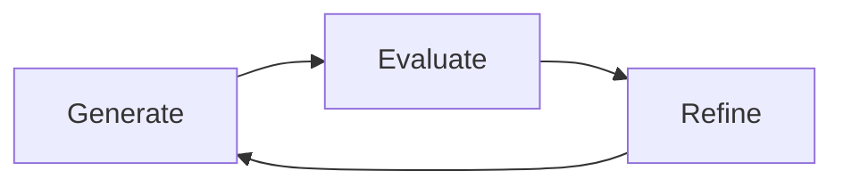

# CrawlerNest Mini-Agent System

**A controlled data infrastructure and AI-assisted development system for education data workflows.**

CrawlerNest Mini-Agent System combines structured data processing with a lightweight, human-guided mini-agent development loop. It is designed for reliability, evaluation, and system clarity rather than speculative autonomy.

## Overview

CrawlerNest is built around two connected layers:

- **Data infrastructure**
  - ingest messy external data
  - normalize and structure it
  - support downstream analytics and recommendation workflows

- **AI-assisted development**
  - use lightweight mini-agents to support implementation, review, and refinement
  - keep humans in control of decisions, scope, and release quality
  - use evaluation signals to improve outputs over time

This project should be understood as a **controlled engineering workflow**, not an autonomous coding system.

## Role in CrawlerNest

This repository serves as the experimental mini-agent layer for CrawlerNest.

It is designed to:

- Accelerate development through evaluation-driven loops
- Assist data processing and validation workflows
- Explore controlled AI-assisted system evolution

This is **not** a standalone autonomous system.  
It is a controlled subsystem integrated into CrawlerNest.

## Architecture

High-level pipeline:

Core system responsibilities:

- **Crawler**
  - collects raw university and admissions-related signals from external sources

- **Extractor**
  - converts heterogeneous source content into structured intermediate records

- **Normalizer**
  - standardizes names, countries, ranking fields, scores, and other noisy attributes

- **Database**
  - stores canonicalized records for retrieval, auditing, and downstream use

- **Analytics**
  - supports inspection, quality checks, aggregation, and comparative analysis

- **Recommendation**
  - powers rule-based or model-assisted decision support on top of normalized data

## Development Model

CrawlerNest uses a **mini-agent development loop**:

This loop is intentionally lightweight and controlled.

- **Generate**
  - produce code, rules, transforms, or candidate improvements

- **Evaluate**
  - test outputs against expected behavior, quality criteria, and system constraints

- **Refine**
  - adjust implementation based on observed failures, regressions, or weak signals

### Human-in-the-Loop

The system is designed with explicit operator oversight:

- mini-agents assist with bounded tasks
- humans approve scope, changes, and release direction
- evaluation results guide iteration
- final engineering judgment remains human-led

## AutoEval

CrawlerNest emphasizes **evaluation-driven development**.

AutoEval is the operating idea behind the workflow:

- define expected behavior
- measure outputs continuously
- use evaluation to improve pipelines and implementation quality
- prioritize reproducibility and observability over novelty

Typical uses include:

- validating normalization rules
- checking parser behavior across edge cases
- comparing candidate implementations
- reducing regressions during rapid iteration

## Features

- Modular data processing pipeline
- Structured normalization for noisy external data
- Lightweight CLI-oriented workflow
- Human-guided mini-agent task loop
- Evaluation-first engineering approach
- Reliability-oriented system design
- Clear separation between raw ingestion and downstream recommendation logic

## Design Principles

- **Controlled, not autonomous**
  - bounded workflows over open-ended execution

- **Evaluation before expansion**
  - improve quality with measurable checks before adding complexity

- **Reliable abstractions**
  - clear modules, stable interfaces, predictable behavior

- **Human judgment stays central**
  - agents assist; operators decide

- **System thinking over feature accumulation**
  - architecture, flow, and maintainability matter more than isolated demos

## CLI

The project includes command-line entry points for development and pipeline operations.

Typical workflow:

- run ingestion and extraction steps
- normalize structured records
- execute evaluation or validation tasks
- inspect outputs and iterate

CLI surfaces are designed for controlled development and internal operations rather than broad public automation.

## Status

Current project focus:

- building a disciplined data pipeline
- improving normalization and quality controls
- formalizing mini-agent evaluation loops
- strengthening recommendation-support infrastructure

Project maturity:

- active engineering iteration
- architecture-first development
- reliability and evaluation are current priorities

## Roadmap

- Expand normalization coverage across additional data sources
- Improve schema validation and data quality checks
- Strengthen evaluation harnesses for development tasks
- Add more structured analytics and recommendation metrics
- Refine mini-agent orchestration for narrow, high-signal workflows
- Improve observability across pipeline stages

## Philosophy

CrawlerNest is based on a simple idea:

> Useful AI systems in engineering are often small, controlled, and measurable.

Rather than aiming for unrestricted automation, this project focuses on building a practical loop where data infrastructure, evaluation, and human oversight work together.

## Notes

- This README describes the system at the architectural level.
- Some implementation details are intentionally abstracted to keep the repository focused on system design and development direction.
