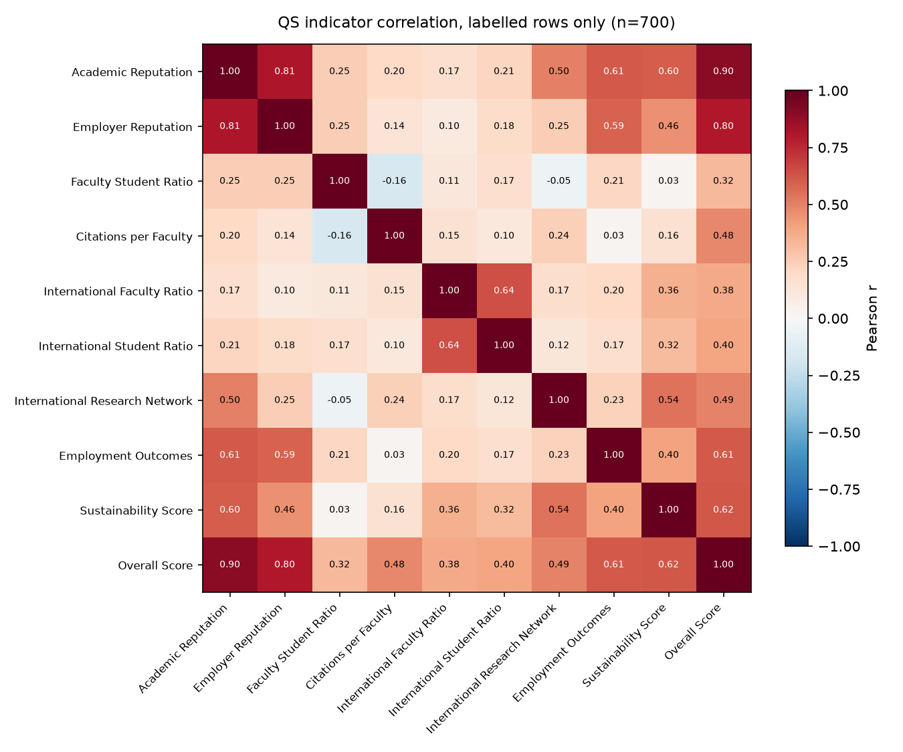
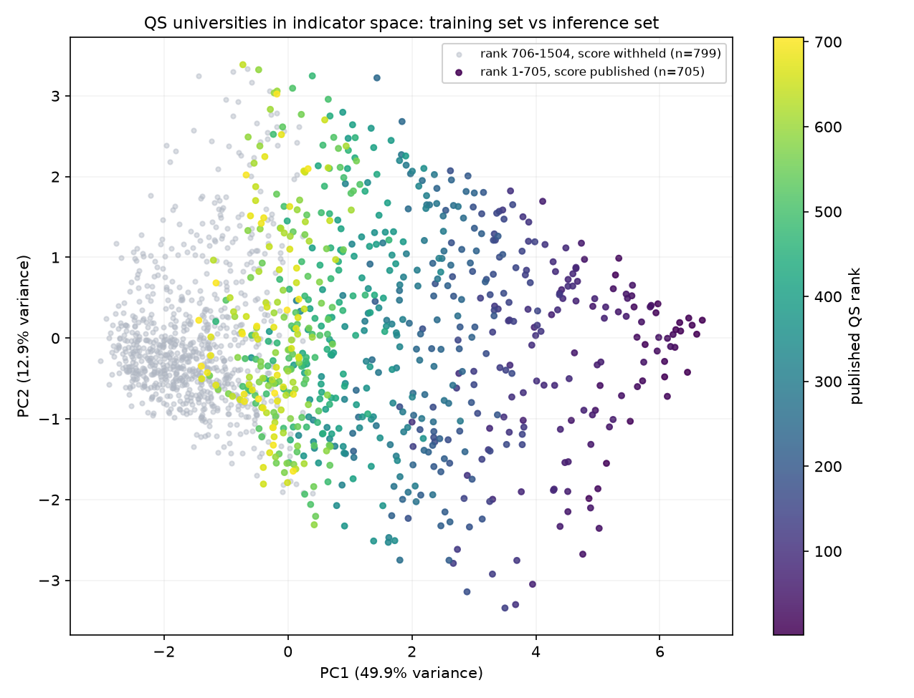
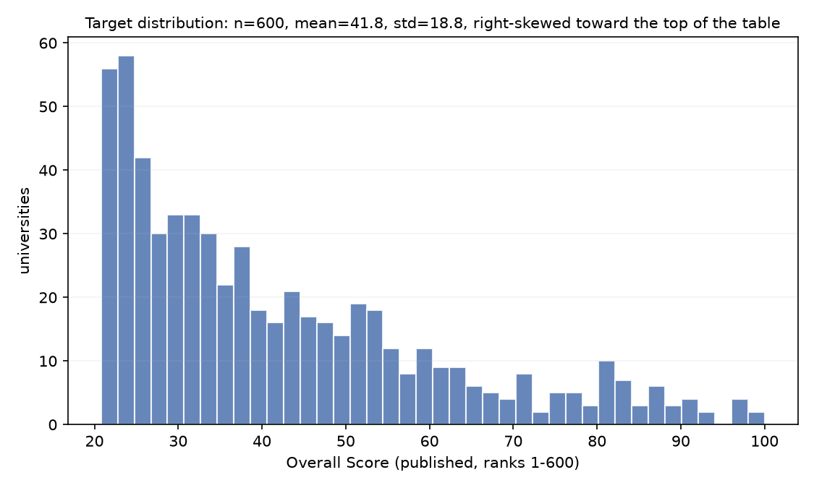
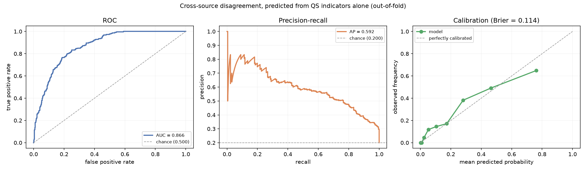

# CrawlerNest ML

Modelling layer over the QS indicator data. It sits **beside** the deterministic
pipeline, never inside it: nothing here writes to `analytics.aggregated_rankings`
or changes a published rank, and every model output is stored and labelled as an
estimate. This is the same honesty contract the rest of the repo runs on — see
the "No black-box scores" rule in the root [`CLAUDE.md`](../../CLAUDE.md).

Status: feature layer, EDA, two evaluated models, and a serving path that writes
estimates into `analytics.ml_predictions` for the API to read. Full records in
[`model_cards/overall_score.md`](model_cards/overall_score.md) and
[`model_cards/disagreement.md`](model_cards/disagreement.md).

## The data

Built from `crawlernest/crawlernest-kb/databases/last_crawl_snapshot.json`, which
is committed — so everything here runs with no database and no network.

| | |
|---|---|
| Universities | 1,503 (QS 2026) |
| Indicators | 9, all present on every record |
| Countries | 107, grouped into 12 regions |
| Feature matrix | `(1503, 9)` indicators, `(1503, 21)` with region one-hot |

The target is QS's `Overall Score`, and its availability is the reason this is a
supervised problem at all:

```
rank    1– 600  →  Overall Score published   →  600 labelled rows  (training set)
rank  601–1503  →  Overall Score = "n/a"     →  903 unlabelled rows (inference set)
```

QS publishes the nine component indicators for all 1,503 universities but the
total only for the top 600.

`rank` is never a feature — QS derives the rank *from* the overall score, so
using it would leak the target. It is carried alongside the matrix for
evaluation only.

## Running it

```bash
./.venv/bin/pip install -r requirements-ml.txt
PYTHONPATH=crawlernest/crawlernest-ml ./.venv/bin/python -m ranking_ml.features.build_features
PYTHONPATH=crawlernest/crawlernest-ml ./.venv/bin/python -m ranking_ml.eda.run_eda
PYTHONPATH=crawlernest/crawlernest-ml ./.venv/bin/python -m ranking_ml.training.train_overall_score
PYTHONPATH=crawlernest/crawlernest-ml ./.venv/bin/python -m ranking_ml.training.train_disagreement
```

## Phase 1 findings

### 1. Missingness is small but real

Every indicator is *present* on every record, but some carry `"n/a"`:

| Indicator | Missing | % |
|---|---:|---:|
| International Faculty Ratio | 100 | 6.65 |
| International Student Ratio | 58 | 3.86 |
| Sustainability Score | 19 | 1.26 |
| International Research Network | 1 | 0.07 |
| the other five | 0 | 0.00 |

Median imputation is the current strategy. It is a decision, not a default —
`missingness_report()` exists so it stays visible.

### 2. The indicators line up with QS's published weighting

Correlation with `Overall Score` on the 600 labelled rows:

| Indicator | Pearson r | QS published weight |
|---|---:|---:|
| Academic Reputation | 0.901 | 30% |
| Employer Reputation | 0.777 | 15% |
| Employment Outcomes | 0.630 | 5% |
| Sustainability Score | 0.576 | 5% |
| International Research Network | 0.478 | 5% |
| Citations per Faculty | 0.476 | 20% |
| International Student Ratio | 0.405 | 5% |
| International Faculty Ratio | 0.351 | 5% |
| Faculty Student Ratio | 0.333 | 10% |

The ordering broadly tracks the published weights, with one worth noting:
**Citations per Faculty carries a 20% weight but correlates at only 0.476**,
below three indicators weighted at 5%. Whether a fitted model recovers the
published 20% is a concrete, checkable question for Phase 2 rather than a
hand-wave about feature importance.



### 3. Training set and inference set are not the same population

This is the finding that constrains Phase 2. Standardised difference in means
(Cohen's *d*) between the 600 labelled and 903 unlabelled rows:

| Indicator | Labelled mean | Unlabelled mean | Cohen's *d* |
|---|---:|---:|---:|
| Sustainability Score | 49.98 | 6.88 | 1.91 |
| Academic Reputation | 37.72 | 8.70 | 1.68 |
| Citations per Faculty | 44.56 | 9.51 | 1.60 |
| International Research Network | 72.57 | 35.22 | 1.58 |
| Employer Reputation | 37.00 | 8.35 | 1.49 |
| International Faculty Ratio | 50.46 | 15.61 | 1.21 |
| Employment Outcomes | 40.02 | 13.06 | 1.13 |
| International Student Ratio | 41.86 | 13.74 | 1.03 |
| Faculty Student Ratio | 38.71 | 21.10 | 0.67 |

Every indicator shifts by more than 0.6 pooled standard deviations and most by
more than 1.0. Predicting the 903 from the 600 is **extrapolation, not
interpolation**.



PC1 alone explains 50.7% of the variance and orders the labelled rows almost
monotonically by rank. The unlabelled rows pile up at the low end of PC1, in a
region where the training data is sparse — though the two populations do overlap
around ranks 500–600, so predictions just past the cutoff rest on real support
and predictions deep in the tail do not.

**Consequences for Phase 2**, all of them arising from this figure:

1. A cross-validated RMSE on the 600 labelled rows measures how well the model
   recovers QS's scoring function. It does **not** estimate the error on the 903.
   Reporting it as though it did would be the exact kind of flattering,
   unfalsifiable number this repo's honesty contract exists to prevent.
2. Every prediction needs a **support flag** — a distance from the training
   distribution — and only predictions inside the supported region should be
   surfaced. This maps onto the existing mechanically-derived confidence rule
   rather than inventing a new one.
3. Spearman ρ between predicted score and QS's published rank on the 903 is not
   an optional extra. It is the only external validation available in the
   shifted region, because the ordering is known even though the scores are not.



## Phase 2 results

Full detail in the [model card](model_cards/overall_score.md). Three things came
out of it.

### The published weighting is recovered from the data

A linear fit on the raw indicators reproduces QS's documented weighting to a
mean absolute error of **0.0006** (worst case 0.0008): Academic Reputation
0.2996 against a published 0.30, Citations per Faculty 0.1992 against 0.20, and
so on for all nine.

This reframes what the model is. The overall score is a deterministic weighted
sum, so this is system identification, not forecasting — and an R² of 0.9999
should be read as "the formula was recovered", never as predictive accuracy.
Tree models do *worse* here (random forest RMSE 3.84 against 0.18), which is the
expected result when the true relationship is exactly linear.

It also shows why correlation is not importance: Citations per Faculty carries a
20% weight but correlates with the target at only 0.476, below three indicators
weighted at 5%.

### Imputation, not model choice, decided performance under shift

The first run used median imputation and scored Spearman 0.9551 against the
published ranks of the 903. Holding the weights fixed and only changing how
missing indicators are handled:

| Missing-value strategy | Spearman on the 903 |
|---|---:|
| median imputation | 0.9551 |
| renormalise over available weights | **0.9755** |

The fitted and published weights differ by at most 0.0008, so none of that gap
is about the model. Median imputation borrows values from a training
distribution whose medians run three to five times higher than the withheld
tail, biasing exactly the 114 rows that carry a missing indicator. The
recommended model, `linear_renorm`, renormalises instead — and then wins on both
cross-validation (RMSE 0.175 against 0.278) and extrapolation.

The general lesson is worth stating plainly: under covariate shift the default
preprocessing step did more damage than any modelling decision, and only the
out-of-distribution check surfaced it. Cross-validation alone would have shipped
the worse pipeline.

### A quarter of the inference set is unsupported

| Set | n | Supported | % |
|---|---:|---:|---:|
| Labelled (train) | 600 | 590 | 98.33 |
| Unlabelled (infer) | 903 | 657 | 72.76 |

Support is the mean distance to the 10 nearest training rows in standardised
indicator space, thresholded at the 95th percentile of the training set's own
leave-one-out distances — mechanical and inspectable, like the rest of the
confidence handling in this repo. **27% of the rows we would predict sit outside
the region the model was fitted on**, and the flag is what decides whether an
estimate is publishable.

## Phase 3 results — cross-source disagreement

Full detail in the [model card](model_cards/disagreement.md). QS and THE both
rank 820 of the same universities (exact name match), and they frequently
disagree about them.

The trap here was the same shape as Phase 2's, one level up. Each source's rank
is close to a deterministic function of its own component scores, so a
classifier handed *both* sources' scores would be recomputing the label rather
than predicting it, and would score well while meaning nothing. The task
modelled is therefore one-sided: **given only QS's view of a university, will
THE disagree?** That is a real prediction, and it has a use — flagging contested
institutions at QS ingest time, before THE data arrives.

| Feature set | Model | ROC-AUC | PR-AUC |
|---|---|---:|---:|
| **QS only** | **gradient boosting** | **0.8133** | **0.4696** |
| QS only | logistic regression | 0.7307 | 0.3198 |
| both sources *(ceiling)* | gradient boosting | 0.8902 | 0.7048 |
| chance | — | 0.5000 | 0.2000 |



PR-AUC 0.470 against a 0.200 base rate is the honest headline — a 2.3× lift,
where ROC-AUC would flatter an imbalanced problem. QS alone reaches 0.813 of a
two-sided ceiling of 0.890, so most of what is predictable is already in QS's own
numbers. Gradient boosting beats the linear model here by a wide margin, the
opposite of the overall-score result, because this relationship genuinely is not
linear. Calibration holds in the low and middle range and goes over-confident in
the top bin (0.72 predicted against 0.52 observed).

Among disagreeing pairs, **THE ranks the university higher 133 times to QS's
31** — the sources do not merely differ, they differ in a consistent direction.

## Phase 3 results — LLM evaluation

The faithfulness checker was already mechanical and already ran in CI, but it
reported only pass/fail over 6 golden cases, of which just 2 were faithful. A
pass count cannot distinguish a checker that catches everything from one that
also fires on clean text, and with 2 clean cases the false-positive rate had no
denominator worth reading.

Two changes:

- **The golden set is now 34 cases, 17 of them faithful.** The new entries cover
  fabricated scores, years and counts, dropped, paraphrased and softened
  caveats, invented institutions in both name forms, three-way combinations, and
  edge cases that *should* pass — whitespace-normalised caveats, rank bands
  quoted as published, trailing-zero variants, ordinals written as words, and
  institutions named from nested profile evidence.
- **The runner scores the checker as a detector**, reporting per-kind precision,
  recall and F1 plus the false-positive rate on clean text.

| Violation kind | TP | FP | FN | Precision | Recall | F1 |
|---|---:|---:|---:|---:|---:|---:|
| unsupported_number | 9 | 0 | 0 | 1.000 | 1.000 | 1.000 |
| missing_caveat | 7 | 0 | 0 | 1.000 | 1.000 | 1.000 |
| unsupported_university | 4 | 0 | 0 | 1.000 | 1.000 | 1.000 |
| micro-average | 20 | 0 | 0 | 1.000 | 1.000 | 1.000 |

False positives on clean text: **0 over 17 faithful cases**.

The checker turned out to be more robust than its own docstring implied — it
handles whitespace variation and numeric formatting correctly. Two cases are
tagged `known_limitation` because the flagged behaviour is deliberate rather than
a bug: a score rescaled from 0.82 to 82%, and a rank difference computed rather
than quoted. Both are unverifiable transformations, so flagging them is the
intended contract, and the dataset now records that decision instead of leaving
it in a comment.

## Layout

```
ranking_ml/
  features/
    schema.py               feature contract, QS published weights, validation
    regions.py              107 countries → 12 regions, documented judgement calls
    build_features.py       snapshot → FeatureMatrix (X, y, rank, names)
  eda/
    run_eda.py              the analysis and figures above
    cross_source.py         QS ∩ THE join, percentiles, disagreement label
  models/
    overall_score.py        candidate estimators, incl. RenormalisedWeightedScore
    support.py              distance-to-training-data flag
  evaluation/
    metrics.py              RMSE / MAE / R², and rank agreement
    baselines.py            QS's published weighting, and weight-recovery tables
  training/
    train_overall_score.py  the overall-score run
    train_disagreement.py   the cross-source disagreement run
  serving/
    predict.py              batch scoring into analytics.ml_predictions
model_cards/
  overall_score.md          full record for the score estimator
  disagreement.md           full record for the disagreement classifier
artifacts/
  eda/                      committed figures
  metrics/                  committed metrics.json, what CI compares against
  models/                   trained binaries (gitignored, rebuildable)
```

## Serving

Estimates reach the API through their own tables, never through
`analytics.aggregated_rankings`:

```bash
PYTHONPATH=crawlernest/crawlernest-ml ./.venv/bin/python -m ranking_ml.serving.predict \
    --pg-user test --pg-password test --pg-database clawer
# add --dry-run to compute everything and write nothing
```

The job fits the estimator on the 600 labelled universities, predicts the 903
withheld ones, resolves each to a `canonical_university_id`, and writes one
`analytics.ml_model_runs` row plus its predictions in a single transaction. On
the current snapshot 902 of 903 resolve; the one that does not is a snapshot row
literally named "N/A", which is skipped rather than guessed at.

The schema enforces two things rather than trusting callers to:
`ml_predictions.is_estimated` is `CHECK`-constrained true, so no writer can turn
the disclosure off, and every row carries its support distance, so no consumer
can surface an estimate without the means to say how far outside the training
data it sits.

`GET /api/v1/analytics/estimated-scores` reads them. Every non-empty response
carries `AnalyticsService.ESTIMATED_SCORE_CAVEAT`, and each item carries
`is_estimated` and `is_supported`. Unsupported rows are returned by default —
`?supported_only=true` filters them — because dropping them silently would hide
the part of the output least worth trusting.

### A boundary check worth knowing about

QS's lowest published overall score is 20.8, and every estimated university ranks
below 600, so on QS's own ordering no estimate should exceed 20.8. Two of 902
do (0.22%), the worst by 0.585. They are left unclipped: clipping would pile
rows up at the boundary and hide the error rather than remove it, and the size of
the overshoot is a useful read on the estimates' precision near the cut-off.

## CI

`.github/workflows/ml-tests.yml` runs on every push and pull request, with no
database and no network — everything trains from the committed snapshot.

```bash
# what CI does, locally
PYTHONPATH=crawlernest/crawlernest-ml ./.venv/bin/python -m pytest crawlernest/crawlernest-ml/tests -q
mkdir -p /tmp/metrics-baseline && cp artifacts/metrics/*.json /tmp/metrics-baseline/
PYTHONPATH=crawlernest/crawlernest-ml ./.venv/bin/python -m ranking_ml.training.train_overall_score
PYTHONPATH=crawlernest/crawlernest-ml ./.venv/bin/python -m ranking_ml.training.train_disagreement
PYTHONPATH=crawlernest/crawlernest-ml ./.venv/bin/python -m ranking_ml.evaluation.check_metrics \
    --baseline-dir /tmp/metrics-baseline
```

**38 feature-layer tests** run first: matrix shape, the 600/903 publication
split, region coverage for all 107 countries, value parsing, the renormalising
baseline, and that `rank` never appears among the features. They are fast and
have no model in them, so a broken feature layer fails as itself rather than
surfacing later as an unexplained metric movement.

**The metrics gate** then retrains both models and compares against the
committed `artifacts/metrics/*.json`. A model has no compiler and no failing test
to say it broke; without a gate, a change that quietly costs three points of AUC
looks exactly like a change that costs nothing. This repo already had that
failure mode once — a Java test that stayed red for two months because no
workflow ran it.

Two kinds of guard, because they fail differently:

| Kind | Checked how | Examples |
|---|---|---|
| **Invariant** | exactly, and first | `rows_labelled` = 600, `matched` = 820, `positives` = 164 |
| **Metric** | against a direction and tolerance | `linear_renorm` RMSE (±0.05), weight-recovery error (±0.0005), disagreement ROC-AUC (±0.02) |

Invariants come first because they describe the *data*: if the training set
stops being 600 rows, no metric comparison below it means anything.

Training is seeded and reproducible — a rerun on the same snapshot reproduces
every guarded number exactly, so the tolerances exist for library drift rather
than for run-to-run noise. Metric movement within tolerance is reported but does
not fail; it is the cue to retrain and recommit the metrics files.

The gate was verified by feeding it a deliberately degraded report: a 0.063 drop
in ROC-AUC and a changed row count both fail it with exit 1. A gate that cannot
fail is not a gate.

## Next

1. Surfacing the disagreement classifier's probability through the serving path.
   The tables are model-agnostic; only a second `predict` job is missing.
2. LLM-as-judge as a *second* faithfulness signal, calibrated against the
   mechanical checker on the golden set and reported with Cohen's κ before it is
   trusted for anything.
3. Cross-checking the MATLAB port in `matlab/` against the Python EDA. Both claim
   to compute the same covariate-shift figures; nothing currently verifies that
   they agree.
