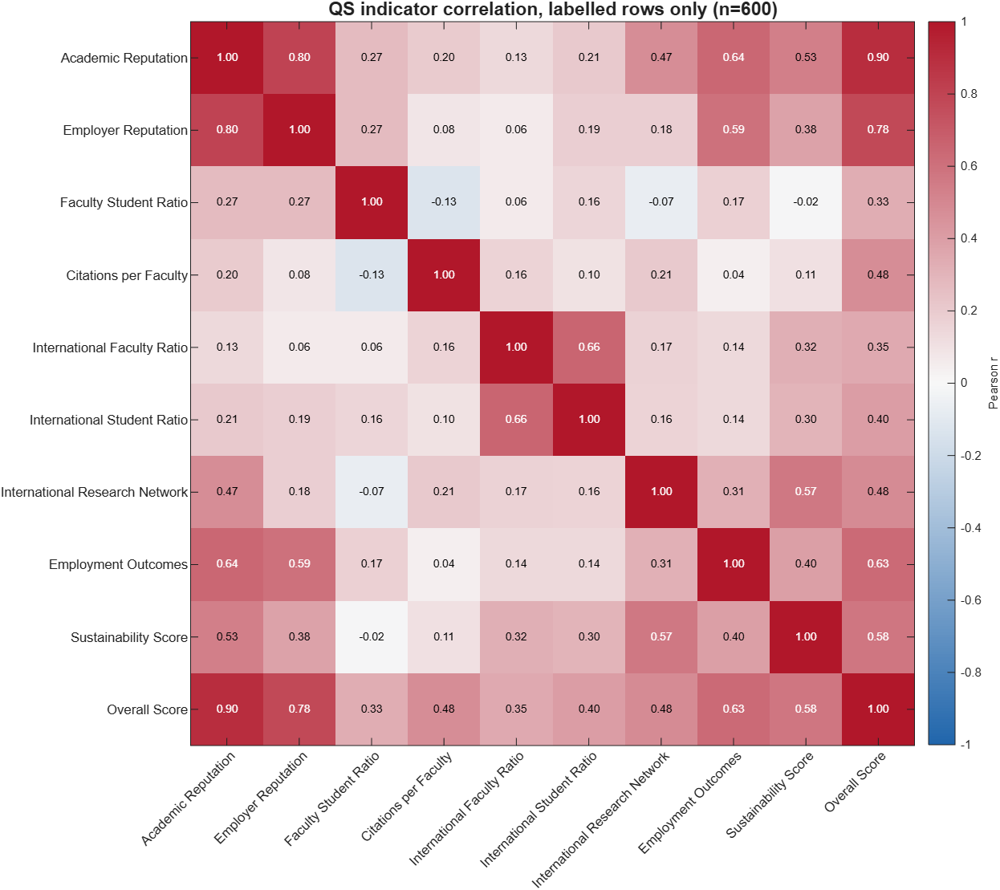
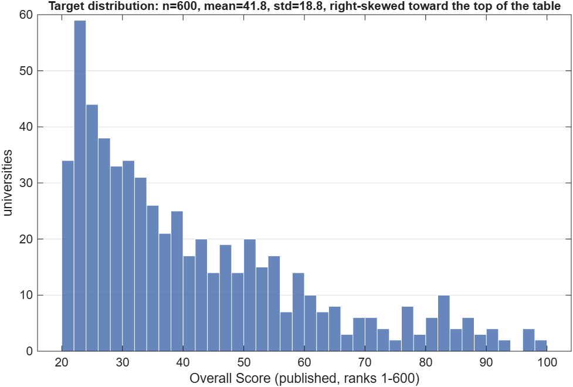

# MATLAB port of the QS modelling layer

MATLAB reimplementations of the Python analyses in `ranking_ml/`, reading the
same committed snapshots and producing the same numbers. Tested on MATLAB
**R2026a**; no toolboxes beyond Statistics and Machine Learning are used.

| Port | MATLAB | Python | Artifacts |
|---|---|---|---|
| Phase 1 EDA | `run_qs_eda.m` | `eda/run_eda.py` | `artifacts/eda_matlab/` |
| Phase 2 weight recovery | `recover_qs_weights.m` | `models/overall_score.py` | `artifacts/weights_matlab/` |
| Support flag | `qs_support_flagger.m` | `models/support.py` | `artifacts/support_matlab/` |
| Phase 3 dataset | `build_cross_source_data.m` | `features/cross_source.py` | `artifacts/cross_source_matlab/` |
| Phase 3 classifier | `train_disagreement_classifier.m` | `training/train_disagreement.py` | none — see below |

They exist as *ports*, not rewrites: the point is that two independent
implementations agree on the numbers the modelling decisions rest on. Each
script prints its own parity check against the Python output, and
`check_matlab_parity` re-checks every one of them in CI.

## Running it

From the MATLAB prompt:

```matlab
cd crawlernest/crawlernest-ml/matlab
results = run_qs_eda();
weights = recover_qs_weights();
support = qs_support_flagger();

[X, y, info] = build_cross_source_data();
qsOnly = train_disagreement_classifier(X, y, Name="qs_only");
ceiling = train_disagreement_classifier([X info.theFeatures], y, Name="both_sources");
```

Headless, from a Windows shell:

```bash
"C:/Program Files/MATLAB/R2026a/bin/matlab.exe" -batch "cd('//wsl.localhost/ubuntu-24.04/home/torgau/dev/University-Data-Infrastructure-Web-Platform/crawlernest/crawlernest-ml/matlab'); run_qs_eda();"
```

Options:

| Call | Effect |
|---|---|
| `<script>(Snapshot="...json")` | analyse a different crawl snapshot |
| `<script>(OutDir="...")` | write somewhere other than the default artifact directory |
| `run_qs_eda(SaveFigures=false)` | on-screen only, writes nothing |
| `<script>(SaveOutput=false)` | same, for the other three |
| `train_disagreement_classifier(X, y, Seed=3)` | a different stratified fold split |

No database, no network, no pipeline run: the input is
`crawlernest/crawlernest-kb/databases/last_crawl_snapshot.json`, which is
committed. Output lands in `../artifacts/eda_matlab/`, deliberately separate
from the Python-committed `../artifacts/eda/` so neither run clobbers the other.

## Output



Pearson correlation on the 600 labelled rows, target included as the last row
and column. The ordering broadly tracks QS's published weighting, with one
exception worth reading off the bottom row: **Citations per Faculty carries a
20% weight but correlates with Overall Score at only 0.48**, below three
indicators weighted at 5%. Correlation is not importance — Phase 2 confirms the
20% is really there by recovering it from a linear fit.



The regression target, published only for ranks 1-600 (n=600, mean 41.8, std
18.8). The right skew is the shape of the ranking table itself: scores above 60
are rare because few universities are near the top. The 903 rows QS withholds a
score for are not in this histogram at all — that gap is what the PCA figure is
about.

## Files

```
load_qs_snapshot.m               snapshot JSON -> 1503x9 indicator matrix, y, rank, names
qs_to_float.m                    QS cell -> double; "n/a" and off-scale values -> NaN
qs_to_rank.m                     published rank -> double; "901-950" -> midpoint
run_qs_eda.m                     Phase 1 figures, tables and parity check
recover_qs_weights.m             Phase 2 weight recovery and the published-weight baseline
qs_support_flagger.m             distance-to-training-data flag
build_cross_source_data.m        QS/THE join, percentile gap, disagreement label
train_disagreement_classifier.m  stratified CV, logistic and boosted models
```

The first three are shared by everything else, so a change to one of them can
move any artifact; the freshness guard treats them as a source for every port.

`rank` is loaded but kept out of the feature matrix. QS derives the rank *from*
the overall score, so using it as a feature would leak the target — the same
rule the Python side enforces in `features/schema.py`.

## Parity with the Python run

Every run prints this table. Deviations are at the level of the rounding in the
hard-coded reference values, not at the level of the computation:

```
--- parity with ranking_ml.eda.run_eda ---
            table                    max_abs_deviation_from_python
    "correlation with target"                  4.4310e-07
    "covariate shift (Cohen's d)"              4.8632e-05
    "PCA explained variance %"                 3.9696e-05
    "target mean / std"                        3.3333e-07
```

Anything above the script's tolerance raises a warning. Treat it as a real
signal — it means one of the two ports has drifted, and the figures should not
be used until that is explained.

Four places where MATLAB and scikit-learn defaults differ, all handled
explicitly in the sources:

- **Standardisation.** `StandardScaler` uses the population standard deviation
  (ddof=0). MATLAB's `std(X)` uses the sample one. The PCA input uses
  `std(X, 1, 1)`; the plain default shifts PC1 by ~0.03% of variance.
- **Cohen's *d*.** The pooled standard deviation uses ddof=1, matching the
  Python side. MATLAB's `var` default already does this.
- **Component signs.** PCA component signs are arbitrary and MATLAB and sklearn
  do not agree on them. Both components are flipped to a positive loading sum,
  so reruns and the Python figure orient the same way.
- **Percentile convention.** `numpy.percentile` and `pandas.quantile` place
  order statistics at `(i-1)/(n-1)`; MATLAB's `prctile` places them at
  `(i-0.5)/n`. This is a methodological difference, not rounding, and it bit
  twice: it moved the support threshold by 4.8e-3 (four universities across the
  supported/unsupported line) and it shifted the disagreement label's gap
  cutoff. Both ports interpolate explicitly instead of calling `prctile`.

## Deliberate visual differences

The numbers are identical; two colour choices are not, because MATLAB ships
neither colormap:

- matplotlib `RdBu_r` → a hand-built blue-white-red diverging map.
- matplotlib `viridis` → `parula`.

## Parity is checked, not asserted

The claim that these ports compute the same numbers is verified on every push:

```bash
PYTHONPATH=crawlernest/crawlernest-ml ./.venv/bin/python \
    -m ranking_ml.evaluation.check_matlab_parity
```

It compares the committed CSVs in every artifact directory against a fresh
Python run at a tolerance of 1e-9. Measured agreement:

| Port | Worst difference |
|---|---|
| eda | 7.1e-14 (covariate-shift means; correlations 7.2e-16, missingness exact) |
| weights | 9.2e-16 |
| support | 2.8e-14 |
| cross_source | 2.8e-16 |

Machine precision, which is what the same formulas over the same inputs should
give. The step runs in `.github/workflows/ml-tests.yml` and needs no MATLAB,
because this side is committed output.

Each entry point is registered in `check_matlab_parity.PORTS` as a `.m` file, an
artifact directory, the CSVs to compare, and the Python function that recomputes
them. Adding a port means adding one entry — the guard, the CLI and the
reporting all follow from the registry. The guard also asks its ordering
question **per port**, which an earlier version did not: it compared every `.m`
file against `artifacts/eda_matlab/` alone, so adding a second entry point
failed the check because a new source was newer than an artifact directory it
has nothing to do with.

**That is also its limit.** Editing a `.m` file without re-running it leaves the
CSVs stale, and stale CSVs still match. The check now asks git about the ordering
as well — it fails if a port's `.m` was committed after its artifacts, or if one
is modified in the working tree while its artifacts are not — so the sequence
that produces a stale artifact is caught even though the sources are not
re-executed. **Re-run the affected script and commit its regenerated artifact
directory after any change here.**

### How the sources are re-executed in CI

MathWorks' `setup-matlab` action runs MATLAB on GitHub-hosted runners without a
licence **for public repositories only**. This repository was private, which is
why the ordering guard existed instead. It is public now, so the
`matlab-reexecution` job in `.github/workflows/ml-tests.yml` runs the sources on
every push:

```yaml
- uses: matlab-actions/setup-matlab@v2
  with:
    products: Statistics_and_Machine_Learning_Toolbox
- uses: matlab-actions/run-command@v2
  with:
    command: |
      addpath("crawlernest/crawlernest-ml/matlab");
      root = "/tmp/matlab_fresh";
      run_qs_eda(OutDir = root + "/eda_matlab");
      recover_qs_weights(OutDir = root + "/weights_matlab");
      qs_support_flagger(OutDir = root + "/support_matlab");
      build_cross_source_data(OutDir = root + "/cross_source_matlab");
```

The toolbox is not optional: the ports call `pca`, `corr`, `tiedrank`,
`knnsearch` and `prctile`, none of which is in base MATLAB.

Output goes to a scratch directory rather than over the committed artifacts, so
the parity check has two independent things to compare. It is then run with
`--fresh-root` pointing at that directory, which makes the Python comparison one
against sources that just executed *and* asserts that the committed artifacts
are what those sources produce. A numeric comparison rather than
`git diff --exit-code`, because the PNGs differ in encoding between runs while
the numbers do not. Measured locally on R2026a, every fresh-versus-committed
column comes back `0.000e+00`.

The ordering guard stays. It runs in the fast job, needs no MATLAB, and still
catches the sequence that makes an artifact stale.

## What this does *not* cover

**The disagreement classifier's metrics are not parity-checked.** Its dataset
is — matched population, gap threshold, positive count and which source is
favoured all agree exactly — but ROC-AUC and PR-AUC are not comparable at 1e-9,
for two reasons that cannot be engineered away:

- The stratified fold split uses MATLAB's RNG, which cannot be aligned with
  scikit-learn's `random_state`.
- MATLAB's `LogitBoost` stands in for scikit-learn's `GradientBoostingClassifier`.
  They are the same family, not the same algorithm, and `templateTree` has no
  `MaxDepth`, so `MaxNumSplits=7` is a proxy for `max_depth=3`.

What can be claimed is that the two agree within the spread across fold seeds.
Over seeds 0–4 the MATLAB one-sided model gives ROC-AUC 0.7375 ± 0.0040
(logistic) and 0.8334 ± 0.0062 (boosting); Python reports 0.7340 and 0.8262,
both inside that range. Asserting more than that in CI would produce a flaky
check, so `train_disagreement_classifier.m` is listed in
`check_matlab_parity.UNCHECKED_SOURCES` — an explicit decision rather than an
oversight.

Nothing else in `ranking_ml/` is ported: the serving write path, the metrics
regression gate and the LLM faithfulness checker stay Python-only. See the
[ML README](../README.md) and the model cards.
