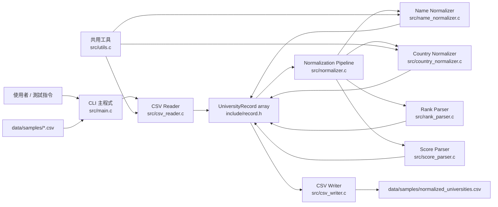
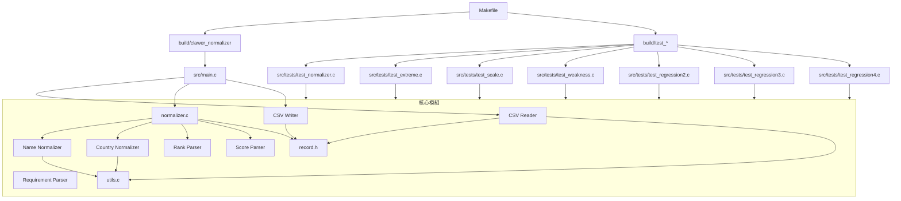
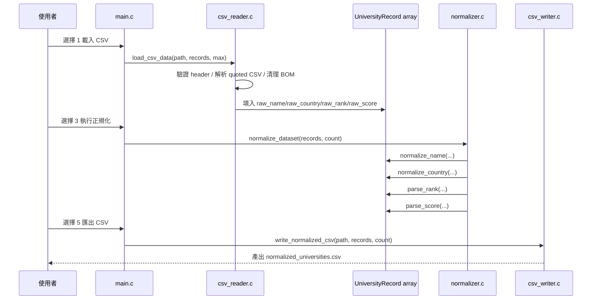
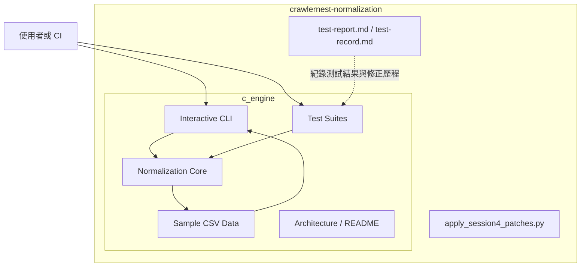

# crawlernest-normalization 系統架構圖

本文件以目前 `/Users/test/Desktop/crawlernest-normalization` 目錄中的實際程式碼為準，描述 `c_engine` 的執行入口、模組分工、資料流與測試結構。

## 1. 系統總覽



## 2. 執行與建置架構



## 3. 資料流



## 4. 核心元件說明

| 元件 | 位置 | 主要責任 |
|---|---|---|
| CLI 主程式 | `c_engine/src/main.c` | 提供互動式選單，協調載入、正規化、預覽、匯出 |
| CSV Reader | `c_engine/src/csv_reader.c` | 驗證 5 欄 header、解析 quoted CSV、處理 BOM、略過不合法列 |
| Record 模型 | `c_engine/include/record.h` | 保存 raw 與 normalized 欄位，以及 `rank_min/max`、`score` |
| Pipeline 協調器 | `c_engine/src/normalizer.c` | 逐筆呼叫名稱、國家、排名、分數解析模組 |
| Name Normalizer | `c_engine/src/name_normalizer.c` | 名稱清理、大小寫調整、縮寫保留 |
| Country Normalizer | `c_engine/src/country_normalizer.c` | 國家別名映射與標準化 |
| Rank Parser | `c_engine/src/rank_parser.c` | 解析 `Top 100`、`Rank 53`、`101-150`、`=201`、`#10`、`201+` |
| Score Parser | `c_engine/src/score_parser.c` | 從字串提取分數，失敗時回傳哨兵值 |
| CSV Writer | `c_engine/src/csv_writer.c` | 輸出標準化 CSV，必要時做 quoting / escaping |
| Utils | `c_engine/src/utils.c` | trim、collapse spaces、title case、acronym 識別等共用字串工具 |
| Test Suites | `c_engine/src/tests/*.c` | 基礎、極端、規模、弱點與回歸測試 |

## 5. 目前系統邊界



## 6. 關鍵設計觀察

- 目前專案核心是單機、檔案導向的 C 正規化引擎，沒有資料庫、Web API 或外部網路服務依賴。
- `csv_reader.c` 的輸入 schema 已是目前版本的 5 欄格式：`University, Country, Rank Min, Rank Max, Overall Score`。
- `main.c` 使用固定路徑 `data/samples/raw_universities.csv` 與 `data/samples/normalized_universities.csv`，代表 CLI 偏向示範與本地批次處理。
- 測試結構相對完整，`Makefile` 已把基礎測試、弱點測試與多輪 regression test 納入建置流程。

## 7. 目錄對照

```text
crawlernest-normalization/
├── README.md
├── test-report.md
├── test-record.md
├── apply_session4_patches.py
└── c_engine/
    ├── Makefile
    ├── include/
    │   ├── csv_reader.h
    │   ├── csv_writer.h
    │   ├── normalizer.h
    │   ├── record.h
    │   └── utils.h
    ├── src/
    │   ├── main.c
    │   ├── csv_reader.c
    │   ├── csv_writer.c
    │   ├── normalizer.c
    │   ├── name_normalizer.c
    │   ├── country_normalizer.c
    │   ├── rank_parser.c
    │   ├── score_parser.c
    │   ├── requirement_parser.c
    │   ├── utils.c
    │   └── tests/
    ├── data/samples/
    ├── build/
    └── docs/architecture.md
```
