# crawlernest-ranking-crawler

Ranking-specific crawler engine for CrawlerNest.

This module is responsible for:

- crawling ranking sources such as QS, THE, and ARWU
- handling ranking universes such as global, region, and subject
- extracting structured ranking rows
- preparing normalized ranking-ready records for downstream pipeline stages
- supporting the ranking-specific production path through normalization, staging, validation, ingest, warehouse preview, warehouse landing, and deterministic entity-resolution handoff

It should depend on `crawlernest-crawler-core/`, but it must not depend on the admission crawler engine.

`crawlernest-crawler-core/` should be treated here as a shared runtime dependency that may evolve on a different cadence, but only for reusable crawler primitives rather than ranking-specific policy.

## Current Role In The Ranking Pipeline

The ranking engine is no longer just a crawler entrypoint. It is now the front edge of a controlled ranking production workflow:

```mermaid
flowchart LR
    crawl["crawl"]
    raw["raw"]
    normalized["normalized"]
    staging["staging"]
    validate["validate"]
    ingest["ingest"]
    preview["warehouse preview"]
    landing["warehouse landing"]
    resolve["resolve"]
    report["report"]
    seed["seed"]
    refresh["refresh"]

    crawl --> raw --> normalized --> staging --> validate --> ingest --> preview --> landing --> resolve --> report --> seed --> refresh
```

Within that chain, this module owns the source-facing side:

- source crawl execution
- structured ranking record construction
- lightweight normalization handoff
- safe export into downstream pipeline stages

It does not own:

- final warehouse read models
- ranking aggregation truth
- recommendation logic
- production-facing entity-resolution policy beyond deterministic handoff boundaries

## Files

- `engine.py`: ranking engine entrypoint
- `models.py`: `RankingRecord`
- `sources/qs.py`: example QS crawler stub
- `sources/the.py`: THE crawler placeholder
- `sources/arwu.py`: ARWU crawler placeholder
- `extractors/ranking_rows.py`: lightweight row-to-model conversion helper

## Design Notes

- Ranking crawling is intentionally isolated from admission crawling.
- Raw crawler output is preserved before stronger downstream transforms.
- Database persistence is treated as a later pipeline concern, not as a crawler responsibility.
- Deterministic entity resolution and manual alias curation happen after warehouse landing, not inside crawl execution.
