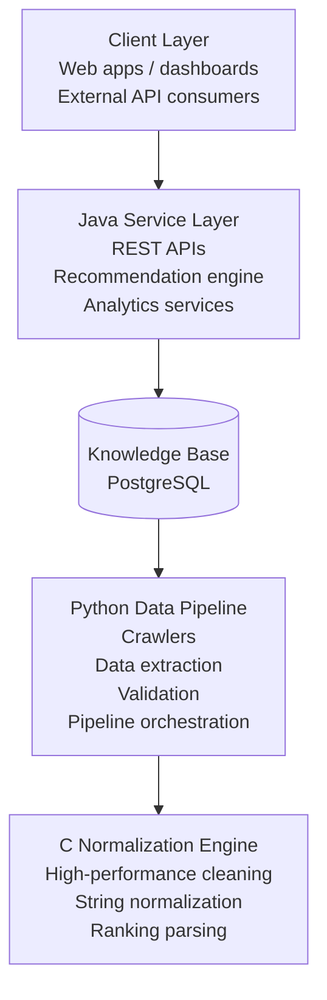
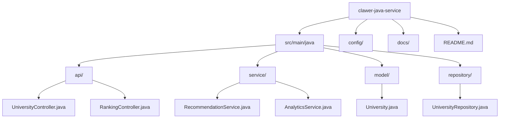

# Clawer Java Service

Java backend services for the **Clawer Education Data Platform**

---

## 🚀 How to Run

To start the Spring Boot API service:

```bash
cd crawlernest/servise_for_java
./mvnw spring-boot:run
```

The API will be available at `http://localhost:8080`.

---

# Overview

**Clawer** is a multi-layer data intelligence system designed to collect, normalize, analyze, and serve global university information such as:

- university rankings
- admission requirements
- country / region data
- subject rankings
- academic indicators

The Java module represents the **service and product backend layer** of the Clawer ecosystem.

While the core Clawer pipeline focuses on **data ingestion and processing**, this module focuses on:

- backend APIs
- analytics services
- recommendation engines
- product-level backend infrastructure

---

# Clawer System Architecture

Clawer follows a **multi-language layered architecture**, where each language is used according to its strengths.



### Language Responsibilities

| Language | Role | Layer |
|--------|------|------|
| Python | Crawling & data pipeline | Data Collection |
| C | High-performance preprocessing | Data Quality |
| Java | Backend services & APIs | Product Layer |

---

# Responsibilities of the Java Module

The Java service layer is responsible for transforming the **raw knowledge base into usable services**.

## 1 API Service

Provide structured APIs for accessing university data.

Example endpoints:

```
GET /api/v1/universities
GET /api/v1/universities/{slug}
GET /api/v1/rankings
GET /api/v1/rankings/qs
GET /api/v1/admissions/{university_slug}
GET /api/v1/recommendations
```

#### Persistence & Repositories
- **AggregatedRankingReadRepository**: Official read-only interface for product rankings.
- **JdbcAggregatedRankingReadRepository**: Spring JDBC implementation with support for complex search scoring, pagination, and multi-dimensional filtering (year, scope, region).

Possible frameworks:

- Spring Boot
- Jakarta REST
- Micronaut
- Lightweight HTTP frameworks

---

## 2 Recommendation Engine

This component recommends universities based on user preferences.

Possible input:

- target country
- subject / major
- ranking preference
- budget
- admission score range

Processing flow:

```
User Input
   ↓
Rule Filtering
   ↓
Weighted Scoring
   ↓
Candidate Ranking
   ↓
Recommendation Output
```

Example output:

```
Top Recommendations

1. University A
2. University B
3. University C
```

---

## 3 Analytics Services

The analytics layer converts raw crawler data into insights.

Examples:

- ranking aggregation
- university comparison
- trend analysis
- dataset summarization

This layer helps turn Clawer from a **data collector** into a **data intelligence system**.

---

## 4 Backend Product Infrastructure

The Java layer will eventually support:

- university search platforms
- admission planning tools
- education data dashboards
- API platforms

This makes the Clawer ecosystem capable of becoming a **complete education data platform**.

---

# Example Project Structure



---

# Why Java

Java is used for this layer because it provides:

- strong type safety
- scalable backend frameworks
- maintainable service architecture
- mature ecosystem for APIs and enterprise systems

While Python excels in **data engineering and crawling**, Java is well suited for **stable backend services and product systems**.

---

# Future Development

Planned features:

- REST API platform
- university search engine
- advanced recommendation algorithms
- analytics dashboards
- ML-assisted admission prediction

These capabilities will gradually transform Clawer from a **crawler project** into a **global education data intelligence platform**.

---

# Clawer Ecosystem

| Component | Language | Purpose |
|--------|--------|--------|
| Clawer Core | Python | Crawlers & data pipeline |
| Normalization Engine | C | High-performance data cleaning |
| Knowledge Base | SQL | structured storage |
| Java Service | Java | APIs & recommendation services |

---

# License

Same license as the main Clawer project.
