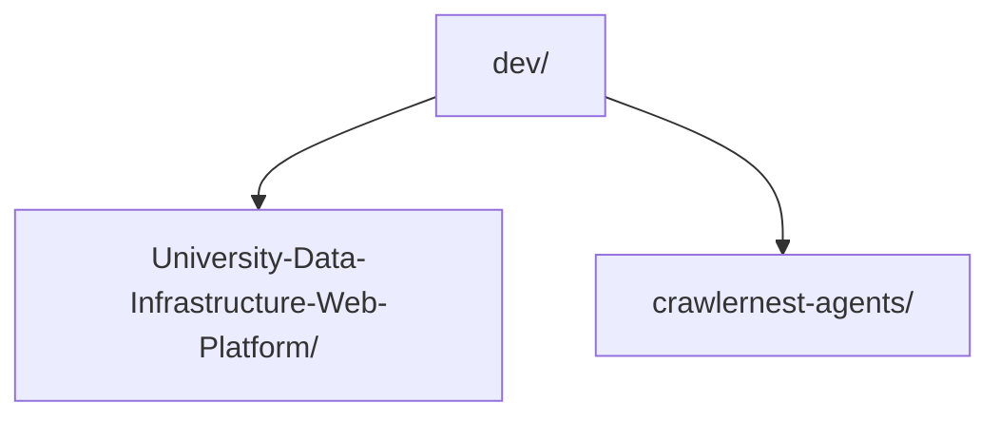

# Agents Pipeline Analysis

CrawlerNest can optionally call the sibling `crawlernest-agents` repository for
readonly pipeline log analysis.

This integration is intentionally loose. The agents repository is a development
companion, not a runtime dependency, git submodule, symlink, CI dependency, or
production truth source.

## Pipeline Analysis Flow

Expected local layout:



Run the wrapper from the main CrawlerNest repository:

```bash
./scripts/agent_pipeline_analysis.sh <log_file>
```

The wrapper:

```mermaid
flowchart TB
    locate["Locate main CrawlerNest repository"]
    repo["Check ../crawlernest-agents"]
    tool["Check generate-pipeline-analysis.py"]
    envRoot["Export CRAWLERNEST_REPO_ROOT"]
    envMode["Export CRAWLERNEST_AGENT_MODE=readonly"]
    call["Call agents pipeline analysis tool"]
    output["Write tmp/agent-analysis/pipeline-analysis-prompt.md"]

    locate --> repo --> tool --> envRoot --> envMode --> call --> output
```

You can pass a custom output file:

```bash
./scripts/agent_pipeline_analysis.sh \
  tmp/pipeline.log \
  tmp/agent-analysis/my-pipeline-analysis.md
```

## Readonly Guarantees

The wrapper does not fix code, write memory, modify pipeline configuration, edit
database state, change APIs, alter frontend code, update CI, or run smoke
scripts.

It only:

- validates the optional sibling agents repository
- passes the main repository path through `CRAWLERNEST_REPO_ROOT`
- marks the operation with `CRAWLERNEST_AGENT_MODE=readonly`
- invokes the agents analysis generator
- allows generated analysis output in explicit temporary locations

Any suggested fixes remain human-reviewed recommendations. The engineer decides
what to change, if anything.

## Allowed Outputs

Generated files are limited to:

```text
crawlernest/tmp/agent-analysis/
../crawlernest-agents/tmp/
```

The default main-repo output is:

```text
tmp/agent-analysis/pipeline-analysis-prompt.md
```

## Operational Boundaries

The analysis wrapper is outside the production data path. It must not be used as
an implicit pipeline step or CI gate.

Do not use it to:

- auto-fix code
- auto-write agent memory
- auto-modify pipeline behavior
- auto-commit changes
- create symlinks
- add git submodules
- make `crawlernest-agents` a package or runtime dependency

## Example Usage

Analyze a saved pipeline log:

```bash
./scripts/agent_pipeline_analysis.sh tmp/latest-pipeline.log
```

Analyze a log and write to a named prompt:

```bash
./scripts/agent_pipeline_analysis.sh \
  reports/daily-pipeline.log \
  tmp/agent-analysis/daily-pipeline-analysis.md
```

The debug wrapper is separate:

```bash
./scripts/agent_debug.sh
```

## Failure Handling

If `../crawlernest-agents` is missing, the wrapper prints a clear message and
exits successfully without changing source files.

If the pipeline analysis tool is missing, the wrapper exits with a failure and
prints the expected path.

If the agents analysis tool fails, the wrapper preserves the original exit code.
This makes failures visible to the caller without hiding the underlying tool
result.
