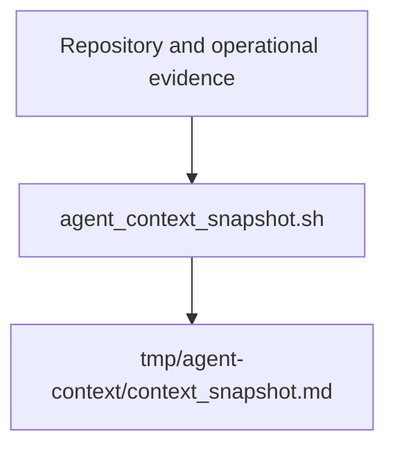
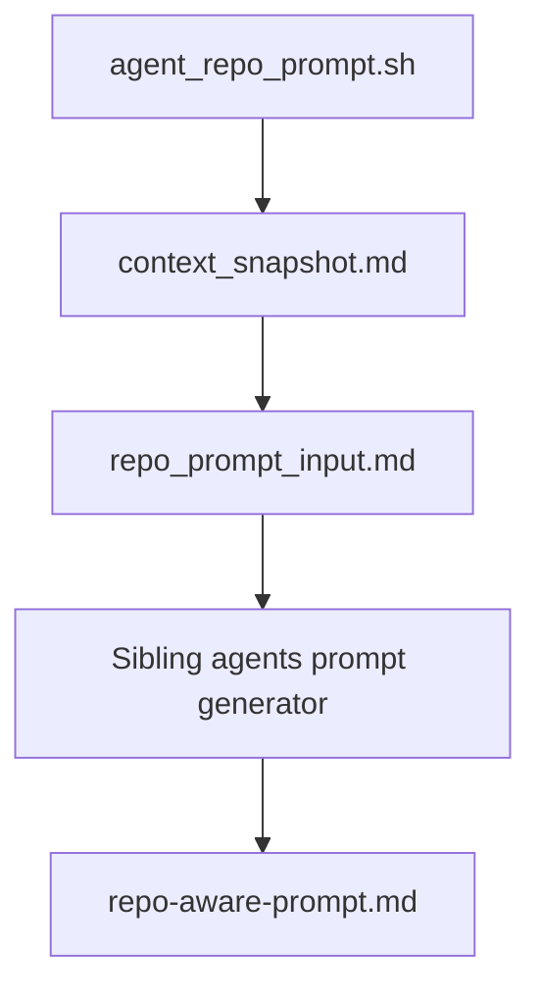

# Agent Context Flow

CrawlerNest can produce a readonly repository context snapshot for prompts sent
to the sibling `crawlernest-agents` repository.

This flow gives agents operational context without making them part of the
production runtime, CI pipeline, data pipeline, or release process.

## Context Snapshot Lifecycle

Run:

```bash
./scripts/agent_context_snapshot.sh
```



The script reads repository and operational evidence, then writes:

```text
tmp/agent-context/context_snapshot.md
```

The snapshot is temporary. It is meant to be regenerated whenever a debugging or
analysis prompt needs current repository context.

The repo-aware prompt wrapper runs the snapshot step first:

```bash
./scripts/agent_repo_prompt.sh [log_or_note_file]
```



It then creates:

```text
tmp/agent-context/repo_prompt_input.md
tmp/agent-context/repo-aware-prompt.md
```

The prompt input records the context snapshot path and embeds a bounded copy of
the current snapshot before calling the sibling agents prompt generator.

## Readonly Boundaries

The context flow is readonly with respect to source, configuration, production
data, and automation behavior.

It does not:

- fix code
- edit repository source files
- write memory
- run pipeline mutations
- change database state
- commit changes
- open pull requests
- modify CI
- create symlinks
- add git submodules
- make `crawlernest-agents` a dependency

The only main-repo writes are temporary prompt artifacts under `tmp/`.

## Operational Guarantees

The wrappers only collect and package context. They do not interpret context as
permission to act.

Allowed output directories are:

```text
tmp/agent-context/
tmp/agent-debug/
tmp/agent-analysis/
../crawlernest-agents/tmp/
```

`agent_repo_prompt.sh` rejects output paths outside those directories.

## Injected Context Sources

`agent_context_snapshot.sh` collects:

- `git status --short`
- current branch
- latest commit hash
- latest smoke summary
- latest failure summary
- latest diagnostics snapshot
- latest freshness snapshot
- latest regression summary
- latest operational summary when present
- latest operational index summary when present
- latest drift and freshness intelligence reports when present

The snapshot includes these sections:

- Repository State
- Changed Files
- Latest Smoke Results
- Latest Diagnostics
- Latest Failures
- Latest Freshness
- Latest Regression Summary

If an expected artifact does not exist, the section is marked `[missing]`
instead of failing.

## Operational Artifact Alignment

The agent context wrappers may consume generated evidence from:

- `reports/latest_failure_summary.md`
- `reports/operational_summary.md`
- `reports/operational_index_summary.md`
- `reports/drift_timeline.md`
- `reports/freshness_escalation.md`
- `snapshots/latest_status.json`
- `releases/v0.1-demo/smoke_release_output.txt`

They do not consume live runtime authority. In particular, the wrappers do not
read from PostgreSQL directly, do not call mutation endpoints, do not rerun the
pipeline, and do not treat generated reports as permission to repair anything.

The sibling `crawlernest-agents` repository remains:

- readonly from this repository's perspective
- optional
- a sibling repository, not a submodule
- a non-runtime dependency
- non-authoritative for release truth

## Failure Handling

If optional operational artifacts are missing, context generation continues and
marks them as `[missing]`.

If `../crawlernest-agents` is missing, `agent_repo_prompt.sh` prints a clear
message and exits successfully without changing source files.

If the sibling prompt generator is missing, `agent_repo_prompt.sh` exits with a
failure and prints the expected path.

If the sibling prompt generator fails, the wrapper preserves the original exit
code.

## Why No Auto-Fix Exists

The agents flow is designed for analysis, not autonomous mutation.

Operational context can identify likely failure areas, stale data, regression
coverage gaps, and changed files, but those observations still require human
judgment. CrawlerNest keeps fixes, memory updates, commits, CI changes, and
pipeline mutations outside this wrapper so the engineer remains the decision
maker.
