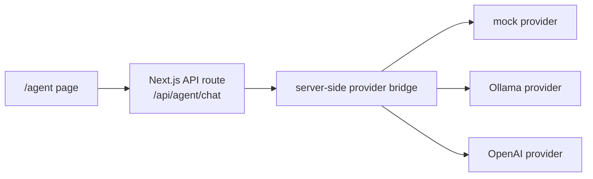

# Agent Model Integration

CrawlerNest Agent Model Integration Phase 1 adds a readonly model-provider
bridge for the `/agent` page. The integration is intentionally narrow: it lets
the page request advisory text from a configured provider without giving the
model tools, shell access, database write access, pipeline control, or repository
mutation capability.

Phase 2 adds response-quality alignment: a shared system prompt, provider prompt
consistency, minimal response-safety normalization, visible capability
boundaries, and suggested prompts.

Phase 3 adds demo readiness: prompt library, response evaluation guidance,
provider readiness matrix, fallback flow, rubric constants, and a visible demo
ready information banner on `/agent`.

## Architecture



The frontend never receives API keys. The page sends only the user message to
`/api/agent/chat`. The server-side route selects a provider based on environment
variables, calls the provider when configured, and returns a formatted advisory
response.

## Supported Providers

| Provider | `AGENT_MODEL_PROVIDER` | Notes |
| --- | --- | --- |
| Mock | `mock` | Default. No external service required. Stable for build, test, and demo. |
| Ollama | `ollama` | Local model service. Uses native Ollama `/api/chat`. |
| OpenAI | `openai` | Server-side only. Requires `OPENAI_API_KEY` and `AGENT_MODEL_NAME`. |

## Environment Variables

| Variable | Required | Used by | Notes |
| --- | --- | --- | --- |
| `AGENT_MODEL_PROVIDER` | No | all | Defaults to `mock`. Valid values: `mock`, `ollama`, `openai`. |
| `AGENT_MODEL_NAME` | Yes for Ollama/OpenAI | ollama/openai | Example: `qwen2.5-coder:7b`, `llama3.1`, or an OpenAI model configured by the operator. |
| `AGENT_MODEL_BASE_URL` | Optional | ollama/openai | Overrides provider base URL. |
| `OLLAMA_BASE_URL` | Optional | ollama | Defaults to `http://localhost:11434` when Ollama is selected. |
| `OPENAI_API_KEY` | Yes for OpenAI | openai | Read only on the server. Never forwarded to the browser. |

## Readonly Guarantees

Phase 1 chat integration:

- Does not execute tools.
- no tool calling
- Does not run shell commands.
- no shell execution
- Does not write to PostgreSQL.
- no DB writes
- Does not rerun crawlers, ingestion, aggregation, ranking, diagnostics, or recommendation pipelines.
- no pipeline execution
- Does not edit repository files.
- no repo mutation
- Does not write long-term memory.
- Does not create commits, branches, PRs, or autonomous tasks.
- no autonomous behavior

The route returns metadata fields such as `toolsExecuted=false`, `dbWrites=false`,
and `pipelineRuns=false` to make the boundary visible in debug output.

## Shared Prompt Boundary

All providers use the same server-side system prompt. The prompt defines
CrawlerNest as an explainable university intelligence platform and limits the
agent to:

- query suggestions;
- page navigation;
- ranking, recommendation, analytics, and diagnostics interpretation;
- caveat summaries;
- debugging direction for a human maintainer.

The prompt tells the agent not to claim it modified code, edited the repository,
ran shell commands, reran pipelines, changed rankings, changed recommendations,
wrote the database, or updated diagnostics. It also requires concise, technical,
honest replies and disclosure of relevant data limits, stale data, source gaps,
and caveats.

## Response Normalization

Provider output passes through a small conservative normalization step before it
is returned to the page. The normalization is not a broad moderation framework.
It only rewrites unsafe first-person action claims into advisory wording.

Examples:

| Unsafe wording | Normalized wording |
| --- | --- |
| `I changed the code` | `I can suggest how to change the code` |
| `I ran the pipeline` | `You can run the pipeline` |
| `I updated the database` | `I can explain how a maintainer can update the database` |

This keeps provider responses aligned with the readonly boundary even when a
model phrases an answer too assertively.

## Capability Boundaries

The `/agent` page displays a capability card.

Agent can:

- explain rankings;
- explain recommendations;
- guide users to `/analytics`, `/rankings`, `/recommendations`, and
  `/system-status`;
- summarize caveats;
- suggest debugging steps.

Agent cannot:

- modify code;
- run shell commands;
- write database;
- rerun pipeline;
- change recommendations.

## Suggested Prompts

The page includes suggested prompt buttons that fill the input without executing
tools:

- Explain why source disagreement matters
- What does stale data mean in CrawlerNest?
- How should I interpret recommendation confidence?
- Where can I view analytics caveats?
- How do I debug missing ranking data?

## Demo Readiness

Demo readiness docs:

- [AGENT_DEMO_PROMPTS.md](AGENT_DEMO_PROMPTS.md): core competition prompts,
  expected themes, caveats, and judge learning goals.
- [AGENT_DEMO_EVALUATION.md](AGENT_DEMO_EVALUATION.md): good/bad answer
  criteria and demo evaluation checks.
- [AGENT_PROVIDER_MATRIX.md](AGENT_PROVIDER_MATRIX.md): mock, Ollama, and
  OpenAI readiness comparison.
- [AGENT_DEMO_FALLBACK.md](AGENT_DEMO_FALLBACK.md): presenter-safe fallback
  flow for unavailable, timed out, missing-key, and misconfigured providers.

The `/agent` page includes a "Demo Ready Information" banner that shows the
current provider, readonly status, no-tool-calling status, advisory-only
boundary, and intended use.

## Provider Recommendations

Competition default should be mock or Ollama:

- `mock` is the safest default because it is repeatable, free, and independent
  of internet access.
- `ollama` is suitable when the local model is already pulled and verified.
- `openai` can provide richer responses, but should not be the only demo path
  because it depends on internet access, API key configuration, quota, and model
  availability.

Before a demo, run the validation script:

```bash
python3 scripts/validate_agent_demo_readiness.py
```

## Mock Provider Behavior

The mock provider is the default and works without environment variables. It:

- echoes the user's intent in a stable response;
- states that the answer is advisory only;
- follows the same shared prompt boundary as model providers;
- suggests related CrawlerNest pages: `/analytics`, `/rankings`,
  `/recommendations`, and `/system-status`;
- avoids any external network request.

This keeps demos and CI builds reproducible even when no model service is
available.

## Local Ollama Setup

Example:

```bash
export AGENT_MODEL_PROVIDER=ollama
export OLLAMA_BASE_URL=http://localhost:11434
export AGENT_MODEL_NAME=qwen2.5-coder:7b
npm run dev
```

The route calls Ollama with a timeout. If Ollama is not running or the model is
missing, the page receives a safe provider-unavailable message rather than a raw
stack trace.

## OpenAI Setup

Example:

```bash
export AGENT_MODEL_PROVIDER=openai
export AGENT_MODEL_NAME=<operator-selected-model>
export OPENAI_API_KEY=<server-side-key>
npm run dev
```

`OPENAI_API_KEY` must be set only in the server environment. Do not use
`NEXT_PUBLIC_` for model keys. The key is never returned by `/api/agent/chat` or
included in frontend code.

## Fallback Behavior

| Condition | Behavior |
| --- | --- |
| Missing provider env | Uses mock provider. |
| Missing OpenAI key | Returns safe provider-unavailable error. |
| Missing Ollama model name | Returns safe provider-unavailable error. |
| Invalid provider name | Returns safe provider-unavailable error. |
| Provider timeout | Returns safe provider-unavailable error. |
| Provider malformed response | Returns safe provider-unavailable error. |
| Message too long | Rejects before any provider call. |

Raw provider errors and stack traces are intentionally not shown to the browser.
See [AGENT_DEMO_FALLBACK.md](AGENT_DEMO_FALLBACK.md) for presenter wording and
fallback commands.

## Non-Goals

Phase 1 explicitly does not support:

- streaming responses;
- tool calling or function calling;
- file upload;
- auto-fix behavior;
- shell execution;
- database writes;
- pipeline runs;
- recommendation mutation;
- ranking, aggregation, diagnostics, or explainability behavior changes;
- repository mutation;
- autonomous PRs;
- autonomous agent loops;
- auth-gated agent access;
- production model deployment.

## Why No Tool Execution Yet

The current integration is about safe model connectivity and response quality,
not autonomy. Tool execution would require a separate permission model, audit
trail, policy layer, rollback plan, and validation boundary. Keeping the agent
advisory-only preserves release confidence while still allowing maintainers to
test mock, local, and hosted model providers.
