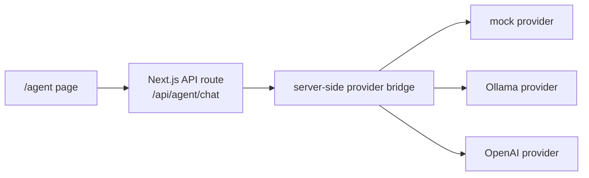

# Agent Model Integration

CrawlerNest Agent Model Integration Phase 1 adds a readonly model-provider
bridge for the `/agent` page. The integration is intentionally narrow: it lets
the page request advisory text from a configured provider without giving the
model tools, shell access, database write access, pipeline control, or repository
mutation capability.

## Architecture



The frontend never receives API keys. The page sends only the user message to
`/api/agent/chat`. The server-side route selects a provider based on environment
variables, calls the provider when configured, and returns a formatted advisory
response.

## Supported Providers

| Provider | `AGENT_MODEL_PROVIDER` | Notes |
| --- | --- | --- |
| Mock | `mock` | Default. No external service required. Stable for build, test, and demo. |
| Ollama | `ollama` | Local model service. Uses native Ollama `/api/chat`. |
| OpenAI | `openai` | Server-side only. Requires `OPENAI_API_KEY` and `AGENT_MODEL_NAME`. |

## Environment Variables

| Variable | Required | Used by | Notes |
| --- | --- | --- | --- |
| `AGENT_MODEL_PROVIDER` | No | all | Defaults to `mock`. Valid values: `mock`, `ollama`, `openai`. |
| `AGENT_MODEL_NAME` | Yes for Ollama/OpenAI | ollama/openai | Example: `qwen2.5-coder:7b`, `llama3.1`, or an OpenAI model configured by the operator. |
| `AGENT_MODEL_BASE_URL` | Optional | ollama/openai | Overrides provider base URL. |
| `OLLAMA_BASE_URL` | Optional | ollama | Defaults to `http://localhost:11434` when Ollama is selected. |
| `OPENAI_API_KEY` | Yes for OpenAI | openai | Read only on the server. Never forwarded to the browser. |

## Readonly Guarantees

Phase 1 chat integration:

- Does not execute tools.
- Does not run shell commands.
- Does not write to PostgreSQL.
- Does not rerun crawlers, ingestion, aggregation, ranking, diagnostics, or recommendation pipelines.
- Does not edit repository files.
- Does not write long-term memory.
- Does not create commits, branches, PRs, or autonomous tasks.

The route returns metadata fields such as `toolsExecuted=false`, `dbWrites=false`,
and `pipelineRuns=false` to make the boundary visible in debug output.

## Mock Provider Behavior

The mock provider is the default and works without environment variables. It:

- echoes the user's intent in a stable response;
- states that the answer is advisory only;
- suggests related CrawlerNest pages: `/analytics`, `/rankings`,
  `/recommendations`, and `/system-status`;
- avoids any external network request.

This keeps demos and CI builds reproducible even when no model service is
available.

## Local Ollama Setup

Example:

```bash
export AGENT_MODEL_PROVIDER=ollama
export OLLAMA_BASE_URL=http://localhost:11434
export AGENT_MODEL_NAME=qwen2.5-coder:7b
npm run dev
```

The route calls Ollama with a timeout. If Ollama is not running or the model is
missing, the page receives a safe provider-unavailable message rather than a raw
stack trace.

## OpenAI Setup

Example:

```bash
export AGENT_MODEL_PROVIDER=openai
export AGENT_MODEL_NAME=<operator-selected-model>
export OPENAI_API_KEY=<server-side-key>
npm run dev
```

`OPENAI_API_KEY` must be set only in the server environment. Do not use
`NEXT_PUBLIC_` for model keys. The key is never returned by `/api/agent/chat` or
included in frontend code.

## Fallback Behavior

| Condition | Behavior |
| --- | --- |
| Missing provider env | Uses mock provider. |
| Missing OpenAI key | Returns safe provider-unavailable error. |
| Missing Ollama model name | Returns safe provider-unavailable error. |
| Invalid provider name | Returns safe provider-unavailable error. |
| Provider timeout | Returns safe provider-unavailable error. |
| Provider malformed response | Returns safe provider-unavailable error. |
| Message too long | Rejects before any provider call. |

Raw provider errors and stack traces are intentionally not shown to the browser.

## Non-Goals

Phase 1 explicitly does not support:

- streaming responses;
- tool calling or function calling;
- file upload;
- auto-fix behavior;
- shell execution;
- database writes;
- pipeline runs;
- recommendation mutation;
- ranking, aggregation, diagnostics, or explainability behavior changes;
- repository mutation;
- autonomous PRs;
- autonomous agent loops;
- auth-gated agent access;
- production model deployment.

## Why No Tool Execution Yet

The first integration step is about safe model connectivity, not autonomy. Tool
execution would require a separate permission model, audit trail, policy layer,
rollback plan, and validation boundary. Keeping Phase 1 advisory-only preserves
release confidence while still allowing maintainers to test mock, local, and
hosted model providers.
