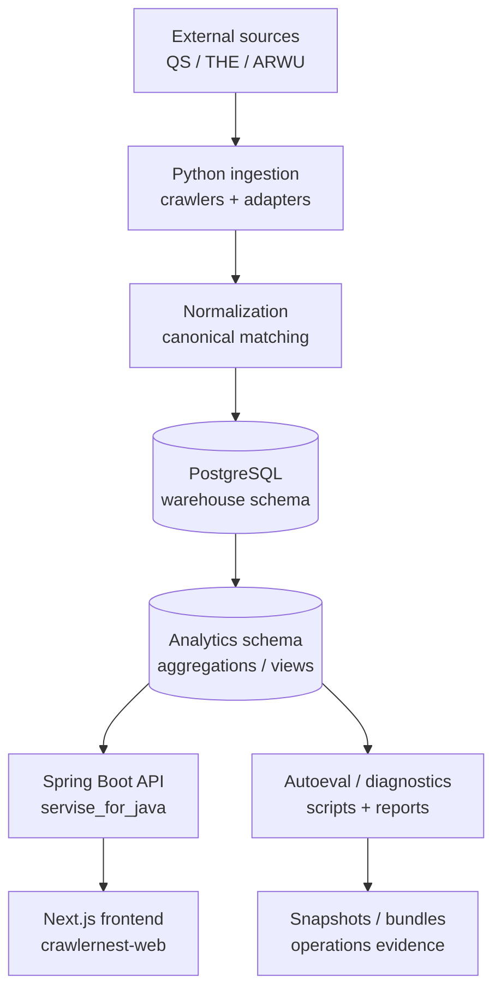
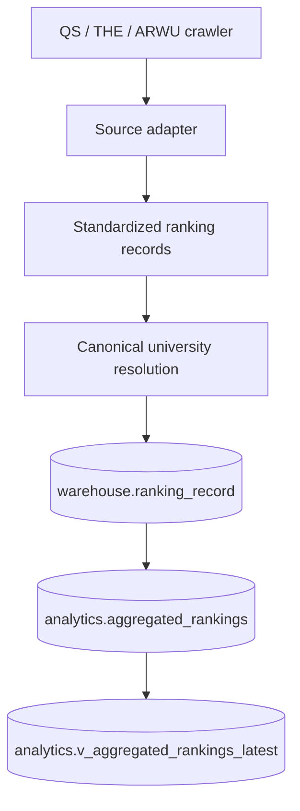
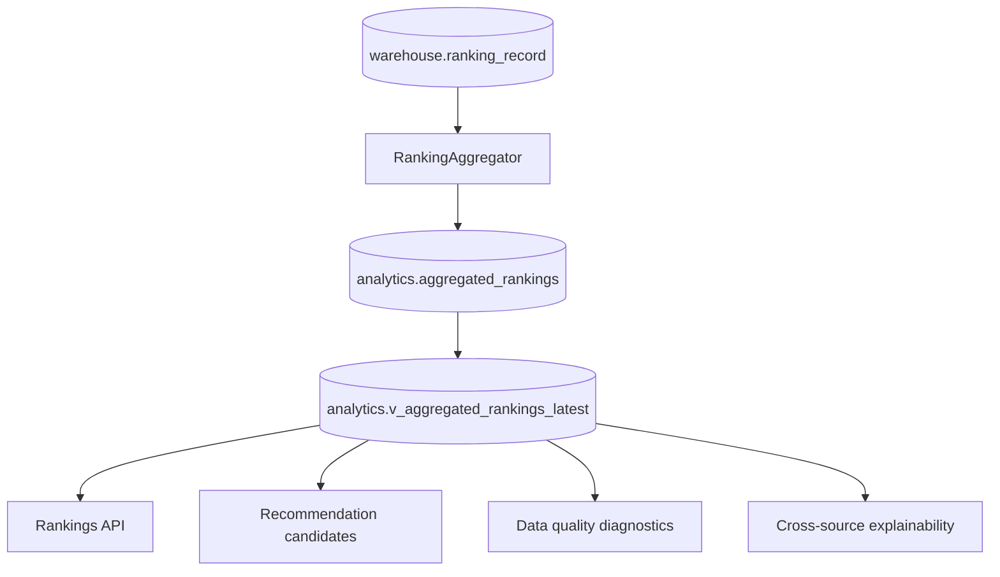
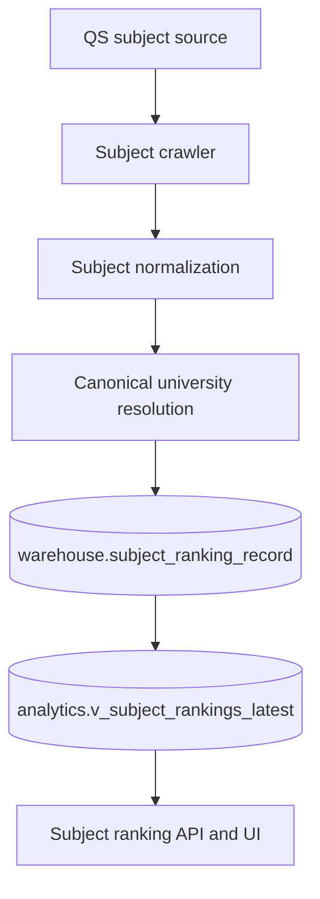
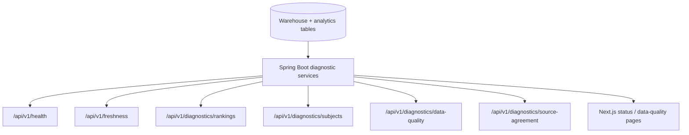
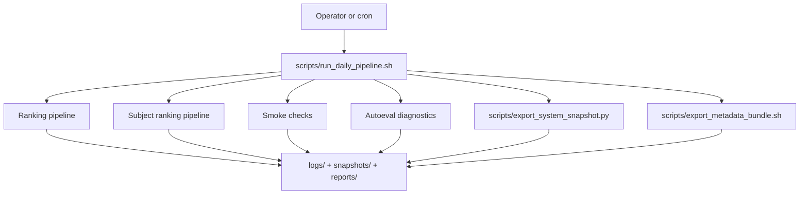
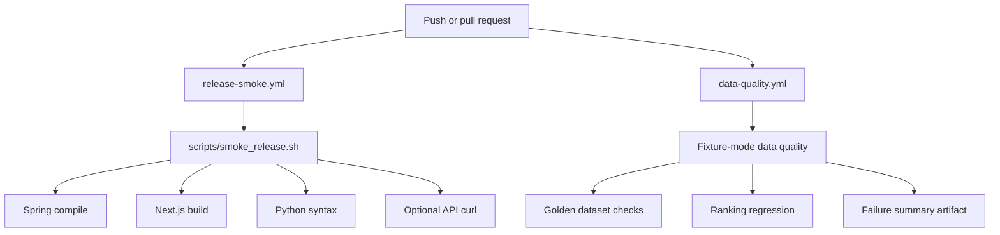
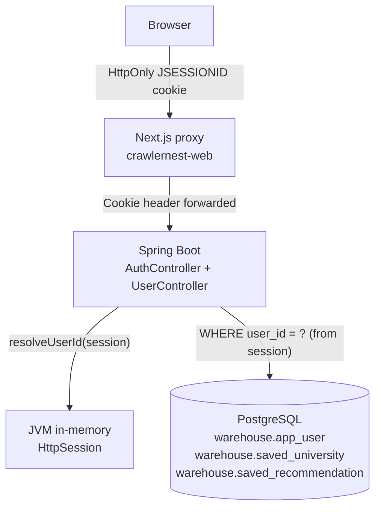

# CrawlerNest Architecture Overview

This document maps the current CrawlerNest system as implemented in the repository. It focuses on how ranking data moves from crawlers into PostgreSQL, how analytics views feed APIs, and how operations and CI keep the platform observable.

## High-Level Architecture

Core runtime split:

- Python owns crawling, normalization, canonical resolution, ingestion, aggregation writes, snapshots, and operational scripts.
- PostgreSQL owns durable warehouse records and analytics views.
- Spring Boot owns product API reads and operational API diagnostics.
- Next.js owns the web UI and server-side proxy routes.
- GitHub Actions and scripts own repeatable verification.

## Ingestion Pipeline

Main code paths:

- `crawlernest/run_pipeline.py`
- `crawlernest/crawlernest-core/multi_source/`
- `crawlernest/crawlernest-core/ranking_aggregation/`
- `crawlernest/db/analytics_bridge.py`
- `crawlernest/servise_for_java/src/main/java/clawer/api/RankingController.java`

The aggregation formula is owned by the ranking aggregation layer. API explainability reads existing stored aggregation output and does not recalculate or change ranking scores.

## Analytics Flow

Important analytics fields include:

- `display_rank`
- `composite_score`
- `coverage_ratio`
- `source_ranks_json`
- `source_normalized_scores_json`
- `source_weights_used_json`
- `aggregation_method_version`

These support rankings, confidence visibility, source comparison, and explainability without modifying the aggregation output.

## Subject Ranking Flow

Subject rankings are a parallel read path. They do not feed the global ranking aggregation formula.

Key entry points:

- `python3 -m crawlernest.run_pipeline run-qs-subject`
- `crawlernest/servise_for_java/src/main/java/clawer/api/SubjectRankingController.java`
- `crawlernest/crawlernest-web/src/app/subject-rankings/page.tsx`

## Diagnostics Flow

Diagnostics cover:

- PostgreSQL connectivity and counts
- freshness and stale source detection
- ranking and subject API readiness
- unresolved canonical entities
- source drift and low-confidence matches
- source agreement, overlap, and disagreement outliers

## Operational Automation Flow

The operational scripts create evidence that can be inspected without rerunning the full system:

- `snapshots/latest_status.json`
- `snapshots/system_snapshot_*.json`
- `reports/`
- `logs/daily_pipeline_*.log`

## CI/CD Flow

CI is intentionally split:

- Release smoke confirms the platform can compile/build and that Python entry points are syntactically valid.
- Data quality CI runs fixture-mode checks without requiring a live database.

## Minimal Identity Layer

CrawlerNest includes a minimal in-process session-based identity and user-owned persistence layer. It is deliberately thin and scoped for local development use.

### Session Model

- **Engine:** Servlet container `HttpSession`. No Redis, no JWT, no distributed session infrastructure.
- **Cookie:** `JSESSIONID` set as `HttpOnly=true`, `SameSite=Lax`. The `Secure` flag is absent — localhost HTTP assumption only.
- **Timeout:** 30 minutes of inactivity (sliding).
- **Restart behavior:** Backend restart terminates all active sessions; users must re-authenticate.
- **Session content:** Only `user_id` (Long). Email and other fields are not kept in session state.

### User-Owned Persistence

| Table | Schema | Purpose |
|---|---|---|
| `app_user` | `warehouse` | Accounts: `id`, `email`, `password_hash` (BCrypt), `created_at` |
| `saved_university` | `warehouse` | Per-user saved ranking entries with `canonical_university_id` FK |
| `saved_recommendation` | `warehouse` | Per-user recommendation snapshots: `title`, `request_json` (JSONB), `result_json` (JSONB) |

Tables are created idempotently on `ApplicationReadyEvent` via `AuthSchemaInitializer` (`CREATE TABLE IF NOT EXISTS`).

### Current Auth Boundaries

This layer **provides:**
- Account registration with BCrypt password hashing.
- HttpOnly session cookies with session-fixation prevention.
- Session-gated access to all user-owned API endpoints.
- User-isolation enforcement: all data queries include `WHERE user_id = ?` from the session only.
- 404 (not 403) for cross-user record access, to avoid confirming record existence.

This layer **does not provide** (explicit non-goals for the current scope):
- No RBAC or role management.
- No OAuth or third-party identity providers.
- No JWT or token-based authentication.
- No frontend route protection (pages render; data requests are gated at the API layer).
- No distributed session infrastructure.
- No rate limiting, account lockout, or multi-factor authentication.
- No admin tooling or user management surface.

See [AUTH_LIMITATIONS.md](AUTH_LIMITATIONS.md) for the full non-goals list and scaling risks.

---

## Companion Components

### crawlernest-agents

`crawlernest-agents/` is a repo-native AI dev agent collection (not a runtime
dependency). It provides readonly development analysis agents — debug, pipeline,
and code-review roles — and shell scripts that wrap them. No agent writes to the
database, calls the API, or modifies source files. Output artifacts are written to
`tmp/` directories only.

### Clawer-C-Data-Normalization-Engine

A standalone C-language CSV normalization engine that standardizes heterogeneous
crawler output (university names, country abbreviations, rank-range strings) into
comparable numeric records. It operates independently on CSV files and is not
called by the Python pipeline, Spring Boot API, or Next.js frontend at runtime.
It is a research deliverable documenting the normalization problem formulation.

---

## Related Documents

- [Repository Map](REPOSITORY_MAP.md)
- [Data Flow](DATA_FLOW.md)
- [Operational Runbook](operational/OPERATIONAL_RUNBOOK.md)
- [API Surface](API_SURFACE.md)
- [CI Pipelines](release/CI_PIPELINES.md)
