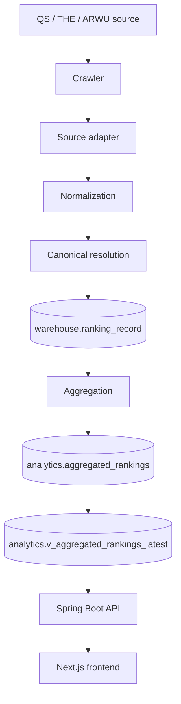
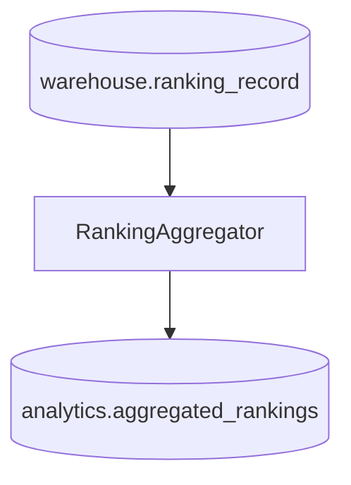
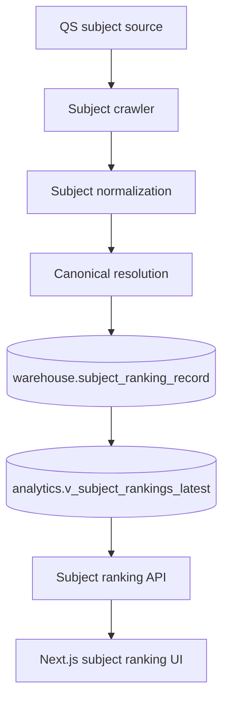
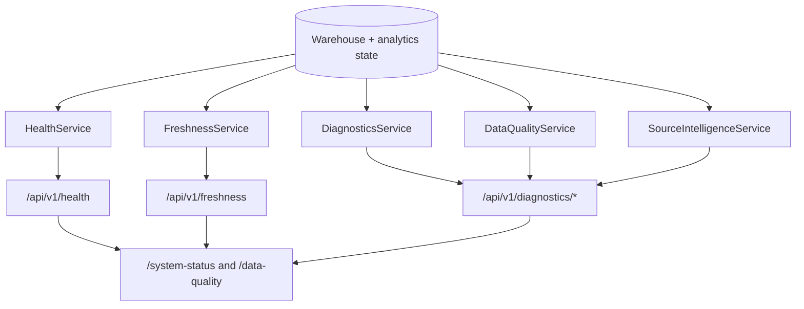
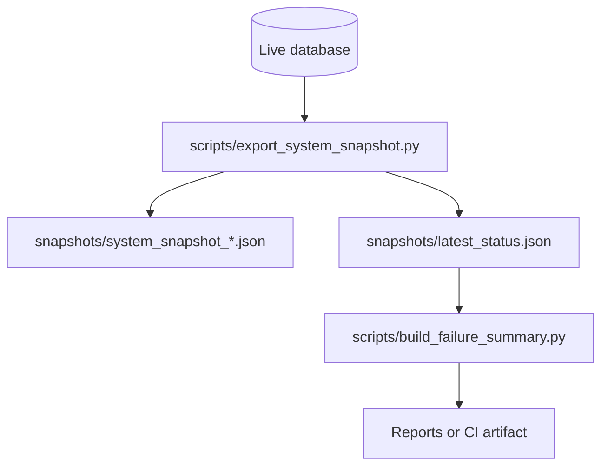
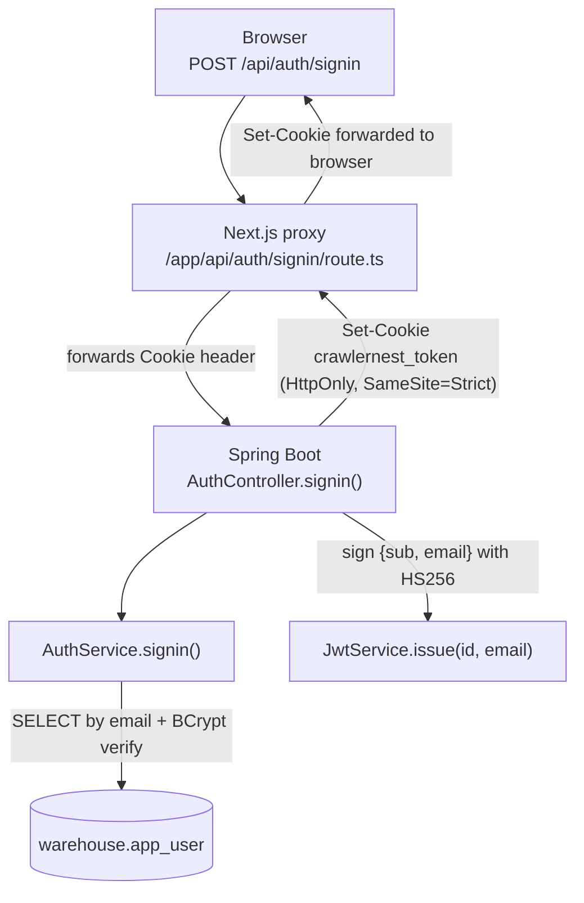
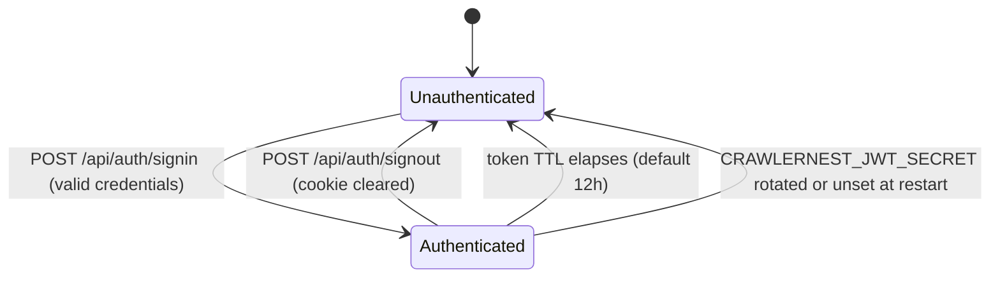
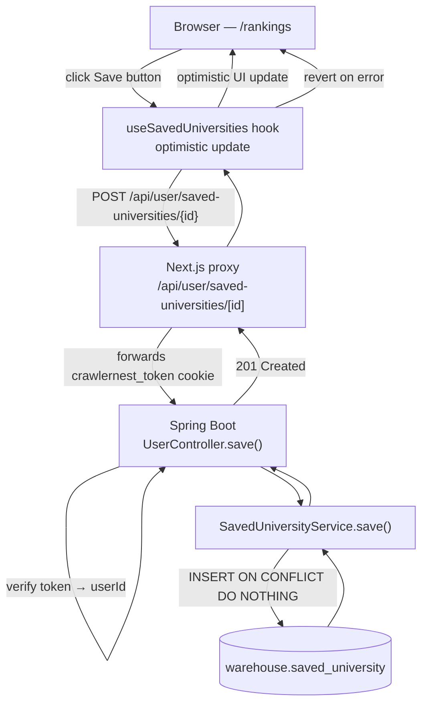
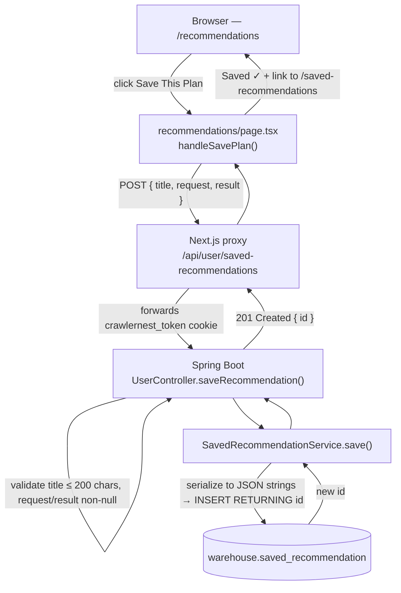

# CrawlerNest Data Flow

This document traces global ranking and subject ranking data from source acquisition to frontend rendering.

## Global Ranking Flow



### 1. Source Acquisition

Ranking acquisition starts with source-specific crawlers and adapters.

- QS global and universe crawls are handled by the ranking crawler and `run` command.
- THE world ranking ingestion is available through `run-the-rankings`.
- ARWU ingestion support is available through `run-arwu-rankings` when source data exists.

Main entry points:

- `crawlernest/run_pipeline.py`
- `crawlernest_ranking_crawler/sources/qs.py`
- `crawlernest/crawlernest-core/multi_source/adapters/qs_adapter.py`
- `crawlernest/crawlernest-core/multi_source/adapters/the_adapter.py`
- `crawlernest/crawlernest-core/multi_source/adapters/arwu_adapter.py`

### 2. Normalization

Raw source rows are normalized into stable records before persistence. Normalization standardizes names, ranks, years, source identifiers, countries, and source-specific metadata.

Relevant paths:

- `crawlernest/pipeline/utils/normalization.py`
- `crawlernest/crawlernest-core/multi_source/types.py`
- `crawlernest/crawlernest-core/multi_source/integrator.py`

### 3. Canonical Resolution

Canonical resolution connects source university names to `warehouse.canonical_university` records. This keeps ranking, admission, subject, and recommendation data on the same canonical identity.

Resolution outputs and diagnostics can include:

- canonical links
- source mappings
- university aliases
- missing entity logs
- low-confidence matches

Relevant paths:

- `crawlernest/crawlernest-core/entity_resolution/`
- `crawlernest_ranking_crawler/entity_resolver.py`
- `crawlernest_admission_crawler/entity_resolver.py`

### 4. Ranking Records

Resolved ranking rows are written into:

```text
warehouse.ranking_record
warehouse.ranking_source
```

These tables preserve source-level evidence. They are the input evidence for aggregation, source comparison, and explainability.

### 5. Aggregation

Aggregation reads source ranking records and writes stored outputs.



Stored aggregation output includes:

- source ranks
- normalized scores
- weights used
- composite score
- display rank
- coverage ratio
- aggregation method version

The explainability API reads these stored fields. It does not change the formula.

### 6. Analytics Views

The product read path uses:

```text
analytics.v_aggregated_rankings_latest
```

This view selects latest aggregated ranking rows by canonical university, year, universe, and method. It feeds rankings, recommendations, diagnostics, and source intelligence.

### 7. API

Spring Boot reads from warehouse and analytics tables.

Primary global ranking endpoints:

- `GET /api/v1/rankings`
- `GET /api/v1/rankings/{source}`
- `GET /api/v1/rankings/{id}/explain`
- `GET /api/v1/universities/{id}/source-comparison`

### 8. Frontend

Next.js renders pages and proxies API calls.

Global ranking UI paths:

- `/rankings`
- `/universities/[slug]`
- `/universities/[slug]/sources`
- `/data-quality`
- `/system-status`

## Subject Ranking Flow



Subject rankings are intentionally separate from global aggregation. They provide discipline-specific evidence without modifying global composite ranks.

Important paths:

- `crawlernest_ranking_crawler/subjects/`
- `crawlernest/scripts/smoke_subject_rankings.py`
- `crawlernest/servise_for_java/src/main/java/clawer/api/SubjectRankingController.java`
- `crawlernest/crawlernest-web/src/app/subject-rankings/page.tsx`

## Diagnostics Data Flow



Diagnostics use the same database state as product reads, which keeps operational signals aligned with user-visible data.

## Snapshot and Report Flow



Snapshots are useful for handoff, CI summaries, and incident analysis when live services are not available.

## Identity and User Data Flows

### Signin Flow



1. Browser `POST`s `{ email, password }` to the Next.js proxy (`/api/auth/signin`).
2. Proxy forwards the request — including any existing `Cookie` header — to Spring Boot.
3. `AuthService` queries `warehouse.app_user` by email and verifies the BCrypt hash.
4. On success: `JwtService` signs a token carrying the user id and email. Nothing is written server-side, so there is no session to fixate on.
5. Spring Boot includes `Set-Cookie: crawlernest_token=...` in the response. The proxy forwards this header back to the browser unchanged.
6. The browser stores the cookie and sends it automatically on subsequent requests to `localhost:3000`.

### Token Lifecycle



- No state is held anywhere: every request is authenticated by verifying the signature again.
- The TTL is fixed at issue, not sliding; there is no silent renewal.
- Signout clears the browser's copy. A token already copied elsewhere stays valid until it expires — rotating the secret is the only way to invalidate outstanding tokens.
- A restart signs everyone out only when the secret is unconfigured (an ephemeral per-process key).

### Save University Flow



- Optimistic update is applied immediately. If the API call fails, the hook reverts the UI.
- Duplicate saves are no-ops at the DB level.

### Save Recommendation Flow



- `title` is validated (non-blank, ≤ 200 chars) at the controller before the service is called.
- Both `request` (recommendation inputs) and `result` (full API response) are serialized and stored as JSONB.
- The UI transitions to a "Saved ✓" state with a link to `/saved-recommendations` on success.

---

## Related Documents

- [Architecture Overview](ARCHITECTURE_OVERVIEW.md)
- [Repository Map](REPOSITORY_MAP.md)
- [Operational Runbook](operational/OPERATIONAL_RUNBOOK.md)
- [API Surface](API_SURFACE.md)
