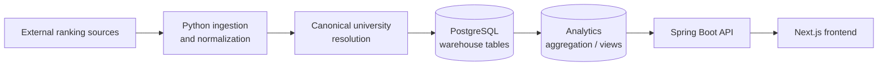

# Project State Review

This review captures the current CrawlerNest system state as of the latest
repository snapshot. It is an inventory and risk assessment only. It does not
change runtime behavior, aggregation, scoring, schema, recommendation logic,
frontend behavior, or agent wrappers.

## Executive Summary

CrawlerNest is a data-first university intelligence platform. Its core shape is:

The system has moved beyond a simple prototype. It now has multi-source ranking
ingestion paths, deterministic aggregation storage, subject ranking support,
diagnostics endpoints, explainability surfaces, recommendation reads, CI smoke
checks, operational snapshots, failure summaries, artifact cleanup, environment
verification, and readonly companion-agent workflows.

Current maturity: **operational MVP** with early-stage platform foundations. It
is usable for local development, demos, evidence-driven iteration, and
repeatable operational checks. It is not yet production-ready because upstream
source fragility, partial source coverage, local-only operational assumptions,
limited fixture coverage, and manual recovery paths remain material risks.

Primary risks at this stage:

- QS/THE/ARWU source availability and markup drift can degrade ingestion.
- Local PostgreSQL and Python environment setup still carry significant friction.
- THE and ARWU coverage is less mature than QS coverage.
- Some historical modules and naming inconsistencies make ownership harder to
  infer.
- Operational checks are improving, but recovery remains mostly manual.
- Snapshot/report retention exists, but artifact volume and CI runtime will need
  stronger policy as data grows.

## Repository Inventory

### `crawlernest/`

Main Python project root. It contains pipeline orchestration, core services,
schemas, crawlers, autoeval, knowledge-base artifacts, legacy modules, and
several agent-related experimental packages.

Important current responsibilities:

- pipeline entrypoint: `crawlernest/run_pipeline.py`
- canonical resolution and multi-source integration
- ranking aggregation writes
- subject ranking ingestion
- operational scripts used by snapshots and reports
- Python service/repository layers used by API and diagnostics

Risk: the directory contains both current production-facing modules and older or
experimental packages. This increases onboarding cost and makes ownership
boundaries more important.

### `crawlernest/crawlernest-web/`

Next.js frontend. It owns product UI pages and proxy routes for ranking,
subject-ranking, diagnostics, data-quality, system-status, and explainability
surfaces.

Maturity: MVP product layer. It can render current analytics-backed data, but it
depends on correct API readiness and local Node version alignment.

### `crawlernest/servise_for_java/`

Spring Boot API service. It owns the primary product API reads, diagnostics
endpoints, freshness, subject rankings, and explainability endpoints.

Note: the directory name `servise_for_java` is a persistent naming inconsistency.
It is acceptable short-term because scripts and docs reference it, but it is a
medium-term maintainability debt.

### `crawlernest/crawlernest-autoeval/`

Evaluation and diagnostics harness. It includes ranking regression, canonical
diagnostics, source drift, extractor evaluation, and subject evaluation runners.

Maturity: useful for local and CI evidence, but fixture coverage is still a
subset of real operational states.

### `../crawlernest-agents`

Sibling development companion repository. It provides prompt generation,
operational heuristics, memory context, debug roles, and pipeline analysis
workflows.

Boundary: it is not a dependency, symlink, submodule, runtime service, CI gate,
or production truth source. Main repo wrappers call it optionally and readonly.

### `scripts/`

Operational entrypoints and verification tools:

- local startup and smoke checks
- daily pipeline automation
- release smoke checks
- snapshot and metadata exports
- failure summaries
- cleanup retention
- environment verification
- pipeline health diagnostics
- readonly agent wrappers

Maturity: strong for an operational MVP. Risk remains around duplicated helper
concepts and local-environment assumptions.

### Diagnostics

Diagnostics exist in three layers:

- Spring Boot endpoints: health, freshness, ranking diagnostics, subject
  diagnostics, data quality, source agreement
- Python autoeval runners: ranking regression, source drift, canonical
  diagnostics, subject evaluation
- operational scripts: snapshots, failure summaries, pipeline health model

Maturity: good observability foundation. The next need is clearer alerting and
trend comparison across snapshots.

### `snapshots/`

Generated operational state. Current examples include `latest_status.json` and
timestamped `system_snapshot_*.json` files.

Maturity: useful manual evidence. Risk is retention growth and stale snapshot
interpretation if operators do not check timestamps.

### `reports/`

Generated human-readable and machine-readable evidence. Current examples include
`latest_failure_summary.md`.

Maturity: useful for triage and handoff. Needs stronger conventions as report
types multiply.

### `backups/`

Generated backup bundles such as metadata archives.

Maturity: early operational support. Backup/restore verification is not yet a
fully exercised production recovery workflow.

## Capability Matrix

| Capability | Status | Maturity | Operational Risk | Owner Layer | Production Criticality |
| --- | --- | --- | --- | --- | --- |
| Ingestion | QS plus partial THE/ARWU | MVP | High | Python pipeline | Critical |
| Normalization | Source-specific processing | MVP | High | Python crawler/core | Critical |
| Aggregation | Stored analytics output | Operational MVP | Medium | Python core + PostgreSQL | Critical |
| Subject rankings | QS subject read path | MVP | Medium | Pipeline + API + UI | High |
| Diagnostics | API, autoeval, scripts | Operational MVP | Medium | API + scripts | High |
| Explainability | Stored evidence reads | MVP | Medium | API + frontend | Medium |
| Recommendation | Aggregation candidate reads | MVP | Medium | Python core + API | Medium |
| CI/CD | Smoke plus fixture checks | Operational MVP | Medium | GitHub Actions + scripts | High |
| Operational automation | Pipeline, snapshots, cleanup | Operational MVP | Medium | Scripts + docs | High |
| Readonly agent workflows | Optional sibling wrappers | Early support | Low | Scripts + sibling repo | Low |

Risk notes:

- Ingestion and normalization risk is high because upstream source shape can
  change without notice.
- Aggregation, diagnostics, recommendation, CI/CD, and operational automation
  risk is medium because each depends on local data freshness, fixture realism,
  and PostgreSQL availability.
- Readonly agent workflow risk is low while the sibling repo remains optional
  and non-runtime.

## Operational Readiness Assessment

### Startup Reproducibility

Current state: moderate. README quick start, local startup script, and
environment verification make setup repeatable, but PostgreSQL credentials,
Python dependencies, Node version, and local ports remain common failure points.

Assessment: suitable for active developers; not yet one-command production
bootstrap.

### Local Environment Reliability

Current state: improving. `verify_local_environment.sh` gives PASS/WARN/FAIL
coverage for PostgreSQL, Python, `psycopg2`, Java, `JAVA_HOME`, Node, npm,
`node_modules`, and port availability.

Risk: current Python interpreter may differ from `.venv`, so dependency checks
can fail unless the right environment is active.

### Smoke Coverage

Current state: useful. Release smoke covers Spring Boot compile, Next.js build,
Python syntax, readonly environment verification, readonly pipeline health, and
optional API endpoint checks.

Risk: smoke does not fully validate live ingestion quality or all frontend user
flows.

### Recovery Readiness

Current state: documented but manual. `docs/OPERATIONAL_RECOVERY.md` covers
common failure modes, but restore drills and automated rollback are not mature.

### Observability

Current state: good for MVP. API diagnostics, snapshots, reports, health model,
and failure summaries provide useful evidence.

Risk: observability is mostly pull-based. There is no alerting, trend dashboard,
or automated anomaly notification.

### Outage Handling

Current state: conservative. Source outages are treated as degraded operational
states rather than reasons to change scoring or matching.

Risk: upstream outage detection is not yet a complete operator workflow with
retry budgets, source-specific status pages, or incident timelines.

### Rollback Readiness

Current state: partial. Code rollback is git-based; DB rollback depends on
intentional backups; artifact rollback depends on retained snapshots/bundles.

Risk: database restore and schema rollback procedures are not routinely tested.

### Artifact Retention

Current state: basic retention script exists. It safely targets snapshots,
reports, backups, and agent tmp directories.

Risk: retention is count-based, not size-based or age-based. Large artifacts can
still grow disk usage.

### Snapshot Coverage

Current state: useful. Latest status and timestamped snapshots cover data
freshness, counts, ingestion, unresolved entities, drift warnings, and regression
summary.

Risk: snapshots do not replace full DB backups and may not capture enough detail
for every regression root cause.

## Architecture Boundary Review

### CrawlerNest vs `crawlernest-agents`

Current boundary is healthy. `crawlernest-agents` is a sibling development
companion, not part of runtime, CI, database, API, frontend, or product logic.
Wrappers are optional and readonly.

### Readonly Guarantees

Current readonly wrappers:

- generate debug prompts
- generate pipeline analysis prompts
- generate repo context snapshots
- enforce output directories for prompt artifacts

They do not auto-fix code, write memory, mutate pipeline data, commit, open PRs,
or modify CI.

### Coupling Risks

Main coupling risks:

- treating agent output as authoritative production truth
- making `crawlernest-agents` required for smoke, CI, startup, or runtime
- allowing wrappers to mutate source files or memory automatically
- passing production secrets or DB write credentials into prompt workflows

### Future Dangerous Integration Paths

Avoid:

- autonomous pipeline repair
- automatic canonical matching changes from prompts
- automatic aggregation/scoring changes
- auto-generated PRs from operational failures
- CI jobs that require the sibling agents repo
- symlink or submodule integration
- runtime calls from API/frontend into `crawlernest-agents`

### Healthy Boundaries Today

Healthy boundaries:

- subject rankings remain parallel to global aggregation
- explainability reads stored evidence rather than recalculating rankings
- recommendation reads aggregation candidates rather than owning aggregation
- operations scripts observe and report before changing state
- agents remain optional and sibling-scoped

## Current Technical Debt

### Urgent

- Confirm Python environment consistency, especially `psycopg2` availability.
- Strengthen upstream drift handling for QS/THE/ARWU crawlers.
- Expand fixture coverage for realistic failure states.
- Exercise PostgreSQL backup and restore procedures.

### Medium-Term

- Resolve or document the `servise_for_java` naming inconsistency.
- Reduce duplicated script concepts across `scripts/ai-dev`, agent wrappers, and
  operational diagnostics.
- Improve module ownership around legacy and experimental packages under
  `crawlernest/`.
- Add trend comparison for snapshots and failure summaries.
- Add size-aware artifact retention.

### Acceptable

- Local-first startup assumptions while the platform is still an operational
  MVP.
- Manual recovery runbooks before introducing automation.
- Optional API endpoint checks in smoke when Spring Boot is not running.
- Count-based health thresholds as diagnostics rather than hard product rules.

### Intentional

- Subject rankings do not feed global aggregation.
- Explainability does not modify scoring.
- Recommendation does not own ranking aggregation.
- Agent workflows remain readonly and optional.
- THE/ARWU partial coverage is visible rather than hidden.

## Scaling Risks

### Multi-Source Growth

Adding sources increases source-specific crawler fragility, mapping ambiguity,
coverage gaps, and source disagreement. Each source needs ingestion logs,
drift checks, fallback behavior, and explainability coverage.

### DB Growth

`warehouse.ranking_record`, subject records, snapshots, and diagnostics logs will
grow with each source/year/subject. Indexes and query plans should be reviewed
before large subject expansion.

### Aggregation Cost

Aggregation cost grows with sources, universities, years, universes, and method
versions. Current design stores deterministic outputs, which is good, but
rebuild cost and lineage cleanup need attention.

### Subject Ranking Explosion

Subject rankings can multiply by source, subject, year, and university count.
This is the largest likely data-volume growth path.

### Snapshot Retention Growth

Snapshots and reports are useful, but count-only retention can miss large-file
growth. Add size and age policies before long-running scheduled use.

### CI Runtime Growth

As fixtures, builds, and diagnostics expand, CI can become slow. Keep fast smoke,
fixture checks, and live-data checks separated.

### Diagnostics Query Cost

Diagnostics endpoints and health scripts read aggregate counts, joins, and
latest views. Query plans should be checked before diagnostics become dashboard
polling surfaces.

## Recommended Next Phases

### Short-Term

- Fix local Python environment consistency and confirm `psycopg2` in `.venv`.
- Add snapshot trend comparison for source counts, unresolved entities, and
  aggregation freshness.
- Add richer fixture cases for empty aggregation, stale data, missing source,
  unresolved spike, and subject ranking gaps.
- Run and document a PostgreSQL backup/restore drill.
- Add docs index entries for new operational review and health docs.

### Medium-Term

- Introduce source-specific outage classification and retry budgets.
- Add query-plan review for diagnostics and aggregation views.
- Create a stable ownership map for current vs legacy modules.
- Add size-aware artifact cleanup and backup verification.
- Separate fast CI, fixture CI, and optional live-data validation more clearly.

### Explicitly Avoid

- Do not modify aggregation formula to hide missing data.
- Do not change recommendation scoring to compensate for source outages.
- Do not make `crawlernest-agents` a runtime dependency.
- Do not automate canonical matching changes from agent prompts.
- Do not add autonomous repair or auto-PR workflows before recovery procedures
  are reliable and reviewed.
- Do not expand subject rankings without first reviewing data volume and query
  cost.

## Overall System Classification

Conservative classification: **operational MVP**.

Why:

- It has real end-to-end data movement from sources to UI.
- It has PostgreSQL warehouse and analytics separation.
- It has API, frontend, diagnostics, smoke checks, snapshots, and recovery docs.
- It has enough automation to support repeatable local operations.
- It has readonly agent workflows without runtime coupling.

Why it is not yet production-ready:

- Source coverage and upstream drift handling are incomplete.
- Recovery is documented but not fully drilled.
- Fixture coverage does not yet represent enough real-world failure modes.
- Local environment assumptions remain strong.
- Scaling costs for subjects, diagnostics, and snapshots need more testing.

It also has **early-stage platform** characteristics because the architecture is
layered and extensible, and **research infrastructure** characteristics because
admission crawling, autoeval, diagnostics, and experimental agent packages are
still evolving alongside the product path.
