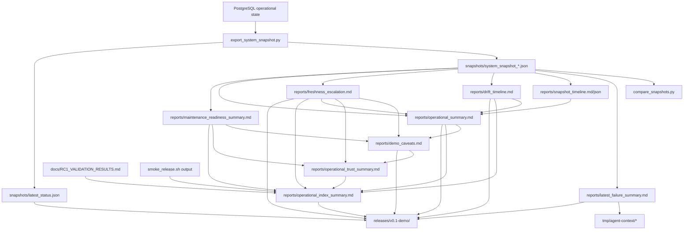

# Report Relationships

This map shows how CrawlerNest operational reports relate to snapshots,
diagnostics, validation output, release bundles, and demo summaries. The goal is
to reduce future operational fragmentation by making report ownership and data
flow explicit.

---

## Relationship Graph

---

## Consumption Matrix

| Report | Consumes Snapshots | Consumes Diagnostics | Consumes Previous Reports | Feeds Release Bundle | Feeds Demo Summary |
| --- | --- | --- | --- | --- | --- |
| `latest_failure_summary.md` | Yes | Optional live readonly checks | No | Yes | Yes |
| `snapshot_timeline.md/json` | Yes | No | No | Not currently copied | Yes, indirectly |
| `drift_timeline.md` | Yes | No | No | Yes | Yes |
| `freshness_escalation.md` | Yes | No | No | Yes | Yes |
| `operational_summary.md` | Yes | No | Drift/freshness availability | Yes | Yes |
| `operational_index_summary.md` | Yes, compact latest | No | Yes | Yes | Yes |
| `maintenance_readiness_summary.md` | Yes | No | No | Yes | Yes |
| `demo_caveats.md` | Yes, compact latest | No | Freshness/operational/maintenance reports | Yes | Yes |
| `operational_trust_summary.md` | Yes, compact latest | No | Freshness/maintenance/caveat/drift reports | Yes | Yes |
| `diagnostics_summary.txt` | No | `check_pipeline_health.py` output | No | Yes | Yes |
| `smoke_release_output.txt` | Fixture checks and optional live API checks | Yes | No | Yes | Yes |

---

## Intended Direction

Use `operational_index_summary.md` as the first file for handoff or demo
readiness, then drill down:

1. Freshness question: `freshness_escalation.md`
2. Drift question: `drift_timeline.md`
3. History question: `snapshot_timeline.md`
4. Maintenance question: `maintenance_readiness_summary.md`
5. Release evidence question: `smoke_release_output.txt` and `RC1_VALIDATION_RESULTS.md`
6. Source-state question: `SOURCE_HEALTH_MODEL.md`

No report should become a hidden runtime authority. Reports summarize evidence;
the runtime remains PostgreSQL plus running services.
