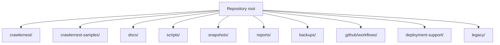

# CrawlerNest Repository Map

This document explains the major directories in the repository and what to inspect first when onboarding or debugging.

## Top-Level Map

## Core Directories

### `crawlernest/`

Main application and data platform workspace. It contains Python pipeline code, Java API service, Next.js web app, schemas, autoeval datasets, and operational helpers.

Important subdirectories:

- `crawlernest/run_pipeline.py`: primary Python CLI for bootstrap, ingestion, aggregation, subject ranking, and maintenance tasks.
- `crawlernest/crawlernest-core/`: core Python packages for multi-source ingestion, ranking aggregation, entity resolution, comparison, and recommendation logic.
- `crawlernest/crawlernest-ranking-crawler/`: ranking crawler components and source-specific extractors.
- `crawlernest/crawlernest-admission-crawler/`: admission crawler and extraction support.
- `crawlernest/crawlernest-schema/`: PostgreSQL schema definitions for warehouse, analytics, recommendation, and ranking support.
- `crawlernest/db/`: analytics bridge helpers used to sync and backfill database outputs.
- `crawlernest/scripts/`: CrawlerNest-specific utility scripts.

### `crawlernest/crawlernest-web/`

Next.js frontend. It contains user-facing pages, API proxy routes, React components, hooks, and frontend types.

Key paths:

- `src/app/rankings/`: global rankings UI.
- `src/app/subject-rankings/`: subject rankings UI.
- `src/app/universities/[slug]/`: university detail pages.
- `src/app/universities/[slug]/sources/`: source comparison and explainability page.
- `src/app/data-quality/`: data quality and source agreement dashboard.
- `src/app/system-status/`: operational status UI.
- `src/app/api/`: Next.js proxy routes to the Spring Boot API.

**Auth and user-owned UI and proxy routes:**

- `src/app/signup/`, `src/app/signin/`: signup and signin forms.
- `src/app/saved-universities/page.tsx`: auth-aware saved universities list.
- `src/app/saved-recommendations/page.tsx`: auth-aware saved recommendation plans list.
- `src/app/api/auth/`: proxy routes for signup, signin, signout, and me.
- `src/app/api/user/saved-universities/`: GET list proxy; `[canonicalUniversityId]/` — POST + DELETE proxy.
- `src/app/api/user/saved-recommendations/`: GET list + POST proxy; `[id]/` — GET detail + DELETE proxy.
- `src/lib/authProxy.ts`: `proxyGet`, `proxyPost`, `proxyDelete` helpers; forwards `Cookie` header inbound and `Set-Cookie` header outbound.
- `src/hooks/useAuthPlaceholder.ts`: `useAuth()` hook — fetches `/api/auth/me`; provides `{ authenticated, currentUser, loading, refresh }`.
- `src/hooks/useSavedUniversities.ts`: optimistic save/unsave toggle hook for the rankings page.

### `crawlernest/servise_for_java/`

Spring Boot API service. The directory name is historical. It is the main product API read layer.

Key paths:

- `src/main/java/clawer/api/`: controllers and endpoint surface.
- `src/main/java/clawer/service/`: business and diagnostic services.
- `src/main/java/clawer/repository/`: JDBC/JPA read adapters.
- `src/test/java/clawer/`: API, service, and integration tests.
- `src/test/resources/sql/`: integration-test database fixtures.
- `src/main/resources/application.properties`: local datasource and session configuration.

**Auth and user-owned data paths:**

- `src/main/java/clawer/auth/`: auth controller, service, DTOs, and schema initializer.
  - `AuthController.java` — `/api/v1/auth/signup`, `/signin`, `/signout`, `/me`.
  - `AuthService.java` — BCrypt account creation; signin with session-fixation prevention.
  - `config/AuthSchemaInitializer.java` — idempotent `CREATE TABLE IF NOT EXISTS` for `app_user`, `saved_university`, `saved_recommendation` on `ApplicationReadyEvent`.
  - `dto/` — `SignupRequest`, `SigninRequest`, `AuthUserResponse`.
- `src/main/java/clawer/user/`: user-owned data controller, services, and DTOs.
  - `controller/UserController.java` — all `/api/v1/user/` endpoints. `resolveUserId()` gates every method.
  - `service/SavedUniversityService.java` — save (idempotent), delete, list by `user_id`.
  - `service/SavedRecommendationService.java` — save, list summaries (JSONB extraction), get detail, delete — all scoped by `user_id`.
  - `dto/` — `SaveRecommendationRequest`, `SavedRecommendationSummary`, `SavedRecommendationDetail`, `SavedUniversityResponse`.

### `crawlernest/crawlernest-autoeval/`

Evaluation and diagnostics workspace. It supports fixture-mode CI, local regression checks, canonical diagnostics, source drift analysis, and report generation.

Key paths:

- `datasets/`: golden data and CI fixtures.
- `runners/`: Python runners for ranking regression, subject evaluation, canonical diagnostics, and source drift.
- `reports/`: generated autoeval outputs.
- `sandbox/`: isolated experimentation and auto-loop assets.

### `scripts/`

Repository-level operational scripts. These are the preferred entry points for local service startup, smoke checks, daily operations, snapshots, and failure summaries.

Important scripts:

- `scripts/start_localhost.sh`
- `scripts/smoke_local_stack.sh`
- `scripts/smoke_release.sh`
- `scripts/run_daily_pipeline.sh`
- `scripts/export_system_snapshot.py`
- `scripts/export_metadata_bundle.sh`
- `scripts/build_failure_summary.py`
- `scripts/run_ci_locally.sh`

### `snapshots/`

Operational snapshot output directory. Typical files include:

- `latest_status.json`
- `system_snapshot_YYYYMMDD_HHMMSS.json`

Snapshots summarize health, freshness, drift warnings, regression status, and table counts for handoff or incident review.

### `reports/`

Generated human-readable reports. This directory is used by diagnostics and CI support scripts, including failure summaries and autoeval artifacts.

### `backups/`

Local backup output area. Use this for manual database exports or operational backup files. Do not treat it as a source-of-truth schema location.

## Supporting Directories

### `docs/`

Project documentation. New architecture, data flow, runbook, repository map, and API surface docs live here.

### `.github/workflows/`

CI definitions:

- `release-smoke.yml`: compile/build/syntax smoke workflow.
- `data-quality.yml`: fixture-mode data quality workflow.

### `crawlernest-samples/`

Sample data used for local development, previews, and crawler/export demonstrations.

### `deployment-support/`

Deployment notes and node-specific operational files, including Lobster host support.

### `legacy/`

Historical code retained for reference. Prefer current paths under `crawlernest/`, `scripts/`, and `docs/` for active development.

## Where To Start

| Need | Start Here |
| --- | --- |
| Ingest data | `crawlernest/run_pipeline.py` |
| API behavior | `crawlernest/servise_for_java/src/main/java/clawer/api/` |
| Auth behavior | `crawlernest/servise_for_java/src/main/java/clawer/auth/` |
| User-owned data | `crawlernest/servise_for_java/src/main/java/clawer/user/` |
| Web behavior | `crawlernest/crawlernest-web/src/app/` |
| Auth UI / hooks | `crawlernest/crawlernest-web/src/hooks/` and `src/app/signup/`, `src/app/signin/` |
| Ranking formula | `crawlernest/crawlernest-core/ranking_aggregation/` |
| Schema/view details | `crawlernest/crawlernest-schema/` |
| Diagnostics | `scripts/` and `crawlernest/crawlernest-autoeval/` |
| CI status | `.github/workflows/` |

## Related Documents

- [Architecture Overview](ARCHITECTURE_OVERVIEW.md)
- [Data Flow](DATA_FLOW.md)
- [Operational Runbook](operational/OPERATIONAL_RUNBOOK.md)
- [API Surface](API_SURFACE.md)
