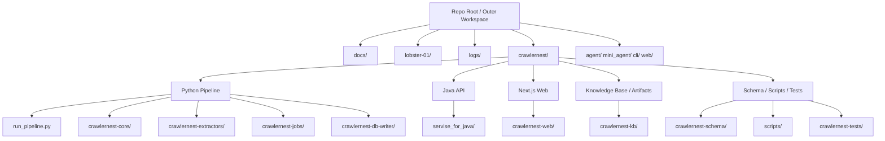
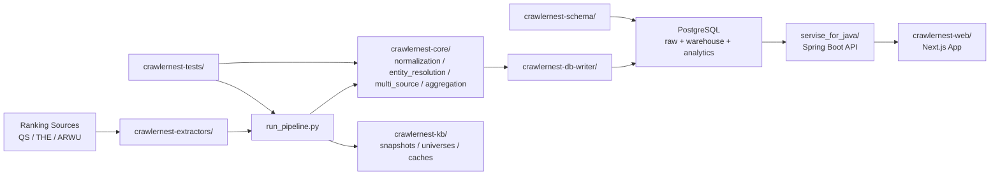
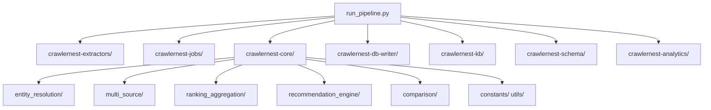
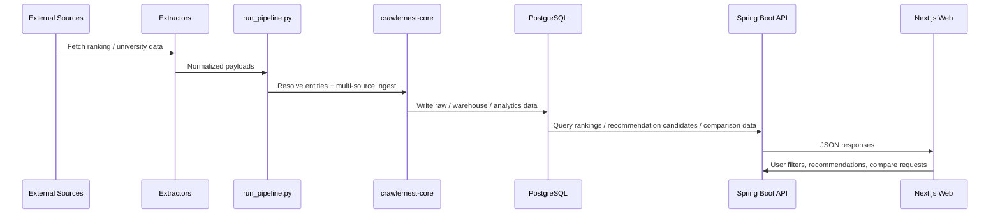

# Repository Structure

CrawlerNest 目前是「外層 workspace + 內層產品平台 workspace」的雙層結構。  
這份文件把目前 repo 的大架構、執行路徑、以及主要子系統細節整理成可直接閱讀的 Markdown 架構圖。

## 1. Big Picture



## 2. Runtime Architecture



## 3. Repo Layer Map

### 3.1 Outer Workspace

```text
repo-root/
├── README.md / README.zh-TW.md        # 專案總覽
├── docs/                              # 文件、架構、部署、參考資料
├── logs/                              # 本機執行紀錄
├── lobster-01/                        # 部署節點與 runtime 資產
├── crawlernest/                       # 主要可執行平台
├── agent/                             # Agent 開發層元件
├── mini_agent/                        # 輕量 agent 實驗/介面
├── cli/                               # CLI 側工具
├── web/                               # 外層 web 相關程式
└── .vscode/                           # 編輯器設定
```

### 3.2 Inner Product Workspace

```text
crawlernest/
├── run_pipeline.py                    # Python 資料管線主入口
├── run_platform.py                    # 平台模組啟動/整合入口
├── verify_db.py                       # DB 驗證工具
├── crawlernest-core/                  # 核心領域邏輯
├── crawlernest-extractors/            # 爬蟲 / 擷取器
├── crawlernest-jobs/                  # Job orchestration
├── crawlernest-db-writer/             # DB 寫入層
├── crawlernest-schema/                # SQL schema / views / warehouse 定義
├── crawlernest-analytics/             # 分析與匯出工具
├── crawlernest-tests/                 # Python 測試
├── crawlernest-kb/                    # 快照、cache、universe artifact
├── servise_for_java/                  # Spring Boot API
├── crawlernest-web/                   # Next.js 前端
├── scripts/                           # 維運 / migration / smoke test 腳本
├── pipeline/                          # 分段 pipeline 輔助模組
├── crawlernest-autoeval/              # 自動評估與報告
├── crawlernest-mini-agent/            # Mini-agent 產品層/實驗層
├── crawlernest-api/                   # 舊 API/過渡資產
├── crawlernest-recommendation/        # 舊推薦層或 sidecar 資料
├── crawlernest-normalization/         # 舊 normalization 實作
├── crawlernest-normalization-py/      # Python normalization 側材料
├── crawlernest-cli/                   # CLI 使用者介面工具
├── crawlernest-docs/                  # 舊內部文件鏡像
├── crawlernest-samples/               # 範例資料
└── crawlernest-infra/                 # 基礎設施相關資產
```

## 4. Core Product Decomposition

### 4.1 Python Data Platform



### 4.2 `crawlernest-core/` 細節圖

```text
crawlernest/crawlernest-core/
├── entity_resolution/                 # canonical identity 對齊、別名映射、source-to-canonical linking
├── multi_source/                      # 多來源 ingest 流程與 adapter
├── ranking_aggregation/               # universe-aware ranking 聚合
├── recommendation_engine/             # 推薦分數、信心度、解釋生成
├── comparison/                        # shortlist / compare workflow 查詢邏輯
├── constants/                         # 國家、區域、主題等參考常數
├── utils/                             # cache / formatter / retry / logging 等工具
└── src/                               # 其他主程式碼入口/整理區
```

### 4.3 API Layer 細節圖

```text
crawlernest/servise_for_java/src/main/java/clawer/
├── api/                               # REST controllers / API endpoints
├── service/                           # 排名、推薦、比較等業務邏輯
├── repository/                        # DB 讀取與查詢封裝
├── dto/                               # request / response DTO
├── model/                             # API/domain model
├── domain/                            # 更細的領域物件
├── domain/ranking/                    # ranking domain 子模組
├── config/                            # Spring 與系統設定
└── util/                              # 共用輔助工具
```

### 4.4 Web Layer 細節圖

```text
crawlernest/crawlernest-web/src/
├── app/                               # Next.js App Router
│   ├── api/                           # 同源 API proxy / route handlers
│   ├── rankings/                      # 排名瀏覽頁
│   ├── recommendations/               # 推薦頁
│   ├── compare/                       # 比較頁
│   ├── universities/                  # 學校詳情頁
│   └── about/                         # 靜態資訊頁
├── components/                        # UI 元件
├── components/rankings/               # 排名頁專用元件
├── hooks/                             # React hooks
├── lib/                               # 前端資料存取與工具
├── types/                             # TypeScript 型別
└── __tests__/                         # 前端測試
```

## 5. End-to-End Data Flow



## 6. Canonical Working Paths

如果目前是在做產品主路徑，最重要的檔案與資料夾如下：

- Data pipeline: `crawlernest/run_pipeline.py`
- Python core logic: `crawlernest/crawlernest-core/`
- SQL schema: `crawlernest/crawlernest-schema/`
- Java API: `crawlernest/servise_for_java/`
- Frontend: `crawlernest/crawlernest-web/`
- Knowledge artifacts: `crawlernest/crawlernest-kb/`
- Operations scripts: `crawlernest/scripts/`

## 7. Structural Notes

- repo 目前採雙層 workspace，功能上可行，但視覺上容易混淆
- `servise_for_java/` 是歷史拼字，若要更名應獨立做 migration
- `crawlernest/` 底下同時存在主路徑模組與歷史/側邊模組，閱讀時要分清 active path
- 部分本機產物如 `.next/`、`target/`、`__pycache__/` 是 build/cache 結果，不屬於核心架構本體

## 8. Recommended Reading Order

第一次進 repo 建議依這個順序理解：

1. `README.md`
2. `docs/REPO_STRUCTURE.md`
3. `crawlernest/run_pipeline.py`
4. `crawlernest/crawlernest-core/`
5. `crawlernest/servise_for_java/`
6. `crawlernest/crawlernest-web/`
