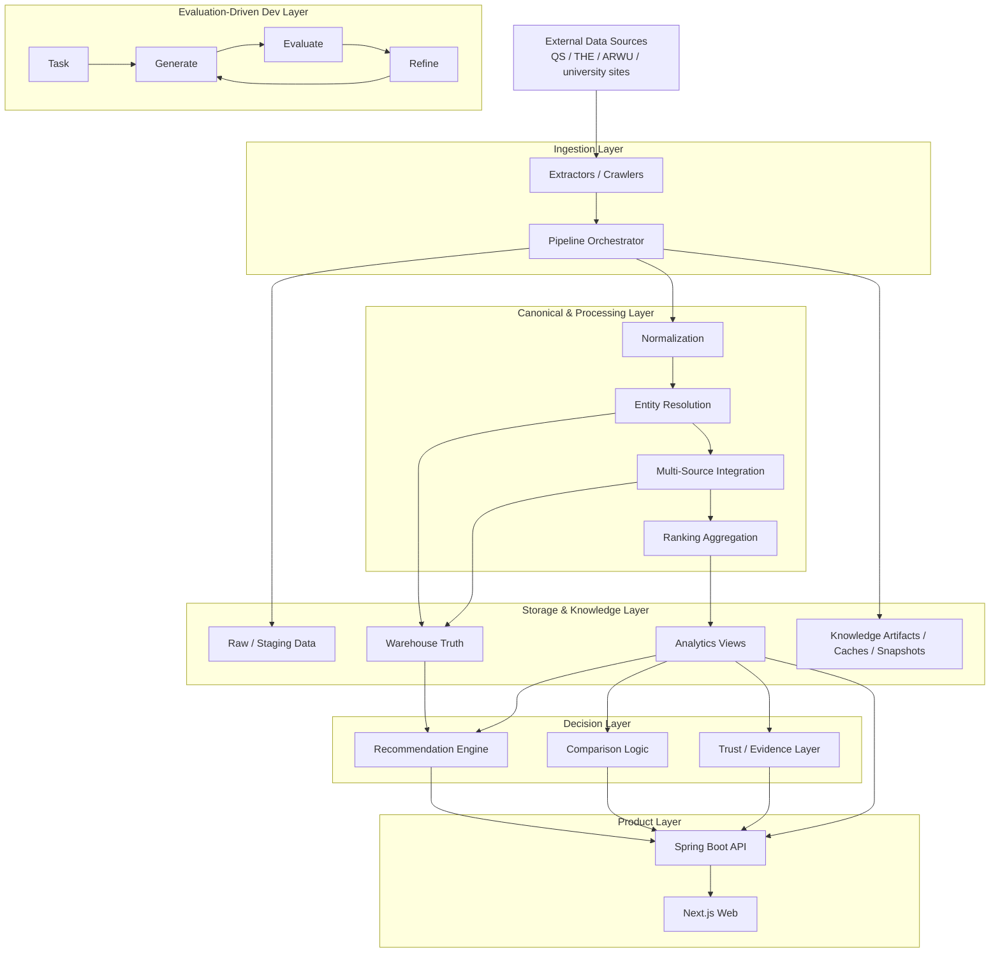
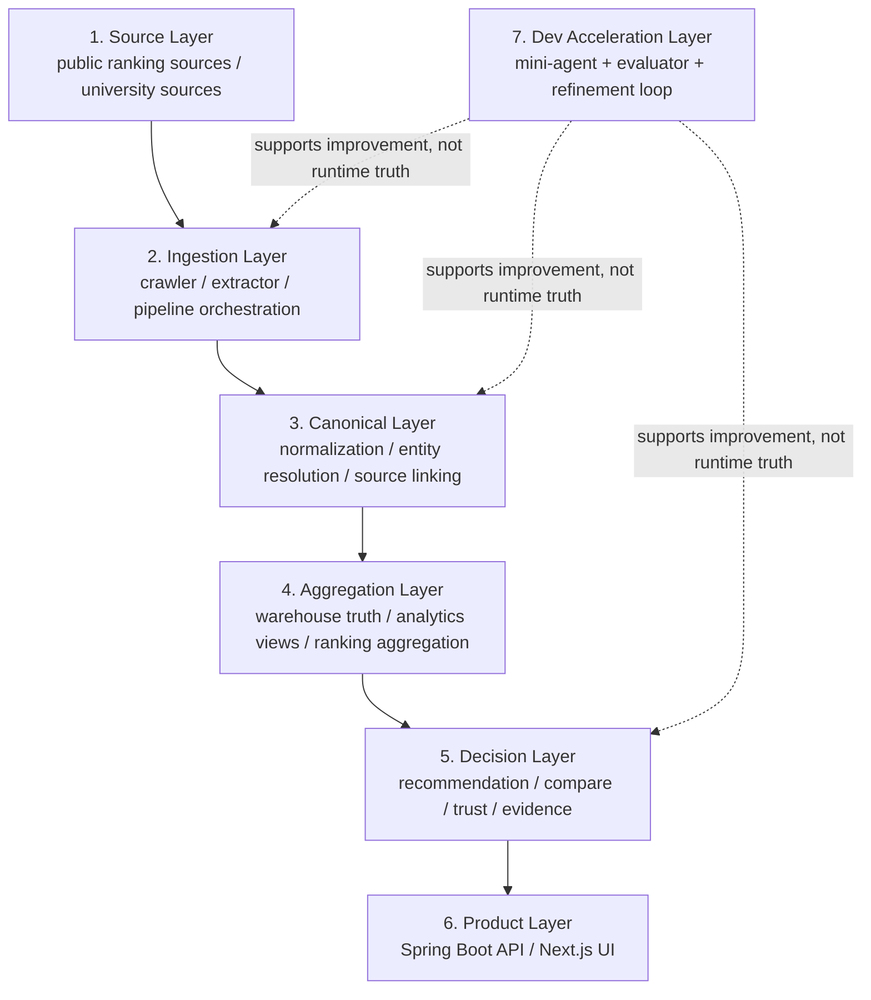
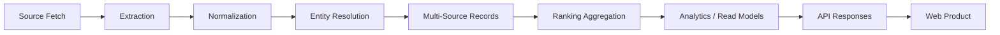
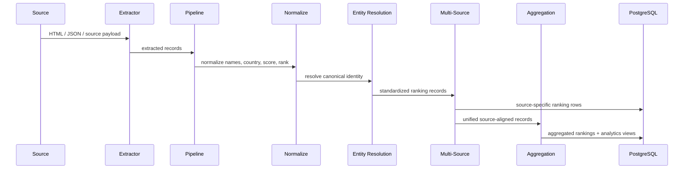
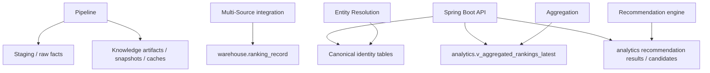
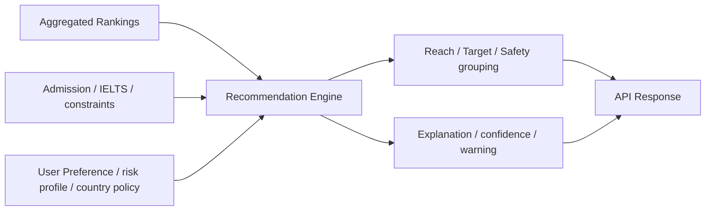
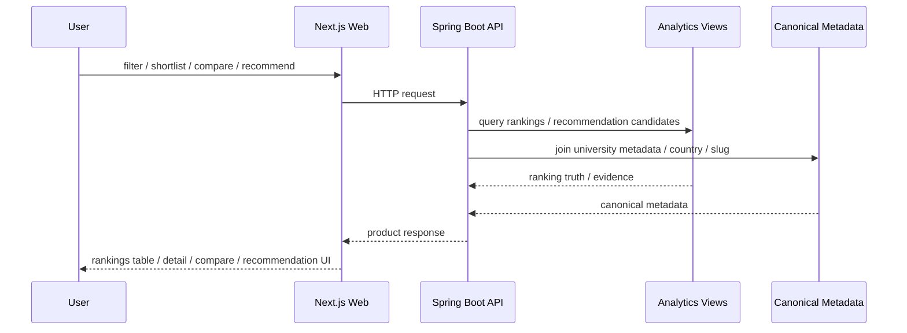
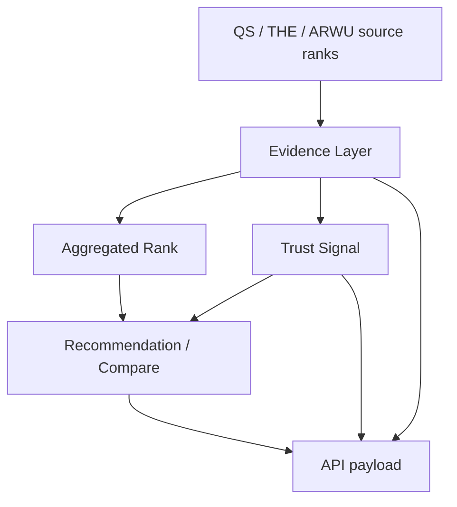
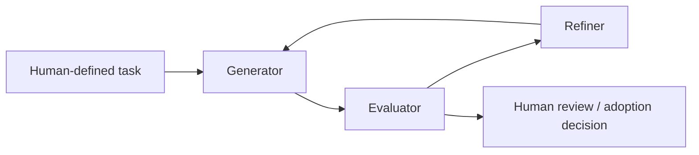
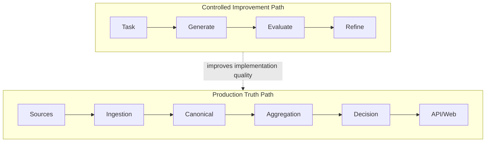

# CrawlerNest System Architecture

這份文件描述的是 **CrawlerNest 整體系統怎麼運作**，不是 repo 的檔案樹。  
重點放在資料流、系統分層、執行路徑、以及各子系統之間的責任邊界。

## 1. System Mission

CrawlerNest 不是單一爬蟲，也不是單一網站，而是一個由下列能力組成的教育資料平台：

- 多來源排名資料採集
- canonical identity / normalization / entity resolution
- multi-source ranking aggregation
- explainable recommendation / comparison / trust layer
- Spring Boot API product layer
- Next.js website product layer
- evaluation-driven mini-agent development layer

---

## 2. Full System View

---

## 3. Layered Architecture

### Layer meanings

- `Source Layer`
  外部來源，包含 QS / THE / ARWU 與部分學校站點資料。
- `Ingestion Layer`
  負責抓取、解析、節流、job orchestration、resume 與 ingest 入口。
- `Canonical Layer`
  把來源世界轉成平台自己的 identity truth，解決名稱差異、國家別名、source entity linking。
- `Aggregation Layer`
  把多來源排名轉成可查詢、可解釋、可比較的 warehouse/analytics truth。
- `Decision Layer`
  在 aggregated truth 上做 recommendation、compare、trust、evidence summary。
- `Product Layer`
  對外提供 API 與網站介面。
- `Dev Acceleration Layer`
  Mini-agent + evaluator，用於改進系統，不直接定義 production ranking truth。

---

## 4. Core Runtime Path

這是 CrawlerNest 最重要的主路徑：

### Runtime intent

- `Source Fetch`
  從外部資料源抓到 ranking/university facts。
- `Extraction`
  解析成較穩定的 payload。
- `Normalization`
  標準化名稱、國家、數值、ranking metadata。
- `Entity Resolution`
  對齊到 `canonical_university`。
- `Multi-Source Records`
  保留 QS/THE/ARWU 各自的 source truth，不互相覆蓋。
- `Ranking Aggregation`
  產生 aggregated rank、coverage、evidence、trust-related signals。
- `Analytics / Read Models`
  提供 product 端穩定查詢視圖。
- `API Responses`
  封裝產品查詢、推薦、比較。
- `Web Product`
  呈現 rankings browser、university detail、recommendation、compare。

---

## 5. Data Pipeline Architecture

### Key design rule

- source rows保留原貌
- aggregation 才產生平台層 truth
- recommendation / compare 只消費 canonical + analytics truth

也就是說：

**來源真相、平台真相、產品輸出** 是三個不同層次，不混在一起。

---

## 6. Storage Model

### Why this matters

- 不是所有爬到的資料都會直接出現在前端
- 資料必須經過 canonical linking 與 ranking record/backfill
- 最後還要進入 analytics/read model，產品層才看得到

---

## 7. Decision System Architecture

### Decision principles

- 不是黑箱 ML
- 目前以 deterministic rule-based engine 為主
- 先 explainable，再 intelligent
- ranking evidence 與 confidence 是第一級輸出，不只是附加資訊

---

## 8. Product Request Path

---

## 9. Trust and Explainability Model

CrawlerNest 的產品策略不是只輸出「排名結果」，而是一起輸出：

- source evidence
- source disagreement
- coverage ratio
- recommendation confidence
- explanation text
- warnings / gaps / missing data

這代表系統不是在隱藏不確定性，而是在把不確定性產品化。

---

## 10. Mini-Agent / Evaluation Layer

這層是 **開發輔助系統**，不是 production ranking runtime 本體。

### Role in the whole platform

- 幫助 extractor / parser / workflow refinement
- 透過 evaluator 降低亂改主系統的風險
- 加速開發，但不直接決定資料真相

換句話說：

**Mini-Agent 是 improvement loop，不是 truth source。**

---

## 11. System Boundary Summary

---

## 12. Implementation Mapping

只保留最小必要的實作對應，方便把系統圖對回程式：

- `crawlernest/run_pipeline.py`
  Ingestion pipeline 主入口
- `crawlernest/crawlernest-extractors/`
  source acquisition / extraction
- `crawlernest/crawlernest-core/entity_resolution/`
  canonical identity linking
- `crawlernest/crawlernest-core/multi_source/`
  QS/THE/ARWU source integration
- `crawlernest/crawlernest-core/ranking_aggregation/`
  aggregated ranking truth
- `crawlernest/crawlernest-core/recommendation_engine/`
  explainable deterministic recommendation
- `crawlernest/servise_for_java/`
  product API layer
- `crawlernest/crawlernest-web/`
  website product layer
- `agent/evaluator.py`
  mini-agent evaluation logic

---

## 13. One-Sentence Summary

CrawlerNest 的本質是：

**把多來源教育排名資料，經過 canonical 化、aggregation、explainable decision、API productization，最後交付成可查詢、可比較、可推薦的教育資料系統；而 mini-agent layer 只負責加速這個系統的演進，不直接取代它。**
