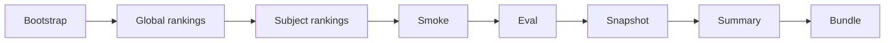

# Scheduled Operations

Operational automation guide for CrawlerNest. Covers crontab setup, pipeline scheduling, snapshot retention, and cleanup policy.

---

## Prerequisites

- PostgreSQL running (`sudo service postgresql start`)
- Python venv activated (`source .venv/bin/activate`)
- Spring Boot running for smoke checks
- Next.js running for full stack smoke checks

---

## Scripts Overview

| Script | Purpose |
|--------|---------|
| `scripts/run_daily_pipeline.sh` | Full daily pipeline from bootstrap through bundle export. |
| `scripts/export_system_snapshot.py` | Export system state to `snapshots/system_snapshot_YYYYMMDD_HHMMSS.json` |
| `scripts/build_failure_summary.py` | Build `reports/latest_failure_summary.md` from latest snapshot |
| `scripts/export_metadata_bundle.sh` | Bundle snapshots, reports, logs into `backups/metadata_bundle_YYYYMMDD.tar.gz` |
| `scripts/smoke_release.sh` | Static build verification: Spring Boot compile + Next.js build + Python syntax |
| `scripts/smoke_local_stack.sh` | Live stack smoke test: PostgreSQL + API + frontend |

---

## Crontab Examples

Add these to `crontab -e`. Adjust paths to your repo root.

```crontab
# ── CrawlerNest scheduled operations ──────────────────────────────────────────

# Daily pipeline at 02:00 UTC (skip smoke if services are not running)
0 2 * * * cd /home/torgau/dev/University-Data-Infrastructure-Web-Platform && \
  ./scripts/run_daily_pipeline.sh \
    --skip-smoke \
    --pg-password test \
    --ranking-year 2026 \
    --limit 30 \
    >> logs/cron_daily.log 2>&1

# Weekly full regression on Sundays at 03:00 UTC
0 3 * * 0 cd /home/torgau/dev/University-Data-Infrastructure-Web-Platform && \
  source .venv/bin/activate && \
  python crawlernest/crawlernest-autoeval/runners/run_ranking_regression.py \
    --pg-password test >> logs/weekly_regression.log 2>&1

# Monthly snapshot bundle export on the 1st at 04:00 UTC
0 4 1 * * cd /home/torgau/dev/University-Data-Infrastructure-Web-Platform && \
  ./scripts/export_metadata_bundle.sh >> logs/cron_bundle.log 2>&1

# Daily snapshot export + failure summary at 02:30 UTC
30 2 * * * cd /home/torgau/dev/University-Data-Infrastructure-Web-Platform && \
  source .venv/bin/activate && \
  python scripts/export_system_snapshot.py --pg-password test && \
  python scripts/build_failure_summary.py --pg-password test \
    >> logs/cron_snapshot.log 2>&1
```

---

## Daily Pipeline

The `run_daily_pipeline.sh` script runs the complete data refresh cycle:



```bash
# Standard daily run
./scripts/run_daily_pipeline.sh \
  --pg-password test \
  --ranking-year 2026 \
  --limit 30

# Dry run (echo commands, no actual execution)
./scripts/run_daily_pipeline.sh --dry-run --pg-password test

# Skip smoke test (if Spring Boot / Next.js are not running)
./scripts/run_daily_pipeline.sh --skip-smoke --pg-password test
```

The `--skip-existing-source` and `--skip-existing-year` flags are passed automatically — re-running the script on the same day will skip already-ingested data.

**Output artifacts:**
```text
logs/daily_pipeline_YYYYMMDD.log
snapshots/system_snapshot_YYYYMMDD_HHMMSS.json
snapshots/latest_status.json
reports/latest_failure_summary.md
backups/metadata_bundle_YYYYMMDD_HHMMSS.tar.gz
```

---

## Weekly Regression

Run manually or schedule on Sundays:

```bash
# Run full regression suite
source .venv/bin/activate

python crawlernest/crawlernest-autoeval/runners/run_ranking_regression.py \
  --pg-password test --pg-database clawer

python crawlernest/crawlernest-autoeval/runners/run_subject_eval.py \
  --pg-password test --pg-database clawer

python crawlernest/crawlernest-autoeval/runners/run_canonical_diagnostics.py \
  --pg-password test --pg-database clawer

python crawlernest/crawlernest-autoeval/runners/run_source_drift.py \
  --pg-password test --pg-database clawer
```

---

## Monthly Snapshot Retention

`export_metadata_bundle.sh` automatically enforces a **30-bundle retention limit** — older bundles are deleted when the 31st is created.

To manually clean old snapshots (keep last 30 days):

```bash
# Keep snapshots from last 30 days
find snapshots/ -name "system_snapshot_*.json" -mtime +30 -delete

# Keep reports from last 30 days
find reports/ -name "*.md" -mtime +30 -delete
```

---

## Cleanup Policy

| Artifact | Retention | Location |
|----------|-----------|----------|
| Daily pipeline logs | 90 days | `logs/daily_pipeline_*.log` |
| System snapshots | 30 days | `snapshots/system_snapshot_*.json` |
| Failure summaries | 30 days | `reports/*.md` |
| Metadata bundles | 30 bundles (auto-enforced) | `backups/metadata_bundle_*.tar.gz` |

Manual cleanup:

```bash
# Remove pipeline logs older than 90 days
find logs/ -name "daily_pipeline_*.log" -mtime +90 -delete

# Remove old bundles (keep last 10)
ls -1t backups/metadata_bundle_*.tar.gz 2>/dev/null | tail -n +11 | xargs -r rm
```

---

## Snapshot Structure

`snapshots/latest_status.json` is a compact status file written after every `export_system_snapshot.py` run. It is read by the `/system-status` page to show operational context.

Key fields:

```json
{
  "snapshot_timestamp": "2026-05-08T12:00:00Z",
  "aggregated_count": 30,
  "unresolved_total": 5,
  "unresolved_last_7d": 2,
  "unresolved_trend_pct": -10.0,
  "drift_warning_count": 0,
  "last_aggregation_run_id": 5,
  "last_aggregation_at": "2026-05-08T02:15:00Z",
  "last_ingestion": { "source_code": "QS", "started_at": "...", "records_in": 30 },
  "overall_stale": false
}
```

---

## Quick Reference: Manual Run Order

When running manually (not via cron), use this order:

```bash
# 1. Start PostgreSQL
sudo service postgresql start

# 2. Activate venv
source .venv/bin/activate

# 3. (Optional) Start services for smoke test
./scripts/start_localhost.sh &

# 4. Run daily pipeline
./scripts/run_daily_pipeline.sh --pg-password test --ranking-year 2026 --limit 30

# 5. Open /system-status to review
open http://localhost:3000/system-status
open http://localhost:3000/data-quality
```
