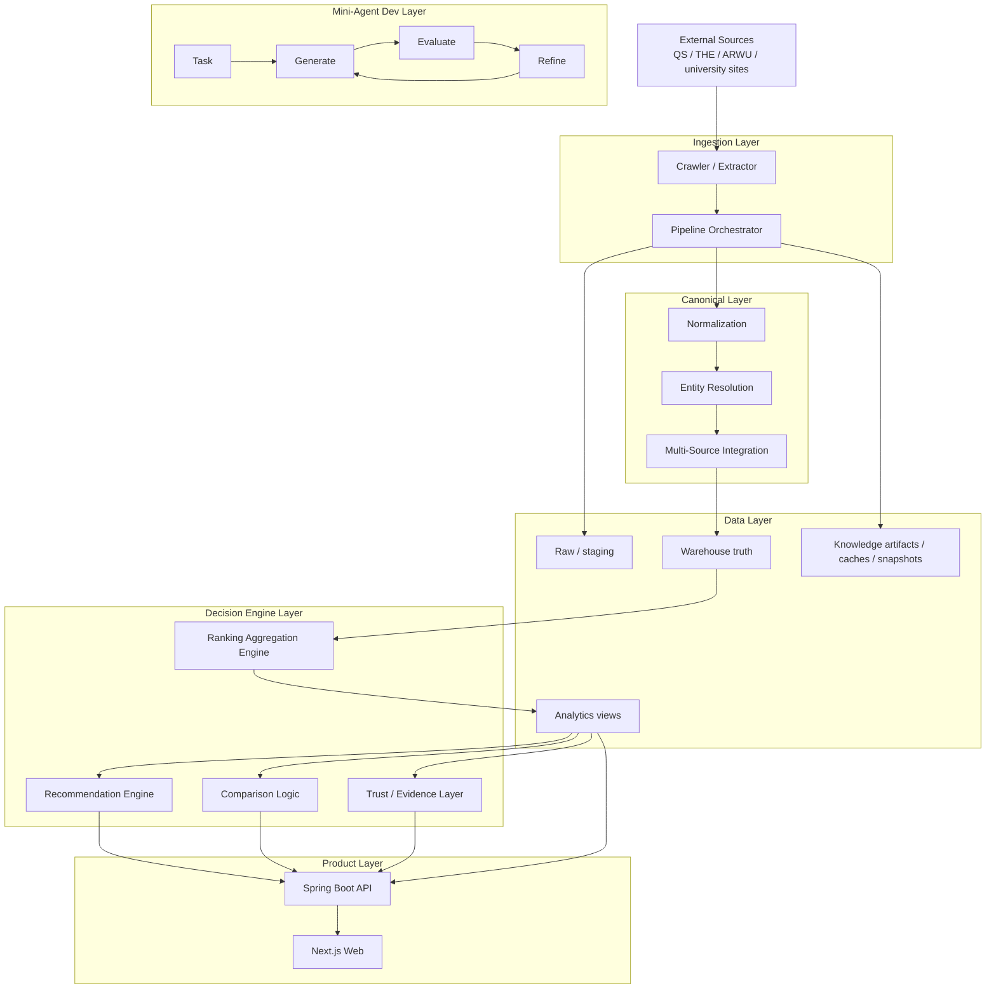
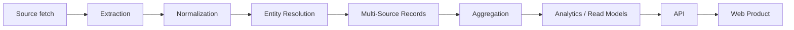
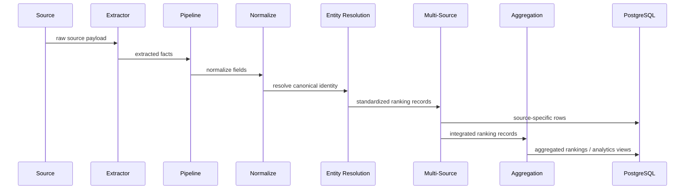
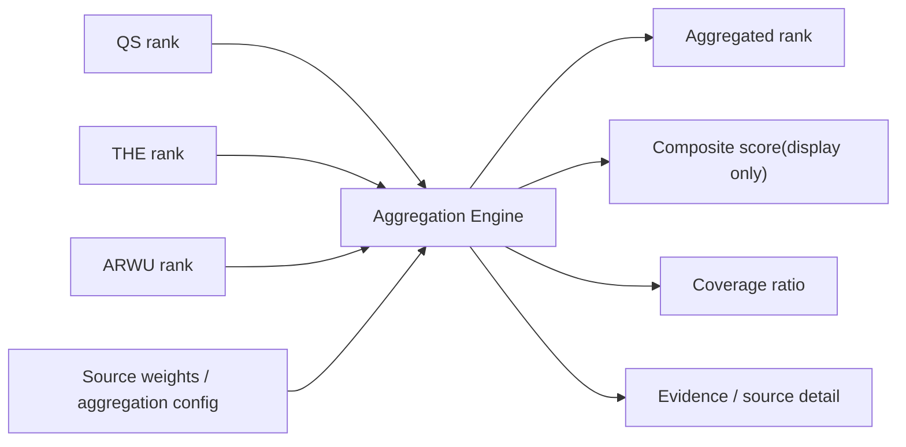
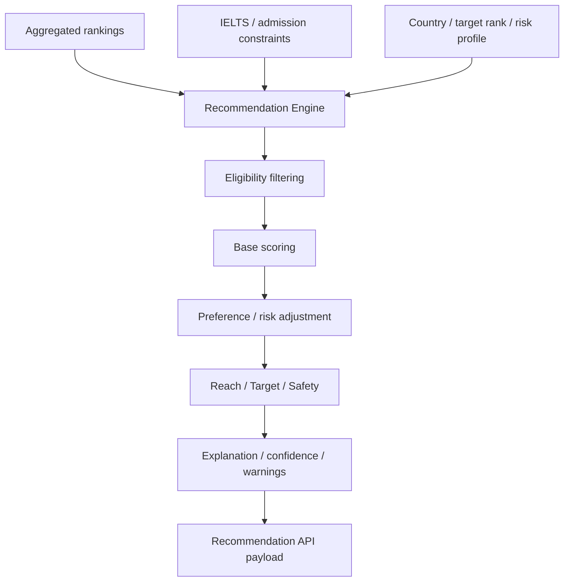
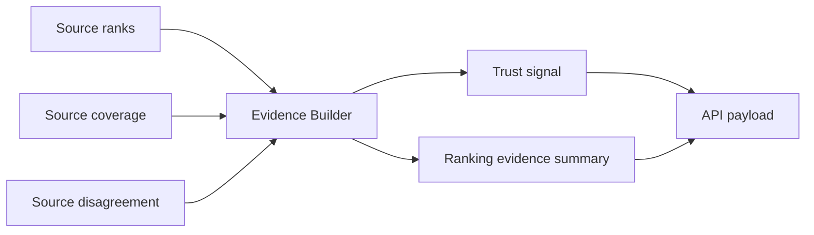
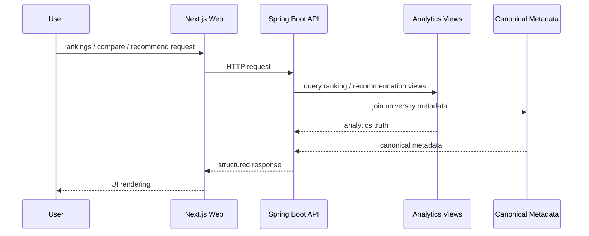
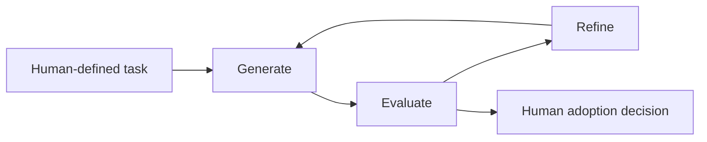
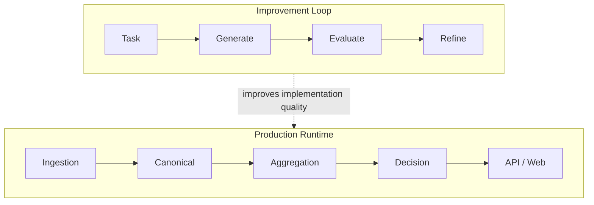

# CrawlerNest System And Engine Architecture

這份文件描述的是 **CrawlerNest 系統架構與核心引擎架構**。  
如果你要看 repo / 目錄怎麼分布，請改看：

- `docs/REPO_STRUCTURE.md`

## 1. Full System View

## 2. Main Production Truth Path

這條路徑代表真正會影響產品資料真相的主鏈：

- 外部來源資料進來
- 轉成平台可理解格式
- 對齊 canonical identity
- 保留 source truth
- 再做 aggregated truth
- 最後提供給 API 與產品層

## 3. Data Engine Architecture

### Core data rules

- source rows 不互相覆蓋
- canonical linking 先於平台 truth
- aggregation 只建立平台層 truth，不抹掉來源差異
- product 層消費的是 analytics/read model，不是原始 crawler payload

## 4. Aggregation Engine

### Aggregation intent

- 聚合是 deterministic analytics，不是 ML
- ranking order 以來源 rank 為核心
- composite score 只是輔助顯示，不是排序真相
- coverage 與 source evidence 會一起保留給後續 decision layer

## 5. Recommendation Engine

### Recommendation intent

- 目前是 explainable deterministic rule engine
- 先過 eligibility，再算 score，再做風險與偏好修正
- 最後輸出 category、confidence、explanation，不只給一個分數

## 6. Trust / Evidence Engine

### Trust intent

- 不把來源差異藏起來
- 讓產品層直接看到 evidence / disagreement / coverage
- 把不確定性顯式交給使用者，而不是假裝資料永遠完整一致

## 7. Product Architecture

## 8. Mini-Agent Development Loop

這層不是 production truth engine，而是 **開發改進引擎**。

### Role

- 幫助 extractor / parser / workflow refinement
- 用 evaluator 限制 hallucination 與脆弱修改
- 加速開發，但不直接產生 ranking truth

## 9. Boundary Summary

## 10. Minimal Implementation Mapping

- `crawlernest/run_pipeline.py`
  pipeline orchestrator
- `crawlernest/crawlernest-extractors/`
  extraction layer
- `crawlernest/crawlernest-core/entity_resolution/`
  canonical engine
- `crawlernest/crawlernest-core/multi_source/`
  source integration engine
- `crawlernest/crawlernest-core/ranking_aggregation/`
  aggregation engine
- `crawlernest/crawlernest-core/recommendation_engine/`
  recommendation engine
- `crawlernest/servise_for_java/`
  product API
- `crawlernest/crawlernest-web/`
  product UI
- `agent/evaluator.py`
  evaluator logic
