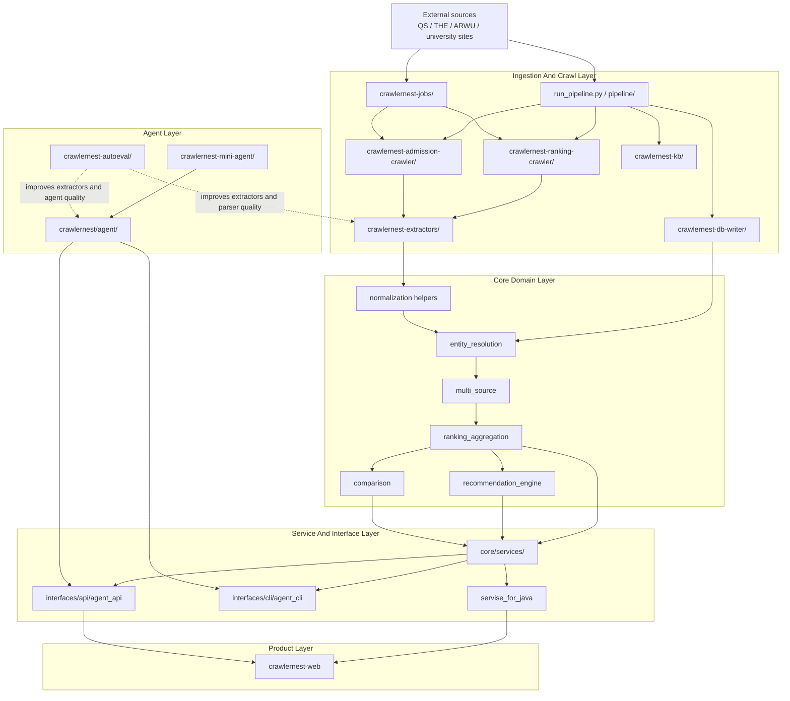
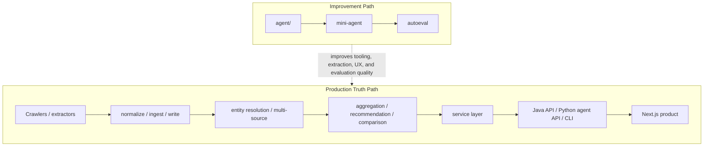

# System And Engine Architecture

這份文件描述的是 **CrawlerNest 目前的系統分層、資料流與執行面**。
如果你要看 repo 目錄怎麼放，請改看：

- `docs/REPO_STRUCTURE.md`

目前可以用一句話概括主系統：

`sources -> crawlers/extractors -> normalize -> staging/ingest -> entity resolution -> multi-source -> aggregation -> recommendation/comparison -> API -> web`

同時，repo 內還並存一條 agent/mini-agent 能力線，主要服務於互動查詢、agent API 與開發迭代，不直接取代資料真相主鏈。

## 1. Architecture Snapshot



## 2. Runtime Surfaces

目前系統不是單一服務，而是幾個執行面並存：

1. `crawlernest/run_pipeline.py`
   ranking / admission / ingest / resolution / backfill 等資料生產主入口。
2. `crawlernest/run_platform.py`
   將模組加進 `sys.path` 後，轉入 `clawer_main` 的平台啟動入口。
3. `crawlernest/interfaces/api/agent_api/server.py`
   Python agent API server，提供 `/health` 與 `/api/v1/agent/tasks`。
4. `crawlernest/interfaces/cli/agent_cli/main.py`
   Python agent CLI，支援 `dev` / `web` mode 與多種 task kind。
5. `crawlernest/servise_for_java/`
   Spring Boot API，承接產品型 REST 需求。
6. `crawlernest/crawlernest-web/`
   Next.js 前端，對使用者暴露 rankings、recommendations、compare、universities、agent、preview 等頁面。

## 3. Primary Data Truth Path

這條路徑是目前最重要的 production truth path：

```mermaid
flowchart LR
    A["Source fetch"] --> B["Crawler / extractor"]
    B --> C["Normalization"]
    C --> D["Staging / ingest / write"]
    D --> E["Entity resolution"]
    E --> F["Multi-source integration"]
    F --> G["Ranking aggregation"]
    G --> H["Recommendation / comparison"]
    H --> I["Service layer"]
    I --> J["API surfaces"]
    J --> K["Web product"]
```



對 ranking workflow 來說，文件與 README 裡反覆出現的操作鏈仍然成立：

`crawl -> raw -> normalized -> staging -> validate -> ingest -> warehouse preview -> warehouse landing -> resolve -> report -> seed -> refresh`

但就現行程式結構來說，這些步驟不是都塞在單一模組，而是分散在：

- `run_pipeline.py`
- `pipeline/`
- `crawlernest-ranking-crawler/`
- `crawlernest-db-writer/`
- `crawlernest-core/entity_resolution/`
- `crawlernest-core/multi_source/`
- `crawlernest-schema/`

## 4. Ingestion And Crawl Layer

### Main responsibilities

- 從 QS、THE、ARWU 與學校網站抓取資料
- 做 source-specific extraction
- 產生 snapshot、checkpoint、staging 與 write payload
- 控制 resume、batch、backfill、seed、refresh 等 operational flow

### Main modules

- `crawlernest/run_pipeline.py`
  高層 orchestration。它會 bootstrap module paths，然後協調 crawler、schema、entity resolution、multi-source、recommendation 等能力。
- `crawlernest/pipeline/`
  提供 parser、command dispatch 與 stage helper，不承載全部業務邏輯。
- `crawlernest/crawlernest-jobs/`
  放較偏 job-routing 與命令分派的實作，例如 `pipeline_command_router.py`、`qs_universe_registry.py`、`the_crawler.py`、`arwu_crawler.py`。
- `crawlernest/crawlernest-ranking-crawler/`
  ranking source 專用 crawler 與 extractors。
- `crawlernest/crawlernest-admission-crawler/`
  admission requirement 專用 crawler、extractors 與 `site_profiles/`。
- `crawlernest/crawlernest-extractors/`
  共用 `fetcher.py`、`extractor.py`。
- `crawlernest/crawlernest-kb/`
  runtime snapshot、checkpoint、resolution cache、本機資料庫等知識資產。

### Design notes

- `pipeline/` 在目前架構中比較像 orchestration shell，不是完整業務核心。
- `run_pipeline.py` 仍然很重要，而且直接串接許多 module；它不是單純薄 wrapper。
- `crawlernest-kb/` 是 runtime artifact 與 cache 的重要落點，不能只當文件範例資料夾看待。

## 5. Core Domain Layer

核心領域引擎主要在 `crawlernest/crawlernest-core/`：

```text
entity_resolution/     canonical university identity、alias linking
multi_source/          將 QS / THE / ARWU 對齊成整合資料
ranking_aggregation/   生成 aggregated ranking 與相關 evidence
recommendation_engine/ deterministic, explainable recommendation logic
comparison/            比較邏輯
constants/             國家、區域、預設常數
utils/                 共用工具
```

### Core rules

- source truth 與平台 truth 分開處理
- entity resolution 先建立 canonical identity，再做多來源整合
- aggregation 是 deterministic analytics，不是黑箱 ML
- recommendation 建立在 aggregation 與 admission constraints 之上
- comparison 與 recommendation 都消費 core domain，而不是直接碰原始 crawler payload

## 6. Service And API Layer

這層的目的是把核心引擎包成較穩定的服務介面。

### Python service facade

`crawlernest/core/services/` 目前至少包含：

- `ranking_service.py`
- `recommendation_service.py`
- `university_service.py`

它們會把 DB 設定、core repositories 與 payload 整理成較接近產品/API 消費的形狀。

### Python agent API

`crawlernest/interfaces/api/agent_api/server.py` 是一個輕量 HTTP server：

- `GET /health`
- `POST /api/v1/agent/tasks`

它依賴 `crawlernest.agent.web_agent.generation.response_generator` 與 `AgentApiHandler`，說明目前 agent 能力已經有獨立的 Python API 面。

### Spring Boot API

`crawlernest/servise_for_java/src/main/java/clawer/` 仍是產品 API 的重要面：

- `api/`
- `service/`
- `repository/`
- `dto/`
- `model/`
- `domain/`
- `config/`
- `util/`

因此現在的產品 API 不是只有一條 Python 線，而是 **Java product API + Python agent API** 並存。

## 7. Frontend Layer

`crawlernest/crawlernest-web/` 是 Next.js 前端產品，目前重要頁面與路由包括：

- `src/app/rankings/`
- `src/app/recommendations/`
- `src/app/compare/`
- `src/app/universities/`
- `src/app/agent/`
- `src/app/preview/`
- `src/app/api/*`

這代表前端除了面向正式產品頁，也承接 preview 與 agent 互動流。

## 8. Agent And Improvement Layer

CrawlerNest 目前還有一條獨立但重要的 agent 能力線：

### `crawlernest/agent/`

這是現行 Python agent 系統，包含：

- `engine/`
- `planner/`
- `orchestration/`
- `tools/`
- `web_agent/`
- `memory_long_term/`
- `policies/`
- `validation/`
- `self_improvement/`

它既可作為互動查詢層，也承接 dev/web mode 的任務執行。

### `crawlernest/crawlernest-mini-agent/`

這不是單純 demo，而是另一條獨立產品/實驗線，內含：

- `src/` TypeScript/Node 側 runtime 與 UI modules
- `rust/crates/` 多個 Rust crates，例如 `api`、`commands`、`runtime`、`tools`
- `tests/`
- `docs/`

### `crawlernest/crawlernest-autoeval/`

這層負責 extractor / agent loop 的評估與改進：

- `datasets/`
- `runners/`
- `reports/`
- `sandbox/`

它的角色是提升品質，不直接作為 ranking truth source。

## 9. Data Assets And Persistence

目前資料層不是單一資料庫，而是多種 artifact 並存：

- `crawlernest/crawlernest-schema/`
  SQL schema、aggregation schema、recommendation query 資產。
- `crawlernest/crawlernest-kb/`
  runtime snapshots、checkpoint、resolution cache、local DB。
- `crawlernest/crawlernest-samples/`
  demo、preview、normalized、staging 等樣本輸出。
- `clawer.db`
  workspace 內的 SQLite artifact。
- PostgreSQL
  由 schema 與 service/repository 路徑共同支持，是產品查詢與推薦的重要存放層。

## 10. Boundary Summary



## 11. Current Canonical Mapping

- Pipeline orchestration: `crawlernest/run_pipeline.py`
- Stage helpers: `crawlernest/pipeline/`
- Job routing: `crawlernest/crawlernest-jobs/`
- Shared extraction helpers: `crawlernest/crawlernest-extractors/`
- Ranking crawler: `crawlernest/crawlernest-ranking-crawler/`
- Admission crawler: `crawlernest/crawlernest-admission-crawler/`
- Core domain engine: `crawlernest/crawlernest-core/`
- Service facade: `crawlernest/core/services/`
- Python agent API: `crawlernest/interfaces/api/agent_api/`
- Python agent CLI: `crawlernest/interfaces/cli/agent_cli/`
- Product API: `crawlernest/servise_for_java/`
- Product web: `crawlernest/crawlernest-web/`
- Agent system: `crawlernest/agent/`
- Mini-agent line: `crawlernest/crawlernest-mini-agent/`
- Evaluation: `crawlernest/crawlernest-autoeval/`
- Schema: `crawlernest/crawlernest-schema/`
- Runtime knowledge/cache: `crawlernest/crawlernest-kb/`
