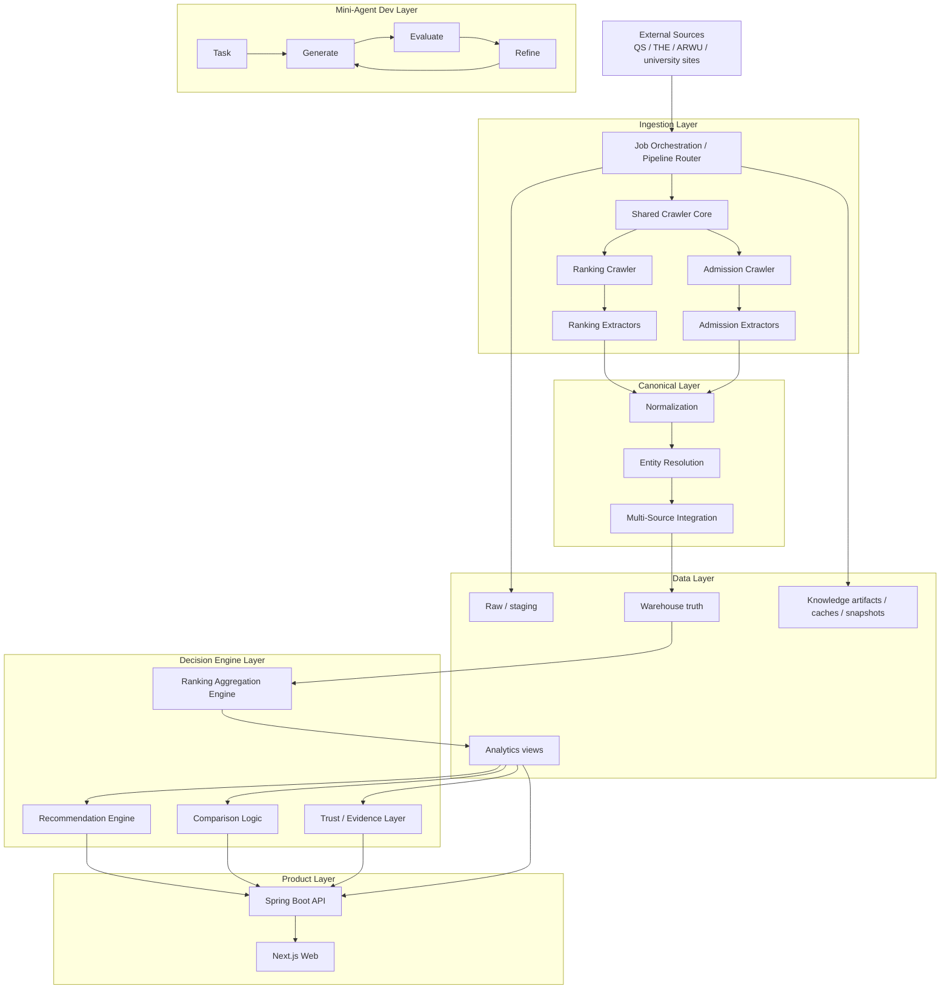
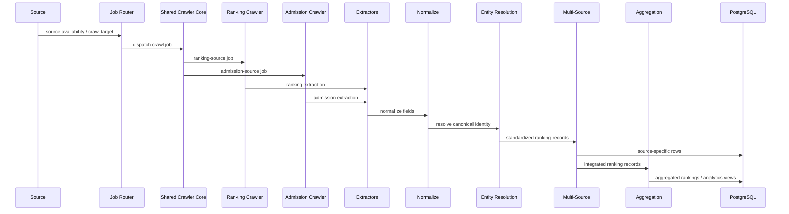
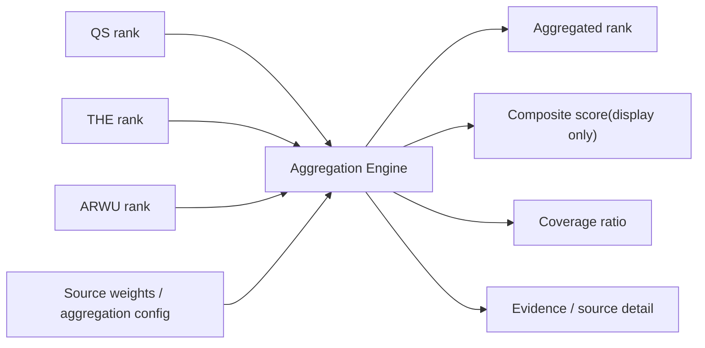
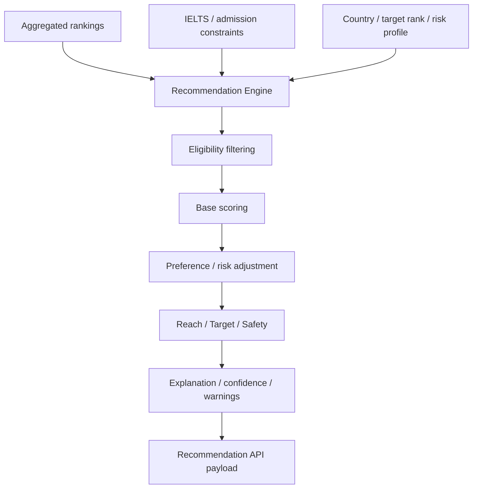
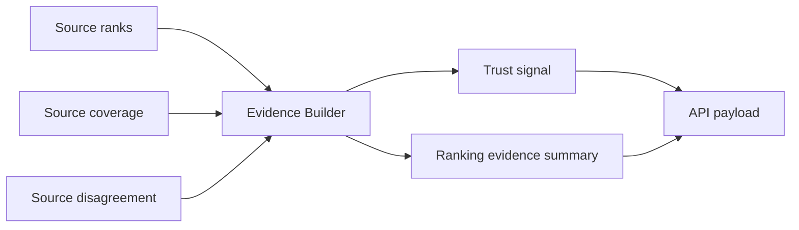
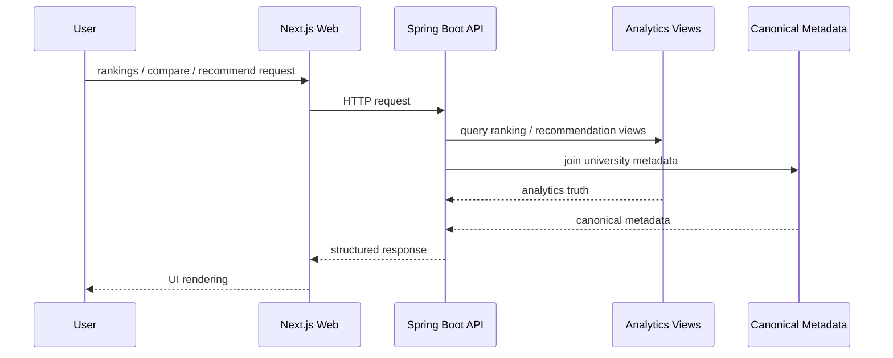
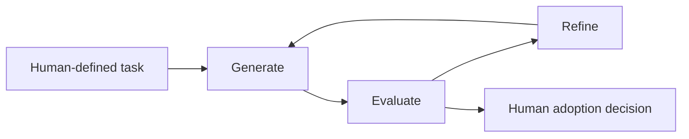
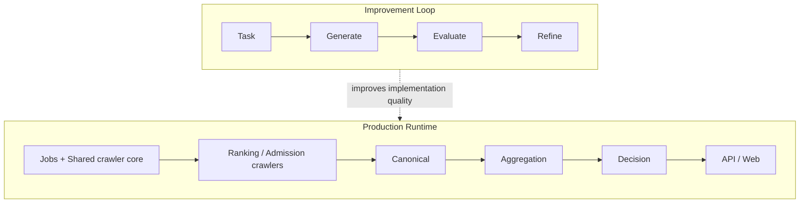

# CrawlerNest System And Engine Architecture

這份文件描述的是 **CrawlerNest 系統架構與核心引擎架構**。  
如果你要看 repo / 目錄怎麼分布，請改看：

- `docs/REPO_STRUCTURE.md`

目前 ranking path 已形成一條安全的資料生產鏈：

```text
crawl -> raw -> normalized -> staging -> validate -> ingest -> warehouse preview -> warehouse landing -> resolve -> report -> seed -> refresh
```

這條路徑的重點不是提早進 production read model，而是先把 ranking data 的產生、落地、解析與人工補種閉環做穩。

## 1. Full System View



## 2. Main Production Truth Path

```mermaid
flowchart LR
    A["Source fetch"] --> B["Shared crawler core"]
    B --> C["Ranking crawler / Admission crawler"]
    C --> D["Source-specific extraction"]
    D --> E["Normalization"]
    E --> F["Entity Resolution"]
    F --> G["Multi-Source Records"]
    G --> H["Aggregation"]
    H --> I["Analytics / Read Models"]
    I --> J["API"]
    J --> K["Web Product"]
```



這條路徑代表真正會影響產品資料真相的主鏈：

- 外部來源資料進來
- 轉成平台可理解格式
- 對齊 canonical identity
- 保留 source truth
- 再做 aggregated truth
- 最後提供給 API 與產品層

對 ranking 而言，主 truth path 前面現在多了一條更保守的前置帶：

- raw artifact
- normalized artifact
- staging artifact
- validation gate
- controlled ingest
- warehouse preview / landing

也就是說，ranking 資料不會在 crawler 結束後直接進入最終可讀 truth。

## 3. Data Engine Architecture



### Core data rules

- source rows 不互相覆蓋
- canonical linking 先於平台 truth
- aggregation 只建立平台層 truth，不抹掉來源差異
- product 層消費的是 analytics/read model，不是原始 crawler payload
- staging / warehouse landing 與最終 production read model 明確分離
- entity resolution 不直接改 raw crawler data

## 4. Aggregation Engine



### Aggregation intent

- 聚合是 deterministic analytics，不是 ML
- ranking order 以來源 rank 為核心
- composite score 只是輔助顯示，不是排序真相
- coverage 與 source evidence 會一起保留給後續 decision layer

## 5. Recommendation Engine



### Recommendation intent

- 目前是 explainable deterministic rule engine
- 先過 eligibility，再算 score，再做風險與偏好修正
- 最後輸出 category、confidence、explanation，不只給一個分數

## 6. Trust / Evidence Engine



### Trust intent

- 不把來源差異藏起來
- 讓產品層直接看到 evidence / disagreement / coverage
- 把不確定性顯式交給使用者，而不是假裝資料永遠完整一致

## 7. Product Architecture



## 8. Mini-Agent Development Loop

這層不是 production truth engine，而是 **開發改進引擎**。



### Role

- 幫助 extractor / parser / workflow refinement
- 不直接產生 ranking truth
- 用 evaluator 限制 hallucination 與脆弱修改
- 加速開發，但不直接產生 ranking truth

## 9. Boundary Summary



## 10. Minimal Implementation Mapping

- `crawlernest/run_pipeline.py`
  pipeline orchestrator
- `crawlernest/crawlernest-jobs/`
  orchestration, routing, resume, batch control
- `crawlernest/crawlernest-crawler-core/`
  shared crawler runtime concerns
- `crawlernest/crawlernest-ranking-crawler/`
  ranking crawler engine
- `crawlernest/crawlernest-admission-crawler/`
  admission crawler engine
- `crawlernest/crawlernest-core/entity_resolution/`
  canonical engine
- `crawlernest/crawlernest-core/multi_source/`
  source integration engine
- `crawlernest/crawlernest-core/ranking_aggregation/`
  aggregation engine
- `crawlernest/crawlernest-core/recommendation_engine/`
  recommendation engine
- `crawlernest/servise_for_java/`
  product API
- `crawlernest/crawlernest-web/`
  product UI
- `agent/evaluator.py`
  evaluator logic
