# System And Engine Architecture

以圖為主；repo 目錄對照請看 `docs/REPO_STRUCTURE.md`。

## 1. System Overview

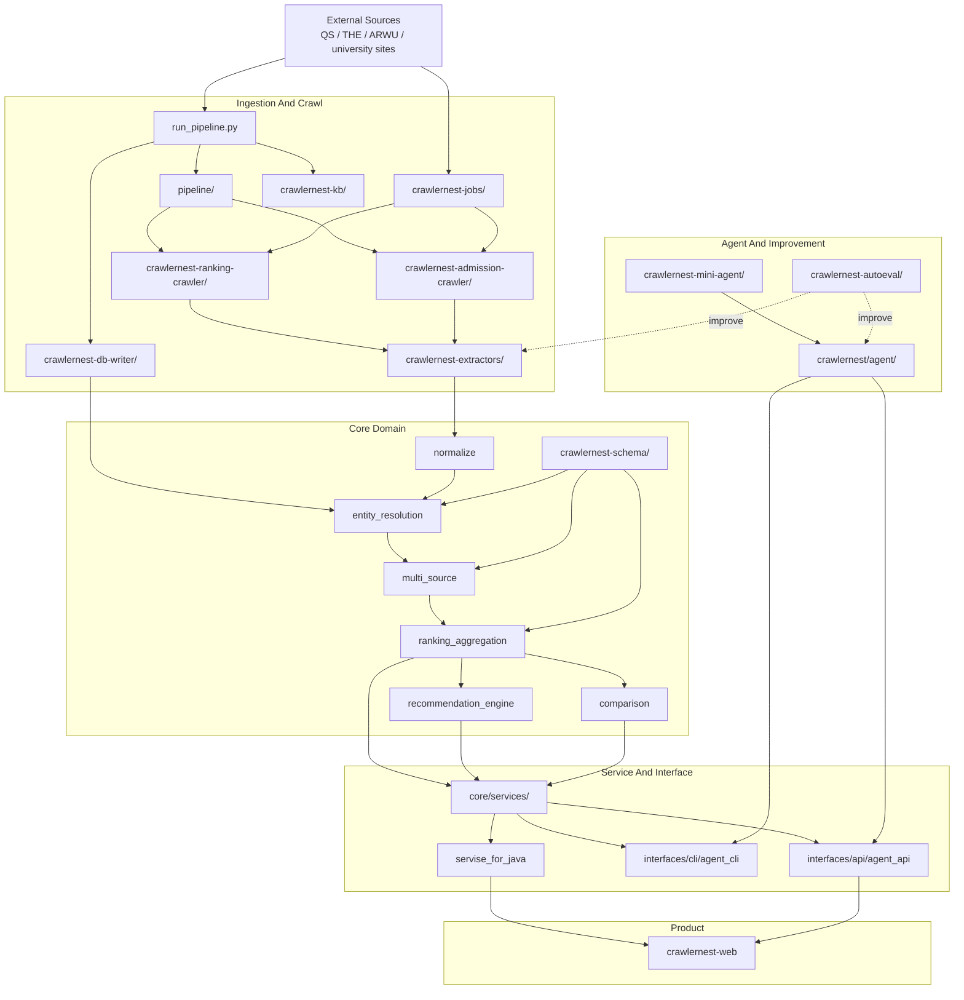

## 2. Production Truth Path

```mermaid
flowchart LR
    A["Source fetch"] --> B["Crawler / extractor"]
    B --> C["Normalized records"]
    C --> D["Staging / ingest / write"]
    D --> E["Entity resolution"]
    E --> F["Multi-source integration"]
    F --> G["Ranking aggregation"]
    G --> H["Recommendation / comparison"]
    H --> I["Service facade"]
    I --> J["API surfaces"]
    J --> K["Web product"]
```

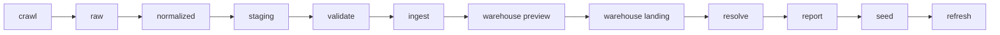

## 3. Runtime Surfaces

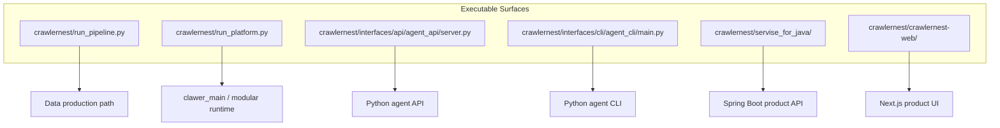

## 4. Ingestion And Crawl View

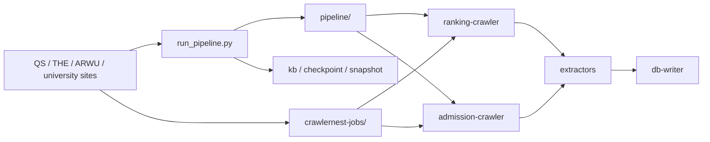

## 5. Core Domain View

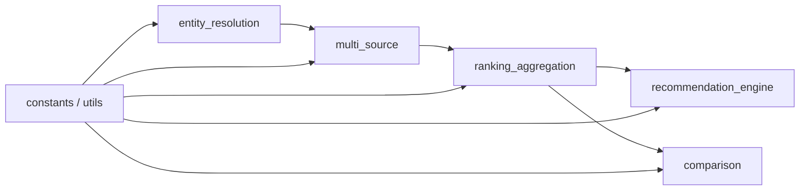

## 6. Service And Product View

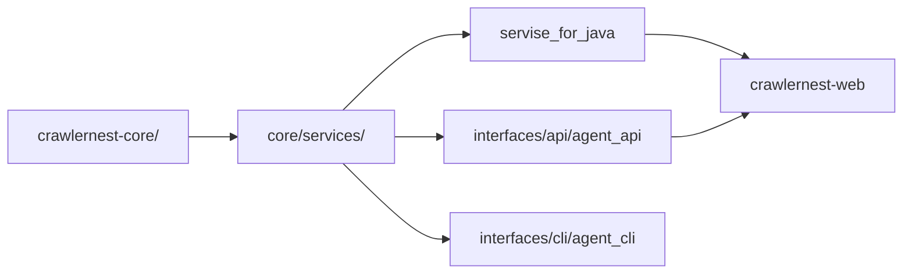

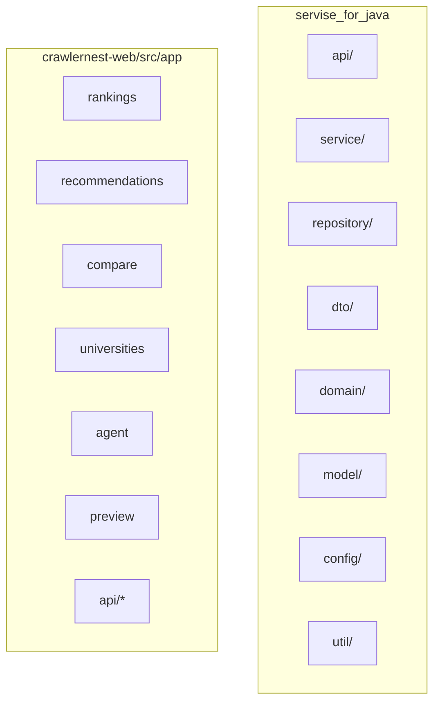

## 7. Agent And Improvement View

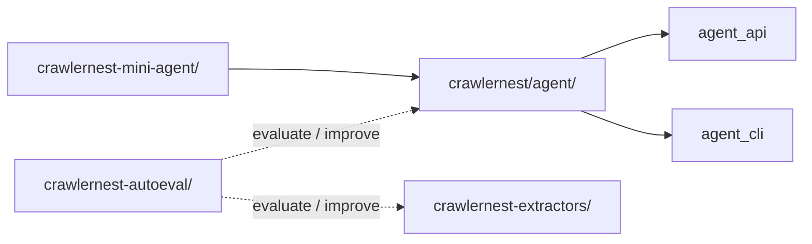

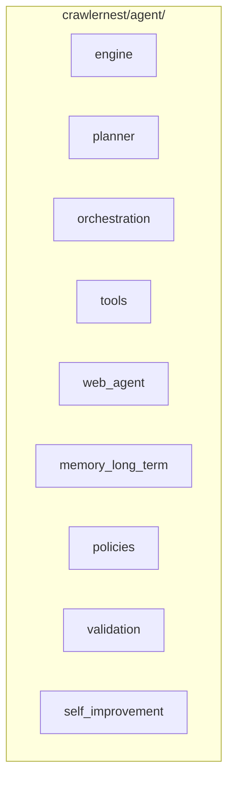

## 8. Data Assets And Persistence

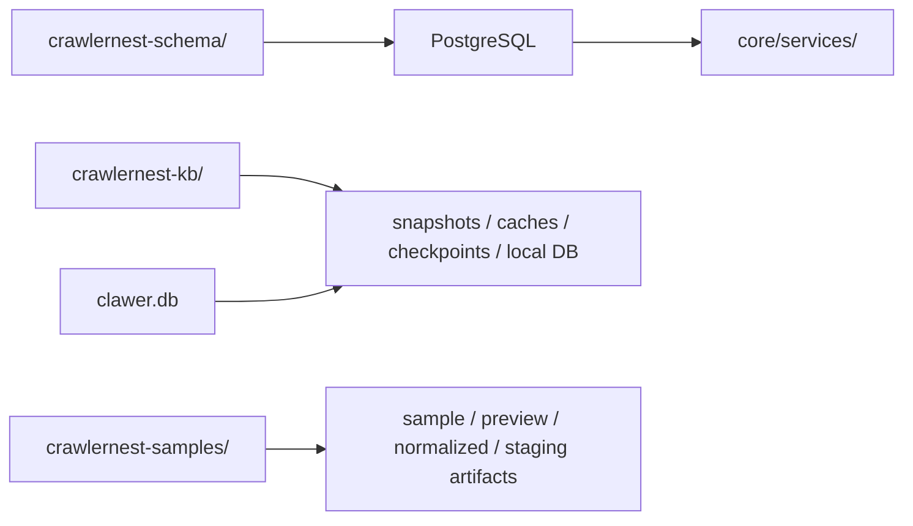

## 9. Canonical Module Map

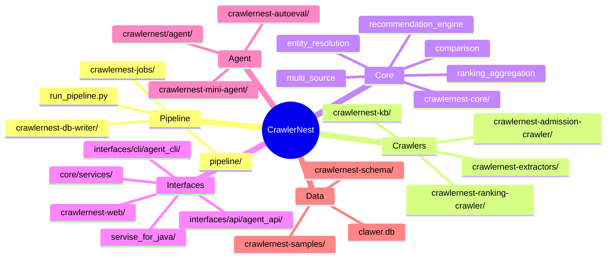
