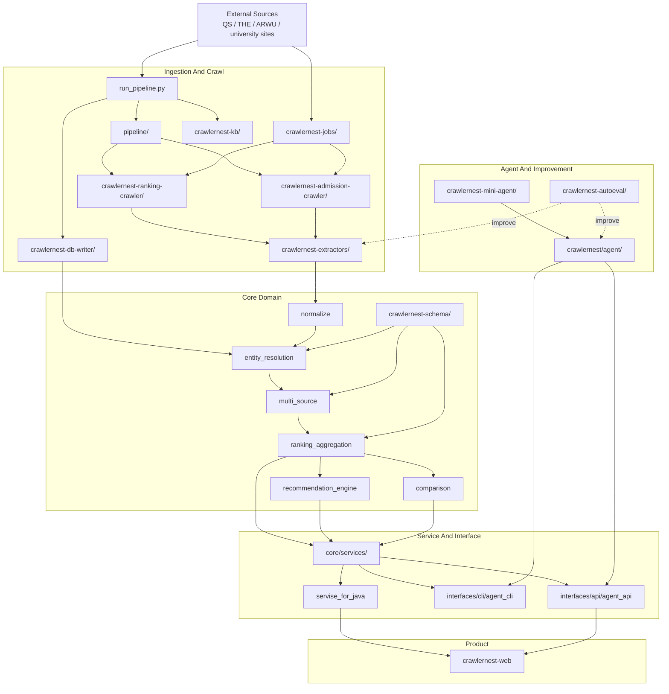
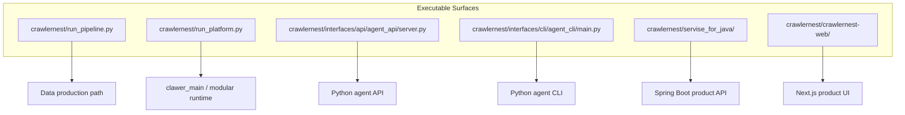
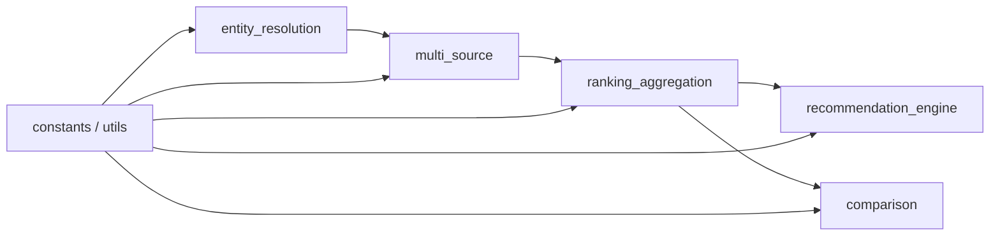
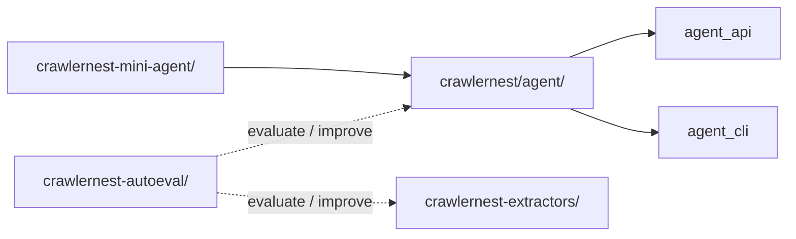
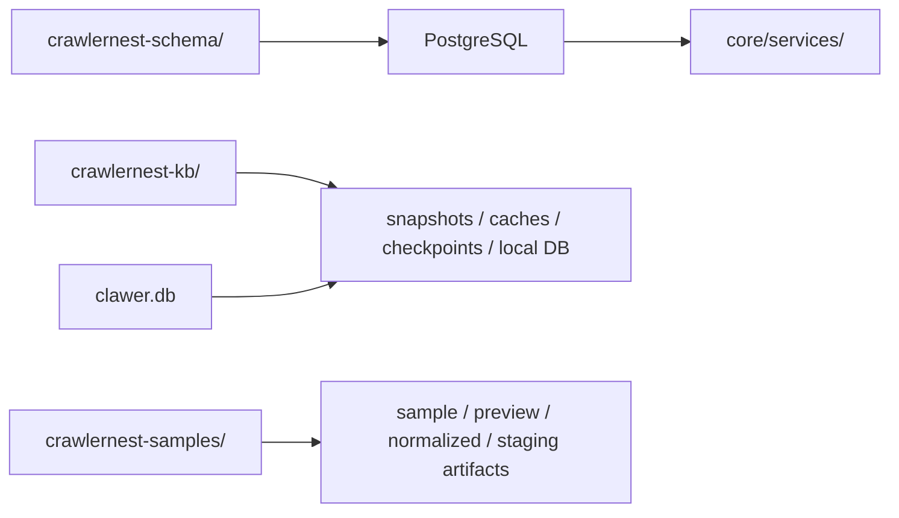
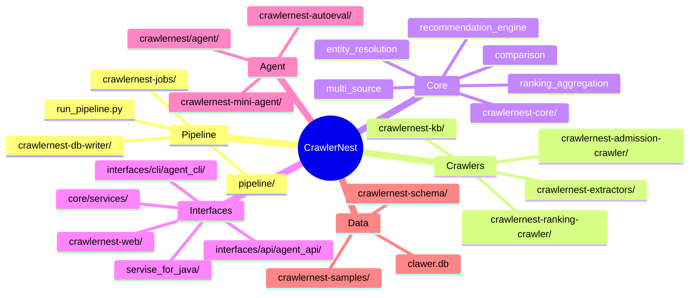

# System And Engine Architecture

以圖為主；repo 目錄對照請看 `docs/REPO_STRUCTURE.md`。

## 1. System Overview



## 2. Production Truth Path

```mermaid
flowchart LR
    A["crawl"] --> B["raw"]
    B --> C["normalized"]
    C --> D["staging"]
    D --> E["validate"]
    E --> F["ingest"]
    F --> G["warehouse preview"]
    G --> H["warehouse landing"]
    H --> I["resolve"]
    I --> J["multi-source"]
    J --> K["aggregation"]
    K --> L["recommendation / comparison"]
    L --> M["service facade"]
    M --> N["API surfaces"]
    N --> O["web product"]
```



## 3. Runtime Surfaces



## 4. Core Domain View



## 5. Agent And Improvement View



## 6. Data Assets And Persistence



## 7. Canonical Module Map



## 8. Regression-Safe Pipeline & Eval Loop

- **Admission Extraction Pipeline** is now at Phase 4 "controlled improvement loop":
  - All anomaly signals (e.g., input_truncated, invalid_ielts, source_host_mismatch) are fully observable
  - Integration regression tests verify all anomaly signals using snapshot HTML
  - CLI summary outputs anomaly breakdown at the end of the pipeline
  - Golden dataset + eval runner (`crawlernest-autoeval/runners/run_extractor_eval.py`) can directly verify if a pattern fix in `admission_text_extractor.py` improves or maintains the score
  - Every extractor pattern fix must pass:
    - golden eval (required_fill_rate, exact_match_rate, error_count, score)
    - regression tests (`test_crawlers.py`)
    - pipeline summary (`AdmissionCrawlerEngine.run()`)

- **Eval Example**
  ```
  python3 crawlernest/crawlernest-autoeval/runners/run_extractor_eval.py --dataset crawlernest/crawlernest-autoeval/datasets/admission_goldens/samples.json --extractor-file crawlernest/crawlernest-admission-crawler/extractors/admission_text_extractor.py
  ```
  - required_fill_rate: 1.00
  - exact_match_rate: 1.00
  - optional_fill_rate: 0.87
  - error_count: 0
  - score: 0.87

- **Safety Mechanism**
  - Any pattern fix must be regression-safe, must not break anomaly observability or existing tests
  - All pipeline output must be traceable to anomaly breakdown
