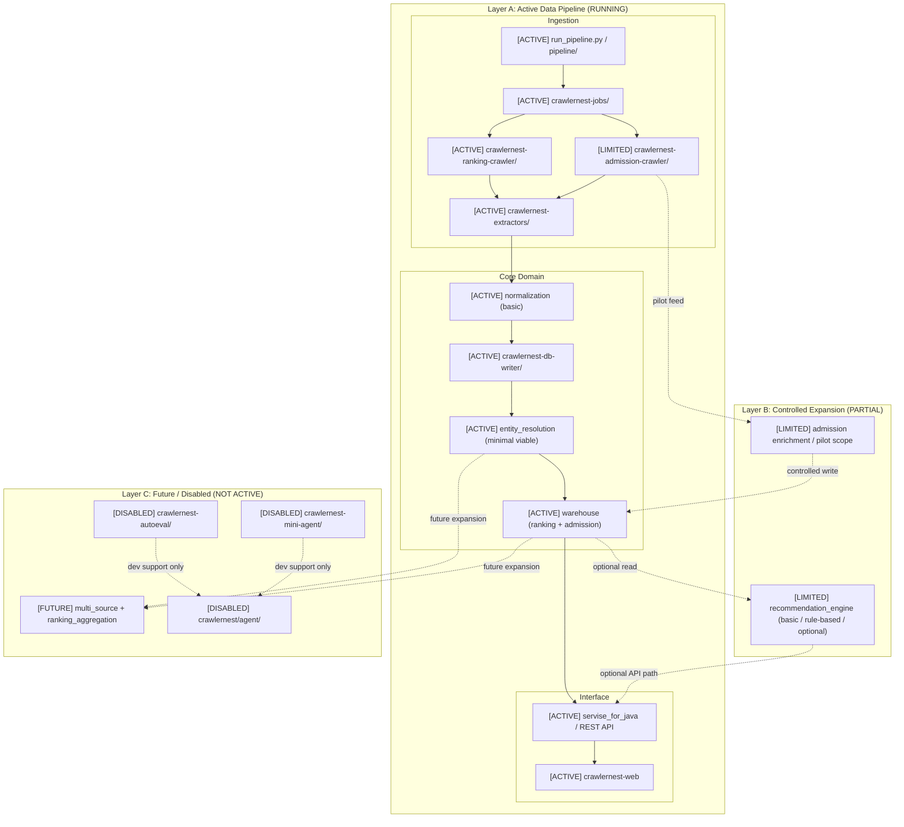

# System And Engine Architecture Execution

`docs/SYSTEM_ENGINE_ARCHITECTURE.md` 是 v1 全景藍圖；這份文件是 v2，目前可執行的 MVP / controlled system。

## 1. Current Executable Architecture

## 2. Execution vs Vision

v1 (`docs/SYSTEM_ENGINE_ARCHITECTURE.md`) 描述的是長期完整藍圖，包含更完整的 multi-source aggregation、recommendation、agent loop 與自動改進能力。  
v2 只保留目前應該真的上線、維護、驗證的執行主鏈：`crawl -> extract -> normalize -> write -> warehouse -> API -> web`。

這份 v2 刻意降級或移出：

- `recommendation_engine`：只作為 `[LIMITED]` 的 basic / rule-based / optional 能力
- `multi_source`、`ranking_aggregation`：標為 `[FUTURE]`
- `crawlernest/agent/`、`crawlernest-mini-agent/`、`crawlernest-autoeval/`：標為 `[DISABLED]`，只屬於 development support，不屬於 production pipeline

## 3. Design Principle

- Agent is not part of production data path.
- Admission crawler is in controlled pilot stage.
- Data correctness > automation.
