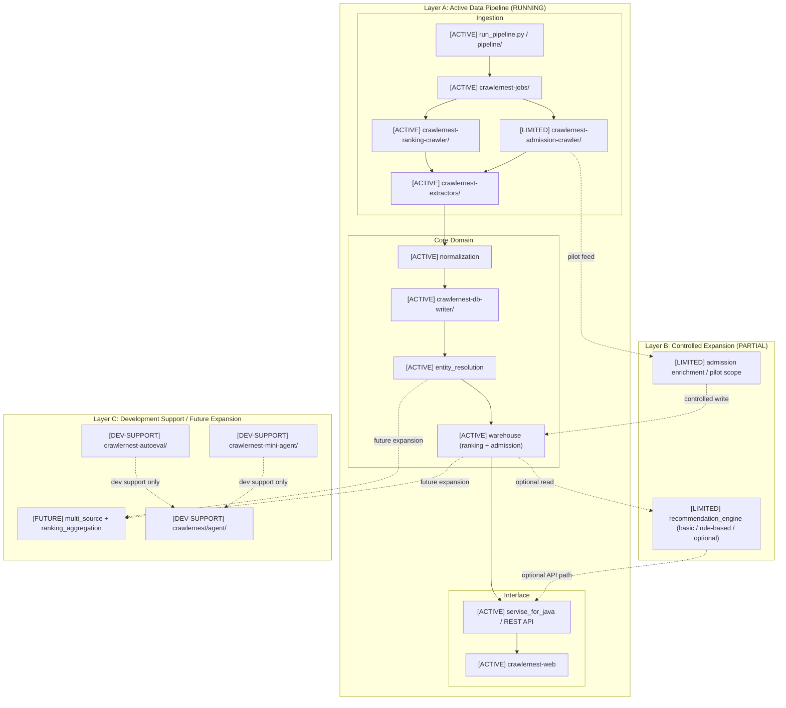
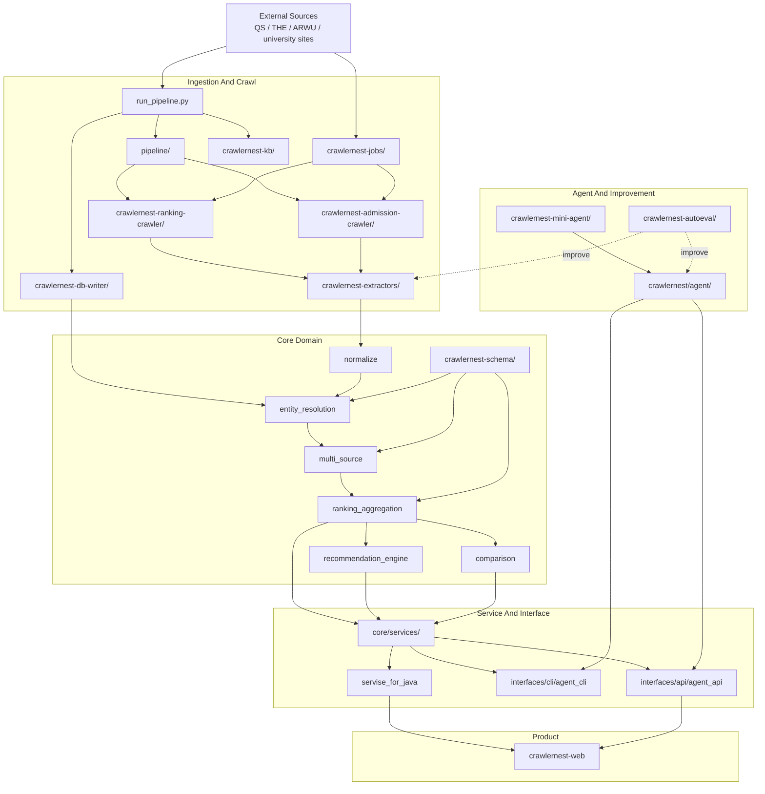
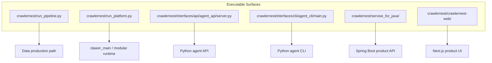
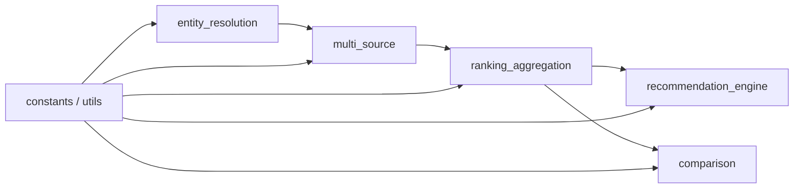
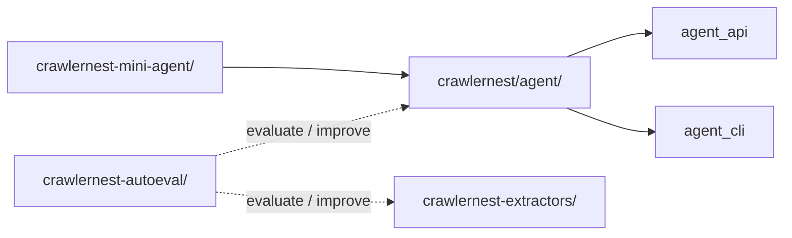
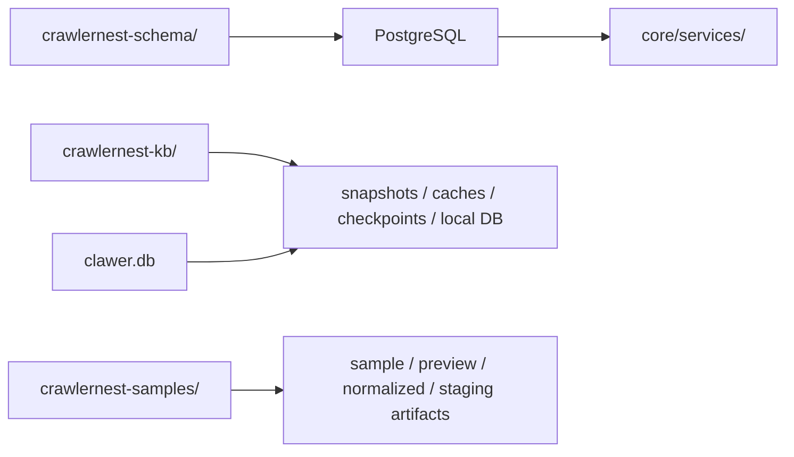
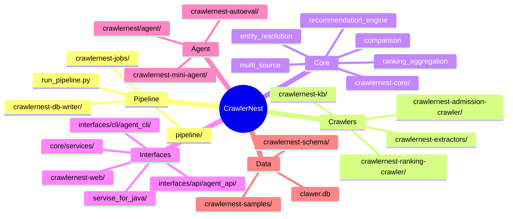

# System And Engine Architecture

以圖為主；repo 目錄對照請看 `docs/architecture/REPO_STRUCTURE.md`。

本文件是 **CrawlerNest 唯一的 system / engine architecture 文件**。  
它同時承擔兩個角色：

1. 說明目前可執行的主線架構
2. 說明較長期的 vision architecture

也就是說，這份文件不再拆成 execution / vision 兩份，而是用同一份文件清楚區分：
- 現在真正該跑、該維護、該驗證的是什麼
- 長期要演進到哪裡

目前 CrawlerNest 的主線仍應遵守 correctness-first 的 no-skip 順序：

1. 穩定 crawl / extract
2. 穩定 normalization / canonical mapping
3. 正式化 warehouse / API contract
4. 建立 admission-aware recommendation
5. 最後才逐步擴大 agent autonomy

foundation 規範文件仍然是主線執行邊界的重要補充，但 system / engine 的總敘事，以這一份文件為唯一來源。

## 0. Current Executable Architecture

目前真正應該被視為 production-oriented mainline 的，是這條路徑：

`crawl -> extract -> normalize -> write -> warehouse -> API -> web`

在 execution reality 中，CrawlerNest 應理解為三個區域：

1. **Active Data Pipeline**
2. **Controlled Expansion**
3. **Development Support / Future Expansion**



### 0.1 Execution Principles

- Agent is not part of production data path.
- Admission crawler is in controlled pilot stage.
- Data correctness > automation.
- Correctness-first sequencing overrides capability breadth.
- Development support layers may evolve, but must not outrun crawl / normalization / canonical / warehouse stability.

### 0.2 Regression-Safe Admission Loop

Admission extraction 的改進應理解為受控 improvement loop，而不是 production truth path 的替代品。

- anomaly signals 必須可觀測
- extractor pattern fix 必須先過 eval / regression / summary
- pipeline output 必須能回溯到 anomaly breakdown

## 1. System Overview



## 2. Production Truth Path

```mermaid
flowchart LR
    A["crawl"] --> B["raw"]
    B --> C["normalized"]
    C --> D["staging"]
    D --> E["validate"]
    E --> F["ingest"]
    F --> G["warehouse preview"]
    G --> H["warehouse landing"]
    H --> I["resolve"]
    I --> J["multi-source"]
    J --> K["aggregation"]
    K --> L["recommendation / comparison"]
    L --> M["service facade"]
    M --> N["API surfaces"]
    N --> O["web product"]
```



## 3. Runtime Surfaces



## 4. Core Domain View



## 5. Agent And Improvement View



## 6. Data Assets And Persistence



## 7. Canonical Module Map



## 8. Regression-Safe Pipeline & Eval Loop

這一節描述的是 admission extraction 與 controlled improvement loop 的理想成熟形態。  
它代表我們希望逐步抵達的工程安全基線，但不表示 agent / eval loop 已取代資料主線本身。

- **Admission Extraction Pipeline** is now at Phase 4 "controlled improvement loop":
  - All anomaly signals (e.g., input_truncated, invalid_ielts, source_host_mismatch) are fully observable
  - Integration regression tests verify all anomaly signals using snapshot HTML
  - CLI summary outputs anomaly breakdown at the end of the pipeline
  - Golden dataset + eval runner (`crawlernest-autoeval/runners/run_extractor_eval.py`) can directly verify if a pattern fix in `admission_text_extractor.py` improves or maintains the score
  - Every extractor pattern fix must pass:
    - golden eval (required_fill_rate, exact_match_rate, error_count, score)
    - regression tests (`test_crawlers.py`)
    - pipeline summary (`AdmissionCrawlerEngine.run()`)

- **Eval Example**
  ```
  python3 crawlernest/crawlernest-autoeval/runners/run_extractor_eval.py --dataset crawlernest/crawlernest-autoeval/datasets/admission_goldens/samples.json --extractor-file crawlernest/crawlernest-admission-crawler/extractors/admission_text_extractor.py
  ```
  - required_fill_rate: 1.00
  - exact_match_rate: 1.00
  - optional_fill_rate: 0.87
  - error_count: 0
  - score: 0.87

- **Safety Mechanism**
  - Any pattern fix must be regression-safe, must not break anomaly observability or existing tests
  - All pipeline output must be traceable to anomaly breakdown
