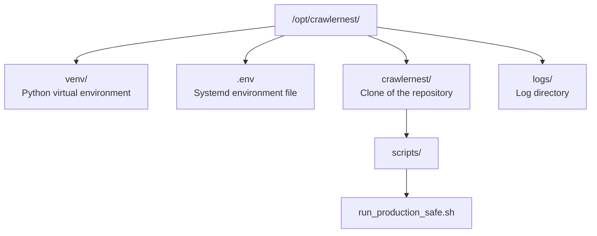

# CrawlerNest Deployment Guide for Lobster-01

**This is a production node runbook.**

This guide covers deploying CrawlerNest as a stable, long-running, low-spec crawler process on the node machine. It uses "boring but reliable" Linux defaults and respects the new detail-enrichment cooldown policies.

---

## 1. Deployment Scope & Assumptions

**Machine Name:** OpenClaw Node-01 / Lobster-01
**Deployment Path:** `/opt/crawlernest`
**User:** A dedicated unprivileged system user named `crawler`

### Directory Structure


**Why this approach?**
[run_production_safe.sh](file:///Users/test/Desktop/crawlernest/crawlernest/scripts/run_production_safe.sh) is a one-shot process (it does not loop infinitely). If we ran it as a standard `Restart=always` systemd service, it would loop constantly upon finishing, burning through the 72-hour 403 cooldowns instantly and hammering QS servers. The correct architecture for Lobster-01 is a **systemd Timer** triggering a **oneshot Service** every 4 hours.

---

## 2. Environment Setup

Create an environment file at `/opt/crawlernest/.env`.

**File:** `/opt/crawlernest/.env`
```ini
# PostgreSQL Connection (local or remote)
POSTGRES_HOST=127.0.0.1
POSTGRES_PORT=5432
POSTGRES_DB=crawlernest_prod
POSTGRES_USER=crawler
POSTGRES_PASSWORD=your_secure_password
```

---

## 3. Systemd Service & Timer Configuration

### A. The Service File

This file defines *how* to run the script. It prepends the `venv` to the path so the script passes its `python3` check.

**File:** `/etc/systemd/system/crawlernest.service`
```ini
[Unit]
Description=CrawlerNest Production Pipeline Service
After=network.target postgresql.service

[Service]
Type=oneshot
User=crawler
Group=crawler
WorkingDirectory=/opt/crawlernest

# Load PostgreSQL credentials
EnvironmentFile=/opt/crawlernest/.env
# Put the virtualenv python first in PATH to pass the script's activation check
Environment="PATH=/opt/crawlernest/venv/bin:/usr/local/bin:/usr/bin:/bin"

ExecStart=/bin/bash /opt/crawlernest/crawlernest/scripts/run_production_safe.sh

# If the script exits with a non-zero code (fatal error), wait 10m then retry.
# If it exits 0 (success or safe failure), the Timer handles the next run.
Restart=on-failure
RestartSec=600

# Protect system paths (Security hardeing for low-spec nodes)
ProtectSystem=full
ProtectHome=true
ReadWritePaths=/opt/crawlernest
```

### B. The Timer File

This file defines *when* to run the service.

**File:** `/etc/systemd/system/crawlernest.timer`
```ini
[Unit]
Description=Run CrawlerNest production pipeline periodically

[Timer]
# Wait 15 minutes after boot before running (allows DB/network to settle)
OnBootSec=15min
# Run every 4 hours after the last run started
OnUnitActiveSec=4h
# If the machine is off during a scheduled run, run it immediately on boot
Persistent=true

[Install]
WantedBy=timers.target
```

---

## 4. Log Rotation Strategy

The [run_production_safe.sh](file:///Users/test/Desktop/crawlernest/crawlernest/scripts/run_production_safe.sh) script generates timestamped logs in `/opt/crawlernest/logs/`. To prevent the disk from filling up, configuring standard `logrotate` is essential.

**File:** `/etc/logrotate.d/crawlernest`
```
/opt/crawlernest/logs/*.log {
    daily
    missingok
    rotate 14
    compress
    delaycompress
    notifempty
    create 0640 crawler crawler
}
```
*(This deletes logs older than 14 days and zips old logs automatically.)*

---

## 5. Exact Terminal Commands for Setup & Testing

Run these as `root` (or prefix with `sudo`) on Lobster-01:

### A. Initial Setup
```bash
# 1. Create dedicated user and directory
useradd -r -m -d /opt/crawlernest -s /bin/bash crawler
mkdir -p /opt/crawlernest
chown crawler:crawler /opt/crawlernest

# (Assume code is cloned to /opt/crawlernest/crawlernest)
# Copy your .env to /opt/crawlernest/.env

# 2. Make the script executable
chmod +x /opt/crawlernest/crawlernest/scripts/run_production_safe.sh
chown -R crawler:crawler /opt/crawlernest
```

### B. Manual Verification (Test run)
Run the script manually *as the crawler user* to ensure permissions and the virtual environment are working before involving systemd:
```bash
sudo -u crawler -i
source venv/bin/activate
bash crawlernest/scripts/run_production_safe.sh
exit
```

### C. Systemd Deployment
*(Create the `.service` and `.timer` files using the contents in section 3, then run:)*
```bash
# 3. Reload systemd to detect the new files
systemctl daemon-reload

# 4. Enable and start the TIMER (not the service!)
systemctl enable crawlernest.timer
systemctl start crawlernest.timer
```

### D. Health & Status Commands (Verification)

```bash
# 5. Check if the timer is active and when it runs next:
systemctl status crawlernest.timer
systemctl list-timers crawlernest.timer

# 6. Check the status of the service (it will say "inactive (dead)" between runs, which is NORMAL)
systemctl status crawlernest.service

# 7. Manually trigger a run *right now* (ignoring the 4h gap) to test:
systemctl start crawlernest.service

# 8. View the systemd logs for the service:
journalctl -u crawlernest.service -f

# 9. View the actual pipeline logs (tailing the latest one):
tail -f /opt/crawlernest/logs/$(ls -t /opt/crawlernest/logs/ | head -n 1)
```

---

## 6. Failure Recovery Checklist

If the service is failing, check these in order:

1. **Service fails to start immediately:**
   - Run `journalctl -u crawlernest.service -e`.
   - **Common cause:** Script not executable (`chmod +x`), or `.env` file contains invalid characters.
2. **"python3 not found" or Modules missing in logs:**
   - **Common cause:** The Python venv isn't recognized. Ensure `Environment="PATH=/opt/crawlernest/venv/bin:..."` is correct in the `.service` file.
3. **PostgreSQL unavailable:**
   - The script will fail instantly. Systemd's `Restart=on-failure` kicks in and will try again in 10 minutes (per `RestartSec=600`).
4. **Logs not being written:**
   - Check directory ownership. Run `chown -R crawler:crawler /opt/crawlernest/logs/`.
5. **Checkpoint file blocks progress unexpectedly:**
   - If the pipeline gets truly stuck on a corrupted network read, manual intervention is needed:
   - `rm /opt/crawlernest/crawlernest/crawlernest-kb/databases/pipeline_checkpoint.json`
   - Data in Postgres is safe (upserts); removing the checkpoint just forces a full re-crawl of the 200 items on the next timer trigger.
