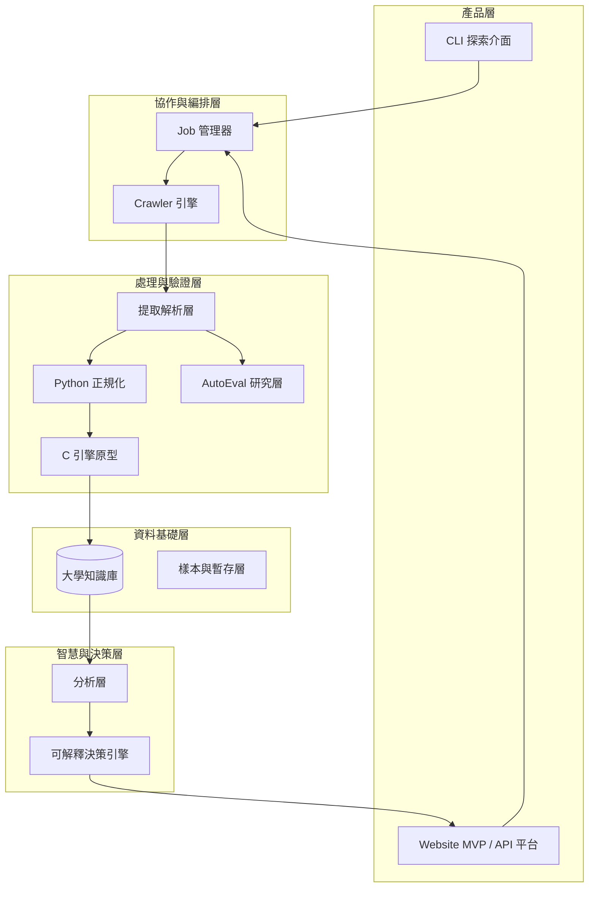
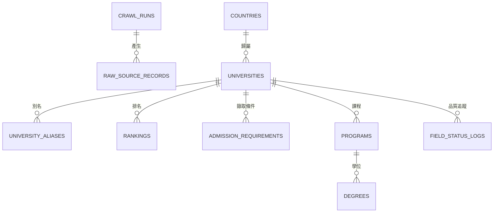
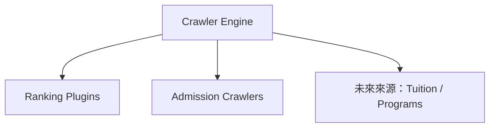
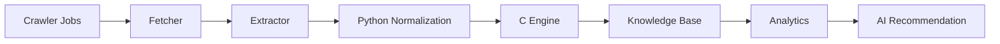

# CrawlerNest 系統架構白皮書

本文件為 CrawlerNest 專案的最高層級技術架構文件（Master Technical Architecture Document）。

CrawlerNest 的目標，不只是建立一套可以抓取大學資料的爬蟲，而是逐步演進成一個可持續擴展、可追溯、可分析、可推薦、可比較、可產品化的教育資料平台。

CrawlerNest 的產品定位也不是「官方排名發布者」，而是：

- 多來源排名整合平台
- 透明化的 ranking evidence 與 trust signal 平台
- 可解釋的教育決策支援系統

其核心演進路線如下：

**資料採集 → 資料平台 → 分析能力 → AI 推薦 → 產品化**

---

## 1. 文件定位

本白皮書作為 CrawlerNest 專案的最高層級技術架構文件 (Master Technical Architecture Document)，其用途如下：

- **決策基準**：作為中長期技術架構與產品演進決策的主參考維度。
- **語言統一**：統一 Crawler、Canonical、Aggregation、Decision 與 API 各層的設計語言。
- **願景與現況**：詳細說明產品願景、系統當前狀態以及歷史里程碑。
- **維護指南**：在功能擴充、資料模型調整或基礎設施變更時，提供一致的設計判準。

對於運維測試、驗證查詢與回歸檢查，請參閱《工程驗證與維護手冊》(TESTING_GUIDE.md)。

本文件聚焦於：

- 系統架構
- 分層模型
- 資料流程
- 資料平台與知識庫設計
- 推薦系統設計
- 里程碑與路線圖
- 維運與風險管理

---

## 2. 平台現況與能力

CrawlerNest 目前採用 **Data-first（資料優先）** 的系統設計原則：

先建立可信任、可追溯、可擴充的資料平台，再在其上疊加分析、推薦與產品層能力。

### 2.1 當前策略重點（V1.5+ / Website Product Layer）

目前 CrawlerNest 的核心策略如下：

1. **資料聚合優先**：QS、THE、ARWU 已可進入同一條 multi-source ranking path，並在統一 universe-aware truth 下被讀取
2. **知識庫優先**：建立可查詢、可維護、可追溯的大學資料基底
3. **決策系統先 explainable 再 intelligent**：先以 deterministic recommendation / comparison / trust layer 打穩決策層，再逐步推進 AI 能力
4. **模組解耦**：crawler、extractor、normalization、db、analytics、API 彼此保持相對獨立
5. **低規節點可運行**：系統設計必須能支援老舊 x86 節點作為第一代 OpenClaw / Lobster Node
6. **合規優先加速**：在 robots.txt 與來源限制下，以本地解析並行、批次寫入、增量 checkpoint、局部更新等手段提升吞吐
7. **產品層逐步落地**：在不破壞資料平台與 API 穩定性的前提下，逐步交付 Rankings Browser、University Detail、Compare、Recommendation Engine 等網站能力
8. **可見性閉環優先**：爬到的資料若尚未 canonical 化或尚未回填至 `warehouse.ranking_record`，必須提供補種與回填路徑，避免資料永久停留在不可見層

### 2.2 模組完成度地圖（截至 2026 年 3 月）

| 模組 | 說明 | 狀態 | 完成度 |
| :--- | :--- | :---: | :---: |
| 最小端到端流程 | `crawlernest/run_pipeline.py`（crawl → normalize → store → query） | 已運行 | ~90% |
| 長時間持續爬蟲 | 無限循環、KeyboardInterrupt 優雅關機、資料不遺失 | 已完成 | 100% |
| 採集 / 網路層 | 非同步請求、端點探測、分頁處理、保守抓取節流 | 已運行 | ~85% |
| 多 universe 採集 | QS global / region / subject / special 統一路徑 | 已運行 | ~85% |
| 解析 / 提取層 | 錄取要求、截止日、分數規則解析 | 已運行 | ~80% |
| Python 正規化基線 | 國家標準化、數值安全轉換、驗證流程 | 進行中 | ~75% |
| C 正規化引擎 | 名稱 / 國家 / 排名 / 分數高效處理 | 開發中 | ~25% |
| 實體識別 | 別名映射、人工校正、模糊比對基礎 | 進行中 | ~40% |
| 儲存 / 資料倉層 | PostgreSQL-only schema、DB writer、analytics views、Spring Data JPA、run traceability | 已完成 | ~95% |
| API 讀取層（唯讀 + 決策） | Spring Boot `/universities`、`/rankings`、`/recommendations`、`/compare`、scope-aware / country-aware filtering，且 country filter 已在最終 read query 依 canonical metadata 落地 | 已完成 | ~95% |
| Website Product Layer | Next.js Rankings Browser、University Detail、Ranking Evidence、Trust Layer、Recommendation UI、Compare Page、API Proxy、country-aware filter UI | 已運行 | ~95% |
| 品質與驗證 | transaction rollback、early commit、AutoEval baseline | 已運行 | ~90% |
| 低規節點運行策略 | `lobster-01` runtime workspace、optimized scripts | 已完成 | 100% |
| 分析與推薦 | multi-universe aggregation、explainable comparison、scope-aware recommendation v3 | 已運作 | ~92% |
| AutoEval 研究層 | extractor 評估、hard dataset、manual autoloop | 已運行 | ~70% |

---

## 3. 目錄

1. 平台現況與能力  
2. 系統總覽架構  
3. 系統分層模型  
4. 核心架構策略與機制  
5. 資料平台與知識庫設計  
6. Crawler 框架與 Job 管線  
7. AutoEval 與資料品質演進層  
8. 實體識別與推薦架構  
9. 開發優先順序與執行策略  
10. 里程碑與四年路線圖  
11. 產品願景與能力地圖  
12. 風險與維護策略  
13. OpenClaw / Lobster-01 節點定位補充

---

## 4. 系統總覽架構

CrawlerNest 的長期技術架構如下：



核心演進原則：

**爬蟲採集 → 資料平台 → 分析能力 → AI 智能 → 產品化**

### 4.1 統一演進視圖（Unified View）

```text
全球來源（QS / THE / ARWU / 校方網站 / 未來第三方來源）
        ↓
採集與匯入層（async jobs / fetch / parse）
        ↓
正規化與實體識別（Python 基線 + C 引擎 + alias/fuzzy/embedding）
        ↓
大學知識庫（rankings / admission / programs / degrees / tuition）
        ↓
分析層 + 推薦引擎 + API 層
        ↓
B2C / B2B 產品化
```

對應分期：

- **當前（V1.5+）**：採集、正規化基線、PostgreSQL-only 資料平台、決策 API、Website Product Layer、AutoEval baseline
- **下一階段（V2）**：多來源整合深化、實體識別升級、program-level analytics、產品層穩定化
- **未來（V3+）**：LLM 輔助研究、公開 API、完整 Web 平台、產品化擴張

---

## 5. 系統分層模型

CrawlerNest 採用五層解耦架構，確保各模組獨立演進：

### Layer 1：資料採集層 (Data Layer - Acquisition)

負責排名、錄取條件、未來學程與學費資料的非同步採集。具備 403 自動降級與端點探測能力。

### Layer 2：資料品質與正規化層 (Canonical Layer - Processing & Resolution)

負責欄位清洗、正規化、實體識別 (Identity Resolution) 與型別安全檢查。將原始來源數據轉換為統一的 Canonical 格式。

### Layer 3：整合儲存層 (Aggregation Layer - Storage)

作為單一真實來源 (Single Source of Truth)，在 PostgreSQL 中存儲原始記錄、標準化實體、聚合後的排名數據與維運日誌。

在目前版本中，單一真實來源已進一步細化為：

- `warehouse.universities`：raw / source-facing university dimension
- `warehouse.canonical_university`：canonical identity truth
- `warehouse.canonical_university_link`：raw university → canonical entity link
- `warehouse.ranking_record`：universe-aware ranking fact truth
- `analytics.v_aggregated_rankings_latest`：產品層與 API 讀取的最新聚合真相

### Layer 4：決策分析層 (Decision Layer - Analytics & Recommendation)

核心決策大腦，整合「分析」與「推薦」功能。包含排名聚合邏輯、可解釋的學校對比與基於信心模型 (Confidence Model) 的 Reach/Target/Safety 推薦。

### Layer 5：API 與產品層 (API Layer - Product)

將決策層的能力透過嚴格型別化 (Typed JSON Envelope) 的 API 暴露給前端產品 (如 Next.js Website Product Layer)，將複雜的工程數據轉化為使用者決策。

分層目的在於：

- **降低耦合**：各層獨立運作與擴展
- **明確職責**：每一層都有清晰的輸入與輸出定義
- **演進彈性**：例如 API 層變更不影響底層採集邏輯

---

## 6. 願景與策略

### 6.1 核心願景

建立一套可持續、可自動化、可解釋的全球大學資料智慧系統，成為未來四年教育決策支援的資料底座。

### 6.2 策略目標

- **資料可信度優先**：強化正規化、實體識別、血緣追蹤與稽核能力
- **架構可擴展性優先**：從專用爬蟲演進為通用教育資料平台
- **決策價值導向**：逐步提供具可行動性的分析與推薦能力
- **可運維性優先**：支援低規節點長時間穩定運作
- **可優化性優先**：建立 AutoEval 等自我改善能力，而非只依賴人工調參

### 6.3 產品定位 (Product Positioning)

CrawlerNest 的競爭優勢與市場定位如下：

- **對比靜態網站 (如 QS, THE, ARWU)**：我們不只顯示單一來源的排名，而是聚合多來源數據，並把來源差異、evidence、trust 與比較邏輯一起暴露給使用者。
- **對比傳統留學代辦 (Agencies)**：我們提供透明、基於演算法且可解釋的推薦與比較，降低傳統代辦可能存在的資訊不對稱與主觀偏見 (black-box bias)。

這代表 CrawlerNest 的關鍵競爭點不是「宣稱更權威」，而是：

- 更透明
- 更可解釋
- 更容易做 side-by-side decision support
- 更容易讓使用者理解資料的不確定性

---

## 7. 核心架構策略與機制

### 7.1 關鍵工程概念 (Key Engineering Concepts)

- **實體識別與多來源未來 (Entity Resolution)**：CrawlerNest 透過將不同來源 (QS, THE, ARWU) 的大學名稱解析為單一 `canonical_university` 實體來處理數據異質性。重疊的排名不會被覆蓋，而是作為獨立的 `ranking_record` 關聯到同一實體。
- **排名聚合 (Ranking Aggregation)**：多來源數據經由 rank-based aggregation 結合為 `aggregated_rank`。目前聚合已支援 multi-universe truth：`global`、`region:*`、`subject:*` 可分 universe 獨立計算，不再以 global filter 假裝 region truth。
- **Ranking Evidence 與 Trust Layer**：產品層可顯示 QS / THE / ARWU 原始來源 rank、source agreement/disagreement、trust score 與 trust explain，避免把聚合結果包裝成不可解釋的單一數字。
- **Canonical Country Filtering**：`/rankings` 的 `country` filter 不改 aggregation layer；它在最終 read query 上 join `canonical_university` / `countries` metadata 後套用，並在 validation、SQL filter、`metadata.countryOptions` 三處共用同一套 canonical country normalization，避免 `China` / `China (mainland)` / `USA` 這類 alias 造成空結果或重複選項。
- **推薦決策系統 (v3) 與信心模型 (Confidence Model)**：最新推薦器將學校嚴格分類為 Reach、Target 與 Safety。動態信心模型會根據底層數據品質 (如是否缺失錄取分數要求) 調整預測準確度。
- **Compare 作為產品決策層**：Compare Page 讓 shortlist 中的 2–4 所學校能 side-by-side 比較 aggregated rank、source evidence、trust、IELTS 與 warnings，讓產品從瀏覽工具進一步變成 decision-support surface。
- **Lobster-01 基礎設施節點**：專用的低規控制節點，利用 systemd timers 與批次 I/O 執行長時間背景 pipeline，確保在受限硬體上的高韌性運作。
- **可見性修復路徑 (Visibility Recovery Path)**：若 crawler 已將學校寫入 `warehouse.universities`，但尚未 canonical 化或尚未回填為 `warehouse.ranking_record`，系統可透過 `seed-canonical` 與 `backfill-ranking-records` 讓資料重新進入可見聚合真相。對於 THE 這類不經過 `warehouse.universities` 的來源，則可透過 `seed-canonical-from-missing` 直接從 `analytics.missing_entity_log` 補種 canonical entities 後再重跑 ingestion。

### 7.2 全域參數與組態

- 以 `Config`（Python Dataclass）集中管理參數
- 併發控制採 `asyncio.Semaphore` + worker / concurrency 雙層節制
- 低規節點安全預設：`workers = 1`、`concurrency = 1`、`request_delay ≈ 10s`
- 全域 timeout 預設 30 秒
- 重試策略採指數退避：`wait = retry_delay * (retry_backoff ** attempt)`
- 長時間運行保護依賴：`resource_guard`、`resume`、checkpoint/snapshot

### 7.2 採集策略：Schema-driven + 探針模式

- 以來源結構 schema 取代硬編碼邏輯
- NID / page id / endpoint 透過多條 regex 鏈與來源特徵自動探測
- 主路徑失敗時，允許 fallback 到關聯頁面或替代結構

### 7.3 解析與正規化策略

- 視窗化提取（windowed extraction）降低噪音污染
- 區段隔離（例如依學制、區塊、表格）避免欄位交叉污染
- 欄位失敗時保留 `unparsed` 與 raw 值，便於回溯與除錯
- 採雙層正規化：
  - Python：主流程驗證與清洗
  - C engine：未來高頻字串與數值解析加速

### 7.4 分數與邏輯一致性

- 區間分數（如 7.0–7.5）可取中值或依策略正規化
- IELTS / TOEFL / GRE / GMAT 等分數設合理範圍檢查
- 綜合評分採標準化策略：

```text
Score_final = Σ(Score_raw / Score_max × 100) / N_valid
```

### 7.5 匯出與呈現

- CLI 表格以可讀性優先
- CSV 匯出預設 UTF-8 BOM，提升 Excel 相容性
- API 層以唯讀資料展示為主，避免過早暴露複雜寫入邏輯

---

## 8. 資料平台與知識庫設計

CrawlerNest 已從單純爬蟲輸出，逐步演進為具備維度 / 事實 / lineage 的資料平台基線。

### 8.1 Canonical 資料模型（V1.5）

核心資料表：

- `crawl_runs`
- `raw_source_records`
- `countries`
- `universities`
- `university_aliases`
- `rankings`
- `admission_requirements`
- `programs`
- `degrees`
- `tuition`
- `field_status_logs`

關係主軸：



### 8.2 表職責摘要

- `crawl_runs`：批次執行狀態追蹤
- `raw_source_records`：原始資料暫存與重解析基礎
- `universities / countries`：核心實體與地理維度
- `university_aliases`：來源名稱映射與 identity resolution 基礎
- `rankings / admission_requirements`：分析與推薦最關鍵的訊號表
- `programs / degrees / tuition`：為 V2 / V3 預留
- `field_status_logs`：欄位品質、失敗原因與稽核能力

### 8.3 長期資料模型方向

由 school-centric 演進為：

**University → Program → Degree**

長期重點：

- identity resolution 從 manual / alias，升級為 fuzzy / embedding
- ranking / admission / tuition / outcome 資料逐步特徵化
- 讓 schema 對推薦系統與分析系統友善（ML-ready）

### 8.4 Schema 與索引策略

目前提供：

- 正式 runtime schema：`crawlernest-schema/postgresql_schema.sql`
- 補充 schema：`entity_resolution_postgresql.sql`、`multi_source_postgresql.sql`、`ranking_aggregation_postgresql.sql`、`recommendation_postgresql.sql`
- `crawlernest-schema/schema.sql` 僅保留為 archived legacy SQLite schema

建議持續維護：

- `idx_universities_slug`
- `idx_universities_country`
- `idx_university_aliases_source_name`
- `idx_raw_source_records_source_type`
- `idx_raw_source_records_crawl_run`
- `idx_rankings_university_year`
- `idx_rankings_source_type`
- `idx_rankings_raw`
- `idx_admission_requirements_university`
- `idx_field_status_logs_university`

---

## 9. Crawler 框架與 Job 管線

### 9.1 統一 Crawler 引擎

系統採用統一 crawler engine，而非大量散落腳本，便於：

- 統一錯誤處理
- 統一 logging
- 統一 retry / timeout
- 統一 pipeline 編排



### 9.2 Job 級編排

目前與未來可抽象成不同 jobs，例如：

- `qs_world_rankings`
- `qs_subject_rankings`
- `mit_admission_sync`
- `ucla_admission_sync`

優勢：

- 排程粒度高
- 故障隔離好
- 可觀測性提升
- 未來更容易掛上 scheduler / node manager

### 9.3 全量 + 增量策略

- **Full Crawl**：週期性全量更新
- **Incremental Update**：針對 admission / program 層做局部刷新
- **Low-spec Execution**：在老舊節點上以低併發、保守節流、resume/checkpoint 模式執行長任務

目前已落地的增量與加速機制（V1.5）：

- **兩段模式**：可先跑 `rankings-only`（僅主榜單），再於需要時補抓 detail requirements
- **403 自動降級**：detail 連續 403 達門檻時，自動切回 rankings-only，避免整批任務中斷
- **待補抓清單輸出**：降級觸發後輸出 `pending_detail_enrichment.json`，保留後續補抓任務
- **小批次補抓子命令**：`enrich-details` 以小批次補抓 detail，成功寫回 admission，失敗保留清單續跑
- **局部更新寫入**：以 `school_slug + ranking_type + year` 先比對現有資料，未變動者跳過寫入
- **checkpoint 增量化**：執行中先寫入 journal，完成後 compact，兼顧續跑速度與完整性
- **批次寫入**：writer 層對 raw / alias / rankings / admissions 採 `executemany` 類批次路徑
- **失敗參數黑名單（TTL）**：對重複失敗的 API 參數組合暫時停用，避免反覆慢失敗

### 9.4 排名資料策略

- HTML extraction 為主，API 為輔
- 採統一 rankings table 容納多榜單
- 透過 `metrics_json` 保留不同榜單指標彈性

### 9.5 端到端資料流程



### 9.6 低規節點運行模式（OpenClaw / Lobster Node）

CrawlerNest 已明確區分：

- **開發主機**：負責功能開發、除錯、測試、小規模驗證
- **低規控制節點**：負責低並發 crawler、長時間 jobs、writer node、checkpoint/resume 與穩定性驗證

建議 Low-spec mode 安全預設：

- `workers = 1`
- `concurrency = 1`
- `request_delay = 8 ~ 12s`（建議 10 秒）
- `write_batch_size = 100 ~ 300`（依節點 I/O 能力微調）
- `log level = INFO`
- `resource_guard = enabled`
- `resume = enabled`

建議的日常執行模式：

- 主流程固定入口：`crawlernest/scripts/run_production_safe.sh`
- 若觸發 detail 降級：執行 `python3 crawlernest/run_pipeline.py enrich-details --limit 30 --request-delay 10`
- 原則：先穩定入庫主資料，再分批補齊 detail，避免單次任務因 WAF 阻擋全批失敗

設計原則不是追求極限吞吐，而是：

**慢慢跑、持續跑、壞了能續跑。**

---

## 10. AutoEval 與資料品質演進層

CrawlerNest 不只追求可運行的 extractor，也逐步建立 **可量化、可比較、可優化** 的研究層。

### 10.1 AutoEval 的定位

AutoEval 是一個位於 extractor / normalization 與資料平台之上的評估層，用於：

- 驗證 extractor 對 hard dataset 的表現
- 建立可重複的評分與比較流程
- 支援 manual autoloop 與未來 agent-assisted optimization
- 避免規則改動造成 silent regression

### 10.2 AutoEval Extractor Milestone

目前已完成第一個完整 extractor AutoEval 閉環：

- 建立 `crawlernest-autoeval`
- 設計 hard dataset（18 筆）
- 實作 extractor evaluator
- 建立 manual autoloop（evaluate → modify → re-evaluate → keep/revert）
- 達成 hard dataset 上的完整正確率

最終結果：

- `required_fill_rate = 1.000000`
- `exact_match_rate = 1.000000`
- `error_count = 0`
- `score ≈ 0.95`（runtime-adjusted）

### 10.3 AutoEval 的意義

這代表 CrawlerNest 已不只是「一套爬蟲」，而是開始具備：

- 可衡量的資料品質
- 可追蹤的優化迭代
- 可重現的評估流程
- 可拒絕退化版本的 guardrail 能力

這一層將成為未來以下能力的基礎：

- extractor 自動改進
- dataset evolution
- AI-assisted parsing
- normalization / recommendation 的評估基線

---

## 11. 實體識別與推薦架構

### 11.1 實體識別流程（Entity Resolution）

```text
Raw School Name
  → Manual Mapping
  → Alias Table Lookup
  → Fuzzy Matching
  → Embedding Matching
  → Resolved school_id
```

優先序：

`manual mapping → alias table → fuzzy matching → embedding matching`

### 11.2 推薦決策流程

```text
使用者檔案
→ 規則過濾（硬條件）
→ 候選集合
→ 校 / 系 / 學位推薦
→ 權重計分
→ ML 精煉（未來）
→ 最終排序
```

### 11.3 推薦架構核心價值

- **可解釋性**：每個推薦結果可回溯到具體特徵與訊號
- **可擴展性**：可逐層引入 ML，不破壞既有流程
- **多層級支援**：University / Program / Degree 三層

### 11.4 推薦演進路線

- **V1.5**：校級推薦
- **V2**：Program-aware 推薦
- **V3**：Degree-level 推薦
- **V4**：多層級智慧決策系統

### 11.5 概念評分式

```text
RecommendationScore = CompositeRanking + AdmissionProb + BudgetFit + LocationPref + OutcomeSignal
```

---

## 12. 開發優先順序與執行策略

### 12.1 第一層：當前（V1.5）

當前焦點：

- 已可運行：
  - QS ranking
  - Canonical schema
  - Python normalization baseline
  - CLI query
  - `crawlernest/run_pipeline.py`
  - Java read-only / decision API（`/universities`、`/rankings`、`/admissions`、`/recommendations`、`/compare`）
  - 初版實體映射
  - checkpoint / resume
  - resource guard
  - extractor AutoEval baseline
  - Website MVP（`/` Rankings Browser、`/universities/[slug]`、`/recommendations`）
  - Next.js same-origin API proxy（rankings / recommendations）

- 開發中：
  - C 引擎原型
  - Java 服務測試自動化
  - Low-spec mode 工程化
  - normalization / identity resolution 提升
  - rankings API 與 aggregation view 的持續穩定化

### 12.2 第二層：下一階段（V2）

焦點：多來源整合與資料深度

- THE / ARWU 接入
- admission 自動提取擴展
- 增量更新管線
- alias + fuzzy matching 升級
- admission probability 初版
- program taxonomy 初版
- AutoEval 擴展到 normalization

### 12.3 第三層：未來（V3）

焦點：智能化與產品化

- hybrid recommendation engine
- Program / Degree 層推薦
- LLM 輔助 admission 校驗
- tuition / outcome / 第三方訊號整合
- 公開 API 平台與完整 Web 產品

### 12.4 優先原則

```text
當前（V1.5） → 下一階段（V2） → 未來（V3）
```

任何新功能若會破壞當前穩定性，應延後至 V2 或 V3。

---

## 13. 里程碑與四年路線圖

### 13.1 平台能力里程碑

- **Milestone 1：穩定採集能力**（QS + 基礎正規化）
- **Milestone 2：知識基礎能力**（Canonical schema + school-level identity）
- **Milestone 3：資料增強能力**（多榜單整合 + admission crawling + AutoEval）
- **Milestone 4：智慧決策能力**（Hybrid recommendation + multi-level model）
- **Milestone 5：Website Product Layer**（Rankings Browser + University Detail + Ranking Evidence + Trust Layer + Recommendation UI + Compare）

### 13.2 四年路線原則

**資料平台 → 分析能力 → AI 智能 → 產品化**

### 13.3 已完成里程進展 (Historical Timeline)

| 日期 | 里程碑 / 更新 | 狀態 | 描述 (Refined) |
| :--- | :--- | :--- | :--- |
| **Foundation** | **Crawler Development** | 已完成 | 初期非同步 Pipeline、解析並行化、合規節流機制。 |
| **Data Platform**| **Entity Resolution** | 已完成 | Python 基線與 C 原型正規化；將分散視圖映射至 Canonical 實體。 |
| **Data Platform**| **PostgreSQL Switch** | 已完成 | 從 legacy SQLite 遷移至穩健的 PostgreSQL 數據倉儲。 |
| **Aggregation** | **Multi-Source Rankings**| 已完成 | 引入 Canonical-university 聚合輸出，並建立 global / region / subject universe-aware aggregated truth。 |
| **Infrastructure**| **Production-Safe Flow** | 已完成 | 建立 Lobster-01 節點部署策略，優化 WAF/403 繞過能力。 |
| **Decision Engine**| **Recommendation v3** | 已完成 | 從 CLI 規則匹配進化至校準後的混合確定性評分模型。 |
| **Web Product** | **API Services** | 已完成 | 標準化 Java 後端 API，提供具備 Success Envelope 的 UI 合約。 |
| **Web Product** | **Website Product Layer** | 已完成 | 交付包含 Rankings Browser、University Detail、Recommendation flow、Compare 與 country-aware filters 的 Next.js 前端。 |
| **Web Product** | **Rankings Browser Upgrade**| 已完成 | 擴充為具備分頁、搜尋、scope / region / country 過濾與同源 API 代理的正式排名產品。 |
| **Web Product** | **Decision-Support UX** | 已完成 | 加入 Ranking Evidence、Trust Layer、Explainable Recommendation 與 Compare workflow，支持透明決策。 |
| **Data Platform**| **Regional Coverage Expansion**| 已完成 | 擴充 Oceania, Africa, North America 區域排名抓取。 |
| **Pipeline** | **Continuous Resilience** | 已完成 | 實作無限循環與 KeyboardInterrupt (Ctrl+C) 優雅關機與儲存。 |
| **Web Product** | **Controlled Freshness Model** | 已完成 | 移除自動 polling，改為首次載入、filter 變更與手動 browser refresh 觸發更新，降低 hydration 與不必要 rerender 風險。 |
| **Data Platform** | **Canonical Visibility Recovery** | 已完成 | 新增 canonical seeding 與 ranking-record backfill，使不可見 crawled universities 可重新進入 aggregated truth。 |
| **Aggregation** | **Visible Global Expansion** | 已完成 | 完成 canonical/backfill 後，global visible aggregated rows 從 221 擴張到 1323。 |
| **Web Product** | **Hydration-Safe Rankings UI** | 已完成 | Rankings 頁改為 client-ready gate 與穩定 shell，避免 `useSearchParams()` 與 client fetch 造成 hydration mismatch。 |
| **Data Platform** | **QS Production Hardening** | 已完成 | QS global crawl 由 page-first 改為 cache/direct-entry-first，加入 resolution cache、snapshot fallback 與 failure classification。 |
| **Aggregation** | **Rank Truth Repair** | 已完成 | 排名聚合由 score-based 改為 rank-based，`compositeScore` 降為 display-only，恢復真實排名語意。 |
| **Data Platform** | **Entity Resolution Hardening** | 已完成 | 加入高信度 alias merge（如 LMU / UCB / HKU / NUS / EPFL），提升 multi-source canonical 合併品質。 |
| **Web Product** | **Evidence & Trust Surfaces** | 已完成 | Rankings list 與 University Detail 可完整顯示 QS / THE / ARWU evidence、agreement summary、trust score 與 trust explain。 |
| **Web Product** | **Compare Page** | 已完成 | Shortlist 可進入 side-by-side compare，對照 aggregated rank、source evidence、trust、admissions 與 warnings。 |
| **Data Platform** | **THE Visible Recovery** | 已完成 | 新增 `seed-canonical-from-missing`，將 THE unresolved entities 直接補入 canonical layer，重跑後 THE `matched=2191`、`unresolved=0`。 |
| **Aggregation** | **Cross-Source Visible Expansion** | 已完成 | 在 THE 補種與重 ingest 後，aggregated visible rows 由 1323 進一步擴張到 2736。 |

*詳細執行日誌：*

| 日期 | 詳細更新記錄 | 狀態 |
| :--- | :--- | :--- |
| 2026-02-04 | 初版 admission crawler 原型 | 已完成 |
| 2026-02-17 | 完成模組化重構（V2.0）並預設 async 模式 | 已完成 |
| 2026-03-09 | 完成架構藍圖與長期平台願景定義 | 已完成 |
| 2026-03-15 | 分離 Python 主流程與 C 正規化引擎 | 已完成 |
| 2026-03-18 | Java 服務升級 Spring Data JPA 與 Maven/JUnit 框架 | 已完成 |
| 2026-03-19 | PostgreSQL schema 初始化驗證，Spring Boot 啟動驗證 | 已完成 |
| 2026-03-20 | 新增最小端到端入口 `crawlernest/run_pipeline.py` | 已完成 |
| 2026-03-20 | 新增 Java read-only admissions endpoint：`GET /admissions` | 已完成 |
| 2026-03-21 | 完成老舊 x86 節點可行性評估，確認可作為第一代 OpenClaw / Lobster-01 節點 | 已完成 |
| 2026-03-21 | 定義 Low-spec mode 安全預設（低並發、節流、checkpoint/resume、資源保護） | 已完成 |
| 2026-03-22 | 完成 extractor AutoEval hard dataset baseline 與 manual autoloop milestone | 已完成 |
| 2026-03-22 | crawler 新增兩段模式（`rankings-only` / detail enrichment），支援先快取主排名再補細節 | 已完成 |
| 2026-03-22 | DB writer 完成批次寫入路徑（raw / alias / rankings / admissions），降低逐筆寫入成本 | 已完成 |
| 2026-03-22 | checkpoint 改為增量 journal + 完成後 compact，提升長任務續跑效率與一致性 | 已完成 |
| 2026-03-22 | 實作局部更新策略：比對 `school_slug + ranking_type + year`，未變動資料跳過寫入 | 已完成 |
| 2026-03-23 | 完成 QS detail 403 維運處置文件化（README / 白皮書 / 維護手冊 Runbook） | 已完成 |
| 2026-03-23 | 完成 detail 403 連續偵測自動降級與 deferred 清單輸出（`pending_detail_enrichment.json`） | 已完成 |
| 2026-03-23 | 新增 `enrich-details` 小批次補抓命令，支援補寫 admission 並保留失敗項續跑 | 已完成 |
| 2026-03-23 | 新增正式固定入口腳本 `crawlernest/scripts/run_production_safe.sh`，統一 production-safe 參數 | 已完成 |
| 2026-03-23 | 完成 PostgreSQL canonical seed、legacy ranking backfill、aggregated ranking candidate view 打通 | 已完成 |
| 2026-03-23 | 完成 rule-based recommendation engine（CLI `recommend` + Spring Boot `/recommendations`） | 已完成 |
| 2026-03-23 | 完成 explainable university comparison（CLI `compare` + Spring Boot `/compare`） | 已完成 |
| 2026-03-23 | 完成 recommendation v2（reach / target / safety 分組決策） | 已完成 |
| 2026-03-23 | 完成 PostgreSQL-only cutover，移除 runtime SQLite 依賴 | 已完成 |
| 2026-03-23 | 完成 recommendation v3（hybrid deterministic scoring + preference weights + risk adjustment） | 已完成 |
| 2026-03-24 | 完成 recommendation v3 production calibration（elite-pool category rebalance、較弱風險調整、confidence 與 category 解耦、API/CLI 對齊） | 已完成 |
| 2026-03-25 | 完成官方 Next.js frontend 整併，確立單一 Website MVP app root（`crawlernest-web`） | 已完成 |
| 2026-03-25 | 完成 Rankings Homepage、University Detail Page 與 Recommendation Engine 基本產品流程打通 | 已完成 |
| 2026-03-26 | 完成 Recommendation Engine 同源 proxy 化（`/api/recommendations`），避免 browser-direct backend fetch 問題 | 已完成 |
| 2026-03-26 | 完成 Rankings Browser 升級（pagination、page size、search、year/source controls、same-origin rankings proxy） | 已完成 |
| 2026-03-26 | 完成 rankings API 排序與 aggregated source 修正，確保 aggregated rankings 以全域排序後再分頁 | 已完成 |
| 2026-03-26 | 實作資料庫事務可靠性修復（Early Commit `crawl_run` + Batch 失敗時自動 Rollback） | 已完成 |
| 2026-03-26 | 完成 `lobster-01` 專屬運行目錄與優化腳本，支援低規節點穩定抓取 | 已完成 |
| 2026-03-26 | 修復 `ranking_year` 歸屬 Bug，確保 1500+ 大學排名正確顯示於前端 | 已完成 |
| 2026-03-26 | 修復 Java Backend API 介面不匹配問題，恢復前端資料存取能力 | 已完成 |
| 2026-03-26 | 完成 shortlist → recommendation flow 打通，讓 Rankings Browser、Shortlist 與 Recommendation 頁形成連續決策流程 | 已完成 |
| 2026-03-26 | 完成 recommendation 頁 compare / explanation MVP，支援 shortlist 內學校的並排比較與 rule-based 說明 | 已完成 |
| 2026-03-26 | 完成 rankings API region scope backend support（`scope=region&region=...`），建立 global / region 兩種正式 ranking universe | 已完成 |
| 2026-03-26 | 完成首頁 Rankings Browser multi-scope integration，支援 global / region selector、URL state 與 region-aware rank display | 已完成 |
| 2026-03-26 | 完成 rankings search backend 化，搜尋改為在 active ranking universe 內執行（universe → search → paginate） | 已完成 |
| 2026-03-27 | 完成 ranking semantics shared domain refactor，引入 `RankingContext` / `RankedPosition`，統一 global vs region rank 語意 | 已完成 |
| 2026-03-27 | 完成 shared scoped-ranking read adapter，讓 rankings 與 recommendation 共用同一條 scoped universe read path | 已完成 |
| 2026-03-27 | 完成 multi-universe aggregation 升級，讓 `global`、`region`、`subject` 各自產生獨立 aggregated truth | 已完成 |
| 2026-03-27 | 完成 Europe universe hardening，加入 stable-entry-first、resolution cache 與 failure classification，降低 HTML-first 解析脆弱性 | 已完成 |
| 2026-03-27 | 修復 region aggregated read correctness，堵住 latest view / read join row explosion，恢復 Europe rankings 一校一列 | 已完成 |
| 2026-03-27 | 實做爬蟲無限循環與 KeyboardInterrupt (Ctrl+C) 優雅關機機制，確保資料即時入庫不遺失 | 已完成 |
| 2026-03-28 | 完成 QS 區域 universe 擴充（Oceania、Africa、North America）與 `run-qs-major` 一鍵入口 | 已完成 |
| 2026-03-29 | 新增 `seed-canonical` 命令，將未 linked 的 `warehouse.universities` 補種為 `canonical_university` 與 `canonical_university_link` | 已完成 |
| 2026-03-29 | 新增 `backfill-ranking-records` 命令，將 legacy `warehouse.rankings` 回填至 multi-source `warehouse.ranking_record` 並刷新 aggregation | 已完成 |
| 2026-03-29 | 完成可見性修復鏈路打通，global aggregated visible rows 由 221 增長至 1323，`/api/v1/rankings` 同步反映新總數 | 已完成 |
| 2026-03-29 | 完成網站 same-origin rankings proxy 與 `no-store` freshness 基線，確保 UI 直接讀取最新 aggregated read model | 已完成 |
| 2026-03-30 | 完成 THE crawler 與 `run-the-rankings` 一鍵流程，成功抓取 2026 THE world rankings 3118 rows / 2191 valid ranked rows | 已完成 |
| 2026-03-30 | 新增 `seed-canonical-from-missing` 命令，直接從 `analytics.missing_entity_log` 補種 THE unresolved canonical entities | 已完成 |
| 2026-03-30 | 完成 THE 可見性修復：THE 重 ingest 後 `matched=2191`、`unresolved=0`，aggregated visible rows 由 1323 增長至 2736 | 已完成 |
| 2026-04-01 | Website Layer 型別安全強化：重構 Rankings 主頁 `page.tsx`（605→1200 行），引入 `RankingItem`/`RankingsResponse` 等明確型別、`AbortSignal` 防 race condition、`useMemo` 效能優化 | 已完成 |
| 2026-04-01 | 大學詳情頁強化：新增 `formatValue()` / `renderAdmissionValue()` 空值防護 helper、`DetailCard` 統一卡片 component、`fetchCache = "force-no-store"` 資料新鮮度保證 | 已完成 |
| 2026-04-01 | 新增大學詳情頁 Skeleton Loading UI（`universities/[slug]/loading.tsx`），使用 `animate-pulse` 佔位動畫，符合 Next.js App Router 慣例 | 已完成 |
| 2026-04-01 | Recommendations 頁面 CSS 標準化：將所有硬編碼 hex 色碼統一替換為 Tailwind CSS token，提升可維護性 | 已完成 |
| 2026-04-01 | 修正 `lib/api.ts` TypeScript 型別問題，消除嚴格模式下 `NextRequestInit` 型別警告 | 已完成 |
| 2026-04-01 | 修復 `FakeMultiSourceRepository.upsert_ranking_records()` 缺少 `run_id` 參數導致的 pipeline 測試失敗（TypeError） | 已完成 |
| 2026-04-01 | 修復 `FilterSidebar.tsx` `onFilterChange` callback `any` 型別，改為具體型別定義 | 已完成 |
| 2026-04-01 | 新增 Next.js App Router Global Error Boundary（`app/error.tsx`）與大學詳情頁 Error Boundary（`universities/[slug]/error.tsx`） | 已完成 |
| 2026-04-01 | 建立前端測試基礎設施（Jest 30 + React Testing Library + ts-jest），前端測試數由 0 → 27 個（`format.ts` 21 個 + `ShortlistButton` 6 個） | 已完成 |
| 2026-04-01 | Rankings 主頁搜尋欄加入 400ms debounce，輸入停止後自動觸發搜尋，使用 `useRef` 穩定 navigate 引用避免 effect 依賴迴圈 | 已完成 |
| 2026-04-01 | 新增 Rankings 主頁 Skeleton Loading（`app/loading.tsx`），Next.js App Router 路由切換期間自動啟用，含 header/統計卡/table/分頁 animate-pulse 佔位 | 已完成 |
| 2026-04-01 | 新增 Recommendations 頁 Skeleton Loading（`app/recommendations/loading.tsx`），含 header/shortlist context/表單欄位 animate-pulse 佔位 | 已完成 |
| 2026-04-01 | 新增 `ErrorBanner` 可重用元件（`src/components/ErrorBanner.tsx`），具 `role="alert"` 無障礙標準、`message` prop 顯示錯誤、`onDismiss` Dismiss 按鈕 | 已完成 |
| 2026-04-01 | 整合 ErrorBanner 至 Rankings 主頁：API fetch 失敗時在頁面頂端顯示可 Dismiss 的橫幅提示 | 已完成 |
| 2026-04-01 | 修復 `lib/api.ts` `init` 為 undefined 時存取 `.next` 屬性的 TypeError（改用 optional chaining `?.next`） | 已完成 |
| 2026-04-01 | 前端測試由 27 → 51 個（+24）：新增 ErrorBanner（7）、api.ts mock fetch（15）、3 個 loading 元件渲染驗證（15 — 含 RankingsLoading / RecommendationsLoading / UniversityDetailLoading）；Python 維持 78 passed | 已完成 |
| 2026-04-01 | 修復 `qs_universe_crawlers.py` `datetime.utcnow()` Python 3.12+ DeprecationWarning，改用時區感知 `datetime.now(timezone.utc)` | 已完成 |
| 2026-04-01 | 新增爬蟲核心測試 `test_crawler.py`（24 tests）：覆蓋 `UniversityCrawler.crawl()`、`_process_university()`、resume checkpoint、detail 403 degrade、stats tracking、node deduplication | 已完成 |
| 2026-04-01 | 新增 `test_retry.py`（13 tests）：覆蓋 retry 裝飾器指數退避、exception filter、functools.wraps 保留、logging flags | 已完成 |
| 2026-04-01 | 補強 `test_fetcher.py` resolution cache TTL 測試（+3 tests）：fresh cache 使用、expired cache 繞過、zero-TTL 永不過期 | 已完成 |
| 2026-04-01 | 新增 THE crawler utility 函數測試 `test_the_crawler.py`（43 tests）：覆蓋 `_to_int`、`_to_float`、`_pick_first`、`_extract_rows`、`_normalize_row`、`_discover_data_urls`、`_extract_rows_from_next_data`、`_extract_rows_from_html_tables` | 已完成 |
| 2026-04-01 | Python 測試總數由 78 → **161 passed**（+83 tests，+106%），TypeScript 測試維持 51 passed，tsc 無錯誤 | 已完成 |
| 2026-04-02 | 完成 QS global production crawl stable-entry hardening：global universe 改為 resolution cache / direct entry 優先，不再依賴 HTML page-first 解析 | 已完成 |
| 2026-04-02 | 新增 QS upstream blocked snapshot fallback：live list fetch 被 Cloudflare / 403 阻擋時，可透明回退至 latest known-good raw snapshot 並明確標記 fallback-backed | 已完成 |
| 2026-04-02 | 修復 `run_qs_crawl()` 參數流與 `ranking_year` / `detail_chunk_size` regression，恢復 production-safe run command 正常執行 | 已完成 |
| 2026-04-03 | 完成多來源聚合 rank truth 修復：排序改為 weighted average of ranks，`ORDER BY aggregated_rank ASC`，不再以 `compositeScore` 控制排名 | 已完成 |
| 2026-04-03 | 補強 canonical entity resolution：加入高信度 alias merge（LMU、UCB、HKU、NUS、EPFL），提升跨來源同校合併率 | 已完成 |
| 2026-04-04 | 完成 Aggregation Explainability、Strict Trust Layer 與 Explainable Recommendation，讓使用者可看到來源 rank、權重、trust 與 recommendation reasons/warnings | 已完成 |
| 2026-04-04 | University Detail Page 升級為完整多來源 Ranking Evidence，含 evidence summary、agreement level 與 confidence note | 已完成 |
| 2026-04-05 | 完成 Rankings Browser hydration-safe refactor，移除 polling / auto refresh，改為 deterministic client-ready render 與手動 refresh 模式 | 已完成 |
| 2026-04-05 | 完成 country filter UI / proxy / URL state sync：rankings API 支援 `country`、global / region dependent country list、searchable country panel 與 deterministic filter state | 已完成 |
| 2026-04-05 | 修復 Java rankings read path 的 country filter 真正落地：在最終 read query join `canonical_university` / `countries` metadata，並於 SQL `WHERE` 套用 country predicate，使 `country=Argentina` 不再回 MIT / Oxford / Harvard 類全域結果 | 已完成 |
| 2026-04-05 | 新增 canonical country normalization layer：將 `China` / `China (mainland)` / `USA` / `UK` 等 alias 收斂為統一 canonical country，並同步修復 country validation、SQL filtering 與 `metadata.countryOptions` duplicate variants 問題 | 已完成 |
| 2026-04-05 | 完成 Compare Page MVP：以 shortlist 為來源，比較 2–4 所大學的 aggregated rank、QS/THE/ARWU evidence、trust、admissions 與 warnings | 已完成 |

### 13.4 未來階段規劃

- **Phase 1（0-6 個月）**：建立 HTML 樣本庫、完善 extractor 單測、完成 C engine 邊界定義
- **Phase 2（7-18 個月）**：強化 PostgreSQL analytics schema、實作去重引擎、整合 C engine
- **Phase 3（19-30 個月）**：代理池、THE/ARWU、多來源韌性與監控預警
- **Phase 4（31-48 個月）**：LLM 輔助校驗、decision intelligence 深化、趨勢分析報告

---

## 14. 產品願景與能力地圖

### 14.1 產品形態（成熟期）

- **University Data Explorer**：結構化全球院校查詢
- **AI Selection Assistant**：個人化選校輔助
- **Cross-Ranking Analytics**：跨榜單比較與研究工具
- **Integrated Decision Platform**：排名、錄取、費用、成果整合平台

### 14.2 能力地圖

| 能力層 | 能力項目 | 目前狀態 | 長期方向 |
| :--- | :--- | :---: | :--- |
| 基礎層 | 排名採集基礎設施 | 進行中 | 穩定性與維護性持續提升 |
| 基礎層 | Canonical identity schema | 進行中 | 演進至 program/degree aware |
| 基礎層 | 實體識別（Aliases） | 進行中 | 升級 fuzzy + embedding |
| 基礎層 | 知識庫儲存（PostgreSQL-only） | 已運作 | production-grade analytics / service baseline |
| 基礎層 | 低規節點運行能力 | 已定義（待工程化） | 演進為多節點 crawler / writer / scheduler 原型 |
| 擴展層 | 多榜單整合 | 已運作（QS 回填基線） | 完整支援 QS / THE / ARWU 與區域榜單 |
| 擴展層 | Admission ingestion | 規劃中 | structured + raw 雙軌擴展 |
| 擴展層 | Program taxonomy | 規劃中 | 部門級與課程級分析基礎 |
| 智能層 | Admission probability estimation | 規劃中 | 可解釋推薦關鍵特徵 |
| 智能層 | Explainable decision engine（compare + recommend v1/v2/v3） | 已運作（第三版，已校準） | Rule + Weight + ML |
| 產品化層 | Website MVP（Rankings / Detail / Recommendations） | 已運作 | 演進為完整 decision-support product |
| 產品化層 | Frontend API proxy 與瀏覽穩定性 | 已運作 | 擴展至更多 product APIs 與 caching 策略 |

### 14.3 決策引擎校準快照（2026-03-24）

以目前實際驗證過的 UK hard-filter pool、`targetRank=100`、`ielts=6.5` 為例：

- `balanced`: `reach=2`, `target=2`, `safety=1`
- `conservative`: `reach=1`, `target=2`, `safety=2`
- `aggressive`: `reach=3`, `target=2`, `safety=0`

這表示 decision engine 已從「技術上可運行」提升到「結果上較接近真人顧問」：

- balanced 不再把所有 elite schools 全部塞進 `reach`
- conservative 會明確增加 safety 權重與分類比例
- aggressive 會增加 reach，但不再把頂尖學校大量推到 `100.0`
- confidence 仍會影響解釋、排序與信心，但不再主導 category 扭曲

### 14.4 補充能力地圖

| 能力層 | 能力項目 | 目前狀態 | 長期方向 |
| :--- | :--- | :---: | :--- |
| 研究層 | AutoEval / dataset evolution | 已運作 | 擴展至 normalization / recommendation |
| 產品化層 | CLI explorer | 進行中 | 開發者與研究者主介面 |
| 產品化層 | API / Web platform | 進行中（可運行） | 內部 decision API → 公開平台 / Web 平台 |

---

## 15. 風險與維護策略

### 15.1 主要風險

| 風險類別 | 風險項目 | 影響程度 | 緩解策略 |
| :--- | :--- | :---: | :--- |
| 技術層 | 網站結構改版 | 高 | 落實 schema-driven parsing，降低維護成本 |
| 基礎設施層 | IP 封鎖 / WAF | 中 | 導入代理輪替，必要時採 headless 方案 |
| 採集策略層 | QS detail 頁在特定客戶端指紋下出現 403（ranking 可抓、detail 被擋） | 中 | 維持保守節流（`workers=1`, `request_delay=10`），必要時改同步模式，採 `rankings-only` + 小批次 detail 補抓 |
| 資料品質層 | 實體碎片化 | 高 | 推進 identity resolution 與去重引擎 |
| 研究層 | extractor 規則改動造成 regression | 中 | 以 AutoEval + hard dataset + keep/revert 保護 |
| 運維層 | 低規節點長時間運行失敗（OOM / IO wait / restart loop） | 中 | 導入 Low-spec mode、systemd、自動重啟節流、checkpoint/resume、log rotation |
| 硬體層 | 老舊 x86 節點老化（主機板 / PSU / SATA / 散熱） | 中 | 將其定位為可失敗節點、定期保養、資料備份、避免唯一依賴 |

### 15.2 例行維護清單

- **每季**：抽樣 Top 10 大學頁面，檢查 DOM 與解析正確性
- **每月**：檢查 low-spec 節點磁碟空間、log 增長、checkpoint 更新狀態
- **每月**：抽查 CPU / RAM / iowait / restart 次數，確認長時間運行安全
- **持續**：重大架構變更後同步更新本白皮書
- **資料庫變更後**：重跑 PostgreSQL schema 初始化與 Spring Boot 連線驗證
- **每次重新啟動 Java backend 前**：先停掉舊的 `spring-boot:run` process，重新 `./mvnw -q -DskipTests compile`；若剛改過 country normalization / rankings read path，先跑 focused test（例如 `./mvnw -q -Dtest=CountryNormalizationTest test`）再啟動，避免實際驗證時仍打到舊版程式
- **研究層變更後**：重跑 AutoEval baseline，避免 silent regression
- **硬體維護**：老舊節點定期清灰、檢查散熱與電源健康度

---

## 16. OpenClaw / Lobster-01 節點定位補充

現有低規硬體已被明確定位為 **OpenClaw Node-01 / Lobster-01**。

其核心任務是執行高強度、長週期且具備**高韌性 (Resilience)** 的背景任務。利用 systemd timers 與批次 I/O 策略，確保在受限硬體 (Constrained hardware) 上仍能穩定運行全量或增量 Pipeline。

建議升級方向：

- 16GB RAM
- 1TB SATA SSD
- Linux / Ubuntu Server 化
- 持續維持低並發與保守節流模式

工程原則：

> 這台機器的價值不在極限性能，而在於把老硬體轉成可運行、可重建、可容錯的基礎設施節點。

因此，OpenClaw / Lobster-01 應被視為：

- 第一代龍蝦機
- 低成本節點
- 可失敗節點
- 多節點架構前的驗證節點

不得將其作為長期唯一核心節點，但可作為未來多節點 crawler / writer / scheduler 架構的重要原型。

---

> [!IMPORTANT]
> 本文件為 CrawlerNest 專案的主架構白皮書。所有重大技術決策、資料模型調整、研究層擴展與路線轉向，均應以本文的分層模型與演進策略為優先依據，以確保架構一致性、可擴展性、資料可信度與推薦系統可解釋性。
