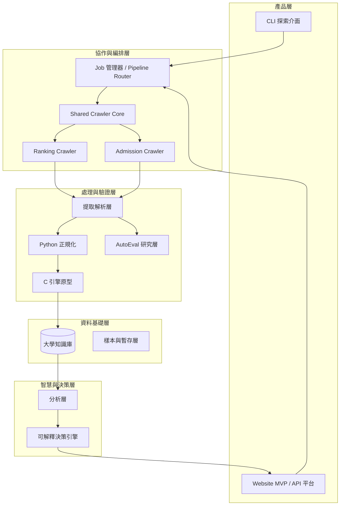
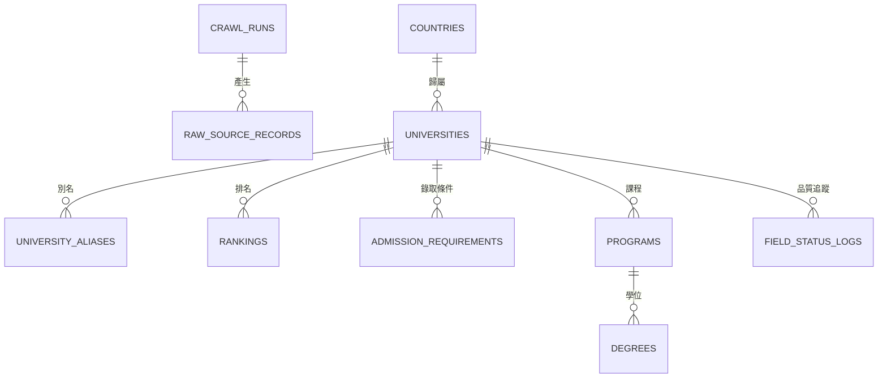
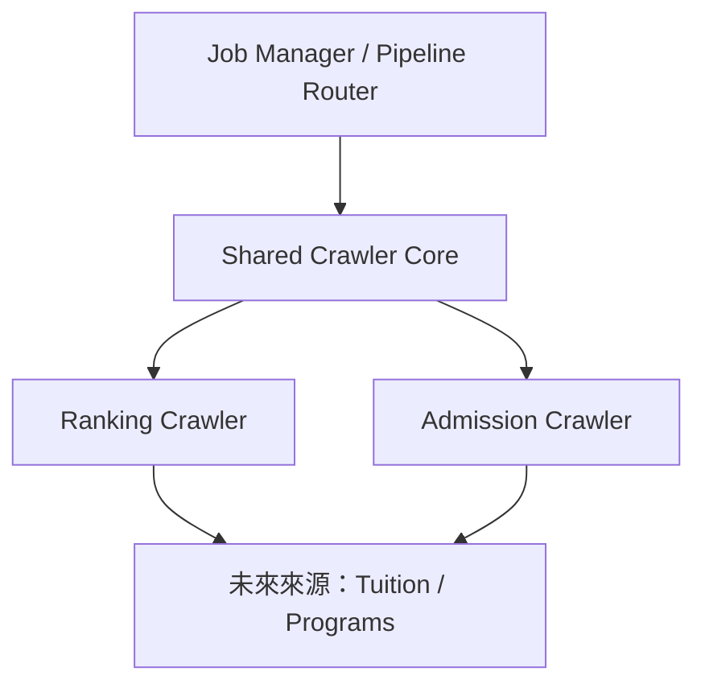
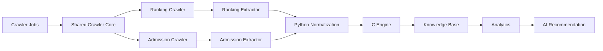

# CrawlerNest 系統架構白皮書

本文件為 CrawlerNest 專案的最高層級技術架構文件（Master Technical Architecture Document）。

本白皮書偏向願景、分層原則與演進方向，不應被直接解讀為「所有層都已經是現在的主執行路徑」。

CrawlerNest 的目標，不只是建立一套可以抓取大學資料的爬蟲，而是逐步演進成一個可持續擴展、可追溯、可分析、可推薦、可比較、可產品化的教育資料平台。

在此基礎上，CrawlerNest 也正在引入一層 **Mini-Agent Development Layer**，作為受控、可評估、且必須有人類監督的 AI-assisted development workflow。這一層並不是自治型 AI 系統，而是用來加速開發、強化評估閉環、並提升系統韌性的輕量化架構層。

CrawlerNest 的產品定位也不是「官方排名發布者」，而是：

- 多來源排名整合平台
- 透明化的 ranking evidence 與 trust signal 平台
- 可解釋的教育決策支援系統

其核心演進路線如下：

**資料採集 → 資料平台 → 分析能力 → AI 推薦 → 產品化**

在新的架構敘事下，CrawlerNest 的定位可進一步描述為：

**Data Infrastructure + Evaluation-Driven AI-Assisted System**

---

## 1. 文件定位

本白皮書作為 CrawlerNest 專案的最高層級技術架構文件 (Master Technical Architecture Document)，其用途如下：

- **決策基準**：作為中長期技術架構與產品演進決策的主參考維度。
- **語言統一**：統一 Crawler、Canonical、Aggregation、Decision 與 API 各層的設計語言。
- **願景與現況**：詳細說明產品願景、系統當前狀態以及歷史里程碑。
- **維護指南**：在功能擴充、資料模型調整或基礎設施變更時，提供一致的設計判準。

對於運維測試、驗證查詢與回歸檢查，請參閱《工程驗證與維護手冊》(TESTING_GUIDE.md)。

本文件聚焦於：

- 系統架構
- 分層模型
- 資料流程
- Mini-Agent development architecture
- 資料平台與知識庫設計
- 推薦系統設計
- 里程碑與路線圖
- 維運與風險管理

---

## 2. 平台現況與能力

CrawlerNest 目前採用 **Data-first（資料優先）** 的系統設計原則：

先建立可信任、可追溯、可擴充的資料平台，再在其上疊加分析、推薦與產品層能力。

### 2.1 當前策略重點（V1.5+ / Website Product Layer）

目前 CrawlerNest 的核心策略如下：

1. **資料正確性優先**：先把 crawl、extract、normalize、write、warehouse、API、web 主鏈穩定下來
2. **知識庫優先**：建立可查詢、可維護、可追溯的大學資料基底
3. **決策系統先 explainable 再 intelligent**：先以 deterministic recommendation / comparison / trust layer 打穩決策層，再逐步推進 AI 能力
4. **模組解耦**：crawler、extractor、normalization、db、analytics、API 彼此保持相對獨立
5. **低規節點可運行**：系統設計必須能支援老舊 x86 節點作為第一代 OpenClaw / Lobster Node
6. **合規優先加速**：在 robots.txt 與來源限制下，以本地解析並行、批次寫入、增量 checkpoint、局部更新等手段提升吞吐
7. **產品層逐步落地**：在不破壞資料平台與 API 穩定性的前提下，逐步交付 Rankings Browser、University Detail、Compare、Recommendation Engine 等網站能力
8. **可見性閉環優先**：爬到的資料若尚未 canonical 化或尚未回填至 `warehouse.ranking_record`，必須提供補種與回填路徑，避免資料永久停留在不可見層
9. **評估驅動的 AI 輔助開發**：Mini-Agent Layer 僅作為受控開發加速層，必須經過 AutoEval 與人工判斷後才可影響主系統路徑
10. **Admission trust 優先於 admission certainty**：admission extraction 不被直接視為絕對事實，而是先轉成可驗證、可合併、可降級、可解釋的 signals，再以 metadata 形式進入 recommendation 與 decision product

### 2.1.1 當前執行現實（Execution Reality）

若以目前工程主線來看，系統應優先理解為三個區域：

1. **Active Data Pipeline**
   `crawl -> extract -> normalize -> write -> warehouse -> API -> web`
2. **Controlled Expansion**
   admission enrichment 與 basic rule-based recommendation
3. **Development Support**
   Mini-Agent、AutoEval、較完整 aggregation / agent loop 等支援層

也就是說：

- Agent 不是 production data path 的一部分
- Admission crawler 仍處於 controlled pilot stage
- Data correctness 優先於 automation breadth

### 2.2 模組完成度地圖（截至 2026 年 4 月）

| 模組 | 說明 | 狀態 | 完成度 |
| :--- | :--- | :---: | :---: |
| 最小端到端流程 | `crawlernest/run_pipeline.py`（crawl → normalize → store → query） | 已運行 | ~90% |
| 長時間持續爬蟲 | 無限循環、KeyboardInterrupt 優雅關機、資料不遺失 | 已完成 | 100% |
| 採集 / 網路層 | 非同步請求、端點探測、分頁處理、保守抓取節流、shared crawler runtime boundary | 已運行 | ~88% |
| 多 universe 採集 | QS global / region / subject / special 統一路徑 | 已運行 | ~88% |
| 解析 / 提取層 | admission requirement、deadline、語言成績規則解析與 correctness-first guardrails | 已運行 | ~86% |
| Python 正規化基線 | 國家標準化、數值安全轉換、驗證流程 | 進行中 | ~80% |
| C 正規化引擎 | 名稱 / 國家 / 排名 / 分數高效處理 | 開發中 | ~25% |
| 實體識別 | 別名映射、人工校正、模糊比對基礎、unresolved / suspicious visibility | 進行中 | ~50% |
| 儲存 / 資料倉層 | PostgreSQL-only schema、DB writer、analytics views、Spring Data JPA、run traceability | 已完成 | ~95% |
| API 讀取層（唯讀 + 決策） | Spring Boot `/universities`、`/rankings`、`/recommendations`、`/compare`、scope-aware / country-aware filtering，且 country filter 已在最終 read query 依 canonical metadata 落地 | 已完成 | ~95% |
| Website Product Layer | Next.js Rankings Browser、University Detail、Ranking Evidence、Trust Layer、Recommendation UI、Compare Page、API Proxy、country-aware filter UI、assistant-facing decision surfaces | 已運行 | ~96% |
| 品質與驗證 | transaction rollback、early commit、AutoEval baseline、crawler guardrails、focused regression discipline | 已運行 | ~92% |
| 低規節點運行策略 | `lobster-01` runtime workspace、optimized scripts | 已完成 | 100% |
| 分析與推薦 | multi-universe aggregation、explainable comparison、scope-aware recommendation v3、admission signals、resolved admission metadata、composite、decision output、decision strategy、compact decision summary | 已運作 | ~96% |
| AutoEval 研究層 | extractor 評估、hard dataset、manual autoloop | 已運行 | ~72% |

---

## 3. 目錄

1. 平台現況與能力  
2. 系統總覽架構  
3. 系統分層模型  
4. 核心架構策略與機制  
5. 資料平台與知識庫設計  
6. Crawler 框架與 Job 管線  
7. 排名資料生產與解析工作流  
8. AutoEval 與資料品質演進層  
9. 實體識別與推薦架構  
10. 開發優先順序與執行策略  
11. 里程碑與四年路線圖  
12. 產品願景與能力地圖  
13. 風險與維護策略  
14. OpenClaw / Lobster-01 節點定位補充

---

## 4. 系統總覽架構

CrawlerNest 的長期技術架構如下：



核心演進原則：

**爬蟲採集 → 資料平台 → 分析能力 → AI 智能 → 產品化**

在新的系統敘事中，這條主路徑之外還補上一條受控的開發輔助側路：

**Task → Generate → Evaluate → Refine**

它不替代主資料管線，而是作為與 AutoEval 緊密耦合的 Mini-Agent Development Layer，服務於 extractor、workflow 與系統 refinement。

### 4.1 Mini-Agent 開發架構（Mini-Agent Development Architecture）

Mini-Agent Development Layer 的存在，不是為了追求「完全自動化」，而是為了處理工程系統中一個很實際的張力：

- 開發速度需要提升
- 但可靠性不能因此被犧牲

CrawlerNest 的解法不是把開發流程交給自治型 agent，而是建立一個受控、輕量、可評估的 mini-agent workflow，作為系統中的輔助層。

#### 4.1.1 為何需要這一層

當 crawler、extractor、normalization、ranking aggregation 與 recommendation 層逐步擴大後，單靠人工逐段調整雖然穩定，但會面臨兩個問題：

- refinement 速度不足，難以快速驗證多種改善方向
- 局部修改若缺乏評估閉環，容易把不穩定性引入主系統

Mini-Agent Layer 的價值，正是在這兩者之間建立平衡。它提供受控的 AI-assisted iteration，但不直接跳過驗證與人工審查。

#### 4.1.2 它解決的問題

Mini-Agent Layer 主要解決的是「development speed vs reliability」之間的矛盾：

- 對 extractor 規則、資料處理流程與局部系統邏輯進行更快的候選生成
- 透過 AutoEval 驗證生成結果是否真的改善品質
- 把 refinement 從一次性修改，轉成可比較、可回顧、可收斂的迭代過程

因此，這一層的目標不是取代工程師，而是讓工程決策有更高效率的候選產生與更明確的驗證基準。

#### 4.1.3 概念運作方式

Mini-Agent Layer 採用的是概念上清楚、責任邊界明確的循環：

**Task → Generate → Evaluate → Refine**

其含義如下：

- **Task**：由人類定義範圍、目標與約束
- **Generate**：產生候選修正、候選策略或候選流程調整
- **Evaluate**：透過 AutoEval 或其他驗證機制評估候選結果
- **Refine**：根據評估結果進一步收斂，而非直接視為最終答案

這是一個受控 loop，而不是無邊界的 agent autonomy。它的本質是 evaluation-driven iteration。

#### 4.1.4 與既有系統的整合方式

Mini-Agent Layer 並非獨立產品，而是作為 CrawlerNest 的 system-integrated intelligence layer。

它與下列模組的關係特別重要：

**a. Extractor**  
Extractor 是最適合 mini-agent 輔助 refinement 的區域之一。因為 extractor 經常面對來源差異、格式漂移與欄位不一致問題，Mini-Agent Layer 可用於提出候選解析策略，但仍需以評估結果決定是否採納。

**b. AutoEval**  
AutoEval 是 Mini-Agent Layer 的核心約束機制。沒有 evaluation 的生成只是一種提議；只有經過 AutoEval 驗證且通過人工判斷的 refinement，才有資格進入主系統考量範圍。

**c. Pipeline**  
Mini-Agent Layer 不直接取代主 pipeline。Crawler、normalizer、database、analytics 與 recommendation 仍是主系統的正式責任鏈。Mini-Agent Layer 的角色是加速 refinement、降低人工試錯成本，並強化可靠性，而不是成為新的 production truth source。

### 4.2 設計原則（Design Principles）

CrawlerNest 在引入 Mini-Agent Development Layer 後，設計原則變得更加明確：

#### 4.2.1 評估優先開發（Evaluation-First Development）

生成不是終點，評估才是決策依據。所有 AI-assisted refinement 都應盡量被拉回到可驗證、可比較、可重跑的評估流程中。

#### 4.2.2 受控自動化優於完全自治（Controlled Automation Over Full Autonomy）

CrawlerNest 選擇的是受控自動化，而不是追求完整自治。原因很直接：資料平台的價值建立在穩定性、可追溯性與責任邊界，而不是最大化自動生成的表面速度。

#### 4.2.3 系統可靠性優先於原始速度（System Reliability Over Raw Speed）

更快的 iteration 很重要，但如果它破壞資料品質、讀取穩定性或推薦可信度，整體系統價值反而會下降。因此，可靠性始終優先於未經驗證的加速。

#### 4.2.4 人類監督是核心約束（Human Oversight as a Core Constraint）

Human-in-the-loop 並不是過渡方案，而是架構本身的一部分。人類負責定義任務邊界、判斷風險、審視評估結果，並決定哪些 refinement 可以真正進入系統。

### 4.3 統一演進視圖（Unified View）

```text
全球來源（QS / THE / ARWU / 校方網站 / 未來第三方來源）
        ↓
採集與匯入層（async jobs / fetch / parse）
        ↓
正規化與實體識別（Python 基線 + C 引擎 + alias/fuzzy/embedding）
        ↓
大學知識庫（rankings / admission / programs / degrees / tuition）
        ↓
分析層 + 推薦引擎 + API 層
        ↓
B2C / B2B 產品化
```

對應分期：

- **當前（V1.5+）**：採集、正規化基線、PostgreSQL-only 資料平台、決策 API、Website Product Layer、AutoEval baseline
- **下一階段（V2）**：多來源整合深化、實體識別升級、program-level analytics、產品層穩定化
- **未來（V3+）**：LLM 輔助研究、公開 API、完整 Web 平台、產品化擴張

### 4.4 從本機系統走向可分離部署平台（From Local System to Distributed Platform）

CrawlerNest 最初是以 local-first 的研究與工程系統型態建立。這個起點是合理的：單機環境能讓 crawler、normalization、資料庫、API 與前端原型在同一台機器上快速迭代，降低早期部署與基礎設施負擔。然而，當系統逐步演進為多層資料平台後，`localhost`-only 的運行方式已不再只是簡單，而是開始成為結構性瓶頸。

#### 4.4.1 為何 local-only 架構會成為瓶頸

**資源限制（CPU / Memory / I/O）**  
單一開發機器若同時承載 Python crawler、ingestion pipeline、C-based normalization、PostgreSQL、Java API 與 Next.js frontend，實際上是在讓高負載 batch 工作與 user-facing read workload 競爭同一組 CPU、記憶體與磁碟 I/O。當資料量與功能數量增加後，這種共置模式會讓：

- 爬蟲與 ingestion 降低 API 響應穩定性
- DB query 與前端 build 互相爭搶資源
- 長時間背景作業放大本機開發的不確定性

**開發與運行環境耦合**  
在 localhost-only 模式下，開發環境與實際服務執行環境高度耦合：

- 本機 debug 狀態可能直接影響服務行為
- 舊 process、舊 build、舊 port 狀態容易造成誤判
- 測試資料、局部修補與正式展示資料共存在同一執行面

這種耦合在早期探索階段可接受，但不適合作為持續對外服務的架構基礎。

**環境依賴與不穩定性**  
本機執行天然受限於單一開發機器的環境條件，包括：

- JDK / Node.js / Python 版本差異
- 本機路徑、port、process 殘留
- 長時間運行後的記憶體壓力與暫存狀態

這些問題會使「在我電腦上可以跑」與「系統可穩定對外提供服務」之間出現落差。

**缺乏外部可達性**  
只存在於 localhost 的系統無法成為真正的產品介面。它不具備穩定的公共入口，因此無法支持：

- rankings browser 的外部使用
- university detail、compare、recommendation 的真實產品驗證
- 非開發者對 API 與 UI 的直接存取

因此，當 CrawlerNest 的目標從研究系統轉向資料平台與產品介面時，系統必須從 local-only 演進為可分離部署的架構。

#### 4.4.2 架構轉型策略

CrawlerNest 的轉型不是一次性重寫，而是以分層責任拆分為核心的漸進式演進。

**a. Data Production Layer**  
資料生產層負責產出與更新平台資料，包含：

- Python-based crawling
- ingestion / backfill / repair workflows
- normalization 與 validation
- C-based normalization engine

這一層具有 batch-oriented、可重試、資源密集、對外不可直接暴露等特性，因此應維持在受控環境中執行。

**b. Data Serving Layer**  
資料服務層負責對外提供已產生資料的穩定讀取能力，包含：

- PostgreSQL persistent data layer
- Java-based read API
- Next.js frontend interface

這一層應追求可預測、可觀察、可對外存取，而不應直接與高波動的 pipeline execution 綁在一起。

**解耦 pipeline 與 user-facing services**  
核心原則是：資料生成與資料提供不應共享同一個運行責任邊界，除非有明確的工程必要。Crawler、normalization、backfill 與 ingest job 可以失敗、重試、重跑；而面向使用者的 API 與 frontend 則需要更穩定的讀取環境。將兩者解耦，有助於避免 batch workload 直接拖垮產品層穩定性。

**從單機整合執行走向分散式部署**  
因此，CrawlerNest 的演進方向是：

- 不再由單一 localhost 同時承載所有層
- 將 heavy data production 與 public read serving 分離
- 讓資料層、API 層與 frontend 能夠獨立部署與演進

這不是為了追求抽象化，而是基於實際工作負載與穩定性要求的必要拆分。

#### 4.4.3 部署模型（高層設計）

CrawlerNest 的部署模型採取高層、供應商中立的設計原則。

**Frontend**  
Next.js frontend 作為對外的公共 Web 介面，負責：

- rankings browsing
- filtering / search
- ranking evidence / trust display
- compare 與 recommendation workflow 入口

**Java API**  
Java read API 作為可擴展的 read service，負責：

- 封裝 rankings / detail / compare / recommendation 的產品級回應
- 執行 read-time filtering 與 product semantics
- 暴露 evidence、trust、aggregation explain 等欄位

**PostgreSQL**  
PostgreSQL 作為持久化資料層，保存：

- canonical entities
- ranking facts
- aggregated views
- lineage / traceability fields
- admissions 與輔助 metadata

**Crawler 與 heavy processing**  
Crawler、normalization、ingestion 與大批次修復流程仍應保留在受控環境，例如：

- local engineering machines
- dedicated internal nodes
- 專用 batch execution hosts

這些工作負載不必直接對外暴露，但必須與 public read surface 明確分離。

#### 4.4.4 設計哲學

CrawlerNest 的部署哲學可概括為：

**Local-first development, cloud-enabled delivery**

其含義不是把所有東西都立刻雲端化，而是：

- 開發與調試仍可從本地開始
- 資料生成維持在可控制、可審計的環境
- 只將必要的 read interface 對外公開
- 維持資料再現性與 traceability

這個策略同時強調兩件事：

**資料生成必須受控**  
爬蟲、normalization 與 backfill 是高權限、高變異、高成本的流程，不應直接與公共服務面混合。

**對外暴露應最小且明確**  
公開的是必要的 read interfaces，而不是整個資料生產系統。這有助於降低運維風險，也讓產品邊界更清晰。

#### 4.4.5 轉型帶來的收益

這種架構演進帶來的收益是具體而可驗證的：

- **系統穩定性提升**：crawler 與 batch job 不再直接干擾 user-facing read path
- **降低開發機負載**：開發機不必長期同時扮演 crawler node、DB host、API host 與 frontend host
- **更接近真實使用情境**：可在更接近產品環境的條件下驗證 API contract、filtering、compare、recommendation 等流程
- **支援真正的對外產品功能**：search、filtering、comparison、evidence display 只有在穩定對外介面存在時才有產品意義
- **為未來擴展預留空間**：analytics、recommendation、AI-assisted research 等能力可建立在更乾淨的 serving boundary 之上

#### 4.4.6 範圍澄清

這個轉型需要明確界定其範圍與意圖。

**這不是完整的 production-scale infrastructure**  
CrawlerNest 目前仍不是全域高可用、多區部署、完全自動化基礎設施的成熟平台。

**這是 staged evolution，不是一次性重構**  
系統正在從 local research system 漸進式演化為可對外提供服務的資料平台。這是一條分階段路線，而不是全面重建。

**重點是務實部署，而不是過度工程化**  
目標不是引入超出當前需求的複雜基礎設施，而是僅在必要處建立清晰的執行邊界，以提升：

- 穩定性
- 可維護性
- 外部可達性
- 產品層可驗證性

CrawlerNest 的演進方向，是在保留 local-first 工程效率的前提下，逐步建立 cloud-enabled、可分離部署、可持續擴展的資料平台能力。

### 4.5 Node Machines 在 CrawlerNest 中的角色（Role of Node Machines in the CrawlerNest Architecture）

在 CrawlerNest 從 local monolith 演進為分散式資料平台之後，node machines 的角色變得更加明確：它們不再只是「跑爬蟲的電腦」，而是整個資料生產層的專用執行節點。

#### 4.5.1 定義

Node machine 指的是一台專門負責**資料生產（data production）**的機器。它的主要職責是產出、更新與修復平台資料，而不是直接對外提供產品介面。

其基本特徵如下：

- 不是 user-facing machine
- 不作為公開 Web 入口
- 不直接暴露給終端使用者
- 專注於受控、可重跑、可追溯的 pipeline execution

換言之，node machines 屬於內部資料生產基礎設施，而不是 public platform 的一部分。

#### 4.5.2 核心責任

在目前架構中，node machines 主要承擔以下工作：

**資料採集**  
負責從外部來源抓取資料，例如：

- QS
- THE
- ARWU
- 校方或未來第三方資料來源

**資料正規化**  
負責欄位層與語意層的正規化，包括但不限於：

- 名稱正規化
- 國家正規化
- 分數與欄位格式清洗
- C-based normalization engine 的執行或整合

**實體識別（Entity Resolution）**  
將不同來源的同一所大學對齊為同一個 `canonical_university`，避免多來源資料碎片化。

**排名聚合與資料修復**  
負責將 multi-source ranking facts 匯入、回填、聚合，並刷新產品層所依賴的 aggregated truth。

**寫入 PostgreSQL**  
Node machines 的輸出最終會落到 PostgreSQL，作為系統的 persistent data layer，包括：

- canonical entities
- ranking records
- admissions / metadata
- aggregated ranking views
- traceability fields

**排程化 pipeline 執行**  
Node machines 適合承載長時間、可中斷、可恢復的排程工作，例如：

- 定期 crawl / ingest
- backfill
- retry / recovery
- snapshot / checkpoint-based execution

#### 4.5.3 與 Public Platform 的責任分離

CrawlerNest 在部署後明確分為兩個主要責任區塊：

**Node machines = data production**  
負責資料生成、資料修復、正規化、聚合與寫入。

**Public platform = data serving**  
負責提供已產生資料的讀取介面，包括：

- Java read API
- Next.js frontend
- user-facing search / filtering / comparison / recommendation surface

因此，public API 的責任不是執行重型計算，而是**讀取已預先計算完成的資料**。  
換句話說，CrawlerNest 的產品層遵循一個明確原則：

> heavy computation does not happen on the public request path

對使用者而言，看到的是預先產生、可重現、可追溯的結果，而不是即時在請求期間動態跑出來的高成本計算。

#### 4.5.4 為什麼這種分離是必要的

這種架構分離的必要性來自幾個工程事實。

**避免 user-facing services 被重負載拖垮**  
Crawler、normalization、aggregation 與 backfill 都屬於高 CPU / 高 I/O / 長時間任務。若這些工作與 API / frontend 共置，使用者體驗會直接受到背景工作干擾。

**提升系統穩定性**  
資料生成流程允許失敗、重試、暫停與恢復；但 public read service 需要可預測與穩定。將兩者拆開，能降低 batch volatility 對服務層的衝擊。

**支持獨立擴展**  
資料生產層與資料服務層的 scaling pattern 不同。crawler node 需要的是排程、節流、checkpoint 與 I/O 韌性；read API / frontend 則更關心查詢穩定性、響應時間與外部可達性。

**避免 development environment 與 deployed system 混在一起**  
如果所有責任仍集中在單一機器上，開發、測試、資料生成與產品服務會互相污染。節點化後，可以更清楚地區分工程環境與對外服務環境。

#### 4.5.5 設計哲學

Node machines 在 CrawlerNest 中所承載的，不只是「跑任務」，而是一套明確的設計哲學：

**Compute offline, serve online**  
高成本計算應盡量在離線、可控制、可重跑的環境中完成；對外介面則應只提供穩定的讀取能力。

**Heavy processing is isolated from user interaction**  
使用者行為不應直接觸發 crawler、normalization 或 aggregation 等高成本工作。產品層看到的是已處理完成的資料，而不是正在執行中的 pipeline。

**Data must be reproducible and traceable**  
Node machines 執行的每一次 crawl、ingest、normalization 與 aggregation，都應能被回溯與重現。這是資料平台可信度的基礎。

#### 4.5.6 未來可擴展性

目前的 node machines 還不是完整 distributed cluster，但它們已經構成未來分散式資料基礎設施的雛形。

未來可自然演進為：

- **crawler nodes**：專門負責不同來源或 universe 的抓取
- **aggregation nodes**：專門負責聚合、回填與視圖刷新
- **analytics nodes**：專門負責更高成本的分析、評估與推薦前處理

這種 specialization 讓不同節點能根據任務特性獨立調整資源與運行策略，而不需要把所有責任集中在單一 host。

#### 4.5.7 範圍澄清

需要明確指出，CrawlerNest 當前的 node machine 架構：

- 不是完整的分散式叢集
- 不是為了極限規模而設計的即時運算系統
- 不是一開始就追求最大化吞吐的 infrastructure build-out

目前階段的重點是：

- correctness
- reliability
- reproducibility
- clear execution boundaries

也就是說，CrawlerNest 正在進行的是一個**受控且可擴展的架構轉型**。Node machines 的價值不在於「已經大規模分散式」，而在於它們為資料生產與資料服務之間建立了清晰、可維護、可持續擴展的責任邊界。

---

## 5. 系統分層模型

CrawlerNest 採用五層解耦架構，確保各模組獨立演進：

### Layer 1：資料採集層 (Data Layer - Acquisition)

負責排名、錄取條件、未來學程與學費資料的非同步採集。具備 403 自動降級與端點探測能力。

### Layer 2：資料品質與正規化層 (Canonical Layer - Processing & Resolution)

負責欄位清洗、正規化、實體識別 (Identity Resolution) 與型別安全檢查。將原始來源數據轉換為統一的 Canonical 格式。

### Layer 3：整合儲存層 (Aggregation Layer - Storage)

作為單一真實來源 (Single Source of Truth)，在 PostgreSQL 中存儲原始記錄、標準化實體、聚合後的排名數據與維運日誌。

在目前版本中，單一真實來源已進一步細化為：

- `warehouse.universities`：raw / source-facing university dimension
- `warehouse.canonical_university`：canonical identity truth
- `warehouse.canonical_university_link`：raw university → canonical entity link
- `warehouse.ranking_record`：universe-aware ranking fact truth
- `analytics.v_aggregated_rankings_latest`：產品層與 API 讀取的最新聚合真相

### Layer 4：決策分析層 (Decision Layer - Analytics & Recommendation)

核心決策大腦，整合「分析」與「推薦」功能。包含排名聚合邏輯、可解釋的學校對比與基於信心模型 (Confidence Model) 的 Reach/Target/Safety 推薦。

目前決策層已進一步補上 admission trust chain。Admission extraction 不直接進入 scoring truth，而是先被轉為 `AdmissionSignal`，經 validation 與 resolver 合併成 `ResolvedAdmissionField` 後，才以 `admissionResolved` metadata 形式進入 recommendation item。這些 metadata 只影響 explanation、assistant reply、decision summary、UI badges 與 export，不改變排序、過濾或計分。

### Layer 5：API 與產品層 (API Layer - Product)

將決策層的能力透過嚴格型別化 (Typed JSON Envelope) 的 API 暴露給前端產品 (如 Next.js Website Product Layer)，將複雜的工程數據轉化為使用者決策。

分層目的在於：

- **降低耦合**：各層獨立運作與擴展
- **明確職責**：每一層都有清晰的輸入與輸出定義
- **演進彈性**：例如 API 層變更不影響底層採集邏輯

---

## 6. 願景與策略

### 6.1 核心願景

建立一套可持續、可自動化、可解釋的全球大學資料智慧系統，成為未來四年教育決策支援的資料底座。

### 6.2 策略目標

- **資料可信度優先**：強化正規化、實體識別、血緣追蹤與稽核能力
- **架構可擴展性優先**：從專用爬蟲演進為通用教育資料平台
- **決策價值導向**：逐步提供具可行動性的分析與推薦能力
- **可運維性優先**：支援低規節點長時間穩定運作
- **可優化性優先**：建立 AutoEval 等自我改善能力，而非只依賴人工調參

### 6.3 產品定位 (Product Positioning)

CrawlerNest 的競爭優勢與市場定位如下：

- **對比靜態網站 (如 QS, THE, ARWU)**：我們不只顯示單一來源的排名，而是聚合多來源數據，並把來源差異、evidence、trust 與比較邏輯一起暴露給使用者。
- **對比傳統留學代辦 (Agencies)**：我們提供透明、基於演算法且可解釋的推薦與比較，降低傳統代辦可能存在的資訊不對稱與主觀偏見 (black-box bias)。

這代表 CrawlerNest 的關鍵競爭點不是「宣稱更權威」，而是：

- 更透明
- 更可解釋
- 更容易做 side-by-side decision support
- 更容易讓使用者理解資料的不確定性

---

## 7. 核心架構策略與機制

### 7.1 關鍵工程概念 (Key Engineering Concepts)

- **實體識別與多來源未來 (Entity Resolution)**：CrawlerNest 透過將不同來源 (QS, THE, ARWU) 的大學名稱解析為單一 `canonical_university` 實體來處理數據異質性。重疊的排名不會被覆蓋，而是作為獨立的 `ranking_record` 關聯到同一實體。
- **排名聚合 (Ranking Aggregation)**：多來源數據經由 rank-based aggregation 結合為 `aggregated_rank`。目前聚合已支援 multi-universe truth：`global`、`region:*`、`subject:*` 可分 universe 獨立計算，不再以 global filter 假裝 region truth。
- **Ranking Evidence 與 Trust Layer**：產品層可顯示 QS / THE / ARWU 原始來源 rank、source agreement/disagreement、trust score 與 trust explain，避免把聚合結果包裝成不可解釋的單一數字。
- **Canonical Country Filtering**：`/rankings` 的 `country` filter 不改 aggregation layer；它在最終 read query 上 join `canonical_university` / `countries` metadata 後套用，並在 validation、SQL filter、`metadata.countryOptions` 三處共用同一套 canonical country normalization，避免 `China` / `China (mainland)` / `USA` 這類 alias 造成空結果或重複選項。
- **推薦決策系統 (v3) 與信心模型 (Confidence Model)**：最新推薦器將學校嚴格分類為 Reach、Target 與 Safety。動態信心模型會根據底層數據品質 (如是否缺失錄取分數要求) 調整預測準確度。
- **Admission Signal Schema / Resolver**：admission requirement 不直接被視為最終事實。系統會先建立帶有 `source_type`、`extraction_method`、`confidence`、`evidence_text` 與 `status` 的 admission signals，再透過 deterministic resolver 合併成 field-level resolved values。衝突與低信心狀態保留到產品層，避免把不確定資料包裝成確定結論。
- **Decision Summary Compact**：recommendation service 產生 `decisionSummaryCompact`，作為 UI banner、assistant reply 與 text export 的共用一行摘要來源。這讓「推薦方案、信心、風險、下一步」在產品介面與匯出內容中保持一致。
- **Compare 作為產品決策層**：Compare Page 讓 shortlist 中的 2–4 所學校能 side-by-side 比較 aggregated rank、source evidence、trust、IELTS 與 warnings，讓產品從瀏覽工具進一步變成 decision-support surface。
- **Lobster-01 基礎設施節點**：專用的低規控制節點，利用 systemd timers 與批次 I/O 執行長時間背景 pipeline，確保在受限硬體上的高韌性運作。
- **可見性修復路徑 (Visibility Recovery Path)**：若 crawler 已將學校寫入 `warehouse.universities`，但尚未 canonical 化或尚未回填為 `warehouse.ranking_record`，系統可透過 `seed-canonical` 與 `backfill-ranking-records` 讓資料重新進入可見聚合真相。對於 THE 這類不經過 `warehouse.universities` 的來源，則可透過 `seed-canonical-from-missing` 直接從 `analytics.missing_entity_log` 補種 canonical entities 後再重跑 ingestion。

### 7.2 全域參數與組態

- 以 `Config`（Python Dataclass）集中管理參數
- 併發控制採 `asyncio.Semaphore` + worker / concurrency 雙層節制
- 低規節點安全預設：`workers = 1`、`concurrency = 1`、`request_delay ≈ 10s`
- 全域 timeout 預設 30 秒
- 重試策略採指數退避：`wait = retry_delay * (retry_backoff ** attempt)`
- 長時間運行保護依賴：`resource_guard`、`resume`、checkpoint/snapshot

### 7.2 採集策略：Schema-driven + 探針模式

- 以來源結構 schema 取代硬編碼邏輯
- NID / page id / endpoint 透過多條 regex 鏈與來源特徵自動探測
- 主路徑失敗時，允許 fallback 到關聯頁面或替代結構

### 7.3 解析與正規化策略

- 視窗化提取（windowed extraction）降低噪音污染
- 區段隔離（例如依學制、區塊、表格）避免欄位交叉污染
- 欄位失敗時保留 `unparsed` 與 raw 值，便於回溯與除錯
- 採雙層正規化：
  - Python：主流程驗證與清洗
  - C engine：未來高頻字串與數值解析加速

### 7.4 分數與邏輯一致性

- 區間分數（如 7.0–7.5）可取中值或依策略正規化
- IELTS / TOEFL / GRE / GMAT 等分數設合理範圍檢查
- 綜合評分採標準化策略：

```text
Score_final = Σ(Score_raw / Score_max × 100) / N_valid
```

### 7.5 匯出與呈現

- CLI 表格以可讀性優先
- CSV 匯出預設 UTF-8 BOM，提升 Excel 相容性
- API 層以唯讀資料展示為主，避免過早暴露複雜寫入邏輯

---

## 8. 資料平台與知識庫設計

CrawlerNest 已從單純爬蟲輸出，逐步演進為具備維度 / 事實 / lineage 的資料平台基線。

### 8.1 Canonical 資料模型（V1.5）

核心資料表：

- `crawl_runs`
- `raw_source_records`
- `countries`
- `universities`
- `university_aliases`
- `rankings`
- `admission_requirements`
- `programs`
- `degrees`
- `tuition`
- `field_status_logs`

關係主軸：



### 8.2 表職責摘要

- `crawl_runs`：批次執行狀態追蹤
- `raw_source_records`：原始資料暫存與重解析基礎
- `universities / countries`：核心實體與地理維度
- `university_aliases`：來源名稱映射與 identity resolution 基礎
- `rankings / admission_requirements`：分析與推薦最關鍵的訊號表
- `programs / degrees / tuition`：為 V2 / V3 預留
- `field_status_logs`：欄位品質、失敗原因與稽核能力

### 8.3 長期資料模型方向

由 school-centric 演進為：

**University → Program → Degree**

長期重點：

- identity resolution 從 manual / alias，升級為 fuzzy / embedding
- ranking / admission / tuition / outcome 資料逐步特徵化
- 讓 schema 對推薦系統與分析系統友善（ML-ready）

### 8.4 Schema 與索引策略

目前提供：

- 正式 runtime schema：`crawlernest-schema/postgresql_schema.sql`
- 補充 schema：`entity_resolution_postgresql.sql`、`multi_source_postgresql.sql`、`ranking_aggregation_postgresql.sql`、`recommendation_postgresql.sql`
- `crawlernest-schema/schema.sql` 僅保留為 archived legacy SQLite schema

建議持續維護：

- `idx_universities_slug`
- `idx_universities_country`
- `idx_university_aliases_source_name`
- `idx_raw_source_records_source_type`
- `idx_raw_source_records_crawl_run`
- `idx_rankings_university_year`
- `idx_rankings_source_type`
- `idx_rankings_raw`
- `idx_admission_requirements_university`
- `idx_field_status_logs_university`

---

## 9. Crawler 框架與 Job 管線

### 9.1 共享 Core + 雙 Crawler 架構

系統目前不再以「單一 crawler engine 包所有來源」作為長期架構描述，而是演進為：

- **共享 crawler core**
  負責 transport、retry、timeout、logging、checkpoint、resume 等共通 runtime 能力
- **ranking crawler**
  專責 QS / THE / ARWU 等 ranking-source crawling 與 ranking staging workflow
- **admission crawler**
  專責 admission / requirement / school-site extraction workflow
- **job orchestration layer**
  負責 routing、批次控制、恢復執行與 pipeline 命令編排

這樣的分工比過去的單一 crawler 敘事更符合現在的實作邊界，也更適合未來擴充不同來源、不同節奏與不同資料契約的工作流。

其主要好處如下：

- 統一錯誤處理
- 統一 logging
- 統一 retry / timeout
- 統一 pipeline 編排
- ranking 與 admission 邏輯清楚分域
- 不同 crawler 可獨立測試、獨立演進、獨立控制風險



### 9.2 Job 級編排

目前與未來可抽象成不同 jobs，例如：

- `qs_world_rankings`
- `qs_subject_rankings`
- `mit_admission_sync`
- `ucla_admission_sync`

優勢：

- 排程粒度高
- 故障隔離好
- 可觀測性提升
- 未來更容易掛上 scheduler / node manager

### 9.3 全量 + 增量策略

- **Full Crawl**：週期性全量更新
- **Incremental Update**：針對 admission / program 層做局部刷新
- **Low-spec Execution**：在老舊節點上以低併發、保守節流、resume/checkpoint 模式執行長任務

目前已落地的增量與加速機制（V1.5）：

- **兩段模式**：可先跑 `rankings-only`（僅主榜單），再於需要時補抓 detail requirements
- **403 自動降級**：detail 連續 403 達門檻時，自動切回 rankings-only，避免整批任務中斷
- **待補抓清單輸出**：降級觸發後輸出 `pending_detail_enrichment.json`，保留後續補抓任務
- **小批次補抓子命令**：`enrich-details` 以小批次補抓 detail，成功寫回 admission，失敗保留清單續跑
- **局部更新寫入**：以 `school_slug + ranking_type + year` 先比對現有資料，未變動者跳過寫入
- **checkpoint 增量化**：執行中先寫入 journal，完成後 compact，兼顧續跑速度與完整性
- **批次寫入**：writer 層對 raw / alias / rankings / admissions 採 `executemany` 類批次路徑
- **失敗參數黑名單（TTL）**：對重複失敗的 API 參數組合暫時停用，避免反覆慢失敗

### 9.4 排名資料策略

- HTML extraction 為主，API 為輔
- 採統一 rankings table 容納多榜單
- 透過 `metrics_json` 保留不同榜單指標彈性

### 9.5 端到端資料流程



### 9.6 低規節點運行模式（OpenClaw / Lobster Node）

CrawlerNest 已明確區分：

- **開發主機**：負責功能開發、除錯、測試、小規模驗證
- **低規控制節點**：負責低並發 crawler、長時間 jobs、writer node、checkpoint/resume 與穩定性驗證

建議 Low-spec mode 安全預設：

- `workers = 1`
- `concurrency = 1`
- `request_delay = 8 ~ 12s`（建議 10 秒）
- `write_batch_size = 100 ~ 300`（依節點 I/O 能力微調）
- `log level = INFO`
- `resource_guard = enabled`
- `resume = enabled`

建議的日常執行模式：

- 主流程固定入口：`crawlernest/scripts/run_production_safe.sh`
- 若觸發 detail 降級：執行 `python3 crawlernest/run_pipeline.py enrich-details --limit 30 --request-delay 10`
- 原則：先穩定入庫主資料，再分批補齊 detail，避免單次任務因 WAF 阻擋全批失敗

設計原則不是追求極限吞吐，而是：

**慢慢跑、持續跑、壞了能續跑。**

---

## 10. 排名資料生產與解析工作流（Ranking Data Production & Resolution Workflow）

本章描述 CrawlerNest 目前已落地的 ranking 專用資料生產與實體解析工作流，以及其與更下游 production read model 之間的安全邊界。

### 10.1 設計目標

這條 ranking workflow 被設計成一條受控的資料生產管線，而不是直接寫入 production-facing model 的捷徑。它的核心目的，是建立一條可重跑、可觀測、可審計的排名資料生產流程，在資料尚未進入更下游的聚合與產品層之前，先把資料品質與實體解析風險隔離開來。

這一層設計主要服務以下幾個目標：

- 建立具備明確 checkpoint 與 artifact 的可重跑資料生產流程
- 將 crawling、transformation、validation、persistence 與 entity resolution 拆成清楚的責任階段
- 避免未驗證或低信心解析的資料直接進入 production-oriented schema
- 讓自動化流程與人工 curation 可以在同一套 operating model 中共存
- 讓每一個階段都能獨立驗證、獨立觀察、獨立重跑
- 為未來 production integration 預留空間，而不要求上游流程被重新設計

整體取向是以安全、可追溯與可運維性優先，而不是過早追求一步到位的最終模型。

### 10.2 流程概覽

目前 ranking workflow 可概括如下：

```text
crawl -> raw -> normalized -> staging -> validate -> ingest -> warehouse preview -> warehouse landing -> resolve -> report -> seed -> refresh
```

每一層都有清楚的角色：

- `crawl`：從 ranking crawler 收集來源資料
- `raw`：保留最原始的結構化 crawl 輸出，作為檢查與重放基礎
- `normalized`：將核心欄位轉成一致的內部格式
- `staging`：把 normalized rows 落成輕量中繼層，供後續流程消費
- `validate`：在持久化之前先套用 deterministic data quality checks
- `ingest`：將驗證通過的資料寫入受控 persistence target
- `warehouse preview`：先把 staging rows 映射成 warehouse-oriented 結構，但尚不承諾為最終 production model
- `warehouse landing`：將 warehouse-ready rows 寫入專用 landing table
- `resolve`：用 deterministic matching 規則附加 canonical university identity
- `report`：統計 unresolved entities，供人工 review
- `seed`：允許人工補入 alias，提升後續 resolution coverage
- `refresh`：在 curation 之後重新跑 resolution 與 unresolved reporting

這條 pipeline 是刻意分層的，因為每一層都代表一種新的責任與控制點，而不是把所有事情壓進單一寫入路徑。

### 10.3 中繼層設計（Staging Layer）

Staging layer 的存在，是為了在 normalized crawl output 與 persistent storage 之間建立一條安全邊界。系統不是在 normalization 完成後就直接寫入資料庫，而是先把資料落成一個簡單、可檢視、可重跑的 staging representation。這個中繼層同時扮演 inspection point、replay point 與 failure-isolation point。

檔案型 staging representation 之所以有價值，原因包括：

- 容易人工檢視
- 可以無副作用地重新產生
- 允許 validation 在任何資料庫 mutation 之前先發生
- 為 extraction 與 persistence 之間提供明確 handoff

這樣的設計可避免 crawler output 太早與資料庫契約緊耦合。若 crawler 行為變動、normalization 規則調整，或 validation 標準收緊，這些變化都可以先在 staging 邊界內被吸收，而不會立刻衝擊下游 warehouse 或 read layer。

validator 在這裡扮演的是 staging gate。它的責任，是在 ingest 之前先擋下明顯無效或結構不安全的資料，例如 required fields 缺失、數值欄位異常、時間欄位不合法，或在定義鍵下出現重複列。它不是一套完整的資料品質平台，而是一個保守但實用的前置安全閘門。

---

### 10.4 倉儲映射與落地層（Warehouse Mapping & Landing）

在 staging rows 與 warehouse-ready rows 之間，系統刻意維持一條明確的 mapping 邊界。staging representation 保存的是 normalized operational data，而 warehouse-oriented representation 則反映這些資料應如何被塑造成可長期保存、可追溯、並可支援未來下游建模的結構。

這種分離之所以重要，是因為 staging data 與 warehouse data 本質上服務的是不同目的：

- staging 是 operational 且偏 transient 的
- warehouse-ready data 則是為 persistence、traceability 與未來 integration 準備的
- 並非每個 staging field 都能直接對應到長期 warehouse 概念
- 有些 warehouse 欄位必須帶有預設值、placeholder，或等待後續 resolution

在 warehouse landing 之前，系統會先產出 preview artifact，讓 mapping 假設可被檢視，而不必立即寫入持久化的 warehouse tables。這讓 mapping layer 更容易被審核，也更容易在未來演進。

warehouse landing table 也不是被當成最終 production model。它的角色，是接住 warehouse-ready rows，形成一個穩定但非最終的落地層。這讓平台可以先持久化已映射的 ranking records，確認資料結構與數量，再繼續往後做 resolution 與更高層的 downstream integration，而不會過早綁死在最終 read pattern、aggregation 規則或 product-facing schema 上。

### 10.5 實體解析策略

目前的 entity resolution strategy 是刻意保守的。它採用 deterministic exact matching，而不是 probabilistic 或 heuristic 的方法。這個第一版的目標不是追求最大 coverage，而是先建立可靠、可解釋、可回滾的 identity attachment 能力。

它建立在兩個核心概念之上：

- canonical university entity：代表一所學校穩定的內部 identity
- alias layer：保存應解析到同一 canonical entity 的替代名稱

目前的 resolution 順序如下：

1. 先對 canonical normalized university names 做直接匹配
2. 若沒有直接命中，再透過已知 alias 做精確匹配
3. 若兩者都沒有命中，則標記為 unresolved

因此，目前的 resolution status 是二元的：

- `resolved`
- `unresolved`

這種方式避免了系統在 identity 層面產生靜默歧義。fuzzy matching 與 AI-based matching 雖然看似能提升 coverage，但也會引入更高的 false positive 風險、更難解釋的判定過程，以及更難回滾的錯誤合併。在這個階段，系統寧願漏解，也不願錯解。

### 10.6 人工校正閉環

這個架構中的一個關鍵閉環是：

```text
seed alias -> refresh -> unresolved report
```

這個 loop 讓平台能以低風險、增量式的方式提升 entity resolution coverage。當 unresolved universities 出現在報表中時，操作人員可以手動補入 deterministic alias mapping。alias seed 完成後，系統就能立即重新執行 resolution，並重新產出 unresolved report。

這構成了一個實際可用的閉環：

- unresolved entities 會被明確暴露
- 操作人員可以逐步補齊缺失的 alias mapping
- resolver 可在既有 landed data 上重新執行
- unresolved population 會隨著 curation 持續下降

這是一種低風險改善資料品質的方式，因為它不需要重寫 crawler 邏輯、不需要改 raw data、也不需要引入 heuristic matching。之所以要保留人工介入，是因為 institutional naming 本來就常常帶有歷史包袱、語境差異與來源偏差，並不適合在早期階段直接交給系統猜測。

### 10.7 安全與隔離原則

這條 workflow 建立在幾個明確的安全與隔離原則之上。

**Staging 與 production 分離**  
所有 intermediate representation 都與 production-oriented storage 明確分開，避免格式錯誤或尚未完成解析的 ranking data 直接污染 consumer-facing structures。

**Validation gate**  
validation 先於 ingest 執行，確保結構不合法的 records 會在 persistence 之前被攔下。這使 extraction 與 storage 之間存在一個清楚的控制點。

**Idempotent writes**  
整條 persistence path 被設計成可容忍 rerun。也就是說，同一個 workflow 被重新執行時，不應造成無控制的 duplication 或狀態混亂。

**Conflict protection**  
duplicate-protection 透過 deterministic uniqueness policy 與 conflict-safe insert 行為來落實，讓 replay、retry 與 backfill 場景更安全。

**Transaction control**  
資料庫寫入會包在明確的 transaction 邊界內，只有成功才 commit，失敗則 rollback，避免 persistent target 落入部分成功、部分失敗的模糊狀態。

**Resolution isolation**  
entity resolution 只更新 identity-related 欄位，不直接改動原始 ranking facts。raw 與 normalized values 仍保留，而 canonical identity 是額外附加上去的。

這些原則合起來，使整條 workflow 更容易被審計、更安全、更能承受增量演進。

### 10.8 目前狀態

就目前而言，ranking workflow 已經到達一個穩定的中繼狀態。ranking data 已能被 crawl、normalize、validate、staging、ingest、映射成 warehouse-oriented rows、寫入 dedicated warehouse preview table，並再經過第一版 deterministic entity resolution。

目前平台同時支援 file-based staging 與 database-backed staging persistence，也已支援 PostgreSQL-based landing target。warehouse-ready rows 可以寫入專用 landing layer，而 unresolved entity population 也可以被統計與追蹤。

entity resolution 目前仍是第一版 exact-match system，建立在 canonical names 與 curated aliases 之上。這已足夠作為 identity boundary 與 manual curation pattern 的基線，但還不應被視為完整的 resolution solution。

目前這條 workflow 尚未直接進入最終 ranking aggregation、production-facing ranking read model，或 recommendation-layer consumption。那些更下游的層，仍刻意與目前的 staging 與 landing pipeline 保持解耦。

### 10.9 未來方向

下一階段的工作，應該是在不破壞這些安全邊界的前提下擴展這套架構。

合理的方向包括：

- 擴大 alias coverage，並建立更結構化的 batch curation workflow
- 在 warehouse-landed records 之上建立 multi-source ranking aggregation
- 在上游 identity 與 quality contract 穩定後，再定義更正式的 production read model
- 在 resolved 與 aggregated ranking data 之上，建立更成熟的決策與 recommendation layers

這些都應該是建立在既有 staging、validation、landing 與 resolution boundary 之後的延伸，而不是回頭把這些安全層拿掉。這也是目前架構最重要的保守原則。

---

## 11. AutoEval 與資料品質演進層

### 11.1 AutoEval 的定位

AutoEval 是一個位於 extractor / normalization 與資料平台之上的評估層，用於：

- 驗證 extractor 對 hard dataset 的表現
- 建立可重複的評分與比較流程
- 支援 manual autoloop 與未來 agent-assisted optimization
- 避免規則改動造成 silent regression

### 11.2 AutoEval Extractor Milestone

目前已完成第一個完整 extractor AutoEval 閉環：

- 建立 `crawlernest-autoeval`
- 設計 hard dataset（18 筆）
- 實作 extractor evaluator
- 建立 manual autoloop（evaluate → modify → re-evaluate → keep/revert）
- 達成 hard dataset 上的完整正確率

最終結果：

- `required_fill_rate = 1.000000`
- `exact_match_rate = 1.000000`
- `error_count = 0`
- `score ≈ 0.95`（runtime-adjusted）

### 11.3 AutoEval 的意義

這代表 CrawlerNest 已不只是「一套爬蟲」，而是開始具備：

- 可衡量的資料品質
- 可追蹤的優化迭代
- 可重現的評估流程
- 可拒絕退化版本的 guardrail 能力

這一層將成為未來以下能力的基礎：

- extractor 自動改進
- dataset evolution
- AI-assisted parsing
- normalization / recommendation 的評估基線

---

## 12. 實體識別與推薦架構

### 12.1 實體識別流程（Entity Resolution）

```text
Raw School Name
  → Canonical Exact Match
  → Alias Exact Match
  → Unresolved Queue
  → Resolved school_id
```

優先序：

`deterministic exact match → alias table → unresolved`

說明：

- 在目前 ranking production path 上，預設採用保守的 deterministic exact match
- fuzzy matching 與 embedding matching 仍屬未來可擴展方向，不在目前預設生產路徑上自動啟用

### 12.2 推薦決策流程

```text
使用者檔案
→ 規則過濾（硬條件）
→ 候選集合
→ 校 / 系 / 學位推薦
→ 權重計分
→ admission resolved metadata 附加（不改分數）
→ decision output / application plan / compact summary
→ ML 精煉（未來）
→ 最終排序
```

需要特別注意的是，`admissionResolved` 是 recommendation item 的 explainability metadata，而不是新的 ranking factor。它用來回答：

- 目前採用哪個 requirement value
- 這個 value 的 confidence 是高、中或低
- 有多少來源支持
- 是否存在 conflict 或 needs_review

當 signal conflict 出現時，系統只會在 `decisionOutput.decisionReason` 補上不一致提醒；當 signal confidence 偏低時，只會在 plan confidence reason 補上低信心提醒；當 relevant signals 一致且高信心時，只會補上資料一致性說明。這些都是 messaging-level integration，不會改變候選集合、排序、分桶或計分。

### 12.3 推薦架構核心價值

- **可解釋性**：每個推薦結果可回溯到具體特徵與訊號
- **可擴展性**：可逐層引入 ML，不破壞既有流程
- **多層級支援**：University / Program / Degree 三層
- **決策一致性**：UI、assistant reply 與 export 使用同一份 compact decision summary，避免不同介面說出彼此不一致的結論

### 12.4 推薦演進路線

- **V1.5**：校級推薦
- **V2**：Program-aware 推薦
- **V3**：Degree-level 推薦
- **V4**：多層級智慧決策系統

### 12.5 概念評分式

```text
RecommendationScore = CompositeRanking + AdmissionProb + BudgetFit + LocationPref + OutcomeSignal
```

---

## 13. 開發優先順序與執行策略

### 13.1 第一層：當前（V1.5）

當前焦點：

- 已可運行：
  - QS ranking
  - Canonical schema
  - Python normalization baseline
  - CLI query
  - `crawlernest/run_pipeline.py`
  - Java read-only / decision API（`/universities`、`/rankings`、`/admissions`、`/recommendations`、`/compare`）
  - 初版實體映射
  - checkpoint / resume
  - resource guard
  - extractor AutoEval baseline
  - Website MVP（`/` Rankings Browser、`/universities/[slug]`、`/recommendations`）
  - Next.js same-origin API proxy（rankings / recommendations）

- 開發中：
  - C 引擎原型
  - Java 服務測試自動化
  - Low-spec mode 工程化
  - normalization / identity resolution 提升
  - rankings API 與 aggregation view 的持續穩定化

### 13.2 第二層：下一階段（V2）

焦點：多來源整合與資料深度

- THE / ARWU 接入
- admission 自動提取擴展
- 增量更新管線
- alias + fuzzy matching 升級
- admission probability 初版
- program taxonomy 初版
- AutoEval 擴展到 normalization

### 13.3 第三層：未來（V3）

焦點：智能化與產品化

- hybrid recommendation engine
- Program / Degree 層推薦
- LLM 輔助 admission 校驗
- tuition / outcome / 第三方訊號整合
- 公開 API 平台與完整 Web 產品

### 13.4 優先原則

```text
當前（V1.5） → 下一階段（V2） → 未來（V3）
```

任何新功能若會破壞當前穩定性，應延後至 V2 或 V3。

---

## 14. 里程碑與四年路線圖

### 14.1 平台能力里程碑

- **Milestone 1：穩定採集能力**（crawler + extractor + normalization baseline）
- **Milestone 2：知識基礎能力**（canonical schema + PostgreSQL data platform）
- **Milestone 3：資料增強能力**（multi-source aggregation + admissions + AutoEval baseline）
- **Milestone 4：產品化決策能力**（API layer + recommendation + compare + trust surfaces）
- **Milestone 5：Mini-Agent Development Layer**（evaluation-driven AI-assisted refinement with human-in-the-loop）
- **Milestone 6：平台化擴展能力**（public interfaces + stronger analytics + broader deployment boundaries）

### 14.2 四年路線原則

**資料平台 → 分析能力 → 評估驅動的 AI 輔助開發 → 產品化**

### 14.3 已完成時間線（每日一行）

| 日期 | 每日摘要 | 狀態 |
| :--- | :--- | :--- |
| 2026-02-04 | 完成 admission crawler 原型，建立 admissions 資料抓取起點。 | 已完成 |
| 2026-02-17 | 完成模組化重構（V2.0）與 async 預設模式，提升採集基線。 | 已完成 |
| 2026-03-09 | 完成架構藍圖與長期平台願景定義 | 已完成 |
| 2026-03-15 | 分離 Python 主流程與 C 正規化引擎。 | 已完成 |
| 2026-03-18 | Java 服務升級至 Spring Data JPA 與 Maven/JUnit 架構。 | 已完成 |
| 2026-03-19 | 驗證 PostgreSQL schema 與 Spring Boot 啟動整合。 | 已完成 |
| 2026-03-20 | 打通最小端到端主流程，建立 `run_pipeline.py` 與 Java admissions read path。 | 已完成 |
| 2026-03-21 | 確認 Lobster-01 / low-spec mode 可作為受控執行環境。 | 已完成 |
| 2026-03-22 | 建立 AutoEval baseline，並補強 crawler 分段、批次寫入與 checkpoint 機制。 | 已完成 |
| 2026-03-23 | 完成 production-safe pipeline、canonical visibility recovery 與 PostgreSQL-only cutover。 | 已完成 |
| 2026-03-24 | 完成 recommendation v3 校準，收斂 category、confidence 與 risk adjustment。 | 已完成 |
| 2026-03-25 | 完成官方 Next.js frontend 整併，確立 Website MVP 單一入口。 | 已完成 |
| 2026-03-26 | 完成 Rankings Browser、recommendation proxy、region scope 與 product-facing read path 升級。 | 已完成 |
| 2026-03-27 | 完成 multi-universe aggregation、shared scoped read path 與 country-aware filtering 對齊。 | 已完成 |
| 2026-03-28 | 完成 QS 區域 universe 擴充與 Ranking Evidence / Trust / Compare 整合。 | 已完成 |
| 2026-03-29 | 完成 canonical seeding、ranking-record backfill 與 aggregated visible rows 擴張。 | 已完成 |
| 2026-03-30 | 完成 THE crawler、`run-the-rankings` 與 THE 可見性修復。 | 已完成 |
| 2026-03-31 | 完成高信度 alias merge 與多來源 canonical entity resolution hardening。 | 已完成 |
| 2026-04-01 | 完成前端型別安全、loading/error UI、測試基礎設施與 Python 測試擴充。 | 已完成 |
| 2026-04-02 | 完成 QS production hardening、snapshot fallback、normalization bridge 與 controlled freshness 收斂。 | 已完成 |
| 2026-04-03 | 完成 ARWU ingestion、THE ingestion 強化與 rank-based aggregation truth 修復。 | 已完成 |
| 2026-04-04 | 完成白皮書架構更新、Aggregation Explainability、Strict Trust Layer 與 Explainable Recommendation。 | 已完成 |
| 2026-04-05 | 完成 canonical country normalization、country filter 真正落地與 Compare Page MVP。 | 已完成 |
| 2026-04-08 | 完成專案定位更新，正式定義為 University Data Intelligence Infrastructure + controlled Mini-Agent Development Layer。 | 已完成 |
| 2026-04-10 | 完成 evaluation-driven dev-agent loop 文件化，將 generator / evaluator / validation pipeline 納入系統敘事。 | 已完成 |
| 2026-04-12 | 完成 ranking staging/validation/preview/resolution pipeline 與 shared crawler core + dual crawler 架構收斂。 | 已完成 |
| 2026-04-13 | 完成 Whitepaper、system docs、repo docs、Markdown index 與 AutoEval docs 的全域同步。 | 已完成 |
| 2026-04-14 | 完成 admission pipeline（crawl → staging → preview → landing）、deterministic entity resolution 與 shared alias seeding / refresh workflow。 | 已完成 |
| 2026-04-15 | 完成 ranking + admission convergence preview、canonical university detail preview、Java preview API 與 preview university page。 | 已完成 |
| 2026-04-16 | 完成 rankings 主 API 由 preview rows 切換至正式 ranking warehouse，並收斂前端 rankings browser 為 product-facing ranking site。 | 已完成 |
| 2026-04-17 | 完成 Web / Dev Agent 顯式分流、Web Agent formatter 邊界、generation layer（context / prompt / response generator）、`/agent` 頁 debug/normal mode 收斂，以及 memory debug summary / recent-entity carry-over 強化。 | 已完成 |
| 2026-04-18 | 完成主開發順序規範化，正式寫入 architecture scope / data contracts / do-not-auto-modify 邊界，將專案主線重新收斂為 admission crawler、normalization、canonical、warehouse、recommendation 的 correctness-first 路徑。 | 已完成 |
| 2026-04-19 | 完成 correctness-first hardening：admission crawler host guard、extractor input truncation 與欄位驗證、agent prompt untrusted-source guardrail、API request size cap，以及 resolution summary / unresolved report 的 anomaly visibility 補強。 | 已完成 |
| 2026-04-22 | 完成 recommendation decision-support 主鏈的第一輪產品化：引入 structured concern vocabulary、surface-priority policy、admission composite、decision output 與 decision strategy，並同步打通 recommendation engine、service/API、assistant reply 與 recommendation UI。 | 已完成 |
| 2026-04-24 | 完成 admission signal schema、deterministic resolver、resolved admission metadata、AdmissionSignalBadge、decisionSummaryCompact、assistant summary line 與 export Decision Snapshot，將 admission trust signals 以 messaging-only 方式整合進決策產品層。 | 已完成 |

### 14.4 當前階段判讀（截至 2026-04-24）

CrawlerNest 目前位於 **V1.5+ 到 V2 之間的過渡階段**。

這個階段的特徵如下：

- 主資料管線已可穩定運作，且具備 multi-source aggregation 與 product-facing read path
- crawler 層已從單一敘事收斂為 shared crawler core + ranking crawler + admission crawler 的雙 crawler 分工
- Website Product Layer 已具備 Rankings、Detail、Recommendation、Compare 與 trust/evidence surfaces
- admission path 已具備獨立 staging / preview / landing / deterministic resolution 能力，並可透過 canonical identity layer 與 ranking path 匯流
- preview integration layer 已能組裝 canonical university detail，並提供 Java / Next.js preview read path 作為 school detail productization 前置模型
- rankings 主 read path 已不再依賴 demo-grade preview rows，而是建立在正式 ranking warehouse 與較清楚的前端 page-level / universe-level 語義之上
- admission crawler 已進一步補上 host allowlist、extractor input budget、欄位硬驗證與 anomaly breakdown，資料正確性與可觀測性明顯高於早期 prototype
- entity resolution / unresolved reporting 已開始補上 suspicious merge、country mismatch 與 manual review backlog 的可見性，讓 correctness 問題不再只停留在隱性 metadata
- recommendation path 已從單純 match score 進一步擴展到 structured admission signals，包括 deadline intelligence、IELTS / TOEFL / GPA / Duolingo fit、admission composite、surface priority、decision output、decision strategy、resolved admission metadata 與 compact decision summary
- user-facing recommendation surface 已不再只是列出學校，而是能在 API、assistant reply 與 website UI 中以 deterministic 方式暴露 readiness、risk、top concerns、suggested action 與 application strategy
- `crawlernest-crawler-core/` 已被正式收斂為 shared crawler runtime boundary，並開始以可獨立演進的 shared subproject 方式來界定 crawler runtime 與 engine-owned business logic 的分工
- AutoEval 已建立 baseline，但仍需擴大 coverage 與 regression discipline
- Mini-Agent Layer 已不只停留於概念定位，Web / Dev Agent 已建立顯式執行邊界；其中 Web Agent 已具備 formatter 邊界、safe fallback、provider-aware generation path 與 recommendation / ranking / lookup 的 task-specific context/prompt routing
- `/agent` page 已由工程測試面板收斂為具 normal/debug mode 的 web agent 入口，且 memory debug 已補上 human-readable summary 與 recent-entity carry-over 可觀測性
- 主開發順序已正式規範化：在 admission crawler、normalization、canonical、formal warehouse 與 admission-aware recommendation 尚未完全穩定前，agent autonomy 與 self-rewrite 不再被視為當前主線

換言之，CrawlerNest 已不是單純 crawler 專案，但也尚未進入 fully scaled platform 階段。它目前最核心的工作，已不再是持續堆疊 agent 能力，而是把 admission crawl、normalization、canonical identity、formal warehouse 與 recommendation 主路徑打磨成真正可靠的資料平台，再讓 agent 層以受控方式服務這條主線。

### 14.5 四年展望（Forward Timeline）

| 階段 | 目標 | 重點 |
| :--- | :--- | :--- |
| **2026（當前）** | 穩定資料平台主鏈，完成 admission-aware decision surfaces 的第一輪產品化 | shared crawler core + ranking/admission crawler 分工穩定、canonical visibility 持續補強、Website Product Layer 穩定化、admission signal chain（signal schema / resolver / resolved metadata / requirement fit / composite / decision / strategy / compact summary）落地、AutoEval baseline 擴充 |
| **2027** | 從校級 decision-support 走向更完整的 admission-readiness 平台 | 強化 entity resolution、coverage validation、recommendation calibration、program / degree-aware admission facts、更清楚的 decision contract 與 product read models |
| **2028** | 平台化資料服務與 intelligence tooling | 更成熟的 analytics service、對外或對內更清楚的 public interfaces、觀測性與評估能力擴張、system-integrated intelligence tooling 深化 |
| **2029** | 形成可持續擴展的教育資料基礎設施 | 在可靠性、資料契約、產品決策支援與 evaluation-driven AI-assisted development workflow 之間建立長期穩定平衡 |

### 14.6 未來階段規劃

- **Phase 1（接下來 0-6 個月）**：把 admission crawler、normalization、canonical visibility、warehouse read contract 與 recommendation decision surfaces 持續打磨成更穩定的 production baseline，並補齊 shared crawler runtime / engine boundary 的工程紀律
- **Phase 2（7-18 個月）**：擴大 admission coverage、強化 entity resolution 與 unresolved handling、提升 AutoEval / regression discipline，讓 recommendation calibration 與 admission-readiness 語義更可信
- **Phase 3（19-30 個月）**：逐步推進 program / degree-aware analytics、更多決策維度與更穩定的 intelligence tooling，同時補強多來源韌性、監控與資料服務介面
- **Phase 4（31-48 個月）**：在不破壞 deterministic core 的前提下，逐步引入更成熟的 decision intelligence、趨勢分析與受控 AI-assisted research / validation workflow

---

## 15. 產品願景與能力地圖

### 15.1 產品形態（成熟期）

- **University Data Explorer**：結構化全球院校查詢
- **AI Selection Assistant**：個人化選校輔助
- **Cross-Ranking Analytics**：跨榜單比較與研究工具
- **Integrated Decision Platform**：排名、錄取、費用、成果整合平台

### 15.2 能力地圖

| 能力層 | 能力項目 | 目前狀態 | 長期方向 |
| :--- | :--- | :---: | :--- |
| 基礎層 | 排名採集基礎設施 | 進行中 | 穩定性與維護性持續提升 |
| 基礎層 | Canonical identity schema | 進行中 | 演進至 program/degree aware |
| 基礎層 | 實體識別（Aliases） | 進行中 | 升級 fuzzy + embedding |
| 基礎層 | 知識庫儲存（PostgreSQL-only） | 已運作 | production-grade analytics / service baseline |
| 基礎層 | 低規節點運行能力 | 已定義（待工程化） | 演進為多節點 crawler / writer / scheduler 原型 |
| 擴展層 | 多榜單整合 | 已運作（QS 回填基線） | 完整支援 QS / THE / ARWU 與區域榜單 |
| 擴展層 | Admission ingestion | 已運作（controlled expansion） | structured + raw 雙軌擴展 |
| 擴展層 | Program taxonomy | 規劃中 | 部門級與課程級分析基礎 |
| 智能層 | Admission probability estimation | 規劃中 | 建立在 deterministic admission signals 之上的下一階段能力 |
| 智能層 | Explainable decision engine（compare + recommend v1/v2/v3） | 已運作（第三版，已校準） | Rule + Weight + ML |
| 智能層 | Admission decision surfaces（fit / composite / action / strategy） | 已運作（deterministic baseline） | 更完整的 decision-support contract 與 calibration |
| 產品化層 | Website MVP（Rankings / Detail / Recommendations / Compare） | 已運作 | 演進為完整 decision-support product |
| 產品化層 | Frontend API proxy 與瀏覽穩定性 | 已運作 | 擴展至更多 product APIs 與 caching 策略 |

### 15.3 決策引擎校準快照（2026-03-24）

以目前實際驗證過的 UK hard-filter pool、`targetRank=100`、`ielts=6.5` 為例：

- `balanced`: `reach=2`, `target=2`, `safety=1`
- `conservative`: `reach=1`, `target=2`, `safety=2`
- `aggressive`: `reach=3`, `target=2`, `safety=0`

這表示 decision engine 已從「技術上可運行」提升到「結果上較接近真人顧問」：

- balanced 不再把所有 elite schools 全部塞進 `reach`
- conservative 會明確增加 safety 權重與分類比例
- aggressive 會增加 reach，但不再把頂尖學校大量推到 `100.0`
- confidence 仍會影響解釋、排序與信心，但不再主導 category 扭曲

### 15.4 補充能力地圖

| 能力層 | 能力項目 | 目前狀態 | 長期方向 |
| :--- | :--- | :---: | :--- |
| 研究層 | AutoEval / dataset evolution | 已運作 | 擴展至 normalization / recommendation / admission decision regression |
| 產品化層 | CLI explorer | 進行中 | 開發者與研究者主介面 |
| 產品化層 | API / Web platform | 已運作（持續擴展） | 內部 decision API → 公開平台 / Web 平台 |

---

## 16. 風險與維護策略

### 16.1 主要風險

| 風險類別 | 風險項目 | 影響程度 | 緩解策略 |
| :--- | :--- | :---: | :--- |
| 技術層 | 網站結構改版 | 高 | 落實 schema-driven parsing，降低維護成本 |
| 基礎設施層 | IP 封鎖 / WAF | 中 | 導入代理輪替，必要時採 headless 方案 |
| 採集策略層 | QS detail 頁在特定客戶端指紋下出現 403（ranking 可抓、detail 被擋） | 中 | 維持保守節流（`workers=1`, `request_delay=10`），必要時改同步模式，採 `rankings-only` + 小批次 detail 補抓 |
| 資料品質層 | 實體碎片化 | 高 | 推進 identity resolution 與去重引擎 |
| 研究層 | extractor 規則改動造成 regression | 中 | 以 AutoEval + hard dataset + keep/revert 保護 |
| 運維層 | 低規節點長時間運行失敗（OOM / IO wait / restart loop） | 中 | 導入 Low-spec mode、systemd、自動重啟節流、checkpoint/resume、log rotation |
| 硬體層 | 老舊 x86 節點老化（主機板 / PSU / SATA / 散熱） | 中 | 將其定位為可失敗節點、定期保養、資料備份、避免唯一依賴 |

### 16.2 例行維護清單

- **每季**：抽樣 Top 10 大學頁面，檢查 DOM 與解析正確性
- **每月**：檢查 low-spec 節點磁碟空間、log 增長、checkpoint 更新狀態
- **每月**：抽查 CPU / RAM / iowait / restart 次數，確認長時間運行安全
- **持續**：重大架構變更後同步更新本白皮書
- **資料庫變更後**：重跑 PostgreSQL schema 初始化與 Spring Boot 連線驗證
- **每次重新啟動 Java backend 前**：先停掉舊的 `spring-boot:run` process，重新 `./mvnw -q -DskipTests compile`；若剛改過 country normalization / rankings read path，先跑 focused test（例如 `./mvnw -q -Dtest=CountryNormalizationTest test`）再啟動，避免實際驗證時仍打到舊版程式
- **研究層變更後**：重跑 AutoEval baseline，避免 silent regression
- **硬體維護**：老舊節點定期清灰、檢查散熱與電源健康度

---

## 17. OpenClaw / Lobster-01 節點定位補充

現有低規硬體已被明確定位為 **OpenClaw Node-01 / Lobster-01**。

其核心任務是執行高強度、長週期且具備**高韌性 (Resilience)** 的背景任務。利用 systemd timers 與批次 I/O 策略，確保在受限硬體 (Constrained hardware) 上仍能穩定運行全量或增量 Pipeline。

建議升級方向：

- 16GB RAM
- 1TB SATA SSD
- Linux / Ubuntu Server 化
- 持續維持低並發與保守節流模式

工程原則：

> 這台機器的價值不在極限性能，而在於把老硬體轉成可運行、可重建、可容錯的基礎設施節點。

因此，OpenClaw / Lobster-01 應被視為：

- 第一代龍蝦機
- 低成本節點
- 可失敗節點
- 多節點架構前的驗證節點

不得將其作為長期唯一核心節點，但可作為未來多節點 crawler / writer / scheduler 架構的重要原型。

---

> [!IMPORTANT]
> 本文件為 CrawlerNest 專案的主架構白皮書。所有重大技術決策、資料模型調整、研究層擴展與路線轉向，均應以本文的分層模型與演進策略為優先依據，以確保架構一致性、可擴展性、資料可信度與推薦系統可解釋性。
