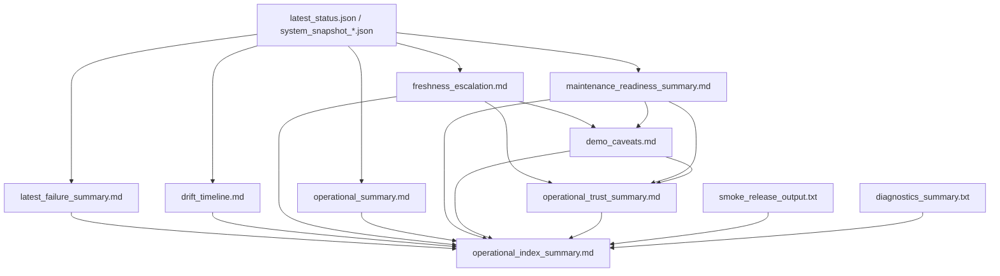

# Operational Artifacts

This bundle contains copied operational evidence. The files are historical
release/demo artifacts, not runtime authority.

## First Read

- `maintenance_calm_summary.md`: calm posture overview — read this first to
  distinguish known stable RC-1 conditions from signals that need attention.
- `maintenance_steadiness_summary.md`: steadiness assessment — caution level,
  stable degraded indicators, and steadiness guidance for the current posture.
- `maintenance_continuity_summary.md`: continuity posture — stable degraded
  continuity, operational memory durability, release honesty continuity, and
  no-continuity-regressions-detected confirmation when applicable.
- `demo_caveats.md`: presenter-facing caveats to state during demo/release.
- `operational_trust_summary.md`: conservative confidence and trust rollup.
- `smoke_release_output.txt`: build, syntax, fixture, diagnostics, and optional
  endpoint smoke evidence captured during bundle creation.
- `operational_summary.md`: demo-friendly source health and freshness summary.
- `maintenance_readiness_summary.md`: maintenance-oriented stale source,
  unresolved, and release/demo caveat summary.
- `operational_index_summary.md`: single-entry operational status for handoff.

## Snapshot Evidence

- `latest_status.json`: compact latest snapshot copied from `snapshots/`.
- `system_snapshot_*.json`: dated snapshot evidence copied from `snapshots/`.

Snapshots are append-oriented historical evidence. Runtime behavior remains
owned by PostgreSQL and running services.

## Report Evidence

- `latest_failure_summary.md`: failure and health detail.
- `drift_timeline.md`: historical drift classification.
- `freshness_escalation.md`: freshness and source-gap escalation.
- `maintenance_readiness_summary.md`: current maintenance readiness and known
  source blockers.
- `demo_caveats.md`: explicit demo caveats derived from freshness,
  maintenance, and source-state reports.
- `operational_trust_summary.md`: confidence relationship across freshness,
  completeness, release, demo, and maintenance dimensions.
- `diagnostics_summary.txt`: bundle-time readonly diagnostics output.

## Relationship

## Report Lifecycle Notes

All report files in this bundle are historical — accurate at bundle-build time.
After the bundle is created, the live `reports/` directory is authoritative.

| Lifecycle | Reports in This Bundle |
| --- | --- |
| Critical (read before demo) | `demo_caveats.md`, `operational_trust_summary.md`, `smoke_release_output.txt`, `freshness_escalation.md` |
| Important (context when needed) | `maintenance_calm_summary.md`, `operational_summary.md`, `maintenance_readiness_summary.md`, `drift_timeline.md` |
| Reference/historical | `operational_index_summary.md`, `latest_failure_summary.md`, `system_snapshot_*.json`, `latest_status.json` |

## Stable Degraded Posture

The following six degraded conditions are present at RC-1. They are expected,
documented, and non-worsening. They do not constitute an active incident.

| Condition | Value | Why Accepted |
| --- | --- | --- |
| QS freshness | stale (~354h) | No crawl since RC-1 packaging; expected for packaged demo |
| THE availability | unavailable (0) | Source files not acquired; out-of-scope at RC-1 |
| ARWU availability | unavailable (0) | Source files not acquired; out-of-scope at RC-1 |
| Subject ranking rows | 0 | QS subject ranking not ingested at MVP scope |
| Release confidence | limited | Derived from above; documented and caveat-covered |
| Operational trust level | critical | Derived from freshness + source gaps; known and disclosed |

See `docs/STABLE_DEGRADED_STATE.md` for escalation triggers and communication
guidance. See `docs/MAINTENANCE_CADENCE_REVIEW.md` for when to run what.

## Maintenance Calmness

`maintenance_calm_summary.md` contextualizes the operational posture without
alarm amplification. Read it first to understand which signals are known
stable conditions (RC-1 posture) versus signals that require action.

`maintenance_steadiness_summary.md` provides caution level and steadiness
guidance derived from the same signals. Read it alongside the calm summary
before a demo or release.

Known stable conditions at RC-1 (expected and documented):
- QS data is stale — no new crawl since RC-1 packaging
- THE and ARWU are unavailable — out-of-scope at RC-1
- Release confidence is limited — caveats are documented and demo-ready

## Reading Mode Guidance

For demo/release preparation, use this reading order (Mode 2):
1. `maintenance_calm_summary.md` — calm posture overview
2. `maintenance_steadiness_summary.md` — caution level and steadiness
3. `maintenance_continuity_summary.md` — continuity posture and honesty check
4. `demo_caveats.md` — required caveats before any demo
5. `operational_trust_summary.md` — confidence posture
6. `smoke_release_output.txt` — build/runtime health confirmation

Full reading modes are in `docs/MAINTENANCE_READING_MODES.md`.
Full maintenance cadence (daily/weekly/release-demo/incident-only) is in
`docs/MAINTENANCE_CADENCE_REVIEW.md`
(both available in the live repository, not copied into this bundle).

## Operational Continuity Semantics

The bundle captures the operational continuity posture at bundle-build time.

| Continuity Dimension | Bundle Evidence |
| --- | --- |
| Stable degraded continuity | `maintenance_continuity_summary.md` — no regression confirmation |
| Operational memory durability | Named snapshots (durable); reports (ephemeral at bundle-build time) |
| Report continuity | All `*.md` reports frozen at bundle-build timestamp in `MANIFEST.txt` |
| Release honesty continuity | `demo_caveats.md` — required disclosures at bundle-build time |
| Confidence continuity | `operational_trust_summary.md` — confidence derived from observable signals |

See `docs/OPERATIONAL_MEMORY_DURABILITY.md` for full durability classification.
See `docs/STABLE_DEGRADED_CONTINUITY.md` for long-term stable degraded guidance.
See `docs/MAINTENANCE_CONTINUITY_MODEL.md` for continuity concept definitions.

## Readonly Boundary

Bundle creation copies artifacts and runs readonly/build validation. It does
not rerun the data pipeline, retry sources, mutate scoring, change aggregation,
modify auth/session behavior, or make autonomous operational decisions.
